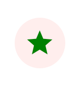

# Icon buttons
Icon buttons allow users to take actions, and make choices, with a single tap.

## Using icon buttons

### Installation

```
npm install @material/md-icon-button
```

### Icons

We recommend using [Material Icons](https://material.io/tools/icons/) from
Google Fonts:

```html
<head>
  <link rel="stylesheet" href="https://fonts.googleapis.com/icon?family=Material+Icons">
</head>
```

However, you can also use SVG, [Font Awesome](https://fontawesome.com/), or any
other icon library you wish.

## Example usage

### Icon button


```
<md-icon-button aria-label="Check" .icon="check">
</md-icon-button>
```

### Link icon button


```
<md-link-icon-button aria-label="Check" .icon="check" .linkHref="https://www.google.com">
</md-link-icon-button>
```

### Icon button toggle

Icon button toggles allow selection, or deselection, of a single choice, such as
starring an item.


```
<md-icon-button-toggle aria-label="Star" .onIcon="star" .offIcon="star_border">
</md-icon-button-toggle>
```

## Theming example



```
@use '@material/md-icon-button/md-icon-button' as icon-button;

md-icon-button {
  @include icon-button.theme((
    unselected-focus-icon-color: green,
    unselected-focus-state-layer-color: red,
    unselected-icon-color: green,
  ));
}
```

For the full list of supported theme keys, see the
[icon button tokens](https://github.com/material-components/material-web/blob/master/components/tokens/latest/_md-comp-icon-button.scss).

## API

### Properties and attributes

#### `<md-icon-button>`, `<md-link-icon-button>`

| Name            | Type      | Default     | Description                      |
| --------------- | --------- | ----------- | -------------------------------- |
| `aria-haspopup` | `string`  | `undefined` | Indicates the availability and   |
:                 :           :             : type of an interactive popup     :
:                 :           :             : element, such as menu or dialog, :
:                 :           :             : that can be triggered by the     :
:                 :           :             : button.                          :
| `aria-label`    | `string`  | `undefined` | Accessible label for the button. |
:                 :           :             : This is required for             :
:                 :           :             : accessibility.                   :
| `disabled`      | `boolean` | `false`     | Disabled buttons cannot be       |
:                 :           :             : interacted with and have no      :
:                 :           :             : visual interaction effect.       :
| `icon`          | `string`  | `''`        | Icon to display, if using        |
:                 :           :             : Material Icons font.             :

#### `<md-icon-button-toggle>`

| Name           | Type      | Default     | Description                       |
| -------------- | --------- | ----------- | --------------------------------- |
| `aria-label`   | `string`  | `undefined` | Accessible label for the button.  |
:                :           :             : If different labels are desired   :
:                :           :             : for the button in its `on` and    :
:                :           :             : `off` states, set `ariaLabelOff`  :
:                :           :             : and `ariaLabelOn` instead.        :
| `ariaLabelOff` | `string`  | `undefined` | `aria-label` value for the button |
:                :           :             : in the `off` state.               :
| `ariaLabelOn`  | `string`  | `undefined` | `aria-label` value for the button |
:                :           :             : in the `on` state.                :
| `isOn`         | `boolean` | `false`     | Whether the button is in the `on` |
:                :           :             : state.                            :
| `offIcon`      | `string`  | `''`        | Icon to display in the `off`      |
:                :           :             : state, if using Material Icons    :
:                :           :             : font.                             :
| `onIcon`       | `string`  | `''`        | Icon to display in the `on`       |
:                :           :             : state, if using Material Icons    :
:                :           :             : font.                             :
| `disabled`     | `boolean` | `false`     | Disabled buttons cannot be        |
:                :           :             : interacted with and have no       :
:                :           :             : visual interaction effect.        :

### Slots

#### `<md-icon-button>`, `<md-link-icon-button>`

| Name      | Description                                                   |
| --------- | ------------------------------------------------------------- |
| *default* | Optional `` or `<svg>` to display, if not using Material |
:           : Icons font.                                                   :

#### `<md-icon-button-toggle>`

| Name      | Description                                                      |
| --------- | ---------------------------------------------------------------- |
| *offIcon* | Optional `` or `<svg>` to display in the `off` state, if    |
:           : not using Material Icons font.                                   :
| *onIcon*  | Optional `` or `<svg>` to display in the `on` state, if not |
:           : using Material Icons font.                                       :
