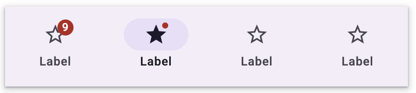
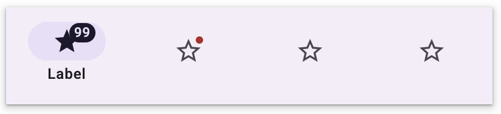
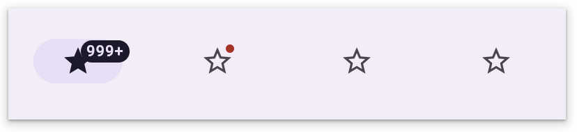
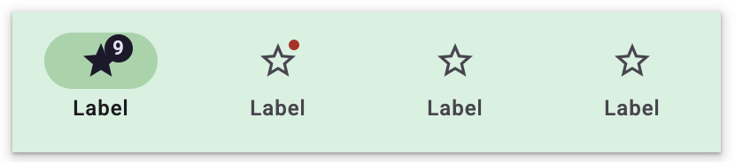

# Navigation Bar
Navigation bars offer a persistent and convenient way to switch between primary
destinations in an app. They’re a common navigation component on handheld
screens.

## Using navigation bars

### Installation

```
npm install @material/md-navigation-bar
npm install @material/md-navigation-tab
```

### Icons

We recommend using [Material Icons](https://material.io/tools/icons/) from
Google Fonts:

```html
<head>
  <link rel="stylesheet" href="https://fonts.googleapis.com/icon?family=Material+Icons">
</head>
```

However, you can also use SVG, [Font Awesome](https://fontawesome.com/), or any
other icon library you wish.

## Example usage

### Navigation bar



```
<md-navigation-bar>
  <md-navigation-tab label="Help">
    <md-icon slot="activeIcon">star</md-icon>
    <md-icon slot="inactiveIcon">star_border</md-icon>
  </md-navigation-tab>
  <md-navigation-tab label="Chat">
    <md-icon slot="activeIcon">chat_bubble</md-icon>
    <md-icon slot="inactiveIcon">chat_bubble_outline</md-icon>
  </md-navigation-tab>
  <md-navigation-tab label="Deleted">
    <md-icon slot="activeIcon">delete</md-icon>
    <md-icon slot="inactiveIcon">delete_outline</md-icon>
  </md-navigation-tab>
</md-navigation-bar>
```

### Navigation bar with hidden inactive labels



```
<md-navigation-bar hideInactiveLabels>
  <md-navigation-tab label="Help">
    <md-icon slot="activeIcon">star</md-icon>
    <md-icon slot="inactiveIcon">star_border</md-icon>
  </md-navigation-tab>
  <md-navigation-tab label="Chat">
    <md-icon slot="activeIcon">chat_bubble</md-icon>
    <md-icon slot="inactiveIcon">chat_bubble_outline</md-icon>
  </md-navigation-tab>
  <md-navigation-tab label="Deleted">
    <md-icon slot="activeIcon">delete</md-icon>
    <md-icon slot="inactiveIcon">delete_outline</md-icon>
  </md-navigation-tab>
</md-navigation-bar>
```

### Icons only navigation bar

When using icon only navigation bars, make sure to use the `aria-label` property
to label the tab.



```
<md-navigation-bar>
  <md-navigation-tab ariaLabel="Help">
    <md-icon slot="activeIcon">star</md-icon>
    <md-icon slot="inactiveIcon">star_border</md-icon>
  </md-navigation-tab>
  <md-navigation-tab ariaLabel="Chat">
    <md-icon slot="activeIcon">chat_bubble</md-icon>
    <md-icon slot="inactiveIcon">chat_bubble_outline</md-icon>
  </md-navigation-tab>
  <md-navigation-tab ariaLabel="Deleted">
    <md-icon slot="activeIcon">delete</md-icon>
    <md-icon slot="inactiveIcon">delete_outline</md-icon>
  </md-navigation-tab>
</md-navigation-bar>
```

## Theming example



```
@use '@material/md-navigation-bar' as navigation-bar;
@use '@material/md-navigation-tab' as navigation-tab;

md-navigation-bar {
  @include navigation-bar.theme((
    container-color: green,
  ));
}

md-navigation-tab {
  @include navigation-tab.theme((
    active-indicator-color: green,
  ));
}
```

For the full list of supported theme keys, see the
[navigation bar tokens](https://github.com/material-components/material-web/blob/master/components/tokens/latest/_md-comp-navigation-bar.scss).

## API

### Properties and attributes

#### `<md-navigation-bar>`

| Name | Type | Default | Description
| ---- | ---- | ------- | -----------
| `ariaLabel` | `string`  | `undefined` | Accessible label for the navigation bar.
| `activeIndex` | `number` | `0` | Sets the index of the active navigation tab.
| `hideInactiveLabels` | `boolean` | `false` | Whether the tabs's labels are hidden when the tab is in the `inactive` state.

#### `<md-navigation-tab>`

| Name | Type | Default | Description
| ---- | ---- | ------- | -----------
| `ariaLabel` | `string` | `undefined` | Accessible label for the tab.
| `active` | `boolean` | `false` | Whether the tab is in the `active` state.
| `hideInactiveLabel` | `boolean` | `false` | Whether the label is hidden when the tab is in the `inactive` state.
| `label` | `string`  | `undefined` | The optional label of the navigation tab.
| `badgeValue` | `string` | `''` | The optional value of the navigation tab's badge. If the value is an empty string, a small badge will be displayed. Otherwise, a large badge will be displayed containing the provided value.
| `showBadge` | `boolean` | `false` | Whether the badge should be shown or hidden.

### Slots

#### `<md-navigation-bar>`

Name      | Description
--------- | ------------------------------------------------------
*default* | The default slot for the navigation tabs to be placed.

#### `<md-navigation-tab>`

Name           | Description
-------------- | --------------------------------------------
*activeIcon*   | The icon to display in the `active` state.
*inactiveIcon* | The icon to display in the `inactive` state.
