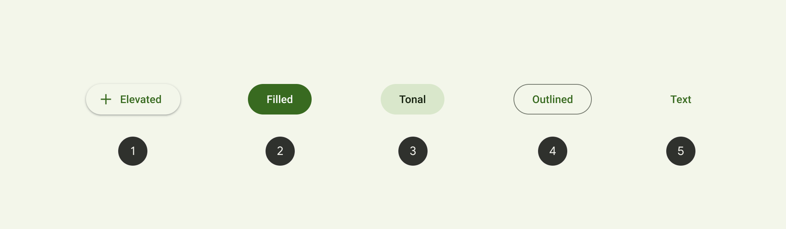
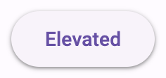
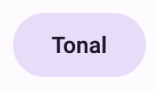
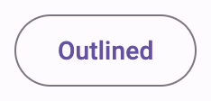
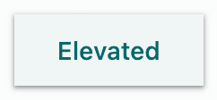
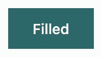
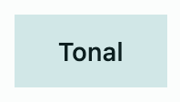
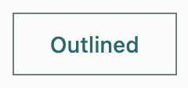
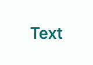

<!-- catalog-only-start --><!-- ---
name: Buttons
dirname: button
-----><!-- catalog-only-end -->

<catalog-component-header>
<catalog-component-header-title slot="title">

# Buttons

<!-- no-catalog-start -->

<!--*
# Document freshness: For more information, see go/fresh-source.
freshness: { owner: 'lizmitchell' reviewed: '2023-11-10' }
tag: 'docType:reference'
*-->

<!-- go/md-button -->

<!-- [TOC] -->

<!-- external-only-start -->
**This documentation is fully rendered on the
[Material Web catalog](https://material-web.dev/components/button/).**
<!-- external-only-end -->

<!-- no-catalog-end -->

[Buttons](https://m3.material.io/components/buttons)<!-- {.external} --> help people
initiate actions, from sending an email, to sharing a document, to liking a
post.

There are five types of common buttons: elevated, filled, filled tonal,
outlined, and text.

</catalog-component-header-title>


</catalog-component-header>

*   [Design article](https://m3.material.io/components/buttons) <!-- {.external} -->
*   [API Documentation](#api)
*   [Source code](https://github.com/material-components/material-web/tree/main/button)
    <!-- {.external} -->

<!-- catalog-only-start -->

<!--

## Interactive Demo



-->

<!-- catalog-only-end -->

## Types

<!-- no-catalog-start -->



<!-- no-catalog-end -->
<!-- catalog-only-start -->

<!--

<div class="figure-wrapper">
  <figure
      class="types-image"
      style="justify-content:center;"
      title="Elevated, filled, filled tonal, outlined, and text buttons"
      aria-label="The 5 types of common buttons">
    <style>
      .types-image .wrapper,
      .types-image .wrapper > * {
        display: flex;
        padding: 8px;
        flex-wrap: wrap;
        justify-content: center;
      }
      .types-image .wrapper > * {
        flex-direction: column;
        align-items: center;
        padding-inline: 16px;
      }
      .types-image span {
        display: inline-flex;
        background-color: var(--md-sys-color-inverse-surface);
        color: var(--md-sys-color-inverse-on-surface);
        padding: 8px;
        margin-block-start: 8px;
        width: 24px;
        height: 24px;
        border-radius: 50%;
        justify-content: center;
        align-items: center;
      }
    </style>
    <div class="wrapper">
      <div>
        <md-elevated-button hasicon>
          <md-icon slot="icon">add</md-icon>
          Elevated
        </md-elevated-button>
        <span>1</span>
      </div>
      <div>
        <md-filled-button>Filled</md-filled-button>
        <span>2</span>
      </div>
      <div>
        <md-filled-tonal-button>Tonal</md-filled-tonal-button>
        <span>3</span>
      </div>
      <div>
        <md-outlined-button>Outlined</md-outlined-button>
        <span>4</span>
      </div>
      <div>
        <md-text-button>Text</md-text-button>
        <span>5</span>
      </div>
    </div>
  </figure>
</div>

-->

<!-- catalog-only-end -->

1.  [Elevated button](#elevated-button)
1.  [Filled button](#filled-button)
1.  [Filled tonal button](#filled-tonal-button)
1.  [Outlined button](#outlined-button)
1.  [Text button](#text-button)

## Usage

Buttons have label text that describes the action that will occur if a user taps
a button.

<!-- no-catalog-start -->


<!-- no-catalog-end -->
<!-- catalog-only-start -->

<!--

<div class="figure-wrapper">
  <figure
      style="justify-content:center;gap: 8px;"
      title="Outlined and filled buttons."
      aria-label="An outlined button with the text 'Back' next to a filled button with the text 'Complete'">
    <md-outlined-button>Back</md-outlined-button>
    <md-filled-button>Complete</md-filled-button>
  </figure>
</div>

-->

<!-- catalog-only-end -->

```html
<md-outlined-button>Back</md-outlined-button>
<md-filled-button>Complete</md-filled-button>
```

### Icon

An icon may optionally be added to a button to help communicate the button's
action and help draw attention.

<!-- no-catalog-start -->


<!-- no-catalog-end -->
<!-- catalog-only-start -->

<!--

<div class="figure-wrapper">
  <figure
      style="justify-content:center;gap: 8px;"
      title="Outlined and filled buttons."
      aria-label="An outlined button with the text 'Back' next to a filled button with the text 'Complete'">
    <md-filled-tonal-button>
      Send
      <svg slot="icon" viewBox="0 0 48 48"><path d="M6 40V8l38 16Zm3-4.65L36.2 24 9 12.5v8.4L21.1 24 9 27Zm0 0V12.5 27Z"/></svg>
    </md-filled-tonal-button>

    <md-text-button trailing-icon>
      Open
      <svg slot="icon" viewBox="0 0 48 48"><path d="M9 42q-1.2 0-2.1-.9Q6 40.2 6 39V9q0-1.2.9-2.1Q7.8 6 9 6h13.95v3H9v30h30V25.05h3V39q0 1.2-.9 2.1-.9.9-2.1.9Zm10.1-10.95L17 28.9 36.9 9H25.95V6H42v16.05h-3v-10.9Z"/></svg>
    </md-text-button>
  </figure>
</div>

-->

<!-- catalog-only-end -->

```html
<md-filled-tonal-button>
  Send
  <svg slot="icon" viewBox="0 0 48 48"><path d="M6 40V8l38 16Zm3-4.65L36.2 24 9 12.5v8.4L21.1 24 9 27Zm0 0V12.5 27Z"/></svg>
</md-filled-tonal-button>

<md-text-button trailing-icon>
  Open
  <svg slot="icon" viewBox="0 0 48 48"><path d="M9 42q-1.2 0-2.1-.9Q6 40.2 6 39V9q0-1.2.9-2.1Q7.8 6 9 6h13.95v3H9v30h30V25.05h3V39q0 1.2-.9 2.1-.9.9-2.1.9Zm10.1-10.95L17 28.9 36.9 9H25.95V6H42v16.05h-3v-10.9Z"/></svg>
</md-text-button>
```

## Accessibility

Add an
[`aria-label`](https://developer.mozilla.org/en-US/docs/Web/Accessibility/ARIA/Attributes/aria-label)<!-- {.external} -->
attribute to buttons whose labels need a more descriptive label.

```html
<md-elevated-button aria-label="Add a new contact">Add</md-elevated-button>
```

## Elevated button

<!-- go/md-elevated-button -->

[Elevated buttons](https://m3.material.io/components/buttons/guidelines#4e89da4d-a8fa-4e20-bb8d-b8a93eff3e3e)<!-- {.external} -->
are essentially filled tonal buttons with a shadow. To prevent shadow creep,
only use them when absolutely necessary, such as when the button requires visual
separation from a patterned background.

<!-- no-catalog-start -->



<!-- no-catalog-end -->
<!-- catalog-only-start -->

<!--

<div class="figure-wrapper">
  <figure
      style="justify-content:center;align-items:center;"
      aria-label="An elevated button.">
    <md-elevated-button>Elevated</md-elevated-button>
  </figure>
</div>

-->

<!-- catalog-only-end -->

```html
<md-elevated-button>Elevated</md-elevated-button>
```

## Filled button

<!-- go/md-filled-button -->

[Filled buttons](https://m3.material.io/components/buttons/guidelines#9ecffdb3-ef29-47e7-8d5d-f78b404fcafe)<!-- {.external} -->
have the most visual impact after the FAB, and should be used for important,
final actions that complete a flow, like Save, Join now, or Confirm.

<!-- no-catalog-end -->
<!-- catalog-only-start -->

<!--

<div class="figure-wrapper">
  <figure
      style="justify-content:center;align-items:center;"
      aria-label="A filled button.">
    <md-filled-button>Filled</md-filled-button>
  </figure>
</div>

-->

<!-- catalog-only-end -->

```html
<md-filled-button>Filled</md-filled-button>
```

## Filled tonal button

<!-- go/md-filled-tonal-button -->

A
[filled tonal button](https://m3.material.io/components/buttons/guidelines#07a1577b-aaf5-4824-a698-03526421058b)<!-- {.external} -->
is an alternative middle ground between filled and outlined buttons. They're
useful in contexts where a lower-priority button requires slightly more emphasis
than an outline would give, such as "Next" in an onboarding flow.

<!-- no-catalog-start -->



<!-- no-catalog-end -->
<!-- catalog-only-start -->

<!--

<div class="figure-wrapper">
  <figure
      style="justify-content:center;align-items:center;"
      aria-label="A tonal button.">
    <md-filled-tonal-button>Tonal</md-filled-tonal-button>
  </figure>
</div>

-->

<!-- catalog-only-end -->

```html
<md-filled-tonal-button>Tonal</md-filled-tonal-button>
```

## Outlined button

<!-- go/md-outlined-button -->

[Outlined buttons](https://m3.material.io/components/buttons/guidelines#3742b09f-c224-43e0-a83e-541bd29d0f05)<!-- {.external} -->
are medium-emphasis buttons. They contain actions that are important, but aren’t
the primary action in an app.

<!-- no-catalog-start -->



<!-- no-catalog-end -->
<!-- catalog-only-start -->

<!--

<div class="figure-wrapper">
  <figure
      style="justify-content:center;align-items:center;"
      aria-label="An outlined button.">
    <md-outlined-button>Outlined</md-outlined-button>
  </figure>
</div>

-->

<!-- catalog-only-end -->

```html
<md-outlined-button>Outlined</md-outlined-button>
```

## Text button

<!-- go/md-text-button -->

[Text buttons](https://m3.material.io/components/buttons/guidelines#c9bcbc0b-ee05-45ad-8e80-e814ae919fbb)<!-- {.external} -->
are used for the lowest priority actions, especially when presenting multiple
options.

<!-- no-catalog-start -->


<!-- no-catalog-end -->
<!-- catalog-only-start -->

<!--

<div class="figure-wrapper">
  <figure
      style="justify-content:center;align-items:center;"
      aria-label="A text button.">
    <md-text-button>Text</md-text-button>
  </figure>
</div>

-->

<!-- catalog-only-end -->

```html
<md-text-button>Text</md-text-button>
```

## Theming

Button supports [Material theming](../theming/README.md) and can be customized
in terms of color, typography, and shape.

### Elevated button tokens

Token                                   | Default value
--------------------------------------- | -------------------------------------
`--md-elevated-button-container-color`  | `--md-sys-color-surface`
`--md-elevated-button-container-shape`  | `--md-sys-shape-corner-full`
`--md-elevated-button-label-text-color` | `--md-sys-color-on-surface`
`--md-elevated-button-label-text-font`  | `--md-sys-typescale-label-large-font`

*   [All tokens](https://github.com/material-components/material-web/blob/main/tokens/_md-comp-elevated-button.scss)
    <!-- {.external} -->

### Elevated button example

<!-- no-catalog-start -->



<!-- no-catalog-end -->
<!-- catalog-only-start -->

<!--

<div class="figure-wrapper">
  <figure
      style="justify-content:center;align-items:center;"
      class="styled-example"
      title="Elevated button theming example."
      aria-label="Image of an elevated button with a different theme applied">
    <style>
      .styled-example {
        background-color: white;
        --md-elevated-button-container-shape: 0px;
        --md-elevated-button-label-text-font: system-ui;
        --md-sys-color-surface-container-low: #FAFDFC;
        --md-sys-color-primary: #191C1C;
      }
    </style>

    <md-elevated-button>Elevated</md-elevated-button>
  </figure>
</div>

-->

<!-- catalog-only-end -->

```html
<style>
:root {
  --md-elevated-button-container-shape: 0px;
  --md-elevated-button-label-text-font: system-ui;
  --md-sys-color-surface-container-low: #FAFDFC;
  --md-sys-color-primary: #191C1C;
}
</style>

<md-elevated-button>Elevated</md-elevated-button>
```

### Filled button tokens

Token                                 | Default value
------------------------------------- | -------------------------------------
`--md-filled-button-container-color`  | `--md-sys-color-primary`
`--md-filled-button-container-shape`  | `--md-sys-shape-corner-full`
`--md-filled-button-label-text-color` | `--md-sys-color-on-primary`
`--md-filled-button-label-text-font`  | `--md-sys-typescale-label-large-font`

*   [All tokens](https://github.com/material-components/material-web/blob/main/tokens/_md-comp-filled-button.scss)
    <!-- {.external} -->

### Filled button example

<!-- no-catalog-start -->



<!-- no-catalog-end -->
<!-- catalog-only-start -->

<!--

<div class="figure-wrapper">
  <figure
      style="justify-content:center;align-items:center;"
      class="styled-example"
      title="Filled button theming example."
      aria-label="Image of a filled button with a different theme applied">
    <style>
      .styled-example {
        background-color: white;
        --md-filled-button-container-shape: 0px;
        --md-filled-button-label-text-font: system-ui;
        --md-sys-color-primary: #006A6A;
        --md-sys-color-on-primary: #FFFFFF;
      }
    </style>

    <md-filled-button>Filled</md-filled-button>
  </figure>
</div>

-->

<!-- catalog-only-end -->

```html
<style>
:root {
  --md-filled-button-container-shape: 0px;
  --md-filled-button-label-text-font: system-ui;
  --md-sys-color-primary: #006A6A;
  --md-sys-color-on-primary: #FFFFFF;
}
</style>

<md-filled-button>Filled</md-filled-button>
```

### Filled tonal button tokens

Token                                       | Default value
------------------------------------------- | -------------
`--md-filled-tonal-button-container-color`  | `--md-sys-color-secondary-container`
`--md-filled-tonal-button-container-shape`  | `--md-sys-shape-corner-full`
`--md-filled-tonal-button-label-text-color` | `--md-sys-color-on-secondary-container`
`--md-filled-tonal-button-label-text-font`  | `--md-sys-typescale-label-large-font`

*   [All tokens](https://github.com/material-components/material-web/blob/main/tokens/_md-comp-filled-tonal-button.scss)
    <!-- {.external} -->

### Filled tonal button example

<!-- no-catalog-start -->



<!-- no-catalog-end -->
<!-- catalog-only-start -->

<!--

<div class="figure-wrapper">
  <figure
      style="justify-content:center;align-items:center;"
      class="styled-example"
      title="Tonal button theming example."
      aria-label="Image of a tonal button with a different theme applied">
    <style>
      .styled-example {
        background-color: white;
        --md-filled-tonal-button-container-shape: 0px;
        --md-filled-tonal-button-label-text-font: system-ui;
        --md-sys-color-secondary-container: #CCE8E7;
        --md-sys-color-on-secondary-container: #051F1F;
      }
    </style>

    <md-filled-tonal-button>Tonal</md-filled-tonal-button>
  </figure>
</div>

-->

<!-- catalog-only-end -->

```html
<style>
:root {
  --md-filled-tonal-button-container-shape: 0px;
  --md-filled-tonal-button-label-text-font: system-ui;
  --md-sys-color-secondary-container: #CCE8E7;
  --md-sys-color-on-secondary-container: #051F1F;
}
</style>

<md-filled-tonal-button>Tonal</md-filled-tonal-button>
```

### Outlined button tokens

Token                                   | Default value
--------------------------------------- | -------------------------------------
`--md-outlined-button-outline-color`    | `--md-sys-color-outline`
`--md-outlined-button-container-shape`  | `--md-sys-shape-corner-full`
`--md-outlined-button-label-text-color` | `--md-sys-color-primary`
`--md-outlined-button-label-text-font`  | `--md-sys-typescale-label-large-font`

*   [All tokens](https://github.com/material-components/material-web/blob/main/tokens/_md-comp-outlined-button.scss)
    <!-- {.external} -->

### Outlined button example

<!-- no-catalog-start -->



<!-- no-catalog-end -->
<!-- catalog-only-start -->

<!--

<div class="figure-wrapper">
  <figure
      style="justify-content:center;align-items:center;"
      class="styled-example"
      title="Outlined button theming example."
      aria-label="Image of a outlined button with a different theme applied">
    <style>
      .styled-example {
        background-color: white;
        --md-outlined-button-container-shape: 0px;
        --md-outlined-button-label-text-font: system-ui;
        --md-sys-color-primary: #006A6A;
        --md-sys-color-outline: #6F7979;
      }
    </style>

    <md-outlined-button>Outlined</md-outlined-button>
  </figure>
</div>

-->

<!-- catalog-only-end -->

```html
<style>
:root {
  --md-outlined-button-container-shape: 0px;
  --md-outlined-button-label-text-font: system-ui;
  --md-sys-color-primary: #006A6A;
  --md-sys-color-outline: #6F7979;
}
</style>

<md-outlined-button>Outlined</md-outlined-button>
```

### Text button tokens

Token                               | Default value
----------------------------------- | -------------------------------------
`--md-text-button-label-text-color` | `--md-sys-color-primary`
`--md-text-button-label-text-font`  | `--md-sys-typescale-label-large-font`

*   [All tokens](https://github.com/material-components/material-web/blob/main/tokens/_md-comp-text-button.scss)
    <!-- {.external} -->

### Text button example

<!-- no-catalog-start -->



<!-- no-catalog-end -->
<!-- catalog-only-start -->

<!--

<div class="figure-wrapper">
  <figure
      style="justify-content:center;align-items:center;"
      class="styled-example"
      title="Text button theming example."
      aria-label="Image of a text button with a different theme applied">
    <style>
      .styled-example {
        background-color: white;
        --md-text-button-label-text-font: system-ui;
        --md-sys-color-primary: #006A6A;
      }
    </style>

    <md-text-button>Text</md-text-button>
  </figure>
</div>

-->

<!-- catalog-only-end -->

```html
<style>
:root {
  --md-text-button-label-text-font: system-ui;
  --md-sys-color-primary: #006A6A;
}
</style>

<md-text-button>Text</md-text-button>
```

<!-- auto-generated API docs start -->

## API


### MdElevatedButton <code>&lt;md-elevated-button&gt;</code>

#### Properties

<!-- mdformat off(autogenerated might break rendering in catalog) -->

Property | Attribute | Type | Default | Description
--- | --- | --- | --- | ---
`disabled` | `disabled` | `boolean` | `false` | Whether or not the button is disabled.
`href` | `href` | `string` | `''` | The URL that the link button points to.
`target` | `target` | `string` | `''` | Where to display the linked `href` URL for a link button. Common options include `_blank` to open in a new tab.
`trailingIcon` | `trailing-icon` | `boolean` | `false` | Whether to render the icon at the inline end of the label rather than the inline start.<br>_Note:_ Link buttons cannot have trailing icons.
`hasIcon` | `has-icon` | `boolean` | `false` | Whether to display the icon or not.
`type` | `type` | `string` | `'submit'` |
`value` | `value` | `string` | `''` |
`name` |  | `string` | `undefined` |
`form` |  | `HTMLFormElement` | `undefined` |

<!-- mdformat on(autogenerated might break rendering in catalog) -->

### MdFilledButton <code>&lt;md-filled-button&gt;</code>

#### Properties

<!-- mdformat off(autogenerated might break rendering in catalog) -->

Property | Attribute | Type | Default | Description
--- | --- | --- | --- | ---
`disabled` | `disabled` | `boolean` | `false` | Whether or not the button is disabled.
`href` | `href` | `string` | `''` | The URL that the link button points to.
`target` | `target` | `string` | `''` | Where to display the linked `href` URL for a link button. Common options include `_blank` to open in a new tab.
`trailingIcon` | `trailing-icon` | `boolean` | `false` | Whether to render the icon at the inline end of the label rather than the inline start.<br>_Note:_ Link buttons cannot have trailing icons.
`hasIcon` | `has-icon` | `boolean` | `false` | Whether to display the icon or not.
`type` | `type` | `string` | `'submit'` |
`value` | `value` | `string` | `''` |
`name` |  | `string` | `undefined` |
`form` |  | `HTMLFormElement` | `undefined` |

<!-- mdformat on(autogenerated might break rendering in catalog) -->

### MdFilledTonalButton <code>&lt;md-filled-tonal-button&gt;</code>

#### Properties

<!-- mdformat off(autogenerated might break rendering in catalog) -->

Property | Attribute | Type | Default | Description
--- | --- | --- | --- | ---
`disabled` | `disabled` | `boolean` | `false` | Whether or not the button is disabled.
`href` | `href` | `string` | `''` | The URL that the link button points to.
`target` | `target` | `string` | `''` | Where to display the linked `href` URL for a link button. Common options include `_blank` to open in a new tab.
`trailingIcon` | `trailing-icon` | `boolean` | `false` | Whether to render the icon at the inline end of the label rather than the inline start.<br>_Note:_ Link buttons cannot have trailing icons.
`hasIcon` | `has-icon` | `boolean` | `false` | Whether to display the icon or not.
`type` | `type` | `string` | `'submit'` |
`value` | `value` | `string` | `''` |
`name` |  | `string` | `undefined` |
`form` |  | `HTMLFormElement` | `undefined` |

<!-- mdformat on(autogenerated might break rendering in catalog) -->

### MdOutlinedButton <code>&lt;md-outlined-button&gt;</code>

#### Properties

<!-- mdformat off(autogenerated might break rendering in catalog) -->

Property | Attribute | Type | Default | Description
--- | --- | --- | --- | ---
`disabled` | `disabled` | `boolean` | `false` | Whether or not the button is disabled.
`href` | `href` | `string` | `''` | The URL that the link button points to.
`target` | `target` | `string` | `''` | Where to display the linked `href` URL for a link button. Common options include `_blank` to open in a new tab.
`trailingIcon` | `trailing-icon` | `boolean` | `false` | Whether to render the icon at the inline end of the label rather than the inline start.<br>_Note:_ Link buttons cannot have trailing icons.
`hasIcon` | `has-icon` | `boolean` | `false` | Whether to display the icon or not.
`type` | `type` | `string` | `'submit'` |
`value` | `value` | `string` | `''` |
`name` |  | `string` | `undefined` |
`form` |  | `HTMLFormElement` | `undefined` |

<!-- mdformat on(autogenerated might break rendering in catalog) -->

### MdTextButton <code>&lt;md-text-button&gt;</code>

#### Properties

<!-- mdformat off(autogenerated might break rendering in catalog) -->

Property | Attribute | Type | Default | Description
--- | --- | --- | --- | ---
`disabled` | `disabled` | `boolean` | `false` | Whether or not the button is disabled.
`href` | `href` | `string` | `''` | The URL that the link button points to.
`target` | `target` | `string` | `''` | Where to display the linked `href` URL for a link button. Common options include `_blank` to open in a new tab.
`trailingIcon` | `trailing-icon` | `boolean` | `false` | Whether to render the icon at the inline end of the label rather than the inline start.<br>_Note:_ Link buttons cannot have trailing icons.
`hasIcon` | `has-icon` | `boolean` | `false` | Whether to display the icon or not.
`type` | `type` | `string` | `'submit'` |
`value` | `value` | `string` | `''` |
`name` |  | `string` | `undefined` |
`form` |  | `HTMLFormElement` | `undefined` |

<!-- mdformat on(autogenerated might break rendering in catalog) -->

<!-- auto-generated API docs end -->
