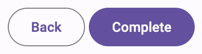
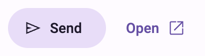
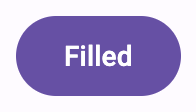

<!-- catalog-only-start --><!-- ---
name: Button
dirname: button
-----><!-- catalog-only-end -->

# Buttons

<!--*
# Document freshness: For more information, see go/fresh-source.
freshness: { owner: 'lizmitchell' reviewed: '2023-01-26' }
tag: 'docType:reference'
*-->

<!-- go/md-button -->

<!-- [TOC] -->

[Buttons](https://m3.material.io/components/buttons)<!-- {.external} --> help people
initiate actions, from sending an email, to sharing a document, to liking a
post.

There are five types of common buttons: elevated, filled, filled tonal,
outlined, and text.


*   [Design article](https://m3.material.io/components/buttons) <!-- {.external} -->
*   API Documentation (*coming soon*)
*   [Source code](https://github.com/material-components/material-web/tree/main/button)
    <!-- {.external} -->

## Types

1.  [Elevated button](#elevated-button)
1.  [Filled button](#filled-button)
1.  [Filled tonal button](#filled-tonal-button)
1.  [Outlined button](#outlined-button)
1.  [Text button](#text-button)

## Usage

Buttons have label text that describes the action that will occur if a user taps
a button.



```html
<md-outlined-button>Back</md-outlined-button>
<md-filled-button>Complete</md-filled-button>
```

### Icon

An icon may optionally be added to a button to help communicate the button's
action and help draw attention.



```html
<md-tonal-button>
  Send
  <svg slot="icon" viewBox="0 0 48 48"><path d="M6 40V8l38 16Zm3-4.65L36.2 24 9 12.5v8.4L21.1 24 9 27Zm0 0V12.5 27Z"/></svg>
</md-tonal-button>

<md-text-button trailingicon>
  Open
  <svg slot="icon" viewBox="0 0 48 48"><path d="M9 42q-1.2 0-2.1-.9Q6 40.2 6 39V9q0-1.2.9-2.1Q7.8 6 9 6h13.95v3H9v30h30V25.05h3V39q0 1.2-.9 2.1-.9.9-2.1.9Zm10.1-10.95L17 28.9 36.9 9H25.95V6H42v16.05h-3v-10.9Z"/></svg>
</md-text-button>
```

## Accessibility

Add an
[`aria-label`](https://developer.mozilla.org/en-US/docs/Web/Accessibility/ARIA/Attributes/aria-label)<!-- {.external} -->
attribute to buttons whose labels need a more descriptive label.

```html
<md-elevated-button aria-label="Add a new contact">Add</md-elevated-button>
```

## Elevated button

<!-- go/md-elevated-button -->

[Elevated buttons](https://m3.material.io/components/buttons/guidelines#4e89da4d-a8fa-4e20-bb8d-b8a93eff3e3e)<!-- {.external} -->
are essentially filled tonal buttons with a shadow. To prevent shadow creep,
only use them when absolutely necessary, such as when the button requires visual
separation from a patterned background.


```html
<md-elevated-button>Elevated</md-elevated-button>
```

## Filled button

<!-- go/md-filled-button -->

[Filled buttons](https://m3.material.io/components/buttons/guidelines#9ecffdb3-ef29-47e7-8d5d-f78b404fcafe)<!-- {.external} -->
have the most visual impact after the FAB, and should be used for important,
final actions that complete a flow, like Save, Join now, or Confirm.



```html
<md-filled-button>Filled</md-filled-button>
```

## Filled tonal button

<!-- go/md-tonal-button -->

A
[filled tonal button](https://m3.material.io/components/buttons/guidelines#07a1577b-aaf5-4824-a698-03526421058b)<!-- {.external} -->
is an alternative middle ground between filled and outlined buttons. They're
useful in contexts where a lower-priority button requires slightly more emphasis
than an outline would give, such as "Next" in an onboarding flow.


```html
<md-tonal-button>Tonal</md-tonal-button>
```

## Outlined button

<!-- go/md-outlined-button -->

[Outlined buttons](https://m3.material.io/components/buttons/guidelines#3742b09f-c224-43e0-a83e-541bd29d0f05)<!-- {.external} -->
are medium-emphasis buttons. They contain actions that are important, but aren’t
the primary action in an app.


```html
<md-outlined-button>Outlined</md-outlined-button>
```

## Text button

<!-- go/md-text-button -->

[Text buttons](https://m3.material.io/components/buttons/guidelines#c9bcbc0b-ee05-45ad-8e80-e814ae919fbb)<!-- {.external} -->
are used for the lowest priority actions, especially when presenting multiple
options.


```html
<md-text-button>Text</md-text-button>
```

## Theming

Button supports [Material theming](../theming.md) and can be customized in terms
of color, typography, and shape.

### Elevated button tokens

Token                                   | Default value
--------------------------------------- | ---------------------------
`--md-elevated-button-container-color`  | `--md-sys-color-surface`
`--md-elevated-button-container-shape`  | `9999px`
`--md-elevated-button-label-text-color` | `--md-sys-color-on-surface`
`--md-elevated-button-label-text-type`  | `500 0.875rem/1.25rem "Roboto"`

*   [All tokens](https://github.com/material-components/material-web/blob/main/tokens/_md-comp-elevated-button.scss)
    <!-- {.external} -->

### Elevated button example


```html
<style>
:root {
  --md-elevated-button-container-shape: 0px;
  --md-elevated-button-label-text-type: 500 0.875rem/1.25rem system-ui;
  --md-sys-color-surface: #FAFDFC;
  --md-sys-color-on-surface: #191C1C;
}
</style>

<md-elevated-button>Elevated</md-elevated-button>
```

### Filled button tokens

Token                                 | Default value
------------------------------------- | ---------------------------
`--md-filled-button-container-color`  | `--md-sys-color-primary`
`--md-filled-button-container-shape`  | `9999px`
`--md-filled-button-label-text-color` | `--md-sys-color-on-primary`
`--md-filled-button-label-text-type`  | `500 0.875rem/1.25rem "Roboto"`

*   [All tokens](https://github.com/material-components/material-web/blob/main/tokens/_md-comp-filled-button.scss)
    <!-- {.external} -->

### Filled button example


```html
<style>
:root {
  --md-filled-button-container-shape: 0px;
  --md-filled-button-label-text-type: 500 0.875rem/1.25rem system-ui;
  --md-sys-color-primary: #006A6A;
  --md-sys-color-on-primary: #FFFFFF;
}
</style>

<md-filled-button>Filled</md-filled-button>
```

### Filled tonal button tokens

Token                                | Default value
------------------------------------ | ---------------------------------------
`--md-tonal-button-container-color`  | `--md-sys-color-secondary-container`
`--md-tonal-button-container-shape`  | `9999px`
`--md-tonal-button-label-text-color` | `--md-sys-color-on-secondary-container`
`--md-tonal-button-label-text-type`  | `500 0.875rem/1.25rem "Roboto"`

*   [All tokens](https://github.com/material-components/material-web/blob/main/tokens/_md-comp-filled-tonal-button.scss)
    <!-- {.external} -->

### Filled tonal button example


```html
<style>
:root {
  --md-tonal-button-container-shape: 0px;
  --md-tonal-button-label-text-type: 500 0.875rem/1.25rem system-ui;
  --md-sys-color-secondary-container: #CCE8E7;
  --md-sys-color-on-secondary-container: #051F1F;
}
</style>

<md-tonal-button>Tonal</md-tonal-button>
```

### Outlined button tokens

Token                                   | Default value
--------------------------------------- | ------------------------
`--md-outlined-button-outline-color`    | `--md-sys-color-outline`
`--md-outlined-button-container-shape`  | `9999px`
`--md-outlined-button-label-text-color` | `--md-sys-color-primary`
`--md-outlined-button-label-text-type`  | `500 0.875rem/1.25rem "Roboto"`

*   [All tokens](https://github.com/material-components/material-web/blob/main/tokens/_md-comp-outlined-button.scss)
    <!-- {.external} -->

### Outlined button example


```html
<style>
:root {
  --md-outlined-button-container-shape: 0px;
  --md-outlined-button-label-text-type: 500 0.875rem/1.25rem system-ui;
  --md-sys-color-primary: #006A6A;
  --md-sys-color-outline: #6F7979;
}
</style>

<md-outlined-button>Outlined</md-outlined-button>
```

### Text button tokens

Token                               | Default value
----------------------------------- | ------------------------
`--md-text-button-label-text-color` | `--md-sys-color-primary`
`--md-text-button-label-text-type`  | `500 0.875rem/1.25rem "Roboto"`

*   [All tokens](https://github.com/material-components/material-web/blob/main/tokens/_md-comp-text-button.scss)
    <!-- {.external} -->

### Text button example


```html
<style>
:root {
  --md-text-button-label-text-type: 500 0.875rem/1.25rem system-ui;
  --md-sys-color-primary: #006A6A;
}
</style>

<md-text-button>Text</md-text-button>
```
