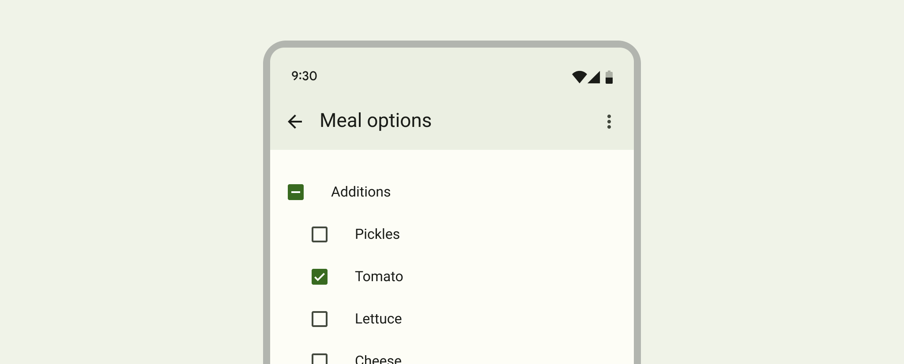
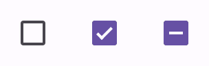
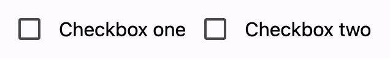
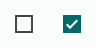

<!-- catalog-only-start --><!-- ---
name: Checkbox
dirname: checkbox
-----><!-- catalog-only-end -->

<catalog-component-header>
<catalog-component-header-title slot="title">

# Checkbox

<!--*
# Document freshness: For more information, see go/fresh-source.
freshness: {
  owner: 'emarquez'
  owner: 'lizmitchell'
  reviewed: '2023-11-10'
}
tag: 'docType:reference'
*-->

<!-- no-catalog-start -->

<!-- go/md-checkbox -->

<!-- [TOC] -->

<!-- external-only-start -->
**This documentation is fully rendered on the
[Material Web catalog](https://material-web.dev/components/checkbox/).**
<!-- external-only-end -->

<!-- no-catalog-end -->

[Checkboxes](https://m3.material.io/components/checkbox)<!-- {.external} --> allow users
to select one or more items from a set. Checkboxes can turn an option on or off.

There's one type of checkbox in Material. Use this selection control when the
user needs to select one or more options from a list.

</catalog-component-header-title>



</catalog-component-header>

*   [Design article](https://m3.material.io/components/checkbox) <!-- {.external} -->
*   [API Documentation](#api)
*   [Source code](https://github.com/material-components/material-web/tree/main/checkbox)
    <!-- {.external} -->

<!-- catalog-only-start -->

<!--

## Interactive Demo



-->

<!-- catalog-only-end -->

## Usage

Checkboxes may be standalone, pre-checked, or indeterminate.

<!-- no-catalog-start -->



<!-- no-catalog-end -->
<!-- catalog-include "figures/checkbox/usage.html" -->

```html
<md-checkbox touch-target="wrapper"></md-checkbox>
<md-checkbox touch-target="wrapper" checked></md-checkbox>
<md-checkbox touch-target="wrapper" indeterminate></md-checkbox>
```

### Label

Associate a label with a checkbox using the `<label>` element.

<!-- no-catalog-start -->



<!-- no-catalog-end -->
<!-- catalog-include "figures/checkbox/usage-label.html" -->

```html
<label>
  <md-checkbox touch-target="wrapper"></md-checkbox>
  Checkbox one
</label>

<md-checkbox id="checkbox-two" touch-target="wrapper"></md-checkbox>
<label for="checkbox-two">Checkbox two</label>
```

## Accessibility

Add an
[`aria-label`](https://developer.mozilla.org/en-US/docs/Web/Accessibility/ARIA/Attributes/aria-label)<!-- {.external} -->
attribute to checkboxes without labels or checkboxes whose labels need to be
more descriptive.

```html
<md-checkbox aria-label="Select all checkboxes"></md-checkbox>

<label>
  <md-checkbox aria-label="Agree to terms and conditions"></md-checkbox>
  Agree
</label>
```

> Note: checkboxes are not automatically labelled by `<label>` elements and
> always need an `aria-label`. See b/294081528.

## Theming

Checkbox supports [Material theming](../theming/README.md) and can be customized
in terms of color and shape.

### Tokens

Token                                    | Default value
---------------------------------------- | -----------------------------------
`--md-checkbox-outline-color`            | `--md-sys-color-on-surface-variant`
`--md-checkbox-selected-container-color` | `--md-sys-color-primary`
`--md-checkbox-selected-icon-color`      | `--md-sys-color-on-primary`
`--md-checkbox-container-shape`          | `2px`

*   [All tokens](https://github.com/material-components/material-web/blob/main/tokens/_md-comp-checkbox.scss)
    <!-- {.external} -->

### Example

<!-- no-catalog-start -->



<!-- no-catalog-end -->
<!-- catalog-include "figures/checkbox/theming.html" -->

```html
<style>
  :root {
    /* System tokens */
    --md-sys-color-primary: #006a6a;
    --md-sys-color-on-primary: #ffffff;
    --md-sys-color-on-surface-variant: #3f4948;

    /* Component tokens */
    --md-checkbox-container-shape: 0px;
  }
</style>

<md-checkbox touch-target="wrapper"></md-checkbox>
<md-checkbox touch-target="wrapper" checked></md-checkbox>
```

<!-- auto-generated API docs start -->

## API

### MdCheckbox <code>&lt;md-checkbox&gt;</code>

#### Properties

<!-- mdformat off(autogenerated might break rendering in catalog) -->

Property | Attribute | Type | Default | Description
--- | --- | --- | --- | ---
`checked` | `checked` | `boolean` | `false` | Whether or not the checkbox is selected.
`disabled` | `disabled` | `boolean` | `false` | Whether or not the checkbox is disabled.
`indeterminate` | `indeterminate` | `boolean` | `false` | Whether or not the checkbox is indeterminate.<br>https://developer.mozilla.org/en-US/docs/Web/HTML/Element/input/checkbox#indeterminate_state_checkboxes
`required` | `required` | `boolean` | `false` | When true, require the checkbox to be selected when participating in form submission.<br>https://developer.mozilla.org/en-US/docs/Web/HTML/Element/input/checkbox#validation
`value` | `value` | `string` | `'on'` | The value of the checkbox that is submitted with a form when selected.<br>https://developer.mozilla.org/en-US/docs/Web/HTML/Element/input/checkbox#value
`name` |  | `string` | `undefined` |
`form` |  | `HTMLFormElement` | `undefined` |
`labels` |  | `NodeList` | `undefined` |
`validity` |  | `ValidityState` | `undefined` |
`validationMessage` |  | `string` | `undefined` |
`willValidate` |  | `boolean` | `undefined` |

<!-- mdformat on(autogenerated might break rendering in catalog) -->

#### Methods

<!-- mdformat off(autogenerated might break rendering in catalog) -->

Method | Parameters | Returns | Description
--- | --- | --- | ---
`checkValidity` | _None_ | `boolean` | Checks the checkbox's native validation and returns whether or not the element is valid.<br>If invalid, this method will dispatch the `invalid` event.<br>https://developer.mozilla.org/en-US/docs/Web/API/HTMLInputElement/checkValidity
`reportValidity` | _None_ | `boolean` | Checks the checkbox's native validation and returns whether or not the element is valid.<br>If invalid, this method will dispatch the `invalid` event.<br>The `validationMessage` is reported to the user by the browser. Use `setCustomValidity()` to customize the `validationMessage`.<br>https://developer.mozilla.org/en-US/docs/Web/API/HTMLInputElement/reportValidity
`setCustomValidity` | `error` | `void` | Sets the checkbox's native validation error message. This is used to customize `validationMessage`.<br>When the error is not an empty string, the checkbox is considered invalid and `validity.customError` will be true.<br>https://developer.mozilla.org/en-US/docs/Web/API/HTMLInputElement/setCustomValidity

<!-- mdformat on(autogenerated might break rendering in catalog) -->

<!-- auto-generated API docs end -->
