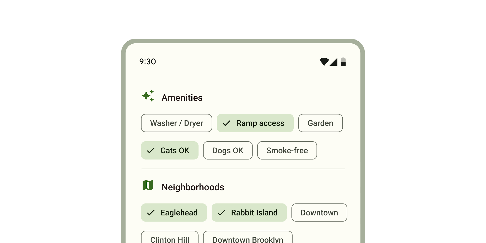

<!-- catalog-only-start --><!-- ---
name: Chips
dirname: chips
-----><!-- catalog-only-end -->

<catalog-component-header image-align="start">
<catalog-component-header-title slot="title">

# Chips

<!--*
# Document freshness: For more information, see go/fresh-source.
freshness: { owner: 'lizmitchell' reviewed: '2023-08-14' }
tag: 'docType:reference'
*-->

<!-- no-catalog-start -->

<!-- go/md-chips -->

<!-- [TOC] -->

<!-- external-only-start -->
**This documentation is fully rendered on the
[Material Web catalog](https://material-web.dev/components/chips/)**
<!-- external-only-end -->

<!-- no-catalog-end -->

[Chips](https://m3.material.io/components/chips)<!-- {.external} --> help people enter
information, make selections, filter content, or trigger actions.

While buttons are expected to appear consistently and with familiar calls to
action, chips should appear dynamically as a group of multiple interactive
elements.

</catalog-component-header-title>



</catalog-component-header>

*   [Design article](https://m3.material.io/components/chips) <!-- {.external} -->
*   API Documentation (*coming soon*)
*   [Source code](https://github.com/material-components/material-web/tree/main/chips)
    <!-- {.external} -->

## Types

1.  [Assist chip](#assist-chip)
1.  [Filter chip](#filter-chip)
1.  [Input chip](#input-chip)
1.  [Suggestion chip](#suggestion-chip)

<!-- catalog-only-start -->

<!--

## Interactive Demo



-->

<!-- catalog-only-end -->

## Usage

Choose the type of chip based on its purpose and author.

-   **Assist** chips are common actions, such as adding an event to a calendar.
-   **Filter** chips are tags used to filter content, such as shopping
    categories.
-   **Input** chips are pieces of information entered by a user, such as event
    attendees.
-   **Suggestion** chips represent dynamic suggestions for user input, such as
    text message replies.

<!-- no-catalog-start -->
<!-- TODO: add image -->
<!-- no-catalog-end -->
<!-- TODO: catalog-include "figures/<component>/usage.html" -->

```html
<md-assist-chip label="Assist"></md-assist-chip>
<md-filter-chip label="Filter"></md-filter-chip>
<md-input-chip label="Input"></md-input-chip>
<md-suggestion-chip label="Suggestion"></md-suggestion-chip>
```

### Chip sets

<!-- go/md-chip-set -->

Chips should always appear in a set. Use the same type of chip for chip set
children.

<!-- no-catalog-start -->
<!-- TODO: add image -->
<!-- no-catalog-end -->
<!-- TODO: catalog-include "figures/<component>/usage.html" -->

```html
<h3>New event</h3>
<md-chip-set type="assist">
  <md-assist-chip label="Add to calendar"></md-assist-chip>
  <md-assist-chip label="Set a reminder"></md-assist-chip>
</md-chip-set>

<h3>Favorite foods</h3>
<md-chip-set type="filter" single-select>
  <md-filter-chip label="Pizza"></md-filter-chip>
  <md-filter-chip label="Ice cream"></md-filter-chip>
  <md-filter-chip label="Sandwich"></md-filter-chip>
</md-chip-set>
```

### Icons

All chips may display an optional icon. Input chips can specify if an avatar
picture is displayed.

<!-- no-catalog-start -->
<!-- TODO: add image -->
<!-- no-catalog-end -->
<!-- TODO: catalog-include "figures/<component>/usage-scenario-one.html" -->
<!-- catalog-only-end -->

```html
<md-assist-chip label="Add to calendar">
  <md-icon slot="icon">event</md-icon>
</md-assist-chip>

<md-input-chip label="Ping Qiang" avatar>
  
</md-input-chip>
```

### Elevated

Assist, filter, and suggestion chips can be elevated if the placement requires
protection, such as on top of an image.

<!-- no-catalog-start -->
<!-- TODO: add image -->
<!-- no-catalog-end -->
<!-- TODO: catalog-include "figures/<component>/usage-scenario-one.html" -->
<!-- catalog-only-end -->

```html
<div>
  
  <md-chip-set type="suggestion">
    <md-suggestion-chip label="Share" elevated></md-suggestion-chip>
    <md-suggestion-chip label="Favorite" elevated></md-suggestion-chip>
  </md-chip-set>
</div>
```

## Accessibility

Add an
[`aria-label`](https://developer.mozilla.org/en-US/docs/Web/Accessibility/ARIA/Attributes/aria-label)<!-- {.external} -->
attribute to chip sets without labels or chips whose labels need to be more
descriptive.

```html
<md-chip-set type="filter" aria-label="Select dates">
  <md-filter-chip label="Mon" aria-label="Monday"></md-filter-chip>
  <md-filter-chip label="Tue" aria-label="Tuesday"></md-filter-chip>
  <md-filter-chip label="Wed" aria-label="Wednesday"></md-filter-chip>
  <!-- ... -->
</md-chip-set>
```

## Assist chip

<!-- go/md-assist-chip -->

[Assist chips](https://m3.material.io/components/chips/guidelines#5dd1928c-1476-4029-bdc5-fde66fc0dcb1)<!-- {.external} -->
represent smart or automated actions that can span multiple apps, such as
opening a calendar event from the home screen.

Assist chips function as though the user asked an assistant to complete the
action. They should appear dynamically and contextually in a UI.

<!-- no-catalog-start -->
<!-- TODO: add image -->
<!-- no-catalog-end -->
<!-- TODO: catalog-include "figures/<component>/usage-scenario-one.html" -->
<!-- catalog-only-end -->

```html
<h3>A restaraunt location</h3>
<md-chip-set type="assist">
  <md-assist-chip label="Add to my itinerary">
    <md-icon slot="icon">calendar</md-icon>
  </md-assist-chip>
  <md-assist-chip label="12 mins from hotel">
    <md-icon slot="icon">map</md-icon>
  </md-assist-chip>
</md-chip-set>
```

## Filter chip

<!-- go/md-filter-chip -->

[Filter chips](https://m3.material.io/components/chips/guidelines#8d453d50-8d8e-43aa-9ae3-87ed134d2e64)<!-- {.external} -->
use tags or descriptive words to filter content. They can be a good alternative
to toggle buttons or checkboxes.

<!-- no-catalog-start -->
<!-- TODO: add image -->
<!-- no-catalog-end -->
<!-- TODO: catalog-include "figures/<component>/usage-scenario-one.html" -->
<!-- catalog-only-end -->

```html
<h3>Choose where to share</h3>
<md-chip-set type="filter">
  <md-filter-chip label="Docs"></md-filter-chip>
  <md-filter-chip label="Slides" selected></md-filter-chip>
  <md-filter-chip label="Sheets" selected></md-filter-chip>
  <md-filter-chip label="Images"></md-filter-chip>
</md-chip-set>
```

### Single select

Filter chip sets can add a `single-select` attribute to only allow a single
filter chip to be selected at one time.

<!-- no-catalog-start -->
<!-- TODO: add image -->
<!-- no-catalog-end -->
<!-- TODO: catalog-include "figures/<component>/usage-scenario-one.html" -->
<!-- catalog-only-end -->

```html
<h3>Shopping category</h3>
<md-chip-set type="filter" single-select>
  <md-filter-chip label="Cameras" selected></md-filter-chip>
  <md-filter-chip label="Laptops"></md-filter-chip>
  <md-filter-chip label="Phones"></md-filter-chip>
</md-chip-set>
```

### Removable

Filter chips can optionally be removable from the chip set. Removable chips have
a trailing remove icon.

<!-- no-catalog-start -->
<!-- TODO: add image -->
<!-- no-catalog-end -->
<!-- TODO: catalog-include "figures/<component>/usage-scenario-one.html" -->
<!-- catalog-only-end -->

```html
<h3>Colors</h3>
<md-chip-set type="filter">
  <md-filter-chip label="Red" removable selected></md-filter-chip>
  <md-filter-chip label="Yellow" removable></md-filter-chip>
  <md-filter-chip label="Blue" removable></md-filter-chip>
  <md-filter-chip label="Green" removable></md-filter-chip>
</md-chip-set>
```

## Input chip

<!-- go/md-input-chip -->

[Input chips](https://m3.material.io/components/chips/guidelines#4d2d5ef5-3fcd-46e9-99f2-067747b2393f)<!-- {.external} -->
represent discrete pieces of information entered by a user, such as Gmail
contacts or filter options within a search field.

Input chips whose icons are user images may add the `avatar` attribute to
display the image in a larger circle.

<!-- no-catalog-start -->
<!-- TODO: add image -->
<!-- no-catalog-end -->
<!-- TODO: catalog-include "figures/<component>/usage-scenario-one.html" -->
<!-- catalog-only-end -->

```html
<md-outlined-text-field label="Attendees" type="email"></md-outlined-text-field>

<md-chip-set type="input">
  <md-input-chip label="Ping Qiang" avatar>
    
  </md-input-chip>
  <md-input-chip label="Thea Schröder" avatar>
    
  </md-input-chip>
</md-chip-set>
```

### Remove-only

All input chips are removable. If an input chip does not have an action
associated with clicking on it, it may be marked as `remove-only`.

<!-- no-catalog-start -->
<!-- TODO: add image -->
<!-- no-catalog-end -->
<!-- TODO: catalog-include "figures/<component>/usage-scenario-one.html" -->
<!-- catalog-only-end -->

```html
<h3>Favorite movies</h3>
<md-chip-set type="input">
  <md-input-chip label="Star Wars" remove-only></md-input-chip>
  <md-input-chip label="Star Trek" remove-only></md-input-chip>
</md-chip-set>
```

## Suggestion chip

<!-- go/md-suggestion-chip -->

[Suggestion chips](https://m3.material.io/components/chips/guidelines#36d7bb16-a9bf-4cf6-a73d-8e05510d66a7)<!-- {.external} -->
help narrow a user’s intent by presenting dynamically generated suggestions,
such as possible responses or search filters.

<!-- no-catalog-start -->
<!-- TODO: add image -->
<!-- no-catalog-end -->
<!-- TODO: catalog-include "figures/<component>/usage-scenario-one.html" -->
<!-- catalog-only-end -->

```html
<h3>Suggested reply</h3>
<md-chip-set type="suggestion">
  <md-suggestion-chip label="I agree"></md-suggestion-chip>
  <md-suggestion-chip label="Looks good to me"></md-suggestion-chip>
  <md-suggestion-chip label="Thank you"></md-suggestion-chip>
</md-chip-set>
```

## Theming

Chips support [Material theming](../theming.md) and can be customized in terms
of color, typography, and shape.

### Assist chip tokens

Token                               | Default value
----------------------------------- | --------------------------------
`--md-assist-chip-outline-color`    | `--md-sys-color-outline`
`--md-assist-chip-container-shape`  | `8px`
`--md-assist-chip-icon-size`        | `18px`
`--md-assist-chip-label-text-color` | `--md-sys-color-on-surface`
`--md-assist-chip-label-text-type`  | `--md-sys-typescale-label-large`

*   [All tokens](https://github.com/material-components/material-web/blob/main/tokens/_md-comp-assist-chip.scss)
    <!-- {.external} -->

### Assist chip example

<!-- no-catalog-start -->
<!-- TODO: add image -->
<!-- no-catalog-end -->
<!-- TODO: catalog-include "figures/<component>/theming.html" -->

```html
<style>
:root {
  --md-assist-chip-container-shape: 0px;
  --md-assist-chip-label-text-type: 400 1rem system-ui;
  --md-sys-color-outline: #6F7979;
  --md-sys-color-on-surface: #191C1C;
}
</style>

<md-assist-chip label="Assist"></md-assist-chip>
```

### Filter chip tokens

Token                                       | Default value
------------------------------------------- | -------------
`--md-filter-chip-selected-container-color` | `--md-sys-color-secondary-container`
`--md-filter-chip-outline-color`            | `--md-sys-color-outline`
`--md-filter-chip-container-shape`          | `8px`
`--md-filter-chip-icon-size`                | `18px`
`--md-filter-chip-label-text-color`         | `--md-sys-color-on-surface`
`--md-filter-chip-label-text-type`          | `--md-sys-typescale-label-large`

*   [All tokens](https://github.com/material-components/material-web/blob/main/tokens/_md-comp-filter-chip.scss)
    <!-- {.external} -->

### Filter chip example

<!-- no-catalog-start -->
<!-- TODO: add image -->
<!-- no-catalog-end -->
<!-- TODO: catalog-include "figures/<component>/theming.html" -->

```html
<style>
:root {
  --md-filter-chip-container-shape: 0px;
  --md-filter-chip-label-text-type: 400 1rem system-ui;
  --md-sys-color-outline: #6f7979;
  --md-sys-color-on-surface: #191c1c;
  --md-sys-color-secondary-container: #cce8e7;
}
</style>

<md-filter-chip label="Filter"></md-filter-chip>
```

### Input chip tokens

Token                              | Default value
---------------------------------- | --------------------------------
`--md-input-chip-outline-color`    | `--md-sys-color-outline`
`--md-input-chip-container-shape`  | `8px`
`--md-input-chip-icon-size`        | `18px`
`--md-input-chip-label-text-color` | `--md-sys-color-on-surface`
`--md-input-chip-label-text-type`  | `--md-sys-typescale-label-large`

*   [All tokens](https://github.com/material-components/material-web/blob/main/tokens/_md-comp-input-chip.scss)
    <!-- {.external} -->

### Input chip example

<!-- no-catalog-start -->
<!-- TODO: add image -->
<!-- no-catalog-end -->
<!-- TODO: catalog-include "figures/<component>/theming.html" -->

```html
<style>
:root {
  --md-input-chip-container-shape: 0px;
  --md-input-chip-label-text-type: 400 1rem system-ui;
  --md-sys-color-outline: #6f7979;
  --md-sys-color-on-surface: #191c1c;
}
</style>

<md-input-chip label="Input"></md-input-chip>
```

### Suggestion chip tokens

Token                                   | Default value
--------------------------------------- | --------------------------------
`--md-suggestion-chip-outline-color`    | `--md-sys-color-outline`
`--md-suggestion-chip-container-shape`  | `8px`
`--md-suggestion-chip-icon-size`        | `18px`
`--md-suggestion-chip-label-text-color` | `--md-sys-color-on-surface`
`--md-suggestion-chip-label-text-type`  | `--md-sys-typescale-label-large`

*   [All tokens](https://github.com/material-components/material-web/blob/main/tokens/_md-comp-suggestion-chip.scss)
    <!-- {.external} -->

### Suggestion chip example

<!-- no-catalog-start -->
<!-- TODO: add image -->
<!-- no-catalog-end -->
<!-- TODO: catalog-include "figures/<component>/theming.html" -->

```html
<style>
:root {
  --md-suggestion-chip-container-shape: 0px;
  --md-suggestion-chip-label-text-type: 400 1rem system-ui;
  --md-sys-color-outline: #6f7979;
  --md-sys-color-on-surface: #191c1c;
}
</style>

<md-suggestion-chip label="Suggestion"></md-suggestion-chip>
```
