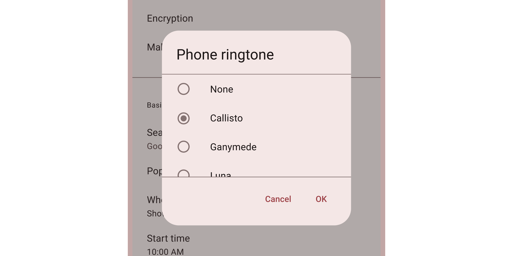

<!-- catalog-only-start --><!-- ---
name: Dialogs
dirname: dialog
-----><!-- catalog-only-end -->

<catalog-component-header image-align="start">
<catalog-component-header-title slot="title">

# Dialogs

<!--*
# Document freshness: For more information, see go/fresh-source.
freshness: { owner: 'lizmitchell' reviewed: '2023-08-08' }
tag: 'docType:reference'
*-->

<!-- no-catalog-start -->

<!-- go/md-dialog -->

<!-- [TOC] -->

<!-- external-only-start -->
**This documentation is fully rendered on the
[Material Web catalog](https://material-web.dev/components/dialog/)**
<!-- external-only-end -->

<!-- no-catalog-end -->

[Dialogs](https://m3.material.io/components/dialogs)<!-- {.external} --> provide
important prompts in a user flow.

</catalog-component-header-title>



</catalog-component-header>

*   [Design article](https://m3.material.io/components/dialogs) <!-- {.external} -->
*   [API Documentation](#api)
*   [Source code](https://github.com/material-components/material-web/tree/main/dialog)
    <!-- {.external} -->

<!-- catalog-only-start -->

<!--

## Interactive Demo



-->

<!-- catalog-only-end -->

## Usage

Dialogs behave like
[`<dialog>`](https://developer.mozilla.org/en-US/docs/Web/API/HTMLDialogElement)<!-- {.external} -->
elements, and can be closed with a `<form method="dialog">` element.

Dialogs have three optional sections: the headline title, the main content, and
action buttons.

```html
<md-dialog>
  <div slot="headline">
    Dialog title
  </div>
  <form slot="content" id="form-id" method="dialog">
    A simple dialog with free-form content.
  </form>
  <div slot="actions">
    <md-text-button form="form-id">Ok</md-text-button>
  </div>
</md-dialog>
```

<!-- no-catalog-start -->
<!-- Need to add image -->
<!-- no-catalog-end -->
<!-- Need to add catalog-include "figures/<component>/usage.html" -->

> Tip: use `margin`, `height`, and `width` CSS properties to control the
> dialog's size and position.

### Opening and closing

Dialogs are opened and closed by setting the `open` attribute or property.

```html
<md-dialog open>
  <div slot="content">
    A dialog that is opened by default.
  </div>
</md-dialog>
```

Dialogs are also opened and closed by calling `dialog.show()` and
`dialog.close()`.

Both return a Promise that resolves after the dialog's animation finishes.

```ts
closeButton.addEventListener('click', async () => {
  await dialog.close();
});
```

### Return value

A button's value attribute will set the dialog's `returnValue` property to
identify which button closed it.

```html
<md-dialog open>
  <form slot="content" id="form-id" method="dialog">...</form>
  <div slot="actions">
    <md-text-button form="form-id" value="cancel">Cancel</md-text-button>
    <md-text-button form="form-id" value="ok">Ok</md-text-button>
  </div>
</md-dialog>
```

```ts
dialog.addEventListener('close', () => {
  const cancelClicked = dialog.returnValue === 'cancel';
  const okClicked = dialog.returnValue === 'ok';
});
```

## Accessibility

Dialogs are labelled by their headlines. Add an
[`aria-label`](https://developer.mozilla.org/en-US/docs/Web/Accessibility/ARIA/Attributes/aria-label)<!-- {.external} -->
attribute to dialogs without a headline.

```html
<md-dialog aria-label="Error message">
  <div slot="content">An error occurred, details ...</div>
</md-dialog>
```

### Alerts

Add a
[`type="alert"`](https://developer.mozilla.org/en-US/docs/Web/Accessibility/ARIA/Roles/alertdialog_role)
attribute to dialogs that need to communicate an important message and require a
user's response.

Common examples include error messages that require confirmation and other
action confirmation prompts.

```html
<md-dialog type="alert">
  <div slot="headline">Confirm deletion</div>
  <form slot="content" id="form-id" method="dialog">
    Are you sure you wish to delete this item?
  </form>
  <div slot="actions">
    <md-text-button form="form-id" value="cancel">Cancel</md-text-button>
    <md-text-button form="form-id" value="delete">Delete</md-text-button>
  </div>
</md-dialog>
```

## Theming

Dialogs supports [Material theming](../theming/README.md) and can be customized
in terms of color, typography, and shape.

### Tokens

Token                               | Default value
----------------------------------- | ---------------------------------------
`--md-dialog-container-color`       | `--md-sys-color-surface-container-high`
`--md-dialog-headline-color`        | `--md-sys-color-on-surface`
`--md-dialog-headline-font`         | `--md-sys-typescale-headline-small-font`
`--md-dialog-supporting-text-color` | `--md-sys-color-on-surface-variant`
`--md-dialog-supporting-text-font`  | `--md-sys-typescale-body-medium-font`

*   [All tokens](https://github.com/material-components/material-web/blob/main/tokens/_md-comp-dialog.scss)
    <!-- {.external} -->

### Example

<!-- no-catalog-start -->
<!-- Need to add image -->
<!-- no-catalog-end -->
<!-- Need to add catalog-include "figures/<component>/usage.html" -->

```html
<style>
:root {
  /* System tokens */
  --md-sys-color-surface-container-highest: #dde4e3;
  --md-sys-color-on-surface: #161d1d;
  --md-sys-color-on-surface-variant: #3f4948;
  --md-sys-typescale-body-medium: system-ui 16px/24px;
  --md-sys-typescale-headline-small: system-ui 24px/32px;

  /* Component tokens */
  --md-dialog-container-shape: 0px;
}
</style>

<md-dialog>
  <div slot="headline">Title</div>
  <div slot="content">Dialog content</div>
</md-dialog>
```

<!-- auto-generated API docs start -->

## API


### MdDialog <code>&lt;md-dialog&gt;</code>

#### Properties

<!-- mdformat off(autogenerated might break rendering in catalog) -->

Property | Attribute | Type | Default | Description
--- | --- | --- | --- | ---
`returnValue` |  | `string` | `''` | Gets or sets the dialog's return value, usually to indicate which button a user pressed to close it.<br>https://developer.mozilla.org/en-US/docs/Web/API/HTMLDialogElement/returnValue
`type` | `type` | `string` | `undefined` | The type of dialog for accessibility. Set this to `alert` to announce a dialog as an alert dialog.
`open` | `open` | `boolean` | `undefined` |
`getOpenAnimation` |  | `() => DialogAnimation` | `function { ... }` | Gets the opening animation for a dialog. Set to a new function to customize the animation.
`getCloseAnimation` |  | `() => DialogAnimation` | `function { ... }` | Gets the closing animation for a dialog. Set to a new function to customize the animation.

<!-- mdformat on(autogenerated might break rendering in catalog) -->

#### Methods

<!-- mdformat off(autogenerated might break rendering in catalog) -->

Method | Parameters | Returns | Description
--- | --- | --- | ---
`show` | _None_ | `Promise<void>` | Opens the dialog and fires a cancelable `open` event. After a dialog's animation, an `opened` event is fired.<br>Add an `autocomplete` attribute to a child of the dialog that should receive focus after opening.
`close` | `returnValue` | `Promise<void>` | Closes the dialog and fires a cancelable `close` event. After a dialog's animation, a `closed` event is fired.

<!-- mdformat on(autogenerated might break rendering in catalog) -->

#### Events

<!-- mdformat off(autogenerated might break rendering in catalog) -->

Event | Description
--- | ---
`open` | Dispatched when the dialog is opening before any animations.
`opened` | Dispatched when the dialog has opened after any animations.
`close` | Dispatched when the dialog is closing before any animations.
`closed` | Dispatched when the dialog has closed after any animations.
`cancel` | Dispatched when the dialog has been canceled by clicking on the scrim or pressing Escape.

<!-- mdformat on(autogenerated might break rendering in catalog) -->

<!-- auto-generated API docs end -->
