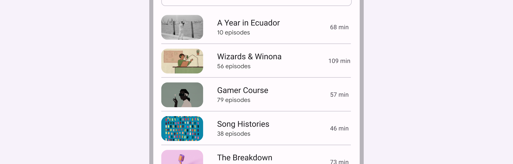
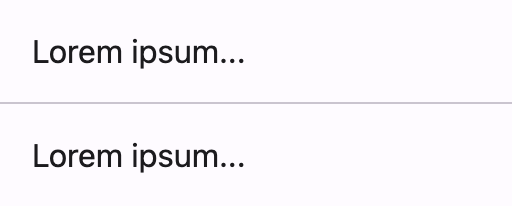
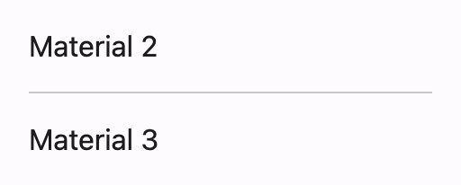
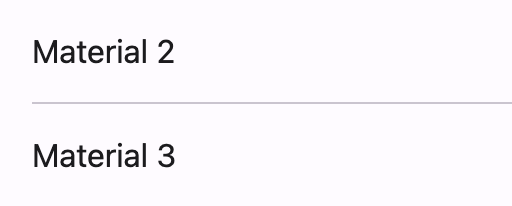
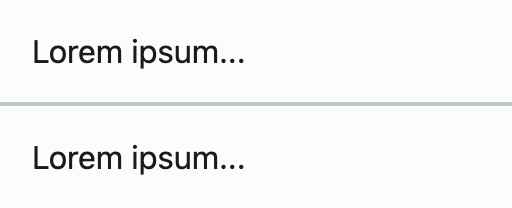

# Divider

<!--*
# Document freshness: For more information, see go/fresh-source.
freshness: { owner: 'lizmitchell' reviewed: '2023-01-22' }
*-->

<!-- go/md-divider -->

<!-- [TOC] -->

A [divider](https://m3.material.io/components/divider)<!-- {.external} --> is a thin line
that groups content in lists and containers.

Dividers can reinforce tapability, such as when used to separate list items or
define tappable regions in an accordion.



*   [Design article](https://m3.material.io/components/divider) <!-- {.external} -->
*   API Documentation (*coming soon*)
*   [Source code](https://github.com/material-components/material-web/tree/master/divider)
    <!-- {.external} -->

## Usage

Use full width dividers to separate larger sections of unrelated content.



```html
<section>
  <p>Lorem ipsum...</p>
  <md-divider></md-divider>
  <p>Lorem ipsum...</p>
</section>
```

### Inset dividers

Use inset dividers to separate related content within a section.



```html
<section>
  <p>Material 2</p>
  <md-divider inset></md-divider>
  <p>Material 3</p>
</section>
```

Inset dividers are equally indented from both sides of the screen by default.
Use `inset-start` or `inset-end` to change this.



```html
<section>
  <p>Material 2</p>
  <md-divider inset-start></md-divider>
  <p>Material 3</p>
</section>
```

## Accessibility

Add a
[`role="separator"`](https://developer.mozilla.org/en-US/docs/Web/Accessibility/ARIA/Roles/separator_role)<!-- {.external} -->
attribute to non-decorative dividers that separate sections of content or groups
of menuitems.

```html
<ul>
  <li>Item one</li>
  <md-divider role="separator"></md-divider>
  <li>Item two</li>
</ul>
```

## Theming

Divider supports [theming](../theming.md) and can be customized with CSS custom
property tokens.

### Tokens

Token                    | Default value
------------------------ | --------------------------------
`--md-divider-color`     | `--md-sys-color-outline-variant`
`--md-divider-thickness` | `1px`

*   [All tokens](https://github.com/material-components/material-web/blob/master/tokens/v0_152/_md-comp-divider.scss#L22-L23)
    <!-- {.external} -->

### Example



```html
<style>
:root {
  --md-sys-color-outline-variant: #BEC9C8;
  --md-divider-thickness: 2px;
}
</style>

<section>
  <p>Lorem ipsum...</p>
  <md-divider></md-divider>
  <p>Lorem ipsum...</p>
</section>
```
