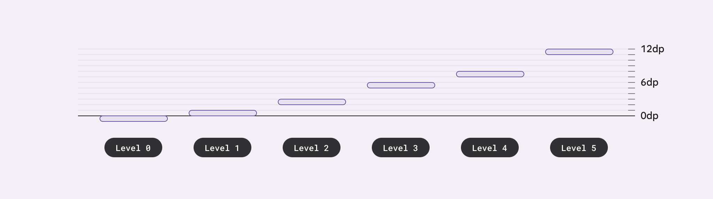
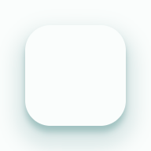

# Elevation

<!--*
# Document freshness: For more information, see go/fresh-source.
freshness: { owner: 'lizmitchell' reviewed: '2023-11-10' }
tag: 'docType:reference'
*-->

<!-- go/md-elevation -->

<!-- [TOC] -->

[Elevation](https://m3.material.io/styles/elevation)<!-- {.external} --> is the relative
distance between two surfaces along the z-axis.

Material's elevation system is deliberately limited to just a handful of levels.
This creative constraint means you need to make thoughtful decisions about your
UI’s elevation story.



*   [Design article](https://m3.material.io/styles/elevation) <!-- {.external} -->
*   [API Documentation](#api)
*   [Source code](https://github.com/material-components/material-web/tree/main/elevation)
    <!-- {.external} -->

## Usage

Elevation can be set from 0 to 5 using the `--md-elevation-level` CSS custom
property. The elevation will automatically fill the nearest `position: relative`
element's size and shape.


```html
<style>
  .surface {
    position: relative;
    border-radius: 16px;
    height: 64px;
    width: 64px;

    --md-elevation-level: 3;
  }
</style>
<div class="surface">
  <md-elevation></md-elevation>
  <!-- Content -->
</div>
```

### Animation

Shadows may be animated between levels by adding `transition-duration` and
`transition-easing-function` CSS properties.


```html
<style>
  .surface {
    /* ... */
    transition-duration: 250ms;
    transition-timing-function: ease-in-out;

    --md-elevation-level: 3;
  }

  .surface:active {
    --md-elevation-level: 0;
  }
</style>
<div class="surface">
  <md-elevation></md-elevation>
  <!-- Content -->
</div>
```

## Accessibility

Elevation is a visual component and does not have accessibility concerns.

## Theming

Elevation supports [Material theming](../theming/README.md) and can be
customized in terms of color.

### Tokens

Token                         | Default value
----------------------------- | -----------------------
`--md-elevation-level`        | `0`
`--md-elevation-shadow-color` | `--md-sys-color-shadow`

*   [All tokens](https://github.com/material-components/material-web/blob/main/tokens/_md-comp-elevation.scss)
    <!-- {.external} -->

### Example



```html
<style>
  .surface {
    position: relative;
    border-radius: 16px;
    height: 64px;
    width: 64px;
  }

  :root {
    --md-elevation-level: 5;
    --md-sys-color-shadow: #006A6A;
  }
</style>
<div class="surface">
  <md-elevation></md-elevation>
  <!-- Content -->
</div>
```

<!-- auto-generated API docs start -->
<!-- auto-generated API docs end -->
