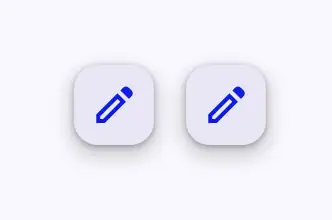
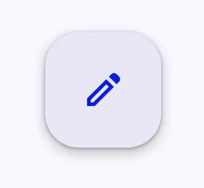
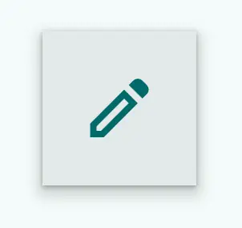
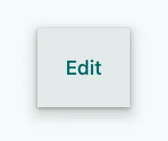

<!-- catalog-only-start --><!-- ---
name: Floating Action Button (FAB)
dirname: fab
-----><!-- catalog-only-end -->

<catalog-component-header>
<catalog-component-header-title slot="title">

# Floating Action Buttons (FAB)

<!--*
# Document freshness: For more information, see go/fresh-source.
freshness: { owner: 'emarquez' reviewed: '2023-06-15' }
tag: 'docType:reference'
*-->

<!-- go/md-fab -->
<!-- [TOC] -->
<!-- github-only-start -->

TODO: update link to live site

**This documentation is fully rendered on the
[Material web catalog](https://github.com/material-components/material-web/tree/main)<!-- {.external} -->.**

<!-- github-only-end -->

[The FAB](https://m3.material.io/components/floating-action-button)<!-- {.external} -->
represents the most important action on a screen. It puts key actions within
reach

[Extended FABs](https://m3.material.io/components/extended-fab) help people take
primary actions. They're wider than FABs to accommodate a text label and larger
target area.

</catalog-component-header-title>


</catalog-component-header>

*   Design articles
    *   [FAB](https://m3.material.io/components/floating-action-button)
        <!-- {.external} -->
    *   [Extended FAB](https://m3.material.io/components/extended-fab)
        <!-- {.external} -->
*   API Documentation (*coming soon*)
*   [Source code](https://github.com/material-components/material-web/tree/main/fab)
    <!-- {.external} -->

<!-- catalog-only-start -->

<!--

## Interactive Demo



-->

<!-- catalog-only-end -->

## Types

### FAB

<!-- github-only-start -->


<!-- github-only-end -->
<!-- catalog-include "figures/fab/fabs.html" -->

1.  [FAB](#fab-1)
2.  [Small FAB](#small)
3.  [Large FAB](#large)

### Extended FAB

<!-- github-only-start -->


<!-- github-only-end -->
<!-- catalog-include "figures/fab/extended-fabs.html" -->

1.  [Extended FAB with both icon and label text](#with-icon)
2.  [Extended FAB without icon](#without-icon)

## Usage

### FAB

FAB comes in two variants, icon-only and extended (icon with label). There are
also three sub variants to each, surface, primary, secondary, tertiary, and
branded FAB.

The icon-only surface variant is the default.

<!-- github-only-start -->


<!-- github-only-end -->
<!-- catalog-include "figures/fab/usage-fab.html" -->

```html
<md-fab aria-label="Edit">
  <md-icon slot="icon">edit</md-icon>
</md-fab>
```

#### Small

The default size of FAB is `"medium"` but it can also be set to `"small"`. You
can also reduce the touch target if you do not need to support touch devices as
the touch target ensures a 48px by 48px area that is interactive with touch
despite the size of the FAB.

<!-- github-only-start -->



<!-- github-only-end -->
<!-- catalog-include "figures/fab/usage-small.html" -->

```html
<md-fab size="small" aria-label="Edit">
  <md-icon slot="icon">edit</md-icon>
</md-fab>
<md-fab size="small" reduced-touch-target aria-label="Edit">
  <md-icon slot="icon">edit</md-icon>
</md-fab>
```

#### Large

The default size of FAB is `"medium"` but it can also be set to `"large"` for
FABs that should be very prominent on the page.

<!-- github-only-start -->



<!-- github-only-end -->
<!-- catalog-include "figures/fab/usage-large.html" -->

```html
<md-fab size="large" aria-label="Edit">
  <md-icon slot="icon">edit</md-icon>
</md-fab>
```

#### Color Variants

Surface fabs are the default variant, but FABs can also be set to primary,
secondary, and tertiary variants.

<!-- github-only-start -->


<!-- github-only-end -->
<!-- catalog-include "figures/fab/usage-color.html" -->

```html
<md-fab variant="primary" aria-label="Edit">
  <md-icon slot="icon">edit</md-icon>
</md-fab>
<md-fab variant="secondary" aria-label="Edit">
  <md-icon slot="icon">edit</md-icon>
</md-fab>
<md-fab variant="tertiary" aria-label="Edit">
  <md-icon slot="icon">edit</md-icon>
</md-fab>
```

#### Branded FAB

Aside from surface and primary FABs, there is the branded FAB which is a FAB
that includes a branded logo. This FAB cannot be set to `size="small"` and
offers different tokens.

<!-- github-only-start -->


<!-- github-only-end -->
<!-- catalog-include "figures/fab/usage-branded.html" -->

```html
<md-branded-fab size="small" aria-label="Add">
  <svg slot="icon" width="36" height="36" viewBox="0 0 36 36">
    <path fill="#34A853" d="M16 16v14h4V20z"></path>
    <path fill="#4285F4" d="M30 16H20l-4 4h14z"></path>
    <path fill="#FBBC05" d="M6 16v4h10l4-4z"></path>
    <path fill="#EA4335" d="M20 16V6h-4v14z"></path>
    <path fill="none" d="M0 0h36v36H0z"></path>
  </svg>
</md-branded-fab>
<md-branded-fab size="small" label="Add">
  <svg slot="icon" width="36" height="36" viewBox="0 0 36 36">
    <path fill="#34A853" d="M16 16v14h4V20z"></path>
    <path fill="#4285F4" d="M30 16H20l-4 4h14z"></path>
    <path fill="#FBBC05" d="M6 16v4h10l4-4z"></path>
    <path fill="#EA4335" d="M20 16V6h-4v14z"></path>
    <path fill="none" d="M0 0h36v36H0z"></path>
  </svg>
</md-branded-fab>
```

#### Lowered

FABs can also come at a lowered elevation and have different elevation tokens
applied to it.

<!-- github-only-start -->


<!-- github-only-end -->
<!-- catalog-include "figures/fab/usage-lowered.html" -->

```html
<md-fab lowered aria-label="Edit">
  <md-icon slot="icon">edit</md-icon>
</md-fab>
```

### Extended FAB

Both the normal and branded FABs can be extended by including the `label`
attribute.

*SSR note:* In the case of SSR, you must explicitly set the `has-icon`
attribute. Otherwise, the client will automatically detect if an icon is slotted
into the element, but that event is not fired upon hydration of a SSRd
declarative shadow DOM template.

<!-- github-only-start -->


<!-- github-only-end -->
<!-- catalog-include "figures/fab/usage-extended.html" -->

```html
<md-fab label="edit" has-icon>
  <md-icon slot="icon">edit</md-icon>
</md-fab>
```

#### Without Icon

Extended fabs are the only fabs that can be used without an icon.

```html
<md-fab label="Edit" has-icon>
  <md-icon slot="icon">edit</md-icon>
</md-fab>
```

<!-- github-only-start -->


<!-- github-only-end -->
<!-- catalog-include "figures/fab/usage-without-icon.html" -->

```html
<md-fab label="reroute"></md-fab>
```

## Accessibility

For each non-extended FAB, an `aria-label` should be provided as the icon text
is not typcially considered accessible. If `aria-label` is not provided, the FAB
will default to announcing its visible contents.

```html
<md-fab aria-label="Edit">
  <md-icon slot="icon">edit</md-icon>
</md-fab>
```

### Extended FAB

For each extended FAB, accessiblity is handled by the `label` attribute. By
supplying the `label` attribute, the extended FAB will make sure that the icon
is not announced.

```html
<md-fab label="Edit" has-icon>
  <md-icon slot="icon">edit</md-icon>
</md-fab>
```

## Theming

FAB supports [Material theming](../theming.md) and can be customized in terms of
color, typography, and shape.

### FAB

#### FAB tokens

Token                       | Default value
--------------------------- | ---------------------------------------
`--md-fab-container-color`  | `--md-sys-color-surface-container-high`
`--md-fab-container-height` | `56px`
`--md-fab-container-width`  | `56px`
`--md-fab-container-shape`  | `16px`
`--md-fab-icon-color`       | `--md-sys-color-primary`
`--md-fab-icon-size`        | `24px`

*   [All tokens](https://github.com/material-components/material-web/blob/main/tokens/_md-comp-fab.scss)
    <!-- {.external} -->

#### FAB example

<!-- github-only-start -->


<!-- github-only-end -->
<!-- catalog-include "figures/fab/theming-fab.html" -->

```html
<style>
  :root {
    --md-sys-color-surface-container-high: #e3e9e9;
    --md-sys-color-primary: #006a6a;
    --md-fab-container-shape: 0px;
    --md-fab-icon-size: 36px;
    background-color: #f4fbfa;
  }
</style>
<md-fab aria-label="Edit">
  <md-icon slot="icon">edit</md-icon>
</md-fab>
```

#### Small tokens

Token                             | Default value
--------------------------------- | ---------------------------------------
`--md-fab-container-color`        | `--md-sys-color-surface-container-high`
`--md-fab-small-container-height` | `40px`
`--md-fab-small-container-width`  | `40px`
`--md-fab-small-container-shape`  | `12px`
`--md-fab-icon-color`             | `--md-sys-color-primary`
`--md-fab-small-icon-size`        | `24px`

*   [All tokens](https://github.com/material-components/material-web/blob/main/tokens/_md-comp-fab.scss)
    <!-- {.external} -->

#### Small example

<!-- github-only-start -->


<!-- github-only-end -->
<!-- catalog-include "figures/fab/theming-small.html" -->

```html
<style>
  :root {
    --md-sys-color-surface-container-high: #e3e9e9;
    --md-sys-color-primary: #006a6a;
    --md-fab-small-icon-size: 28px;
    --md-fab-small-container-shape: 0px;
    background-color: #f4fbfa;
  }
</style>
<md-fab size="small" aria-label="Edit">
  <md-icon slot="icon">edit</md-icon>
</md-fab>
```

#### Large tokens

Token                              | Default value
---------------------------------- | ---------------------------------------
`--md-fab-container-color`         | `--md-sys-color-surface-container-high`
`--md-fab-large-container-heightt` | `96px`
`--md-fab-large-container-width`   | `96px`
`--md-fab-large-container-shape`   | `28px`
`--md-fab-icon-color`              | `--md-sys-color-primary`
`--md-fab-large-icon-size`         | `36px`

*   [All tokens](https://github.com/material-components/material-web/blob/main/tokens/_md-comp-fab.scss)
    <!-- {.external} -->

#### Large example

<!-- github-only-start -->



<!-- github-only-end -->
<!-- catalog-include "figures/fab/theming-large.html" -->

```html
<style>
  :root {
    --md-sys-color-surface-container-high: #e3e9e9;
    --md-sys-color-primary: #006a6a;
    --md-fab-large-icon-size: 28px;
    --md-fab-large-container-shape: 0px;
    background-color: #f4fbfa;
  }
</style>
<md-fab size="large" aria-label="Edit">
  <md-icon slot="icon">edit</md-icon>
</md-fab>
```

#### Color variants tokens

Token                                | Default value
------------------------------------ | ---------------------------------------
`--md-fab-primary-container-color`   | `--md-sys-color-primary-container`
`--md-fab-primary-icon-color`        | `--md-sys-color-on-primary-container`
`--md-fab-secondary-container-color` | `--md-sys-color-secondary-container`
`--md-fab-secondary-icon-color`      | `--md-sys-color-on-secondary-container`
`--md-fab-tertiary-container-color`  | `--md-sys-color-tertiary-container`
`--md-fab-tertiary-icon-color`       | `--md-sys-color-on-tertiary-container`

*   [All tokens](https://github.com/material-components/material-web/blob/main/tokens/_md-comp-fab.scss)
    <!-- {.external} -->

#### Color variants example

<!-- github-only-start -->


<!-- github-only-end -->
<!-- catalog-include "figures/fab/theming-color.html" -->

```html
<style>
  :root {
    --md-sys-color-primary-container: #9cf1f0;
    --md-sys-color-on-primary-container: #002020;
    --md-sys-color-secondary-container: #cce8e7;
    --md-sys-color-on-secondary-container: #051f1f;
    --md-sys-color-tertiary-container: #d3e4ff;
    --md-sys-color-on-tertiary-container: #041c35;
    background-color: #f4fbfa;
  }
</style>
<md-fab variant="primary" aria-label="Edit">
  <md-icon slot="icon">edit</md-icon>
</md-fab>
<md-fab variant="secondary" aria-label="Edit">
  <md-icon slot="icon">edit</md-icon>
</md-fab>
<md-fab variant="tertiary" aria-label="Edit">
  <md-icon slot="icon">edit</md-icon>
</md-fab>
```

#### Branded FAB tokens

Token                               | Default value
----------------------------------- | ---------------------------------------
`--md-fab-branded-container-color`  | `--md-sys-color-surface-container-high`
`--md-fab-branded-container-height` | `56px`
`--md-fab-branded-container-width`  | `56px`
`--md-fab-branded-container-shape`  | `16px`
`--md-fab-branded-icon-color`       | `--md-sys-color-primary`
`--md-fab-branded-icon-size`        | `36px`
`--md-fab-branded-label-text-type`  | `500 0.875rem/1.25rem "Roboto"`

*   [All tokens](https://github.com/material-components/material-web/blob/main/tokens/_md-comp-fab.scss)
    <!-- {.external} -->

#### Branded FAB example

<!-- github-only-start -->


<!-- github-only-end -->
<!-- catalog-include "figures/fab/theming-branded.html" -->

```html
<style>
  :root {
    --md-sys-color-surface-container-high: #e3e9e9;
    --md-sys-color-on-surface: #161d1d;
    --md-fab-branded-icon-size: 48px;
    --md-fab-branded-container-shape: 0px;
    background-color: #f4fbfa;
  }
</style>
<md-branded-fab size="small" aria-label="Add">
  <svg slot="icon" width="36" height="36" viewBox="0 0 36 36">
    <path fill="#34A853" d="M16 16v14h4V20z"></path>
    <path fill="#4285F4" d="M30 16H20l-4 4h14z"></path>
    <path fill="#FBBC05" d="M6 16v4h10l4-4z"></path>
    <path fill="#EA4335" d="M20 16V6h-4v14z"></path>
    <path fill="none" d="M0 0h36v36H0z"></path>
  </svg>
</md-branded-fab>
<md-branded-fab size="small" label="Add">
  <svg slot="icon" width="36" height="36" viewBox="0 0 36 36">
    <path fill="#34A853" d="M16 16v14h4V20z"></path>
    <path fill="#4285F4" d="M30 16H20l-4 4h14z"></path>
    <path fill="#FBBC05" d="M6 16v4h10l4-4z"></path>
    <path fill="#EA4335" d="M20 16V6h-4v14z"></path>
    <path fill="none" d="M0 0h36v36H0z"></path>
  </svg>
</md-branded-fab>
```

#### Lowered tokens

Token                              | Default value
---------------------------------- | --------------------------------------
`--md-fab-lowered-container-color` | `--md-sys-color-surface-container-low`

*   [All tokens](https://github.com/material-components/material-web/blob/main/tokens/_md-comp-fab.scss)
    <!-- {.external} -->

#### Lowered example

<!-- github-only-start -->


<!-- github-only-end -->
<!-- catalog-include "figures/fab/theming-lowered.html" -->

```html
<style>
  :root {
    --md-sys-color-surface-container-low: #eff5f4;
    --md-sys-color-primary: #006a6a;
    --md-fab-container-shape: 0px;
    --md-fab-icon-size: 36px;
    background-color: #f4fbfa;
  }
</style>
<md-fab aria-label="Edit" lowered>
  <md-icon slot="icon">edit</md-icon>
</md-fab>
```

### Extended FAB

#### Extended FAB tokens

Token                       | Default value
--------------------------- | ---------------------------------------
`--md-fab-container-color`  | `--md-sys-color-surface-container-high`
`--md-fab-container-height` | `56px`
`--md-fab-container-shape`  | `16px`
`--md-fab-icon-color`       | `--md-sys-color-primary`
`--md-fab-icon-size`        | `24px`
`--md-fab-label-text-type`  | `500 0.875rem/1.25rem "Roboto"`

*   [All tokens](https://github.com/material-components/material-web/blob/main/tokens/_md-comp-fab.scss)
    <!-- {.external} -->

#### Extended FAB example

<!-- github-only-start -->


<!-- github-only-end -->
<!-- catalog-include "figures/fab/theming-extended.html" -->

```html
<style>
  :root {
    --md-sys-color-surface-container-high: #e3e9e9;
    --md-sys-color-on-surface: #161d1d;
    --md-sys-color-primary: #006a6a;
    --md-fab-container-shape: 0px;
    --md-fab-icon-size: 36px;
    background-color: #f4fbfa;
  }
</style>
<md-fab label="Edit" has-icon>
  <md-icon slot="icon">edit</md-icon>
</md-fab>
```

#### Without Icon tokens

Token                       | Default value
--------------------------- | ---------------------------------------
`--md-fab-container-color`  | `--md-sys-color-surface-container-high`
`--md-fab-container-height` | `56px`
`--md-fab-container-shape`  | `16px`
`--md-fab-label-text-type`  | `500 0.875rem/1.25rem "Roboto"`

*   [All tokens](https://github.com/material-components/material-web/blob/main/tokens/_md-comp-fab.scss)
    <!-- {.external} -->

#### Without Icon example

<!-- github-only-start -->



<!-- github-only-end -->
<!-- catalog-include "figures/fab/theming-without-icon.html" -->

```html
<style>
  :root {
    --md-sys-color-surface-container-high: #e3e9e9;
    --md-sys-color-on-surface: #161d1d;
    --md-fab-container-shape: 0px;
    background-color: #f4fbfa;
  }
</style>
<md-fab label="Edit" has-icon></md-fab>
```
