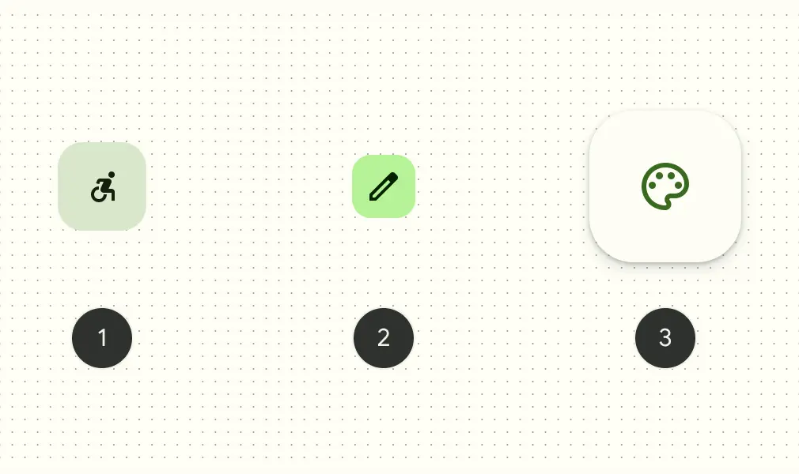
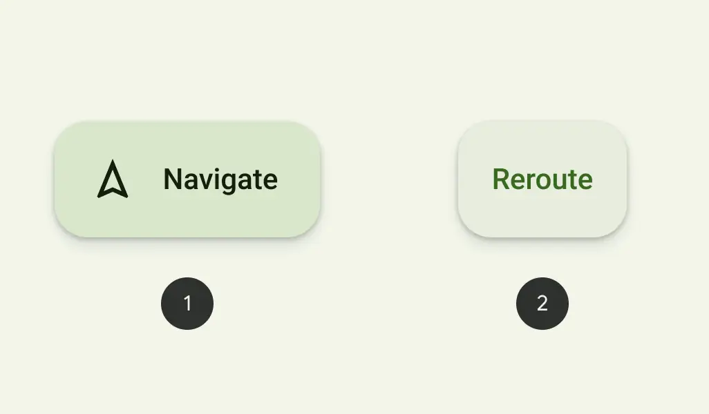
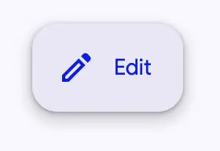

<!-- catalog-only-start --><!-- ---
name: Floating action button (FAB)
dirname: fab
-----><!-- catalog-only-end -->

<catalog-component-header>
<catalog-component-header-title slot="title">

# Floating action buttons (FAB)

<!-- no-catalog-start -->

<!--*
# Document freshness: For more information, see go/fresh-source.
freshness: { owner: 'emarquez' reviewed: '2023-06-15' }
tag: 'docType:reference'
*-->

<!-- go/md-fab -->

<!-- [TOC] -->

<!-- external-only-start -->
**This documentation is fully rendered on the
[Material Web catalog](https://material-web.dev/components/fab/).**
<!-- external-only-end -->

<!-- no-catalog-end -->

[FAB](https://m3.material.io/components/floating-action-button)<!-- {.external} -->
represents the most important action on a screen. It puts key actions within
reach.

[Extended FABs](https://m3.material.io/components/extended-fab) help people take
primary actions. They're wider than FABs to accommodate a text label and larger
target area.

</catalog-component-header-title>


</catalog-component-header>

*   Design articles
    *   [FAB](https://m3.material.io/components/floating-action-button)
        <!-- {.external} -->
    *   [Extended FAB](https://m3.material.io/components/extended-fab)
        <!-- {.external} -->
*   API Documentation (*coming soon*)
*   [Source code](https://github.com/material-components/material-web/tree/main/fab)
    <!-- {.external} -->

<!-- catalog-only-start -->

<!--

## Interactive Demo



-->

<!-- catalog-only-end -->

## Types

<!-- no-catalog-start -->



<!-- no-catalog-end -->
<!-- catalog-include "figures/fab/fabs.html" -->

1.  [FAB](#fab)
2.  [Small FAB](#sizes)
3.  [Large FAB](#sizes)

### Extended FAB

<!-- no-catalog-start -->



<!-- no-catalog-end -->
<!-- catalog-include "figures/fab/extended-fabs.html" -->

*   [Extended FAB with both icon and label text](#extended)
*   [API Documentation](#api)
*   [Extended FAB without icon](#without-icon)

## Usage

FABs should have an icon, such as a font `md-icon`, an `svg`, or an `img`.

<!-- no-catalog-start -->


<!-- no-catalog-end -->
<!-- catalog-include "figures/fab/usage-fab.html" -->

```html
<md-fab aria-label="Edit">
  <md-icon slot="icon">edit</md-icon>
</md-fab>
```

### Lowered

FABs can be set to a lower elevation with the `lowered` attribute.

<!-- no-catalog-start -->


<!-- no-catalog-end -->
<!-- catalog-include "figures/fab/usage-lowered.html" -->

```html
<md-fab lowered aria-label="Edit">
  <md-icon slot="icon">edit</md-icon>
</md-fab>
```

## Accessibility

Icon-only FABs must include an `aria-label` that describes its action. Otherwise
if `aria-label` is not provided, the FAB will default to announcing its visible
contents.

```html
<md-fab aria-label="Edit">
  <md-icon slot="icon">edit</md-icon>
</md-fab>
```

Extended FABs use their `label` for accessibility. Add an `aria-label` for
additional context if needed. By supplying the `label` attribute, the extended
FAB will make sure that the icon is not announced.

```html
<md-fab label="Edit" aria-label="Edit Comment">
  <md-icon slot="icon">edit</md-icon>
</md-fab>
```

## FAB

FABs should display a clear and understandable icon.

<!-- no-catalog-start -->


<!-- no-catalog-end -->
<!-- catalog-include "figures/fab/usage-fab.html" -->

```html
<md-fab aria-label="Edit">
  <md-icon slot="icon">edit</md-icon>
</md-fab>
```

### Extended

FABs may be extended with a label for additional emphasis. Extended FABs can
omit their icon.

<!-- no-catalog-start -->



<!-- no-catalog-end -->
<!-- catalog-include "figures/fab/usage-extended.html" -->

```html
<md-fab label="Edit">
  <md-icon slot="icon">edit</md-icon>
</md-fab>
```

#### Without icon

Extended FABs are the only FABs that can be used without an icon.

<!-- no-catalog-start -->


<!-- no-catalog-end -->
<!-- catalog-include "figures/fab/usage-without-icon.html" -->

```html
<md-fab label="Reroute"></md-fab>
```

### Colors

FAB colors may be changed with the `variant` attribute. It can be set to
"surface" (default), "primary", "secondary", or "tertiary".

<!-- no-catalog-start -->


<!-- no-catalog-end -->
<!-- catalog-include "figures/fab/usage-color.html" -->

```html
<md-fab variant="primary" aria-label="Edit">
  <md-icon slot="icon">edit</md-icon>
</md-fab>
<md-fab variant="secondary" aria-label="Edit">
  <md-icon slot="icon">edit</md-icon>
</md-fab>
<md-fab variant="tertiary" aria-label="Edit">
  <md-icon slot="icon">edit</md-icon>
</md-fab>
```

### Sizes

FABs may be small, medium (default), or large by setting the `size` attribute.
Small FABs can optionally further reduce their touch target.

<!-- no-catalog-start -->


<!-- no-catalog-end -->
<!-- catalog-include "figures/fab/usage-sizes.html" -->

```html
<md-fab size="small" touch-target="none" aria-label="Edit">
  <md-icon slot="icon">edit</md-icon>
</md-fab>
<md-fab size="small" aria-label="Edit">
  <md-icon slot="icon">edit</md-icon>
</md-fab>
<md-fab aria-label="Edit">
  <md-icon slot="icon">edit</md-icon>
</md-fab>
<md-fab size="large" aria-label="Edit">
  <md-icon slot="icon">edit</md-icon>
</md-fab>
```

## Branded FAB

<!-- no-catalog-start -->

<!-- go/md-branded-fab -->

<!-- no-catalog-end -->

Branded FABs use a brightly colored logo for their icon. Unlike [FAB](#fab),
branded FABs do not have color variants.

<!-- no-catalog-start -->


<!-- no-catalog-end -->
<!-- catalog-include "figures/fab/usage-branded.html" -->

```html
<md-branded-fab size="small" aria-label="Add">
  <svg slot="icon" viewBox="0 0 36 36">
    <path fill="#34A853" d="M16 16v14h4V20z"></path>
    <path fill="#4285F4" d="M30 16H20l-4 4h14z"></path>
    <path fill="#FBBC05" d="M6 16v4h10l4-4z"></path>
    <path fill="#EA4335" d="M20 16V6h-4v14z"></path>
    <path fill="none" d="M0 0h36v36H0z"></path>
  </svg>
</md-branded-fab>
```

### Extended

Branded FABs may be extended with a label for additional emphasis. Unlike
[FAB](#fab), branded FABs should always display their logo icon.

<!-- no-catalog-start -->


<!-- no-catalog-end -->
<!-- catalog-include "figures/fab/usage-branded-extended.html" -->

```html
<md-branded-fab label="Add">
  <svg slot="icon" viewBox="0 0 36 36">
    <path fill="#34A853" d="M16 16v14h4V20z"></path>
    <path fill="#4285F4" d="M30 16H20l-4 4h14z"></path>
    <path fill="#FBBC05" d="M6 16v4h10l4-4z"></path>
    <path fill="#EA4335" d="M20 16V6h-4v14z"></path>
    <path fill="none" d="M0 0h36v36H0z"></path>
  </svg>
</md-branded-fab>
```

### Sizes

Branded FABs may be medium (default) or large by setting the `size` attribute.

<!-- no-catalog-start -->


<!-- no-catalog-end -->
<!-- catalog-include "figures/fab/usage-branded-sizes.html" -->

```html
<md-branded-fab aria-label="Add">
  <svg slot="icon" viewBox="0 0 36 36">
    <path fill="#34A853" d="M16 16v14h4V20z"></path>
    <path fill="#4285F4" d="M30 16H20l-4 4h14z"></path>
    <path fill="#FBBC05" d="M6 16v4h10l4-4z"></path>
    <path fill="#EA4335" d="M20 16V6h-4v14z"></path>
    <path fill="none" d="M0 0h36v36H0z"></path>
  </svg>
</md-branded-fab>
<md-branded-fab size="large" aria-label="Add">
  <svg slot="icon" viewBox="0 0 36 36">
    <path fill="#34A853" d="M16 16v14h4V20z"></path>
    <path fill="#4285F4" d="M30 16H20l-4 4h14z"></path>
    <path fill="#FBBC05" d="M6 16v4h10l4-4z"></path>
    <path fill="#EA4335" d="M20 16V6h-4v14z"></path>
    <path fill="none" d="M0 0h36v36H0z"></path>
  </svg>
</md-branded-fab>
```

## Theming

FAB supports [Material theming](../theming/README.md) and can be customized in
terms of color, typography, and shape.

### FAB tokens

Token                              | Default value
---------------------------------- | ---------------------------------------
`--md-fab-container-color`         | `--md-sys-color-surface-container-high`
`--md-fab-lowered-container-color` | `--md-sys-color-surface-container-low`
`--md-fab-container-shape`         | `--md-sys-shape-corner-large`
`--md-fab-icon-color`              | `--md-sys-color-primary`
`--md-fab-icon-size`               | `24px`

*   [All tokens](https://github.com/material-components/material-web/blob/main/tokens/_md-comp-fab.scss)
    <!-- {.external} -->

### FAB example

<!-- no-catalog-start -->


<!-- no-catalog-end -->
<!-- catalog-include "figures/fab/theming-fab.html" -->

```html
<style>
  :root {
    --md-sys-color-surface-container-high: #e3e9e9;
    --md-sys-color-primary: #006a6a;
    --md-fab-container-shape: 0px;
    --md-fab-icon-size: 36px;
    background-color: #f4fbfa;
  }
</style>
<md-fab aria-label="Edit">
  <md-icon slot="icon">edit</md-icon>
</md-fab>
```

#### Sizes tokens

Token                            | Default value
-------------------------------- | -------------
`--md-fab-small-container-shape` | `--md-sys-shape-corner-medium`
`--md-fab-small-icon-size`       | `24px`
`--md-fab-large-container-shape` | `--md-sys-shape-corner-extra-large`
`--md-fab-large-icon-size`       | `36px`

#### Extended FAB tokens

Token                      | Default value
-------------------------- | -------------------------------------
`--md-fab-label-text-font` | `--md-sys-typescale-label-large-font`

#### Extended FAB example

<!-- no-catalog-start -->


<!-- no-catalog-end -->
<!-- catalog-include "figures/fab/theming-extended.html" -->

```html
<style>
  :root {
    --md-sys-color-surface-container-high: #e3e9e9;
    --md-sys-color-on-surface: #161d1d;
    --md-sys-color-primary: #006a6a;
    --md-fab-container-shape: 0px;
    --md-fab-icon-size: 36px;
    background-color: #f4fbfa;
  }
</style>
<md-fab label="Edit">
  <md-icon slot="icon">edit</md-icon>
</md-fab>
```

### Branded FAB tokens

Token                              | Default value
---------------------------------- | ---------------------------------------
`--md-fab-branded-container-color` | `--md-sys-color-surface-container-high`
`--md-fab-branded-container-shape` | `--md-sys-shape-corner-large`
`--md-fab-branded-icon-size`       | `36px`
`--md-fab-branded-label-text-font` | `--md-sys-typescale-label-large-font`

*   [All tokens](https://github.com/material-components/material-web/blob/main/tokens/_md-comp-fab-branded.scss)
    <!-- {.external} -->

### Branded FAB example

<!-- no-catalog-start -->


<!-- no-catalog-end -->
<!-- catalog-include "figures/fab/theming-branded.html" -->

```html
<style>
  :root {
    --md-sys-color-surface-container-high: #e3e9e9;
    --md-sys-color-on-surface: #161d1d;
    --md-fab-branded-icon-size: 48px;
    --md-fab-branded-container-shape: 0px;
    background-color: #f4fbfa;
  }
</style>
<md-branded-fab size="small" aria-label="Add">
  <svg slot="icon" viewBox="0 0 36 36">
    <path fill="#34A853" d="M16 16v14h4V20z"></path>
    <path fill="#4285F4" d="M30 16H20l-4 4h14z"></path>
    <path fill="#FBBC05" d="M6 16v4h10l4-4z"></path>
    <path fill="#EA4335" d="M20 16V6h-4v14z"></path>
    <path fill="none" d="M0 0h36v36H0z"></path>
  </svg>
</md-branded-fab>
<md-branded-fab size="small" label="Add">
  <svg slot="icon" viewBox="0 0 36 36">
    <path fill="#34A853" d="M16 16v14h4V20z"></path>
    <path fill="#4285F4" d="M30 16H20l-4 4h14z"></path>
    <path fill="#FBBC05" d="M6 16v4h10l4-4z"></path>
    <path fill="#EA4335" d="M20 16V6h-4v14z"></path>
    <path fill="none" d="M0 0h36v36H0z"></path>
  </svg>
</md-branded-fab>
```

<!-- auto-generated API docs start -->

## API


### MdFab <code>&lt;md-fab&gt;</code>

#### Properties

<!-- mdformat off(autogenerated might break rendering in catalog) -->

Property | Attribute | Type | Default | Description
--- | --- | --- | --- | ---
`variant` | `variant` | `string` | `'surface'` | The FAB color variant to render.
`size` | `size` | `string` | `'medium'` | The size of the FAB.<br>NOTE: Branded FABs cannot be sized to `small`, and Extended FABs do not have different sizes.
`label` | `label` | `string` | `''` | The text to display on the FAB.
`lowered` | `lowered` | `boolean` | `false` | Lowers the FAB's elevation.

<!-- mdformat on(autogenerated might break rendering in catalog) -->

### MdBrandedFab <code>&lt;md-branded-fab&gt;</code>

#### Properties

<!-- mdformat off(autogenerated might break rendering in catalog) -->

Property | Attribute | Type | Default | Description
--- | --- | --- | --- | ---
`variant` | `variant` | `string` | `'surface'` | The FAB color variant to render.
`size` | `size` | `string` | `'medium'` | The size of the FAB.<br>NOTE: Branded FABs cannot be sized to `small`, and Extended FABs do not have different sizes.
`label` | `label` | `string` | `''` | The text to display on the FAB.
`lowered` | `lowered` | `boolean` | `false` | Lowers the FAB's elevation.

<!-- mdformat on(autogenerated might break rendering in catalog) -->

#### Methods

<!-- mdformat off(autogenerated might break rendering in catalog) -->

Method | Parameters | Returns | Description
--- | --- | --- | ---
`getRenderClasses` | _None_ | `{ primary: boolean; secondary: boolean; tertiary: boolean; small: boolean; lowered: boolean; large: boolean; extended: boolean; }` |

<!-- mdformat on(autogenerated might break rendering in catalog) -->

<!-- auto-generated API docs end -->
