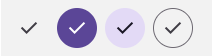
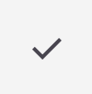
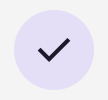
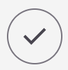
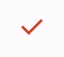
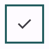

<!-- catalog-only-start --><!-- ---
name: Icon Buttons
dirname: iconbutton
-----><!-- catalog-only-end -->

<catalog-component-header>
<catalog-component-header-title slot="title">

# Icon Buttons

<!--*
# Document freshness: For more information, see go/fresh-source.
freshness: { owner: 'lizmitchell' reviewed: '2023-09-11' }
tag: 'docType:reference'
*-->

<!-- go/md-icon-button -->

<!-- [TOC] -->

<!-- external-only-start -->
**This documentation is fully rendered on the
[Material Web catalog](https://material-web.dev/components/icon-button/).**
<!-- external-only-end -->

[Icon buttons](https://m3.material.io/components/icon-buttons)<!-- {.external} --> help
people take supplementary actions with a single tap.

</catalog-component-header-title>


</catalog-component-header>

*   [Design article](https://m3.material.io/components/icon-buttons) <!-- {.external} -->
*   [API Documentation](#api)
*   [Source code](https://github.com/material-components/material-web/tree/main/iconbutton)
    <!-- {.external} -->

<!-- catalog-only-start -->

<!--

## Interactive Demo



-->

<!-- catalog-only-end -->

## Types

<!-- no-catalog-start -->

")

<!-- no-catalog-end -->
<!-- catalog-include "figures/iconbutton/buttons.html" -->

1.  [Icon Button](#icon-button)
2.  [Filled Icon Button](#filled-icon-button)
3.  [Filled Tonal Icon Button](#filled-tonal-icon-button)
4.  [Outlined Icon Button](#outlined-icon-button)

## Usage

Use icon buttons to display actions in a compact layout. Icon buttons can
represent opening actions such as opening an overflow menu or search, or
represent binary actions that can be toggled on and off, such as favorite or
bookmark.

Icon buttons can be grouped together or they can stand alone.

To use icons by name, see the [Icon](icon.md#usage) documentation for loading
the icon font.

<!-- no-catalog-start -->



<!-- no-catalog-end -->
<!-- catalog-include "figures/iconbutton/usage.html" -->

```html
<md-icon-button>
  <md-icon>check</md-icon>
</md-icon-button>
<md-filled-icon-button>
  <md-icon>check</md-icon>
</md-filled-icon-button>
<md-filled-tonal-icon-button>
  <md-icon>check</md-icon>
</md-filled-tonal-icon-button>
<md-outlined-icon-button>
  <md-icon>check</md-icon>
</md-outlined-icon-button>
```

### Links

Add an
[`href`](https://developer.mozilla.org/en-US/docs/Web/HTML/Element/a#href)<!-- {.external} -->
and optionally a
[`target`](https://developer.mozilla.org/en-US/docs/Web/HTML/Element/a#target)<!-- {.external} -->
attribute to turn the icon button into a link.

```html
<md-icon-button href="https://google.com">
  <md-icon>check</md-icon>
</md-icon-button>
```

### Toggle

<!-- no-catalog-start -->


<!-- no-catalog-end -->
<!-- catalog-include "figures/iconbutton/usage-toggle.html" -->

Toggle icon buttons allow a single choice to be selected or deselected, such as
adding or removing something from favorites.

Add a second icon in the `slot="selected"` slot to change the icon when
selected. Toggle icon buttons can be pre-selected by adding the `selected`
attribute.

```html
<div>
  <md-icon-button toggle>
    <md-icon>close</md-icon>
    <md-icon slot="selected">check</md-icon>
  </md-icon-button>
  <md-filled-icon-button toggle>
    <md-icon>close</md-icon>
    <md-icon slot="selected">check</md-icon>
  </md-filled-icon-button>
  <md-filled-tonal-icon-button toggle>
    <md-icon>close</md-icon>
    <md-icon slot="selected">check</md-icon>
  </md-filled-tonal-icon-button>
  <md-outlined-icon-button toggle>
    <md-icon>close</md-icon>
    <md-icon slot="selected">check</md-icon>
  </md-outlined-icon-button>
</div>
<div>
  <md-icon-button toggle selected>
    <md-icon>close</md-icon>
    <md-icon slot="selected">check</md-icon>
  </md-icon-button>
  <md-filled-icon-button toggle selected>
    <md-icon>close</md-icon>
    <md-icon slot="selected">check</md-icon>
  </md-filled-icon-button>
  <md-filled-tonal-icon-button toggle selected>
    <md-icon>close</md-icon>
    <md-icon slot="selected">check</md-icon>
  </md-filled-tonal-icon-button>
  <md-outlined-icon-button toggle selected>
    <md-icon>close</md-icon>
    <md-icon slot="selected">check</md-icon>
  </md-outlined-icon-button>
</div>
```

## Accessibility

Add an
[`aria-label`](https://developer.mozilla.org/en-US/docs/Web/Accessibility/ARIA/Attributes/aria-label)<!-- {.external} -->
attribute to icon buttons whose labels need a more descriptive label.

```html
<md-icon-button aria-label="Search for Contact">
  <md-icon>search</md-icon>
</md-icon-button>
```

### Toggle

Add an `aria-label-selected` attribute to toggle buttons whose labels need a
more descriptive label when selected.

```html
<md-icon-button toggle
  aria-label="Unselected"
  aria-label-selected="Selected">
  <md-icon>close</md-icon>
  <md-icon slot="selected">check</md-icon>
</md-icon-button>
```

## Icon Button

Standard icon buttons do not have a background or outline, and have the lowest
emphasis of the icon buttons.

<!-- no-catalog-start -->



<!-- no-catalog-end -->
<!-- catalog-include "figures/iconbutton/usage-standard.html" -->

```html
<md-icon-button>
  <md-icon>check</md-icon>
</md-icon-button>
```

## Filled Icon Button

<!-- go/md-filled-icon-button -->

<!-- no-catalog-start -->


<!-- no-catalog-end -->
<!-- catalog-include "figures/iconbutton/usage-filled.html" -->

Filled icon buttons have higher visual impact and are best for high emphasis
actions.

```html
<md-filled-icon-button>
  <md-icon>check</md-icon>
</md-filled-icon-button>
```

## Filled Tonal Icon Button

<!-- go/md-filled-tonal-icon-button -->

<!-- no-catalog-start -->



<!-- no-catalog-end -->
<!-- catalog-include "figures/iconbutton/usage-filled-tonal.html" -->

Filled tonal icon buttons are a middle ground between filled and outlined icon
buttons. They're useful in contexts where the button requires slightly more
emphasis than an outline would give, such as a secondary action paired with a
high emphasis action.

```html
<md-filled-tonal-icon-button>
  <md-icon>check</md-icon>
</md-filled-tonal-icon-button>
```

## Outlined Icon Button

<!-- go/md-outlined-icon-button -->

<!-- no-catalog-start -->



<!-- no-catalog-end -->
<!-- catalog-include "figures/iconbutton/usage-outlined.html" -->

Outlined icon buttons are medium-emphasis buttons. They're useful when an icon
button needs more emphasis than a standard icon button but less than a filled or
filled tonal icon button.

```html
<md-outlined-icon-button>
  <md-icon>check</md-icon>
</md-outlined-icon-button>
```

## Theming

Icon Button supports [Material theming](../theming/README.md) and can be
customized in terms of color, and shape.

### Icon Button tokens

Token                                | Default value
------------------------------------ | -----------------------------------
`--md-icon-button-icon-color`        | `--md-sys-color-on-surface-variant`
`--md-icon-button-state-layer-shape` | `--md-sys-shape-corner-full`
`--md-icon-button-icon-size`         | `24px`

*   [All tokens](https://github.com/material-components/material-web/blob/main/tokens/_md-comp-icon-button.scss)
    <!-- {.external} -->

### Icon Button example

<!-- no-catalog-start -->



<!-- no-catalog-end -->
<!-- catalog-include "figures/iconbutton/theming-standard.html" -->

```html
<style>
:root {
  --md-icon-button-icon-size: 32px;
  --md-sys-color-on-surface-variant: #dc362e;
  background-color: #fff8f6;
}
</style>

<md-icon-button>
  <md-icon>check</md-icon>
</md-icon-button>
```

### Filled Icon Button tokens

Token                                              | Default value
-------------------------------------------------- | ------------------------
`--md-filled-icon-button-selected-container-color` | `--md-sys-color-primary`
`--md-filled-icon-button-container-shape`          | `--md-sys-shape-corner-full`
`--md-filled-icon-button-container-width`          | `40px`
`--md-filled-icon-button-container-height`         | `40px`
`--md-filled-icon-button-icon-size`                | `24px`

*   [All tokens](https://github.com/material-components/material-web/blob/main/tokens/_md-comp-filled-icon-button.scss)
    <!-- {.external} -->

### Filled Icon Button example

<!-- no-catalog-start -->


<!-- no-catalog-end -->
<!-- catalog-include "figures/iconbutton/theming-filled.html" -->

```html
<style>
:root {
  --md-filled-icon-button-container-width: 80px;
  --md-filled-icon-button-container-height: 80px;
  --md-filled-icon-button-icon-size: 40px;
  --md-filled-icon-button-container-shape: 0px;
  --md-sys-color-primary: #dc362e;
  background-color: #fff8f6;
}
</style>
<md-filled-icon-button>
  <md-icon>check</md-icon>
</md-filled-icon-button>
```

### Filled Tonal Icon Button tokens

Token                                                    | Default value
-------------------------------------------------------- | -------------
`--md-filled-tonal-icon-button-selected-container-color` | `--md-sys-color-secondary-container`
`--md-filled-tonal-icon-button-container-shape`          | `--md-sys-shape-corner-full`
`--md-filled-tonal-icon-button-container-width`          | `40px`
`--md-filled-tonal-icon-button-container-height`         | `40px`
`--md-filled-tonal-icon-button-icon-size`                | `24px`

### Filled Tonal Icon Button example

<!-- no-catalog-start -->


<!-- no-catalog-end -->
<!-- catalog-include "figures/iconbutton/theming-filled-tonal.html" -->

```html
<style>
:root {
  --md-filled-tonal-icon-button-container-width: 80px;
  --md-filled-tonal-icon-button-container-height: 80px;
  --md-filled-tonal-icon-button-container-shape: 0px;
  --md-filled-tonal-icon-button-icon-size: 40px;
  --md-sys-color-secondary-container: #006A6A;
}
</style>
<md-filled-tonal-icon-button>
  <md-icon>check</md-icon>
</md-filled-tonal-icon-button>
```

### Outlined Icon Button tokens

Token                                        | Default value
-------------------------------------------- | ------------------------
`--md-outlined-icon-button-outline-color`    | `--md-sys-color-outline`
`--md-outlined-icon-button-outline-width`    | `1px`
`--md-outlined-icon-button-container-shape`  | `--md-sys-shape-corner-full`
`--md-outlined-icon-button-container-width`  | `40px`
`--md-outlined-icon-button-container-height` | `40px`
`--md-outlined-icon-button-icon-size`        | `24px`

### Outlined Icon Button example

<!-- no-catalog-start -->



<!-- no-catalog-end -->
<!-- catalog-include "figures/iconbutton/theming-outlined.html" -->

```html
<style>
:root {
  --md-outlined-icon-button-container-width: 80px;
  --md-outlined-icon-button-container-height: 80px;
  --md-outlined-icon-button-container-shape: 0px;
  --md-outlined-icon-button-icon-size: 40px;
  --md-outlined-icon-button-outline-width: 4px;
  --md-sys-color-outline: #006A6A;
}
</style>
<md-outlined-icon-button>
  <md-icon>check</md-icon>
</md-outlined-icon-button>
```

<!-- auto-generated API docs start -->

## API

### MdIconButton <code>&lt;md-icon-button&gt;</code>

#### Properties

<!-- mdformat off(autogenerated might break rendering in catalog) -->

Property | Attribute | Type | Default | Description
--- | --- | --- | --- | ---
`disabled` | `disabled` | `boolean` | `false` | Disables the icon button and makes it non-interactive.
`flipIconInRtl` | `flip-icon-in-rtl` | `boolean` | `false` | Flips the icon if it is in an RTL context at startup.
`href` | `href` | `string` | `''` | Sets the underlying `HTMLAnchorElement`'s `href` resource attribute.
`target` | `target` | `string` | `''` | Sets the underlying `HTMLAnchorElement`'s `target` attribute.
`ariaLabelSelected` | `aria-label-selected` | `string` | `''` | The `aria-label` of the button when the button is toggleable and selected.
`toggle` | `toggle` | `boolean` | `false` | When true, the button will toggle between selected and unselected states
`selected` | `selected` | `boolean` | `false` | Sets the selected state. When false, displays the default icon. When true, displays the selected icon, or the default icon If no `slot="selected"` icon is provided.
`type` | `type` | `string` | `'submit'` |
`value` | `value` | `string` | `''` |
`name` |  | `string` | `undefined` |
`form` |  | `HTMLFormElement` | `undefined` |
`labels` |  | `NodeList` | `undefined` |

<!-- mdformat on(autogenerated might break rendering in catalog) -->

### MdFilledIconButton <code>&lt;md-filled-icon-button&gt;</code>

#### Properties

<!-- mdformat off(autogenerated might break rendering in catalog) -->

Property | Attribute | Type | Default | Description
--- | --- | --- | --- | ---
`disabled` | `disabled` | `boolean` | `false` | Disables the icon button and makes it non-interactive.
`flipIconInRtl` | `flip-icon-in-rtl` | `boolean` | `false` | Flips the icon if it is in an RTL context at startup.
`href` | `href` | `string` | `''` | Sets the underlying `HTMLAnchorElement`'s `href` resource attribute.
`target` | `target` | `string` | `''` | Sets the underlying `HTMLAnchorElement`'s `target` attribute.
`ariaLabelSelected` | `aria-label-selected` | `string` | `''` | The `aria-label` of the button when the button is toggleable and selected.
`toggle` | `toggle` | `boolean` | `false` | When true, the button will toggle between selected and unselected states
`selected` | `selected` | `boolean` | `false` | Sets the selected state. When false, displays the default icon. When true, displays the selected icon, or the default icon If no `slot="selected"` icon is provided.
`type` | `type` | `string` | `'submit'` |
`value` | `value` | `string` | `''` |
`name` |  | `string` | `undefined` |
`form` |  | `HTMLFormElement` | `undefined` |
`labels` |  | `NodeList` | `undefined` |

<!-- mdformat on(autogenerated might break rendering in catalog) -->

### MdFilledTonalIconButton <code>&lt;md-filled-tonal-icon-button&gt;</code>

#### Properties

<!-- mdformat off(autogenerated might break rendering in catalog) -->

Property | Attribute | Type | Default | Description
--- | --- | --- | --- | ---
`disabled` | `disabled` | `boolean` | `false` | Disables the icon button and makes it non-interactive.
`flipIconInRtl` | `flip-icon-in-rtl` | `boolean` | `false` | Flips the icon if it is in an RTL context at startup.
`href` | `href` | `string` | `''` | Sets the underlying `HTMLAnchorElement`'s `href` resource attribute.
`target` | `target` | `string` | `''` | Sets the underlying `HTMLAnchorElement`'s `target` attribute.
`ariaLabelSelected` | `aria-label-selected` | `string` | `''` | The `aria-label` of the button when the button is toggleable and selected.
`toggle` | `toggle` | `boolean` | `false` | When true, the button will toggle between selected and unselected states
`selected` | `selected` | `boolean` | `false` | Sets the selected state. When false, displays the default icon. When true, displays the selected icon, or the default icon If no `slot="selected"` icon is provided.
`type` | `type` | `string` | `'submit'` |
`value` | `value` | `string` | `''` |
`name` |  | `string` | `undefined` |
`form` |  | `HTMLFormElement` | `undefined` |
`labels` |  | `NodeList` | `undefined` |

<!-- mdformat on(autogenerated might break rendering in catalog) -->

### MdOutlinedIconButton <code>&lt;md-outlined-icon-button&gt;</code>

#### Properties

<!-- mdformat off(autogenerated might break rendering in catalog) -->

Property | Attribute | Type | Default | Description
--- | --- | --- | --- | ---
`disabled` | `disabled` | `boolean` | `false` | Disables the icon button and makes it non-interactive.
`flipIconInRtl` | `flip-icon-in-rtl` | `boolean` | `false` | Flips the icon if it is in an RTL context at startup.
`href` | `href` | `string` | `''` | Sets the underlying `HTMLAnchorElement`'s `href` resource attribute.
`target` | `target` | `string` | `''` | Sets the underlying `HTMLAnchorElement`'s `target` attribute.
`ariaLabelSelected` | `aria-label-selected` | `string` | `''` | The `aria-label` of the button when the button is toggleable and selected.
`toggle` | `toggle` | `boolean` | `false` | When true, the button will toggle between selected and unselected states
`selected` | `selected` | `boolean` | `false` | Sets the selected state. When false, displays the default icon. When true, displays the selected icon, or the default icon If no `slot="selected"` icon is provided.
`type` | `type` | `string` | `'submit'` |
`value` | `value` | `string` | `''` |
`name` |  | `string` | `undefined` |
`form` |  | `HTMLFormElement` | `undefined` |
`labels` |  | `NodeList` | `undefined` |

<!-- mdformat on(autogenerated might break rendering in catalog) -->

<!-- auto-generated API docs end -->
