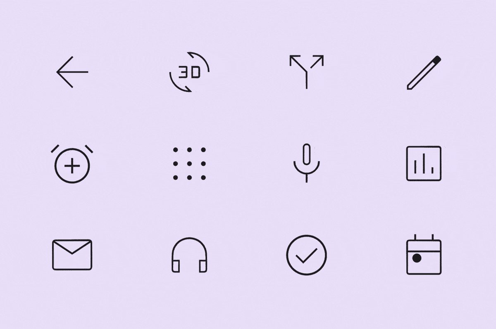
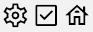
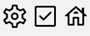
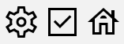
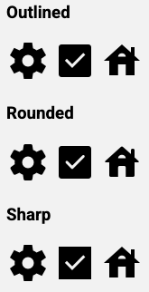
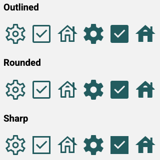

# Icon

<!--*
# Document freshness: For more information, see go/fresh-source.
freshness: { owner: 'dfreedm' reviewed: '2023-03-08' }
tag: 'docType:reference'
*-->

<!-- go/md-icon -->

<!-- [TOC] -->

[Icons](https://m3.material.io/styles/icons/overview)<!-- {.external} --> can be used to
represent common actions. Material Symbols are a set of variable icon fonts
created at seven weights across three different styles.



*   [Design article](https://m3.material.io/styles/icons) <!-- {.external} -->
*   [API Documentation](#api)
*   [Source code](https://github.com/material-components/material-web/tree/main/icon)
    <!-- {.external} -->

## Usage

Icons can be specified by name, unicode code point, or have an `<svg>` child
element.



```html
<md-icon>settings</md-icon>
<md-icon>&#xe834</md-icon>
<md-icon><svg xmlns="http://www.w3.org/2000/svg" viewBox="0 0 48 48"><path d="M10 40V24H4L24 6l10 8.85V9h4v9.55L44 24h-6v16H26.5V28h-5v12Zm3-3h5.5V25h11v12H35V19.95l-11-10-11 10Zm5.5-12h11-11Zm1.25-5.5h8.5q0-1.65-1.275-2.725Q25.7 15.7 24 15.7q-1.7 0-2.975 1.075Q19.75 17.85 19.75 19.5Z"/></svg></md-icon>
```

The full range of icons can be found on the
[Material Symbols](https://fonts.google.com/icons)<!-- {.external} --> font page.

Material Symbols icons are available in three styles: **outlined**, **rounded**,
and **sharp**.

In addition, Material Symbols have four adjustable stylistic variable font
attributes called axes. An axis is a typographic term referring to the attribute
of a symbol that can be altered to create visual variations.

Each style symbol contains four axes: **weight**, **fill**, **grade**, and
**optical size**.

The `weight` and `optical size` attributes are handled automatically, but the
`fill` and `grade` attributes are custom to the Material Symbols font, and must
be set with the
[`font-variation-settings`](https://developer.mozilla.org/en-US/docs/Web/CSS/font-variation-settings)<!-- {.external} -->
property.

### Outlined

Outlined symbols use stroke and fill attributes for a light, clean style that
works well in dense UIs. The stroke weight of outlined icons can be adjusted to
complement or contrast the weight of your typography.

Load the font with

```html
<link href="https://fonts.googleapis.com/icon?family=Material+Symbols+Outlined" rel="stylesheet">
```

### Rounded



Rounded symbols use a corner radius that pairs well with brands that use heavier
typography, curved logos, or circular elements to express their style.

Load the font with

```html
<link href="https://fonts.googleapis.com/icon?family=Material+Symbols+Rounded" rel="stylesheet">
```

To use Rounded icons, set `--md-icon-font` to `'Material Symbols Rounded'`.

### Sharp



Sharp symbols display corners with straight edges, for a crisp style that
remains legible even at smaller scales. These rectangular shapes can support
brand styles that aren’t well-reflected by rounded shapes.

Load the font with

```html
<link href="https://fonts.googleapis.com/icon?family=Material+Symbols+Sharp" rel="stylesheet">
```

To use Sharp icons, set `font-family` to `'Material Symbols Sharp'`.

### Fill



Filled Icons gives you the ability to transition from a more outlined style to a
reversed or more filled style.

A fill attribute can be used to convey a state of transition, such as unfilled
and filled states. Values range from `0` to `1`, with `1` being completely
filled. Along with weight, fill is a primary attribute that impacts the overall
look of a symbol.

All styles of Material Symbols can be filled by setting
`font-variation-settings` to `'FILL' 1`.

## Accessibility

Icons are mostly intended to be used inside of other components that have
accessibility settings.

If used on their own, Icons should be given an accessible name if they are
focusable. If you use icons by name, they will be announced by screen readers
without any extra steps.

If using codepoints, wrap the codepoint in a `<span>` with an
[`aria-label`](https://developer.mozilla.org/en-US/docs/Web/Accessibility/ARIA/Attributes/aria-label)<!-- {.external} -->
attribute.

```html
<md-icon tabindex="-1"><span aria-label="home">&#xe88a</span></md-icon>
```

If using SVG icons, add an `aria-label` attribute to the SVG element.

```html
<md-icon tabindex="-1"><svg aria-label="paper airplane" viewBox="0 0 48 48"><path d="M6 40V8l38 16Zm3-4.65L36.2 24 9 12.5v8.4L21.1 24 9 27Zm0 0V12.5 27Z"/></svg></md-icon>
```

## Theming

### Tokens

Token            | Default value
---------------- | -----------------------------
`--md-icon-font` | `'Material Symbols Outlined'`
`--md-icon-size` | `24px`

*   [All tokens](https://github.com/material-components/material-web/blob/main/tokens/_md-comp-icon.scss)
    <!-- {.external} -->

### Example



```html
<link href="https://fonts.googleapis.com/css2?family=Material+Symbols+Outlined:opsz,wght,FILL@20..48,100..700,0..1" rel="stylesheet">
<link href="https://fonts.googleapis.com/css2?family=Material+Symbols+Rounded:opsz,wght,FILL@20..48,100..700,0..1"  rel="stylesheet">
<link href="https://fonts.googleapis.com/css2?family=Material+Symbols+Sharp:opsz,wght,FILL@20..48,100..700,0..1" rel="stylesheet">

<style>
md-icon {
  color: #006A6A;
  --md-icon-size: 48px;
}
.rounded {
  --md-icon-font: 'Material Symbols Rounded';
}
.sharp {
  --md-icon-font: 'Material Symbols Sharp';
}
md-icon[filled] {
  font-variation-settings: 'FILL' 1;
}
</style>

<h3>Outlined</h3>
<span>
  <md-icon>settings</md-icon>
  <md-icon>check_box</md-icon>
  <md-icon>house</md-icon>
  <md-icon filled>settings</md-icon>
  <md-icon filled>check_box</md-icon>
  <md-icon filled>house</md-icon>
</span>
<h3>Rounded</h3>
<span class="rounded">
  <md-icon>settings</md-icon>
  <md-icon>check_box</md-icon>
  <md-icon>house</md-icon>
  <md-icon filled>settings</md-icon>
  <md-icon filled>check_box</md-icon>
  <md-icon filled>house</md-icon>
</span>
<h3>Sharp</h3>
<span class="sharp">
  <md-icon>settings</md-icon>
  <md-icon>check_box</md-icon>
  <md-icon>house</md-icon>
  <md-icon filled>settings</md-icon>
  <md-icon filled>check_box</md-icon>
  <md-icon filled>house</md-icon>
</span>
```

<!-- auto-generated API docs start -->
<!-- auto-generated API docs end -->
