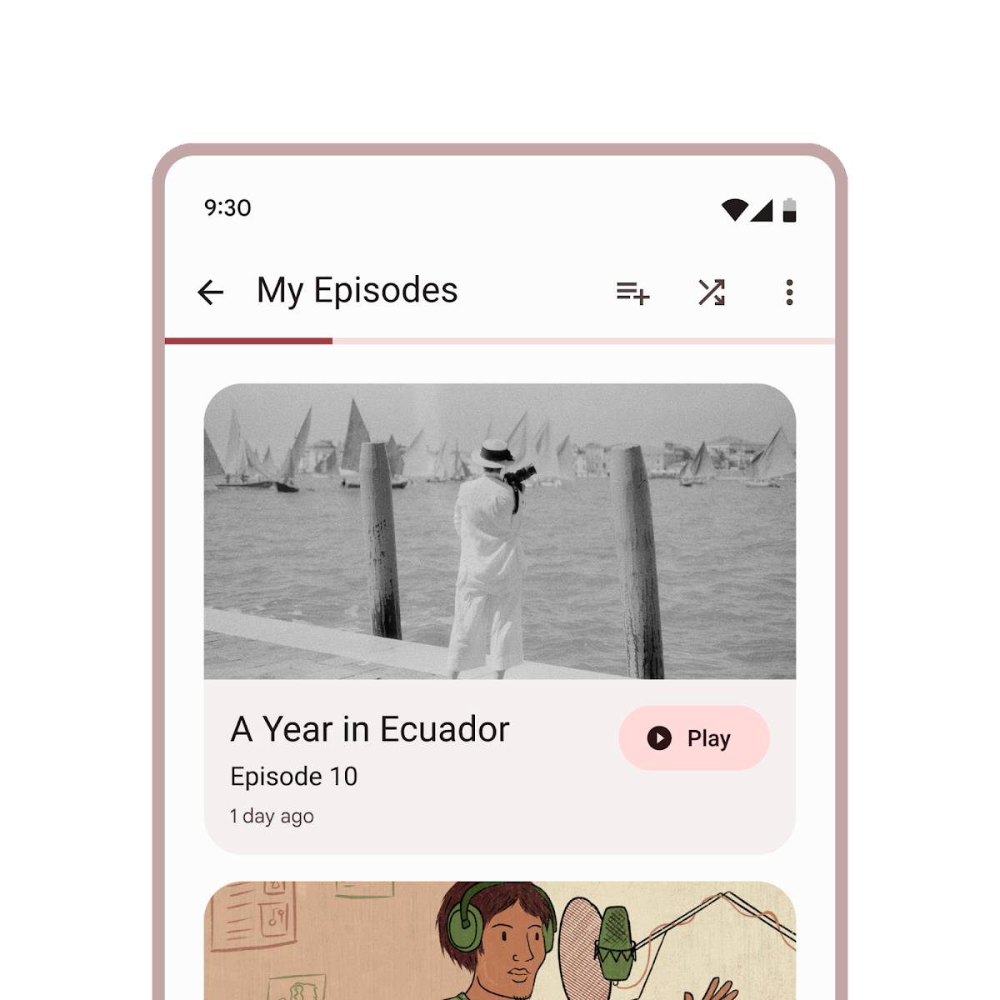
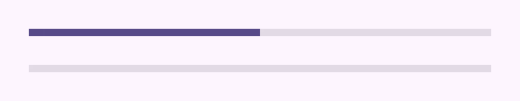
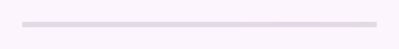

<!-- catalog-only-start --><!-- ---
name: Linear Progress
dirname: linearprogress
ssrOnly: true
-----><!-- catalog-only-end -->

<catalog-component-header>
<catalog-component-header-title slot="title">

# Linear progress

<!--*
# Document freshness: For more information, see go/fresh-source.
freshness: { owner: 'lizmitchell' reviewed: '2023-05-02' }
tag: 'docType:reference'
*-->

<!-- github-only-start -->

<!-- go/md-checkbox -->

<!-- [TOC] -->

**This documentation is fully rendered on the
[Material Web catalog](https://material-components.github.io/material-web/components/linearprogress/)<!-- {.external} -->.**

<!-- github-only-end -->

[Progress indicators](https://m3.material.io/components/progress-indicators)<!-- {.external} -->
inform users about the status of ongoing processes, such as loading an app or
submitting a form.

There are two types of progress indicators: Linear and circular.

Linear progress indicators display progress by animating along the length of a
fixed, visible track.

</catalog-component-header-title>



</catalog-component-header>

*   [Design article](https://m3.material.io/components/progress-indicators)
    <!-- {.external} -->
*   API Documentation (*coming soon*)
*   [Source code](https://github.com/material-components/material-web/tree/main/linearprogress)
    <!-- {.external} -->

<!-- catalog-only-start -->

<!--

## Interactive Demo



-->

<!-- catalog-only-end -->

## Usage

Linear progress indicators may be determinate to show progress, or indeterminate
for an unspecified amount of progress.

<!-- github-only-start -->



<!-- github-only-end -->
<!-- catalog-only-start -->

<!--

<div class="figure-wrapper">
  <figure
      style="min-width:300px;flex-direction:column;justify-content:center;gap:16px;"
      title="Determinate and indeterminate linear progress indicators."
      aria-label="Two linear progress indicators, one with half the track and the other indeterminate.">
    <md-linear-progress style="width:100%;" progress="0.5"></md-linear-progress>
    <md-linear-progress style="width:100%;" indeterminate></md-linear-progress>
  </figure>
</div>

-->

<!-- catalog-only-end -->

```html
<md-linear-progress progress="0.5"></md-linear-progress>

<md-linear-progress indeterminate></md-linear-progress>
```

### Four colors

Indeterminate linear progress indicators may cycle between four colors (primary,
primary container, tertiary, and tertiary container by default).

<!-- github-only-start -->



<!-- github-only-end -->
<!-- catalog-only-start -->

<!--

<div class="figure-wrapper">
  <figure
      style="min-width:300px;"
      title="A four-color indeterminate linear progress indicator"
      aria-label="An indeterminate linear progress indicator that cycles between four colors.">
    <md-linear-progress style="flex-grow:1" four-color indeterminate>
    </md-linear-progress>
  </figure>
</div>

-->

<!-- catalog-only-end -->

```html
<md-linear-progress four-color indeterminate></md-linear-progress>
```

## Accessibility

Add an
[`aria-label`](https://developer.mozilla.org/en-US/docs/Web/Accessibility/ARIA/Attributes/aria-label)<!-- {.external} -->
attribute to progress indicators to give them a descriptive name.

```html
<md-linear-progress progress="0.5" aria-label="Download progress"></md-linear-progress>
```

## Theming

Linear progress supports [Material theming](../theming.md) and can be customized
in terms of color and shape.

### Tokens

Token                                          | Default value
---------------------------------------------- | -------------
`--md-linear-progress-track-color`             | `--md-sys-color-surface-container-highest`
`--md-linear-progress-track-height`            | `4px`
`--md-linear-progress-track-shape`             | `0px`
`--md-linear-progress-active-indicator-color`  | `--md-sys-color-primary`
`--md-linear-progress-active-indicator-height` | `4px`

*   [All tokens](https://github.com/material-components/material-web/blob/main/tokens/_md-comp-linear-progress-indicator.scss)
    <!-- {.external} -->

### Example

<!-- github-only-start -->


<!-- github-only-end -->
<!-- catalog-only-start -->

<!--

<div class="figure-wrapper">
  <figure
      style="min-width:300px;"
      class="styled-example"
      aria-label="Image of a linear progress indicator with a different theme applied"
      title="Linear progress theming example.">
  <style>
    .styled-example {
      background-color: white;
      --md-linear-progress-track-height: 8px;
      --md-linear-progress-track-shape: 8px;
      --md-linear-progress-active-indicator-height: 8px;
      --md-sys-color-primary: #006A6A;
      --md-sys-color-surface-container-highest: #DDE4E3;
    }
    .styled-example md-linear-progress {
      flex-grow: 1;
    }
  </style>
  <md-linear-progress progress="0.5"></md-linear-progress>
  </figure>
</div>

-->

<!-- catalog-only-end -->

```html
<style>
:root {
  --md-linear-progress-track-height: 8px;
  --md-linear-progress-track-shape: 8px;
  --md-linear-progress-active-indicator-height: 8px;
  --md-sys-color-primary: #006A6A;
  --md-sys-color-surface-container-highest: #DDE4E3;
}
</style>

<md-linear-progress progress="0.5"></md-linear-progress>
```
