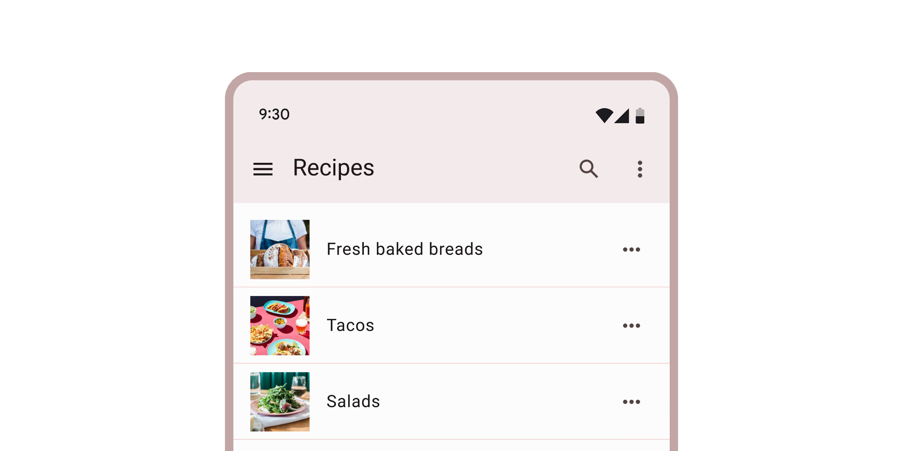
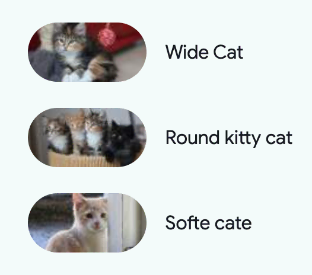

<!-- catalog-only-start --><!-- ---
name: Lists
dirname: list
-----><!-- catalog-only-end -->

<catalog-component-header image-align="start">
<catalog-component-header-title slot="title">

# Lists

<!--*
# Document freshness: For more information, see go/fresh-source.
freshness: { owner: 'emarquez' reviewed: '2024-03-18' }
tag: 'docType:reference'
*-->

<!-- no-catalog-start -->

<!-- go/md-list -->

<!-- [TOC] -->

<!-- external-only-start -->
**This documentation is fully rendered on the
[Material Web catalog](https://material-web.dev/components/list/)**
<!-- external-only-end -->

<!-- no-catalog-end -->

[Lists](https://m3.material.io/components/lists)<!-- {.external} --> are continuous,
vertical indexes of text and images

</catalog-component-header-title>



</catalog-component-header>

*   [Design article](https://m3.material.io/components/lists) <!-- {.external} -->
*   [API Documentation](#api)
*   [Source code](https://github.com/material-components/material-web/tree/main/list)
    <!-- {.external} -->

<!-- catalog-only-start -->

<!--

## Interactive Demo



-->

<!-- catalog-only-end -->

## Usage

`<md-list>` is a container composed of `<md-list-item>`s of different types.

<!-- no-catalog-start -->


<!-- no-catalog-end -->
<!-- catalog-include "figures/list/usage.html" -->

```html
<md-list style="max-width: 300px;">
  <md-list-item>
    Fruits
  </md-list-item>
  <md-divider></md-divider>
  <md-list-item>
    Apple
</md-list-item>
  <md-list-item>
    Banana
  </md-list-item>
  <md-list-item>
    <div slot="headline">Cucumber</div>
    <div slot="supporting-text">Cucumbers are long green fruits that are just as long as this multi-line description</div>
  </md-list-item>
  <md-list-item
      type="link"
      href="https://google.com/search?q=buy+kiwis&tbm=shop"
      target="_blank">
    <div slot="headline">Shop for Kiwis</div>
    <div slot="supporting-text">This will link you out in a new tab</div>
    <md-icon slot="end">open_in_new</md-icon>
  </md-list-item>
</md-list>
```

## Icon Items

Icons can be slotted into list-items' `start` or `end` slot.

<!-- no-catalog-start -->


<!-- no-catalog-end -->
<!-- catalog-include "figures/list/usage-icon.html" -->

```html
<md-list style="max-width: 300px">
  <md-list-item>
    Lit
    <svg  slot="start" style="height: 24px" viewBox="0 0 160 200">
      <path
        fill="currentColor"
        d="m160 80v80l-40-40zm-40 40v80l40-40zm0-80v80l-40-40zm-40 40v80l40-40zm-40-40v80l40-40zm40-40v80l-40-40zm-40 120v80l-40-40zm-40-40v80l40-40z"
      />
    </svg>
  </md-list-item>
  <md-divider></md-divider>
  <md-list-item>
    Polymer
    <md-icon slot="start">polymer</md-icon>
  </md-list-item>
  <md-divider></md-divider>
  <md-list-item>
    Angular
    <svg slot="start" style="height: 24px" viewBox="0 0 250 250">
      <polygon points="108,135.4 125,135.4 125,135.4 125,135.4 142,135.4 125,94.5   " />
      <path
        d="M125,30L125,30L125,30L31.9,63.2l14.2,123.1L125,230l0,0l0,0l78.9-43.7l14.2-123.1L125,30z M183.1,182.6h-21.7h0
          l-11.7-29.2H125h0h0h-24.7l-11.7,29.2h0H66.9h0L125,52.1l0,0l0,0l0,0l0,0L183.1,182.6L183.1,182.6z"
      />
    </svg>
  </md-list-item>
</md-list>
```

## Image Items

Images should be slotted into list-items' `start` slot.

<!-- no-catalog-start -->


<!-- no-catalog-end -->
<!-- catalog-include "figures/list/usage-image.html" -->

```html
<md-list style="max-width: 300px;">
  <md-list-item>
    Cat
    
  </md-list-item>
  <md-divider></md-divider>
  <md-list-item>
    Kitty Cat
    
  </md-list-item>
  <md-divider></md-divider>
  <md-list-item>
    Cate
    
  </md-list-item>
</md-list>
```

## Accessibility

List can have its `role` and `tabindex` set via the `role` and `tabindex`
attributes, and list items can have their `role` and `tabindex` set via the
`type` and `tabindex` attributes respectively.

> NOTE: List item has a limited set of `type`s that can be set on it. This is to
> ensure that your list remains accessible with all other properties and options
> presented to it. See the `ListItemType` TypeScript type exported by list item
> for the current accepted values.

By default these values are set to
[`role="list"`](https://developer.mozilla.org/en-US/docs/Web/Accessibility/ARIA/Roles/list_role)<!-- {.external} -->
and `tabindex="-1"` for list, and
[`role="listitem"`](https://developer.mozilla.org/en-US/docs/Web/Accessibility/ARIA/Roles/listitem_role)<!-- {.external} -->
and `tabindex="0"` for list items.

## Theming

List and List Item supports
[Material theming](https://github.com/material-components/material-web/blob/main/docs/theming/README.md)<!-- {.external} -->
and can be customized in terms of color, typography, and shape.

### List & List Item

Token                                           | Default value
----------------------------------------------- | -------------
`--md-list-container-color`                     | `--md-sys-color-surface`
`--md-list-item-container-shape`                | `--md-sys-shape-corner-none`
`--md-list-item-label-text-color`               | `--md-sys-color-on-surface`
`--md-list-item-supporting-text-color`          | `--md-sys-color-on-surface-variant`
`--md-list-item-trailing-supporting-text-color` | `--md-sys-color-on-surface-variant`
`--md-list-item-label-text-font`                | `--md-sys-typescale-label-large-font`
`--md-list-item-supporting-text-font`           | `--md-sys-typescale-body-medium-font`
`--md-list-item-trailing-supporting-text-font`  | `--md-sys-typescale-label-small-font`

*   [All List tokens](https://github.com/material-components/material-web/blob/main/tokens/_md-comp-list.scss)
    <!-- {.external} -->
*   [All List Item tokens](https://github.com/material-components/material-web/blob/main/tokens/_md-comp-list-item.scss)
    <!-- {.external} -->

### List & List Item Example

<!-- no-catalog-start -->


<!-- no-catalog-end -->
<!-- catalog-include "figures/list/theming-list.html" -->

```html
<style>
  :root {
    --md-list-container-color: #f4fbfa;
    --md-list-item-label-text-color: #161d1d;
    --md-list-item-supporting-text-color: #3f4948;
    --md-list-item-trailing-supporting-text-color: #3f4948;
    --md-list-item-label-text-font: system-ui;
    --md-list-item-supporting-text-font: system-ui;
    --md-list-item-trailing-supporting-text-font: system-ui;
  }
  [slot="trailing-supporting-text"] {
    width: 30px;
    text-align: end;
  }
</style>
<md-list>
  <md-list-item type="button">
    <div slot="headline">Apple</div>
    <div slot="supporting-text">In stock</div>
    <div slot="trailing-supporting-text">+100</div>
  </md-list-item>
  <md-list-item type="button">
    <div slot="headline">Banana</div>
    <div slot="supporting-text">In stock</div>
    <div slot="trailing-supporting-text">56</div>
  </md-list-item>
  <md-list-item type="button">
    <div slot="headline">Cucumber</div>
    <div slot="supporting-text">Low stock</div>
    <div slot="trailing-supporting-text">5</div>
  </md-list-item>
</md-list>
```

### Icon List Item

Token                                | Default value
------------------------------------ | -----------------------------------
`--md-list-item-leading-icon-color`  | `--md-sys-color-on-surface-variant`
`--md-list-item-trailing-icon-color` | `--md-sys-color-on-surface-variant`
`--md-list-item-leading-icon-size`   | `18px`
`--md-list-item-trailing-icon-size`  | `24px`

*   [All List Item tokens](https://github.com/material-components/material-web/blob/main/tokens/_md-comp-list-item.scss)
    <!-- {.external} -->

### Icon List Item Example

<!-- no-catalog-start -->


<!-- no-catalog-end -->
<!-- catalog-include "figures/list/theming-icon.html" -->

```html
<style>
  :root {
    background-color: #f4fbfa;
    --md-list-container-color: #f4fbfa;
    --md-list-item-label-text-color: #161d1d;
    --md-list-item-leading-icon-color: #006a6a;
    --md-list-item-trailing-icon-color: #006a6a;
    --md-list-item-leading-icon-size: 20px;
    --md-list-item-trailing-icon-size: 20px;
  }
  md-list-item.unhealthy {
    --md-list-item-trailing-icon-color: #ba1a1a;
  }
</style>
<md-list>
  <md-list-item>
    <div slot="headline">Eggs</div>
    <md-icon slot="start">egg</md-icon>
    <md-icon slot="end">recommend</md-icon>
  </md-list-item>
  <md-list-item class="unhealthy">
    <div slot="headline">Ice Cream</div>
    <md-icon slot="start">icecream</md-icon>
    <md-icon slot="end">dangerous</md-icon>
  </md-list-item>
  <md-list-item>
    <div slot="headline">Orange</div>
    <md-icon slot="start">nutrition</md-icon>
    <md-icon slot="end">recommend</md-icon>
  </md-list-item>
</md-list>
```

### Avatar List Item

Token                                       | Default value
------------------------------------------- | -------------
`--md-list-item-leading-avatar-label-color` | `--md-sys-color-on-primary-container`
`--md-list-item-leading-avatar-label-font`  | `--md-sys-typescale-title-medium-font`
`--md-list-item-leading-avatar-color`       | `--md-sys-color-primary-container`
`--md-list-item-leading-avatar-size`        | `40px`
`--md-list-item-leading-avatar-shape`       | `--md-sys-shape-corner-full`

*   [All List Item tokens](https://github.com/material-components/material-web/blob/main/tokens/_md-comp-list-item.scss)
    <!-- {.external} -->

### Image List Item

Token                                 | Default value
------------------------------------- | -------------
`--md-list-item-leading-image-height` | `56px`
`--md-list-item-leading-image-width`  | `56px`
`--md-list-item-leading-image-shape`  | `--md-sys-shape-corner-none`

*   [All List Item tokens](https://github.com/material-components/material-web/blob/main/tokens/_md-comp-list-item.scss)
    <!-- {.external} -->

### Image List Item Example

<!-- no-catalog-start -->



<!-- no-catalog-end -->
<!-- catalog-include "figures/list/theming-image.html" -->

```html
<style>
  :root {
    background-color: #f4fbfa;
    --md-list-container-color: #f4fbfa;
    --md-list-item-label-text-color: #161d1d;
    --md-list-item-leading-image-height: 50px;
    --md-list-item-leading-image-width: 100px;
    --md-list-item-leading-image-shape: 25px;
  }
  img {
    width: 40px;
  }
</style>
<md-list>
  <md-list-item headline="Wide Cat">
    
  </md-list-item>
  <md-list-item headline="Round kitty cat">
    
  </md-list-item>
  <md-list-item headline="Softe cate">
    
  </md-list-item>
</md-list>
```

<!-- auto-generated API docs start -->

## API


### MdList <code>&lt;md-list&gt;</code>

#### Properties

<!-- mdformat off(autogenerated might break rendering in catalog) -->

Property | Attribute | Type | Default | Description
--- | --- | --- | --- | ---
`items` |  | `ListItem[]` | `undefined` |

<!-- mdformat on(autogenerated might break rendering in catalog) -->

#### Methods

<!-- mdformat off(autogenerated might break rendering in catalog) -->

Method | Parameters | Returns | Description
--- | --- | --- | ---
`activateNextItem` | _None_ | `ListItem` | Activates the next item in the list. If at the end of the list, the first item will be activated.
`activatePreviousItem` | _None_ | `ListItem` | Activates the previous item in the list. If at the start of the list, the last item will be activated.

<!-- mdformat on(autogenerated might break rendering in catalog) -->

### MdListItem <code>&lt;md-list-item&gt;</code>

#### Properties

<!-- mdformat off(autogenerated might break rendering in catalog) -->

Property | Attribute | Type | Default | Description
--- | --- | --- | --- | ---
`disabled` | `disabled` | `boolean` | `false` | Disables the item and makes it non-selectable and non-interactive.
`type` | `type` | `string` | `'text'` | Sets the behavior of the list item, defaults to "text". Change to "link" or "button" for interactive items.
`href` | `href` | `string` | `''` | Sets the underlying `HTMLAnchorElement`'s `href` resource attribute.
`target` | `target` | `string` | `''` | Sets the underlying `HTMLAnchorElement`'s `target` attribute when `href` is set.

<!-- mdformat on(autogenerated might break rendering in catalog) -->

#### Events

<!-- mdformat off(autogenerated might break rendering in catalog) -->

Event | Description
--- | ---
`request-activation` |

<!-- mdformat on(autogenerated might break rendering in catalog) -->

<!-- auto-generated API docs end -->
