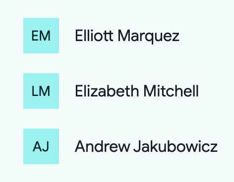

<!-- catalog-only-start --><!-- ---
name: Lists
dirname: list
-----><!-- catalog-only-end -->

<catalog-component-header image-align="start">
<catalog-component-header-title slot="title">

# Lists

<!-- TODO: update freshness to current date when copying. -->

<!--*
# Document freshness: For more information, see go/fresh-source.
freshness: { owner: 'emarquez' reviewed: '2023-08-09' }
tag: 'docType:reference'
*-->

<!-- no-catalog-start -->

<!-- go/md-list -->

<!-- [TOC] -->

<!-- external-only-start -->
**This documentation is fully rendered on the
[Material Web catalog](https://material-web.dev/components/list/)**
<!-- external-only-end -->

<!-- no-catalog-end -->

[Lists](https://m3.material.io/components/lists)<!-- {.external} --> are continuous,
vertical indexes of text and images

</catalog-component-header-title>


</catalog-component-header>

*   [Design article](https://m3.material.io/components/lists) <!-- {.external} -->
*   [Source code](https://github.com/material-components/material-web/tree/main/list)
    <!-- {.external} -->

<!-- catalog-only-start -->

<!--

## Interactive Demo



-->

<!-- catalog-only-end -->

## Usage

`<md-list>` is a container composed of `<md-list-item>`s of different types.

<!-- no-catalog-start -->


<!-- no-catalog-end -->
<!-- catalog-include "figures/list/usage.html" -->

```html
<md-list style="max-width: 300px;">
  <md-list-item headline="Fruits"></md-list-item>
  <md-divider></md-divider>
  <md-list-item headline="Apple"></md-list-item>
  <md-list-item headline="Banana" supporting-text="Banana is a yellow fruit">
  </md-list-item>
  <md-list-item
      headline="Cucumber"
      multi-line-supporting-text
      supporting-text="Cucumbers are long green fruits that are just as long as this multi-line description">
  </md-list-item>
  <md-list-item
      interactive
      headline="Shop for Kiwis"
      supporting-text="This will link you out in a new tab"
      href="https://google.com/search?q=buy+kiwis&tbm=shop"
      target="_blank">
    <md-icon slot="end-icon">open_in_new</md-icon>
  </md-list-item>
</md-list>
```

## Icon Items

Icons can be slotted into list-items' `start-icon` or `end-icon` slot.

<!-- no-catalog-start -->


<!-- no-catalog-end -->
<!-- catalog-include "figures/list/usage-icon.html" -->

```html
<md-list style="max-width: 300px;">
  <md-list-item headline="Lit">
    <svg slot="start-icon" viewBox="0 0 160 200">
      <path
        d="m160 80v80l-40-40zm-40 40v80l40-40zm0-80v80l-40-40zm-40 40v80l40-40zm-40-40v80l40-40zm40-40v80l-40-40zm-40 120v80l-40-40zm-40-40v80l40-40z"/>
    </svg>
  </md-list-item>
  <md-divider></md-divider>
  <md-list-item headline="Polymer">
    <md-icon slot="start-icon">polymer</md-icon>
  </md-list-item>
  <md-divider></md-divider>
  <md-list-item headline="Angular">
    <svg slot="start-icon" viewBox="0 0 250 250">
      <polygon points="108,135.4 125,135.4 125,135.4 125,135.4 142,135.4 125,94.5"/>
      <path d="M125,30L125,30L125,30L31.9,63.2l14.2,123.1L125,230l0,0l0,0l78.9-43.7l14.2-123.1L125,30z M183.1,182.6h-21.7h0 l-11.7-29.2H125h0h0h-24.7l-11.7,29.2h0H66.9h0L125,52.1l0,0l0,0l0,0l0,0L183.1,182.6L183.1,182.6z"/>
    </svg>
  </md-list-item>
</md-list>
```

## Avatar Items

Image or text avatars can be slotted into list-items' `start-avatar` slot.

<!-- no-catalog-start -->


<!-- no-catalog-end -->
<!-- catalog-include "figures/list/usage-avatar.html" -->

```html
<md-list style="max-width: 300px;">
  <md-list-item headline="User 1">
    <span slot="start-avatar">EM</span>
  </md-list-item>
  <md-divider></md-divider>
  <md-list-item headline="User 2">
    
  </md-list-item>
</md-list>
```

## Image Items

Images can be slotted into list-items' `start-image` slot.

<!-- no-catalog-start -->


<!-- no-catalog-end -->
<!-- catalog-include "figures/list/usage-image.html" -->

```html
<md-list style="max-width: 300px;">
  <md-list-item headline="Cat">
    
  </md-list-item>
  <md-divider></md-divider>
  <md-list-item headline="Kitty Cat">
    
  </md-list-item>
  <md-divider></md-divider>
  <md-list-item headline="Cate">
    
  </md-list-item>
</md-list>
```

## Video Items

Videos can also be slotted into list-items' `start-video"` or
`start-video-large` slots.

<!-- no-catalog-start -->

<video src="images/list/usage-video.mp4" autoplay loop muted playsinline alt="Three video items in a list. The first item shows the Material You intro video autoplaying and says Expressiveness. The second item is autoplaying a color customization video and says Personalization. The third item has a bunch of animating components and says Accessible."></video>

<!-- no-catalog-end -->
<!-- catalog-include "figures/list/usage-video.html" -->

```html
<md-list style="max-width: 300px;">
  <md-list-item headline="Expressiveness">
    <video
        slot="start-video"
        playsinline
        muted
        autoplay
        loop
        src="https://kstatic.googleusercontent.com/files/f925638d73101f91d11db39e191ec6ed4101ee96c063283ddc4ea1f01b7d1ebe3ae360c124448d5759a7ecfbcb05af96cf746122ee3b898b4bf7db8d6882de1c">
    </video>
  </md-list-item>
  <md-divider></md-divider>
  <md-list-item headline="Personalization">
    <video
        slot="start-video"
        playsinline
        muted
        autoplay
        loop
        src="https://kstatic.googleusercontent.com/files/e07831809bfeeef1acd74cc5fbf20fc2974984c7e011f01e3df62c96a5a18b309af71e58e01a07ae89e30d7243e692affcf8fbf159fe0e078e35612d0851e8ea">
    </video>
  </md-list-item>
  <md-divider></md-divider>
  <md-list-item headline="Accessible">
    <video
        slot="start-video"
        playsinline
        muted
        autoplay
        loop
        src="https://kstatic.googleusercontent.com/files/9430d9604eff1ecd370d688cb57eb95781e546279ed9bbb04c15dd0b80881c564addc8aaed5d37b3a5fc656b1fc673cfbd25c4b6a08b9d3e7ea396808f00ba20">
    </video>
  </md-list-item>
</md-list>
```

## Accessibility

List can have its `role` and `tabindex` set via the `role` and `tabindex`
attributes, and list items can have their internal `role` and `tabindex` set via
the `type` and `item-tabindex` attributes respectively.

By default these values are set to
[`role="list"`](https://developer.mozilla.org/en-US/docs/Web/Accessibility/ARIA/Roles/list_role)<!-- {.external} -->
and `tabindex="-1"` for list, and
[`role="listitem"`](https://developer.mozilla.org/en-US/docs/Web/Accessibility/ARIA/Roles/listitem_role)<!-- {.external} -->
and `tabindex="0"` for list items.

The following example sets
[`role="listbox"`](https://developer.mozilla.org/en-US/docs/Web/Accessibility/ARIA/Roles/listbox_role)<!-- {.external} -->
on the internal list and
[`role="option"`](https://developer.mozilla.org/en-US/docs/Web/Accessibility/ARIA/Roles/option_role)<!-- {.external} -->
on the internal list item nodes.

```html
<md-list role="listbox" tabindex="0">
  <md-list-item type="option" headline="icon">
    <md-icon slot="start-icon">account_circle</md-icon>
  </md-list-item>

  <md-list-item type="option" headline="image">
    
  </md-list-item>

  <md-list-item type="option" headline="avatar">
    
  </md-list-item>

  <md-list-item type="option" headline="avatar text">
    <span role="img" alt="stylized text EM" slot="start-avatar">EM</span>
  </md-list-item>

  <md-list-item type="option" headline="video">
    <video slot="start-video" playsinline muted autoplay loop
        src="https://kstatic.googleusercontent.com/files/f925638d73101f91d11db39e191ec6ed4101ee96c063283ddc4ea1f01b7d1ebe3ae360c124448d5759a7ecfbcb05af96cf746122ee3b898b4bf7db8d6882de1c">
      <track src="link-to-subtitles-en.vtt" label="English captions" kind="captions" srclang="en" default>
      <track src="link-to-subtitles-zh.vtt" label="中文字幕" kind="captions" srclang="zh">
    </video>
  </md-list-item>
</md-list>
```

## Theming

List and List Item supports
[Material theming](https://github.com/material-components/material-web/blob/main/docs/theming/README.md)<!-- {.external} -->
and can be customized in terms of color, typography, and shape.

### List & List Item

Token                                           | Default value
----------------------------------------------- | -------------
`--md-list-container-color`                     | `--md-sys-color-surface`
`--md-list-item-container-color`                | `--md-sys-color-surface`
`--md-list-item-container-shape`                | `0px`
`--md-list-item-label-text-color`               | `--md-sys-color-on-surface`
`--md-list-item-supporting-text-color`          | `--md-sys-color-on-surface-variant`
`--md-list-item-trailing-supporting-text-color` | `--md-sys-color-on-surface-variant`
`--md-list-item-label-text-font`                | `--md-sys-typescale-label-large-font`
`--md-list-item-supporting-text-font`           | `--md-sys-typescale-body-medium-font`
`--md-list-item-trailing-supporting-text-font`  | `--md-sys-typescale-label-small-font`

*   [All List tokens](https://github.com/material-components/material-web/blob/main/tokens/_md-comp-list.scss)
    <!-- {.external} -->
*   [All List Item tokens](https://github.com/material-components/material-web/blob/main/tokens/_md-comp-list-item.scss)
    <!-- {.external} -->

### List & List Item Example

<!-- no-catalog-start -->


<!-- no-catalog-end -->
<!-- catalog-include "figures/list/theming-list.html" -->

```html
<style>
  :root {
    background-color: #f4fbfa;
    --md-list-container-color: #f4fbfa;
    --md-list-item-container-color: transparent;
    --md-list-item-label-text-color: #161d1d;
    --md-list-item-supporting-text-color: #3f4948;
    --md-list-item-trailing-supporting-text-color: #3f4948;
    --md-list-item-label-text-font: system-ui;
    --md-list-item-supporting-text-font: system-ui;
    --md-list-item-trailing-supporting-text-font: system-ui;
  }
</style>
<md-list>
  <md-list-item
      headline="Apple"
      supporting-text="In stock"
      trailing-supporting-text="+100">
  </md-list-item>
  <md-list-item
      headline="Banana"
      supporting-text="In stock"
      trailing-supporting-text="56">
  </md-list-item>
  <md-list-item
      headline="Cucumber"
      supporting-text="Low stock"
      trailing-supporting-text="5">
  </md-list-item>
</md-list>
```

### Icon List Item

Token                                | Default value
------------------------------------ | -----------------------------------
`--md-list-item-leading-icon-color`  | `--md-sys-color-on-surface-variant`
`--md-list-item-trailing-icon-color` | `--md-sys-color-on-surface-variant`
`--md-list-item-leading-icon-size`   | `18px`
`--md-list-item-trailing-icon-size`  | `24px`

*   [All List Item tokens](https://github.com/material-components/material-web/blob/main/tokens/_md-comp-list-item.scss)
    <!-- {.external} -->

### Icon List Item Example

<!-- no-catalog-start -->


<!-- no-catalog-end -->
<!-- catalog-include "figures/list/theming-icon.html" -->

```html
<style>
  :root {
    background-color: #f4fbfa;
    --md-list-container-color: #f4fbfa;
    --md-list-item-container-color: transparent;
    --md-list-item-leading-icon-color: #006a6a;
    --md-list-item-trailing-icon-color: #006a6a;
    --md-list-item-leading-icon-size: 20px;
    --md-list-item-trailing-icon-size: 20px;
  }
  md-list-item.unhealthy {
    --md-list-item-trailing-icon-color: #ba1a1a;
  }
</style>
<md-list>
  <md-list-item headline="Eggs">
    <md-icon slot="start-icon">egg</md-icon>
    <md-icon slot="end-icon">recommend</md-icon>
  </md-list-item>
  <md-list-item headline="Ice cream" class="unhealthy">
    <md-icon slot="start-icon">icecream</md-icon>
    <md-icon slot="end-icon">dangerous</md-icon>
  </md-list-item>
  <md-list-item headline="Orange">
    <md-icon slot="start-icon">nutrition</md-icon>
    <md-icon slot="end-icon">recommend</md-icon>
  </md-list-item>
</md-list>
```

### Avatar List Item

Token                                       | Default value
------------------------------------------- | -------------
`--md-list-item-leading-avatar-label-color` | `--md-sys-color-on-primary-container`
`--md-list-item-leading-avatar-label-font`  | `--md-sys-typescale-title-medium-font`
`--md-list-item-leading-avatar-color`       | `--md-sys-color-primary-container`
`--md-list-item-leading-avatar-size`        | `40px`
`--md-list-item-leading-avatar-shape`       | `9999px`

*   [All List Item tokens](https://github.com/material-components/material-web/blob/main/tokens/_md-comp-list-item.scss)
    <!-- {.external} -->

### Avatar List Item Example

<!-- no-catalog-start -->



<!-- no-catalog-end -->
<!-- catalog-include "figures/list/theming-avatar.html" -->

```html
<style>
  :root {
    background-color: #f4fbfa;
    --md-list-container-color: #f4fbfa;
    --md-list-item-container-color: transparent;
    --md-list-item-leading-avatar-color: #9cf1f0;
    --md-list-item-leading-avatar-label-color: #002020;
    --md-list-item-leading-avatar-label-font: system-ui;
    --md-list-item-leading-avatar-shape: 0;
    --md-list-item-leading-avatar-size: 36px;
  }
</style>
<md-list>
  <md-list-item headline="Elliott Marquez">
    <span slot="start-avatar">EM</span>
  </md-list-item>
  <md-list-item headline="Elizabeth Mitchell">
    <span slot="start-avatar">LM</span>
  </md-list-item>
  <md-list-item headline="Andrew Jackubowicz">
    <span slot="start-avatar">AJ</span>
  </md-list-item>
</md-list>
```

### Image List Item

Token                                 | Default value
------------------------------------- | -------------
`--md-list-item-leading-image-height` | `56px`
`--md-list-item-leading-image-width`  | `56px`
`--md-list-item-leading-image-shape`  | `0px`

*   [All List Item tokens](https://github.com/material-components/material-web/blob/main/tokens/_md-comp-list-item.scss)
    <!-- {.external} -->

### Image List Item Example

<!-- no-catalog-start -->


<!-- no-catalog-end -->
<!-- catalog-include "figures/list/theming-image.html" -->

```html
<style>
  :root {
    background-color: #f4fbfa;
    --md-list-container-color: #f4fbfa;
    --md-list-item-container-color: transparent;
    --md-list-item-leading-image-height: 50px;
    --md-list-item-leading-image-width: 100px;
    --md-list-item-leading-image-shape: 25px;
  }
</style>
<md-list>
  <md-list-item headline="Wide Cat">
    
  </md-list-item>
  <md-list-item headline="Round kitty cat">
    
  </md-list-item>
  <md-list-item headline="Softe cate">
    
  </md-list-item>
</md-list>
```

### Video List Item

Token                                 | Default value
------------------------------------- | -------------
`--md-list-item-leading-image-height` | `56px`
`--md-list-item-leading-image-width`  | `100px`
`--md-list-item-leading-image-shape`  | `0px`

*   [All List Item tokens](https://github.com/material-components/material-web/blob/main/tokens/_md-comp-list-item.scss)
    <!-- {.external} -->

### Video List Item Example

<!-- no-catalog-start -->

<video src="images/list/theming-video.mp4" autoplay loop muted playsinline alt="Image of a list and video list items of material design concepts with a different theme applied"></video>

<!-- no-catalog-end -->
<!-- catalog-include "figures/list/theming-video.html" -->

```html
<style>
  :root {
    background-color: #f4fbfa;
    --md-list-container-color: #f4fbfa;
    --md-list-item-container-color: transparent;
    --md-list-item-leading-video-height: 60px;
    --md-list-item-leading-video-width: 60px;
    --md-list-item-leading-video-shape: 30px;
  }
</style>
<md-list>
  <md-list-item headline="Expressiveness">
    <video slot="start-video" playsinline muted autoplay loop
      src="https://kstatic.googleusercontent.com/files/f925638d73101f91d11db39e191ec6ed4101ee96c063283ddc4ea1f01b7d1ebe3ae360c124448d5759a7ecfbcb05af96cf746122ee3b898b4bf7db8d6882de1c"
    ></video>
  </md-list-item>
  <md-divider></md-divider>
  <md-list-item headline="Personalization">
    <video slot="start-video" playsinline muted autoplay loop
      src="https://kstatic.googleusercontent.com/files/e07831809bfeeef1acd74cc5fbf20fc2974984c7e011f01e3df62c96a5a18b309af71e58e01a07ae89e30d7243e692affcf8fbf159fe0e078e35612d0851e8ea"
    ></video>
  </md-list-item>
  <md-divider></md-divider>
  <md-list-item headline="Accessible">
    <video slot="start-video" playsinline muted autoplay loop
      src="https://kstatic.googleusercontent.com/files/9430d9604eff1ecd370d688cb57eb95781e546279ed9bbb04c15dd0b80881c564addc8aaed5d37b3a5fc656b1fc673cfbd25c4b6a08b9d3e7ea396808f00ba20"
    ></video>
  </md-list-item>
</md-list>
```

<!-- auto-generated API docs start -->

## API


### MdList &lt;md-list&gt;

#### Properties

<!-- mdformat off(autogenerated might break rendering in catalog) -->

Property | Attribute | Type | Default | Description
--- | --- | --- | --- | ---
`items` |  | `ListItem[]` | `undefined` | An array of activatable and disableable list items. Queries every assigned element that has the `md-list-item` attribute.<br>_NOTE:_ This is a shallow, flattened query via `HTMLSlotElement.queryAssignedElements` and thus will _only_ include direct children / directly slotted elements.

<!-- mdformat on(autogenerated might break rendering in catalog) -->

#### Methods

<!-- mdformat off(autogenerated might break rendering in catalog) -->

Method | Parameters | Returns | Description
--- | --- | --- | ---
`activateNextItem` | _None_ | `ListItem` | Activates the next item in the list. If at the end of the list, the first item will be activated.
`activatePreviousItem` | _None_ | `ListItem` | Activates the previous item in the list. If at the start of the list, the last item will be activated.

<!-- mdformat on(autogenerated might break rendering in catalog) -->

### MdListItem &lt;md-list-item&gt;

#### Properties

<!-- mdformat off(autogenerated might break rendering in catalog) -->

Property | Attribute | Type | Default | Description
--- | --- | --- | --- | ---
`interactive` | `interactive` | `boolean` | `false` | Enables focusing the list item, and adds hover and click ripples when set to true. By default `interactive` is false.
`headline` | `headline` | `string` | `''` | The primary, headline text of the list item.
`supportingText` | `supporting-text` | `string` | `''` | The one-line supporting text below the headline. Set `multiLineSupportingText` to `true` to support multiple lines in the supporting text.
`multiLineSupportingText` | `multi-line-supporting-text` | `boolean` | `false` | Modifies `supportingText` to support multiple lines.
`trailingSupportingText` | `trailing-supporting-text` | `string` | `''` | The supporting text placed at the end of the item. Overridden by elements slotted into the `end` slot.
`disabled` | `disabled` | `boolean` | `false` | Disables the item and makes it non-selectable and non-interactive.
`type` | `type` | `string` | `'listitem'` | Sets the role of the list item. Set to 'nothing' to clear the role. This property will be ignored if `href` is set since the underlying element will be a native anchor tag.
`href` | `href` | `string` | `''` | Sets the underlying `HTMLAnchorElement`'s `href` resource attribute.
`target` | `target` | `string` | `''` | Sets the underlying `HTMLAnchorElement`'s `target` attribute when `href` is set.

<!-- mdformat on(autogenerated might break rendering in catalog) -->

#### Methods

<!-- mdformat off(autogenerated might break rendering in catalog) -->

Method | Parameters | Returns | Description
--- | --- | --- | ---
`getRenderClasses` | _None_ | `{ interactive: boolean; 'with-one-line': boolean; 'with-two-line': boolean; 'with-three-line': boolean; disabled: boolean; }` | 
`renderRipple` | _None_ | `unique symbol \| TemplateResult` | 
`renderFocusRing` | _None_ | `unique symbol \| TemplateResult` | 
`onFocus` | _None_ | `void` | 

<!-- mdformat on(autogenerated might break rendering in catalog) -->

<!-- auto-generated API docs end -->
