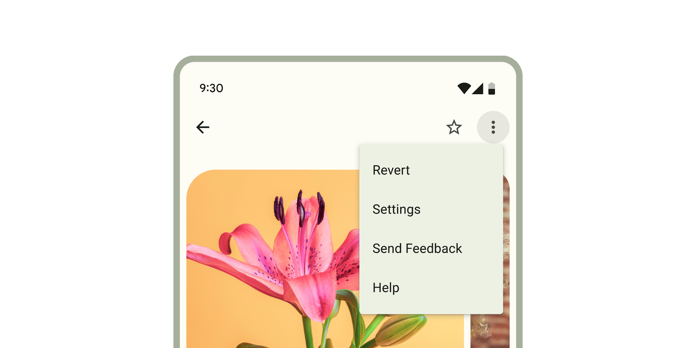

<!-- catalog-only-start --><!-- ---
name: Menus
dirname: menu
-----><!-- catalog-only-end -->

<catalog-component-header>
<catalog-component-header-title slot="title">

# Menus

<!-- no-catalog-start -->

<!--*
# Document freshness: For more information, see go/fresh-source.
freshness: { owner: 'emarquez' reviewed: '2023-08-28' }
tag: 'docType:reference'
*-->

<!-- go/md-menu -->

<!-- [TOC] -->

<!-- external-only-start -->
**This documentation is fully rendered on the
[Material Web catalog](https://material-web.dev/components/menu/).**
<!-- external-only-end -->

<!-- no-catalog-end -->

[Menus](https://m3.material.io/components/menus)<!-- {.external} --> display a list of
choices on a temporary surface.

</catalog-component-header-title>



</catalog-component-header>

*   [Design article](https://m3.material.io/components/menus) <!-- {.external} -->
*   [Source code](https://github.com/material-components/material-web/tree/main/menu)
    <!-- {.external} -->

<!-- catalog-only-start -->

<!--

## Interactive Demo



-->

<!-- catalog-only-end -->

## Usage

When opened, menus position themselves to an anchor. Thus, either `anchor` or
`anchorElement` must be supplied to `md-menu` before opening. Additionally, a
shared parent of `position:relative` should be present around the menu and it's
anchor.

Menus also render menu items such as `md-menu-item` and handle keyboard
navigation between `md-menu-item`s as well as typeahead functionality.
Additionally, `md-menu` interacts with `md-menu-item`s to help you determine how
a menu was closed. Listen for and inspect the `close-menu` custom event's
`details` to determine what action and items closed the menu.

<!-- no-catalog-start -->


<!-- no-catalog-end -->
<!-- catalog-include "figures/menu/usage.html" -->

```html
<!-- Note the position: relative style -->
<span style="position: relative">
  <md-filled-button id="usage-anchor">Set with idref</md-filled-button>
  <md-menu id="usage-menu" anchor="usage-anchor">
    <md-menu-item headline="Apple"></md-menu-item>
    <md-menu-item headline="Banana"></md-menu-item>
    <md-menu-item headline="Cucumber"></md-menu-item>
  </md-menu>
</span>

<script type="module">
  // This example uses anchor as an ID reference
  const anchorEl = document.body.querySelector('#usage-anchor');
  const menuEl = document.body.querySelector('#usage-menu');

  anchorEl.addEventListener('click', () => { menuEl.show(); });
</script>

<span style="position: relative">
  <md-filled-button id="usage-anchor-2">Set with element ref</md-filled-button>
  <md-menu id="usage-menu-2">
    <md-menu-item headline="Apple"></md-menu-item>
    <md-menu-item headline="Banana"></md-menu-item>
    <md-menu-item headline="Cucumber"></md-menu-item>
  </md-menu>
</span>

<script type="module">
  // This example uses MdMenu.prototype.anchorElement to set the anchor as an
  // HTMLElement reference.
  const anchorEl = document.body.querySelector('#usage-anchor-2');
  const menuEl = document.body.querySelector('#usage-menu-2');
  menuEl.anchorElement = anchorEl;

  anchorEl.addEventListener('click', () => { menuEl.show(); });
</script>
```

### Submenus

You can compose submenus inside of an `<md-sub-menu-item>`'s `submenu` slot, but
first the `has-overflow` attribute must be set on the root `<md-menu>` to
disable overflow scrolling and display the nested submenus.

<!-- no-catalog-start -->


<!-- no-catalog-end -->
<!-- catalog-include "figures/menu/usage-submenu.html" -->

```html
<!-- Note the position: relative style -->
<span style="position: relative">
  <md-filled-button id="usage-submenu-anchor">
    Menu with Submenus
  </md-filled-button>
  <!-- Note the has-overflow attribute -->
  <md-menu has-overflow id="usage-submenu" anchor="usage-submenu-anchor">
    <md-sub-menu-item headline="Fruits with A">
      <!-- Submenu must be slotted into sub-menu-item's submenu slot -->
      <md-menu slot="submenu">
        <md-menu-item headline="Apricot"></md-menu-item>
        <md-menu-item headline="Avocado"></md-menu-item>

        <!-- Nest as many as you want and control menu anchoring -->
        <md-sub-menu-item
            headline="Apples"
            menu-corner="START_END"
            anchor-corner="START_START">
          <md-menu slot="submenu">
            <md-menu-item headline="Fuji"></md-menu-item>
            <md-menu-item headline="Granny Smith"></md-menu-item>
            <md-menu-item headline="Red Delicious"></md-menu-item>
          </md-menu>

          <!-- Arrow icons are helpful affordances -->
          <md-icon
              slot="start-icon"
              style="font-size: 24px;height:24px;">
            arrow_left
          </md-icon>
        </md-sub-menu-item>
      </md-menu>

      <!-- Arrow icons are helpful affordances -->
      <md-icon slot="end">arrow_right</md-icon>
    </md-sub-menu-item>

    <md-menu-item headline="Banana"></md-menu-item>
    <md-menu-item headline="Cucumber"></md-menu-item>
  </md-menu>
</span>

<script type="module">
  const anchorEl = document.body.querySelector('#usage-submenu-anchor');
  const menuEl = document.body.querySelector('#usage-submenu');

  anchorEl.addEventListener('click', () => { menuEl.show(); });
</script>
```

### Fixed menus

Internally menu uses `position: absolute` by default. Though there are cases
when the anchor and the node cannot share a common ancestor that is `position:
relative`, or sometimes, menu will render below another item due to limitations
with `position: absolute`. In most of these cases, you would want to use the
`fixed` attribute to position the menu relative to the window instead of
relative to the parent.

> Note: Fixed menu positions are positioned relative to the window and not the
> document. This means that the menu will not scroll with the anchor as the page
> is scrolled.

<!-- no-catalog-start -->


<!-- no-catalog-end -->
<!-- catalog-include "figures/menu/usage-fixed.html" -->

```html
<!-- Note the lack of position: relative parent. -->
<div style="margin: 16px;">
  <md-filled-button id="usage-fixed-anchor">Open fixed menu</md-filled-button>
</div>

<!-- Fixed menus do not require a common ancestor with the anchor. -->
<md-menu fixed id="usage-fixed" anchor="usage-fixed-anchor">
  <md-menu-item headline="Apple"></md-menu-item>
  <md-menu-item headline="Banana"></md-menu-item>
  <md-menu-item headline="Cucumber"></md-menu-item>
</md-menu>

<script type="module">
  const anchorEl = document.body.querySelector('#usage-fixed-anchor');
  const menuEl = document.body.querySelector('#usage-fixed');

  anchorEl.addEventListener('click', () => { menuEl.show(); });
</script>
```

## Accessibility

By default Menu is set up to function as a `role="menu"` with children as
`role="menuitem"`. A common use case for this is the menu button example, where
you would need to add keyboard interactions to the button to open the menu
([see W3C example](https://www.w3.org/WAI/ARIA/apg/patterns/menu-button/examples/menu-button-actions/)<!-- {.external} -->).

Menu can also be adapted for other use cases.

The role of the `md-list` inside the menu can be set with the `type` attribute.
The role of each individual `md-menu-item` can also be set with the `type`
attribute. Anything else slotted into the menu that is not a list item in most
cases should be set to `role="none"`, and `md-divider` should have
`role="separator"`.

```html
<!--
  A simplified example of an autocomplete component – missing javascript logic for interaction.
-->
<md-filled-text-field
    id="textfield"
    type="combobox"
    aria-controls="menu"
    aria-autocomplete="list"
    aria-expanded="true"
    aria-activedescendant="1"
    value="Ala">
</md-filled-textfield>
<md-menu
    id="menu"
    anchor="textfield"
    role="listbox"
    aria-label="states"
    open>
  <md-menu-item type="option" id="0" headline="Alabama"></md-menu-item>
  <md-divider role="separator"></md-divider>
  <md-menu-item type="option" id="1" headline="Alaska" aria-selected="true">
  </md-menu-item>
</md-menu>
```

## Theming

Menus support [Material theming](../theming/README.md) and can be customized in
terms of color. Additionally, `md-menu` composes `md-list`, and each menu item
extends `md-list-item` ([see theming documentation](./list#theming)), so most
the tokens for those components can also be used for Menu.

### Menu Tokens

Token                                     | Default value
----------------------------------------- | -------------
`--md-menu-container-color`               | `--md-sys-color-surface-container`
`--md-menu-container-shape`               | `4px`
`--md-menu-item-container-color`          | `--md-sys-color-surface-container`
`--md-menu-item-selected-container-color` | `--md-sys-color-surface-container-highest`

*   [Menu tokens](https://github.com/material-components/material-web/blob/main/tokens/_md-comp-menu.scss)
    <!-- {.external} -->
*   [Menu item tokens](https://github.com/material-components/material-web/blob/main/tokens/_md-comp-menu-item.scss)
    <!-- {.external} -->
*   [List tokens](https://github.com/material-components/material-web/blob/main/tokens/_md-comp-list.scss)
    <!-- {.external} -->
*   [List item tokens](https://github.com/material-components/material-web/blob/main/tokens/_md-comp-list-item.scss)
    <!-- {.external} -->

### Example

<!-- no-catalog-start -->


<!-- no-catalog-end -->
<!-- catalog-include "figures/menu/theming.html" -->

```html
<style>
  ::root {
    background-color: #f4fbfa;
    --md-menu-container-color: #f4fbfa;
    --md-menu-container-shape: 0px;
    --md-menu-item-container-color: transparent;
    --md-list-item-container-shape: 28px;
    --md-list-item-label-text-color: #161d1d;
    --md-list-item-supporting-text-color: #3f4948;
    --md-list-item-trailing-supporting-text-color: #3f4948;
    --md-list-item-label-text-type: system-ui;
    --md-list-item-supporting-text-type: system-ui;
    --md-list-item-trailing-supporting-text-type: system-ui;
  }
  /* Styles for button and not relevant to menu */
  md-filled-button {
    --md-sys-color-primary: #006a6a;
    --md-sys-color-on-primary: #ffffff;
  }
</style>

<span style="position: relative">
  <md-filled-button id="theming-anchor">Themed menu</md-filled-button>
  <md-menu id="theming-menu" anchor="theming-anchor">
    <md-menu-item headline="Apple"></md-menu-item>
    <md-menu-item headline="Banana"></md-menu-item>
    <md-menu-item headline="Cucumber"></md-menu-item>
  </md-menu>
</span>

<script type="module">
  const anchorEl = document.body.querySelector("#theming-anchor");
  const menuEl = document.body.querySelector("#theming-menu");

  anchorEl.addEventListener("click", () => {
    menuEl.show();
  });
</script>
```
