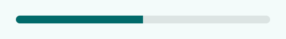

<!-- catalog-only-start --><!-- ---
name: Progress indicators
dirname: progress
ssrOnly: true
-----><!-- catalog-only-end -->

<catalog-component-header image-align="end">
<catalog-component-header-title slot="title">

# Progress indicators

<!-- no-catalog-start -->

<!--*
# Document freshness: For more information, see go/fresh-source.
freshness: { owner: 'lizmitchell' reviewed: '2023-12-18' }
tag: 'docType:reference'
*-->

<!-- go/md-progress -->

<!-- [TOC] -->

<!-- external-only-start -->
**This documentation is fully rendered on the
[Material Web catalog](https://material-web.dev/components/progress/).**
<!-- external-only-end -->

<!-- no-catalog-end -->

[Progress indicators](https://m3.material.io/components/progress-indicators)<!-- {.external} -->
inform users about the status of ongoing processes, such as loading an app or
submitting a form.

There are two types of progress indicators: linear and circular.

</catalog-component-header-title>


</catalog-component-header>

*   [Design article](https://m3.material.io/components/progress-indicators)
    <!-- {.external} -->
*   [API Documentation](#api)
*   [Source code](https://github.com/material-components/material-web/tree/main/progress)
    <!-- {.external} -->

## Types

1.  [Circular progress](#circular-progress)
1.  [Linear progress](#linear-progress)

<!-- catalog-only-start -->

<!--

## Interactive Demo



-->

<!-- catalog-only-end -->

## Usage

Progress indicators may be determinate to show progress, or indeterminate for an
unspecified amount of progress.

<!-- no-catalog-start -->
<!-- Need to add image -->
<!-- no-catalog-end -->
<!-- catalog-only-start -->

<!--

<div class="figure-wrapper">
  <figure
      style="justify-content:center; gap: 16px"
      title="Determinate and indeterminate progress indicators."
      aria-label="Two circular and linear progress indicator examples, one with three quarters of the track full
and the other
indeterminate.">
    <md-circular-progress value="0.75"></md-circular-progress>
    <md-circular-progress indeterminate></md-circular-progress>
    <div style="display: flex; flex-direction: column; align-self: stretch; justify-content: space-evenly;">
      <md-linear-progress value="0.75"></md-linear-progress>
      <md-linear-progress indeterminate></md-linear-progress>
    </div>
  </figure>
</div>

-->

<!-- catalog-only-end -->

```html
<md-circular-progress value="0.75"></md-circular-progress>
<md-circular-progress indeterminate></md-circular-progress>

<md-linear-progress indeterminate></md-linear-progress>
<md-linear-progress value="0.5"></md-linear-progress>
```

### Four colors

Indeterminate progress indicators may cycle between four colors (primary,
primary container, tertiary, and tertiary container by default).

<!-- no-catalog-start -->
<!-- Need to add image -->
<!-- no-catalog-end -->
<!-- catalog-only-start -->

<!--

<div class="figure-wrapper">
  <figure
      style="justify-content:center; gap: 16px;"
      title="A four-color indeterminate circular and linear progress indicator"
      aria-label="Indeterminate progress indicators that cycles between four colors.">
    <md-circular-progress four-color indeterminate></md-circular-progress>
    <md-linear-progress four-color indeterminate></md-linear-progress>
  </figure>
</div>

-->

<!-- catalog-only-end -->

```html
<md-circular-progress four-color indeterminate></md-circular-progress>
<md-linear-progress four-color indeterminate></md-linear-progress>
```

## Accessibility

Add an
[`aria-label`](https://developer.mozilla.org/en-US/docs/Web/Accessibility/ARIA/Attributes/aria-label)<!-- {.external} -->
attribute to progress indicators to give them a descriptive name.

```html
<md-circular-progress value="0.5" aria-label="Page refresh progress"></md-circular-progress>

<md-linear-progress value="0.5" aria-label="Download progress"></md-linear-progress>
```

## Circular progress

<!-- go/md-circular-progress -->

Circular progress indicators display progress by animating along an invisible
circular track in a clockwise direction.

<!-- no-catalog-start -->
<!-- Need to add image -->
<!-- no-catalog-end -->
<!-- catalog-only-start -->

<!--

<div class="figure-wrapper">
  <figure
      style="justify-content:center; gap: 16px;"
      title="Circular progress indicators"
      aria-label="An indeterminate and determinate circular progress indicator.">
    <md-circular-progress indeterminate></md-circular-progress>
    <md-circular-progress value="0.6"></md-circular-progress>
  </figure>
</div>

-->

<!-- catalog-only-end -->

```html
<md-circular-progress indeterminate></md-circular-progress>
<md-circular-progress value="0.6"></md-circular-progress>
```

## Linear progress

<!-- go/md-linear-progress -->

Linear progress indicators display progress by animating along the length of a
fixed, visible track.

<!-- no-catalog-start -->
<!-- Need to add image -->
<!-- no-catalog-end -->
<!-- catalog-only-start -->

<!--

<div class="figure-wrapper">
  <figure
      style="justify-content:center; gap: 16px;"
      title="Linear progress indicators"
      aria-label="An indeterminate and determinate linear progress indicator.">
    <md-linear-progress indeterminate></md-linear-progress>
    <md-linear-progress value="0.6"></md-linear-progress>
  </figure>
</div>

-->

<!-- catalog-only-end -->

```html
<md-linear-progress indeterminate></md-linear-progress>
<md-linear-progress value="0.6"></md-linear-progress>
```

### Buffer

Linear progress indicators may show a buffer to communicate both determinate and
indeterminate progress. The progress bar and track represent known progress
while the buffer dots represent unknown progress.

<!-- no-catalog-start -->
<!-- Need to add image -->
<!-- no-catalog-end -->
<!-- catalog-only-start -->

<!--

<div class="figure-wrapper">
  <figure
      style="justify-content:center;"
      title="Progress and buffer"
      aria-label="A linear progress indicator with partial progress and an indeterminate buffer.">
    <md-linear-progress value="0.5" buffer="0.8"></md-linear-progress>
  </figure>
</div>

-->

<!-- catalog-only-end -->

```html
<md-linear-progress value="0.5" buffer="0.8"></md-linear-progress>
```

## Theming

Progress indicators supports [Material theming](../theming/README.md) and can be
customized in terms of color.

### Circular progress tokens

Token                                           | Default value
----------------------------------------------- | ------------------------
`--md-circular-progress-color`                  | `--md-sys-color-primary`
`--md-circular-progress-size`                   | `48px`
`--md-circular-progress-active-indicator-width` | `8.3333` (%)

> Note: the active indicator width must be specified as a unit-less percentage
> of the size.

*   [All tokens](https://github.com/material-components/material-web/blob/main/tokens/_md-comp-circular-progress.scss)
    <!-- {.external} -->

### Circular progress example

<!-- no-catalog-start -->


<!-- no-catalog-end -->
<!-- catalog-only-start -->

<!--

<div class="figure-wrapper">
  <figure
      style="justify-content:center;align-items:center;"
      class="styled-example"
      title="Circular progress indicator theming example."
      aria-label="Image of a circular progress indicator with a different theme applied">
    <style>
      .styled-example {
        background-color: white;
        --md-circular-progress-size: 32px;
        --md-circular-progress-active-indicator-width: 20;
        --md-sys-color-primary: #006A6A;
      }
    </style>

    <md-circular-progress value="0.5"></md-circular-progress>
  </figure>
</div>

-->

<!-- catalog-only-end -->

```html
<style>
:root {
  --md-circular-progress-size: 32px;
  --md-circular-progress-active-indicator-width: 20;
  --md-sys-color-primary: #006A6A;
}
</style>

<md-circular-progress value="0.5"></md-circular-progress>
```

### Linear progress tokens

Token                                          | Default value
---------------------------------------------- | -------------
`--md-linear-progress-track-color`             | `--md-sys-color-surface-container-highest`
`--md-linear-progress-track-height`            | `4px`
`--md-linear-progress-track-shape`             | `--md-sys-shape-corner-none`
`--md-linear-progress-active-indicator-color`  | `--md-sys-color-primary`
`--md-linear-progress-active-indicator-height` | `4px`

*   [All tokens](https://github.com/material-components/material-web/blob/main/tokens/_md-comp-linear-progress.scss)
    <!-- {.external} -->

### Linear progress example

<!-- no-catalog-start -->



<!-- no-catalog-end -->
<!-- catalog-only-start -->

<!--

<div class="figure-wrapper">
  <figure
      style="min-width:300px;"
      class="styled-example"
      aria-label="Image of a linear progress indicator with a different theme applied"
      title="Linear progress theming example.">
  <style>
    .styled-example {
      background-color: white;
      --md-linear-progress-track-height: 8px;
      --md-linear-progress-track-shape: 8px;
      --md-linear-progress-active-indicator-height: 8px;
      --md-sys-color-primary: #006A6A;
      --md-sys-color-surface-container-highest: #DDE4E3;
    }
    .styled-example md-linear-progress {
      flex-grow: 1;
    }
  </style>
  <md-linear-progress value="0.5"></md-linear-progress>
  </figure>
</div>

-->

<!-- catalog-only-end -->

```html
<style>
:root {
  --md-linear-progress-track-height: 8px;
  --md-linear-progress-track-shape: 8px;
  --md-linear-progress-active-indicator-height: 8px;
  --md-sys-color-primary: #006A6A;
  --md-sys-color-surface-container-highest: #DDE4E3;
}
</style>

<md-linear-progress value="0.5"></md-linear-progress>
```

<!-- auto-generated API docs start -->

## API


### MdLinearProgress <code>&lt;md-linear-progress&gt;</code>

#### Properties

<!-- mdformat off(autogenerated might break rendering in catalog) -->

Property | Attribute | Type | Default | Description
--- | --- | --- | --- | ---
`buffer` | `buffer` | `number` | `1` | Buffer amount to display, a fraction between 0 and `max`.
`value` | `value` | `number` | `0` | Progress to display, a fraction between 0 and `max`.
`max` | `max` | `number` | `1` | Maximum progress to display, defaults to 1.
`indeterminate` | `indeterminate` | `boolean` | `false` | Whether or not to display indeterminate progress, which gives no indication to how long an activity will take.
`fourColor` | `four-color` | `boolean` | `false` | Whether or not to render indeterminate mode using 4 colors instead of one.

<!-- mdformat on(autogenerated might break rendering in catalog) -->

### MdCircularProgress <code>&lt;md-circular-progress&gt;</code>

#### Properties

<!-- mdformat off(autogenerated might break rendering in catalog) -->

Property | Attribute | Type | Default | Description
--- | --- | --- | --- | ---
`value` | `value` | `number` | `0` | Progress to display, a fraction between 0 and `max`.
`max` | `max` | `number` | `1` | Maximum progress to display, defaults to 1.
`indeterminate` | `indeterminate` | `boolean` | `false` | Whether or not to display indeterminate progress, which gives no indication to how long an activity will take.
`fourColor` | `four-color` | `boolean` | `false` | Whether or not to render indeterminate mode using 4 colors instead of one.

<!-- mdformat on(autogenerated might break rendering in catalog) -->

<!-- auto-generated API docs end -->
