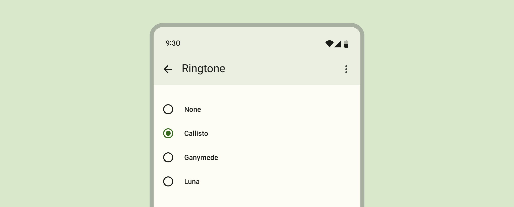

<!-- catalog-only-start --><!-- ---
name: Radio
dirname: radio
ssrOnly: true
-----><!-- catalog-only-end -->

<catalog-component-header image-align="start">
<catalog-component-header-title slot="title">

# Radio button

<!--*
# Document freshness: For more information, see go/fresh-source.
freshness: { owner: 'lizmitchell' reviewed: '2023-08-01' }
tag: 'docType:reference'
*-->

<!-- github-only-start -->

<!-- go/md-radio -->

<!-- [TOC] -->

<!-- github-only-end -->

[Radio buttons](https://m3.material.io/components/radio-button)<!-- {.external} --> let
people select one option from a set of options.

</catalog-component-header-title>



</catalog-component-header>

*   [Design article](https://m3.material.io/components/radio-button) <!-- {.external} -->
*   API Documentation (*coming soon*)
*   [Source code](https://github.com/material-components/material-web/tree/main/radio)
    <!-- {.external} -->

<!-- catalog-only-start -->

<!--

## Interactive Demo



-->

<!-- catalog-only-end -->

## Usage

Radios behave like
[`<input type="radio">`](https://developer.mozilla.org/en-US/docs/Web/HTML/Element/input/radio)<!-- {.external} -->
elements and form a group with the same `name` attribute. Only one radio can be
selected in a group.

Radios can be pre-selected by adding a `selected` attribute.

Add a `value` to identify which radio is selected in a form.

<!-- TODO: add image example -->

```html
<form>
  <md-radio name="animals" value="cats"></md-radio>
  <md-radio name="animals" value="dogs"></md-radio>
  <md-radio name="animals" value="birds" selected></md-radio>
</form>
```

### Label

Associate a label with a radio using the `<label>` element.

<!-- TODO: add image example -->

```html
<label>
  <md-radio name="animals" value="cats"></md-radio>
  Cats
</label>

<md-radio id="dogs-radio" name="animals" value="dogs"></md-radio>
<label for="dogs-radio">Dogs</label>
```

## Accessibility

Add an
[`aria-label`](https://developer.mozilla.org/en-US/docs/Web/Accessibility/ARIA/Attributes/aria-label)<!-- {.external} -->
attribute to radios without labels or radios whose labels need to be more
descriptive.

<!-- TODO: add image example -->

```html
<label>
  <md-radio name="group" value="1" aria-label="First"></md-radio>
  1st
</label>
<label>
  <md-radio name="group" value="2" aria-label="Second"></md-radio>
  2nd
</label>
```

> Note: radios are not automatically labelled by `<label>` elements and always
> need an `aria-label`. See b/294081528.

## Theming

Radios support [Material theming](../theming.md) and can be customized in terms
of color.

### Tokens

Token                            | Default value
-------------------------------- | -----------------------------------
`--md-radio-icon-color`          | `--md-sys-color-on-surface-variant`
`--md-radio-selected-icon-color` | `--md-sys-color-primary`
`--md-radio-icon-size`           | `20px`

*   [All tokens](https://github.com/material-components/material-web/blob/main/tokens/_md-comp-radio.scss)
    <!-- {.external} -->

### Example

<!-- TODO: add image example -->

```html
<style>
:root {
  --md-sys-color-primary: #006A6A;
  --md-radio-icon-size: 16px;
}
</style>

<md-radio name="group"></md-radio>
<md-radio name="group" selected></md-radio>
<md-radio name="group"></md-radio>
```
