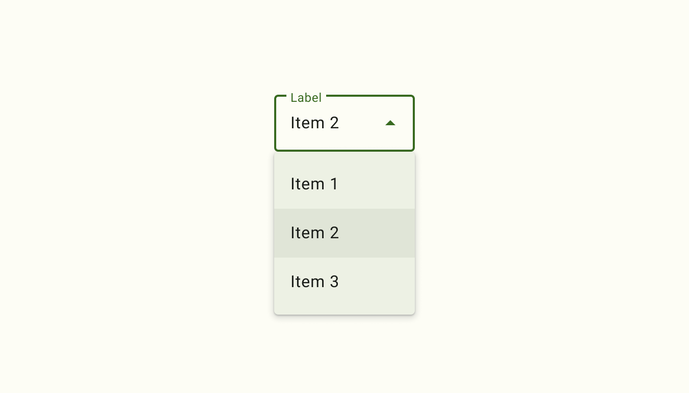
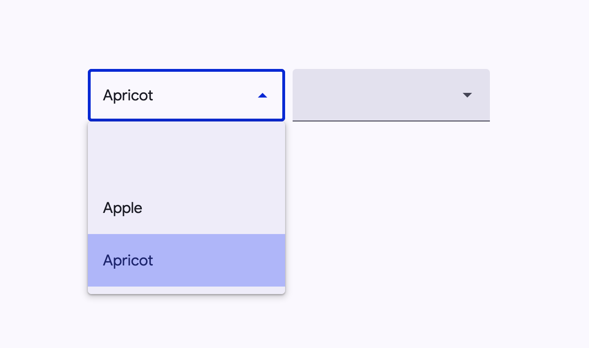
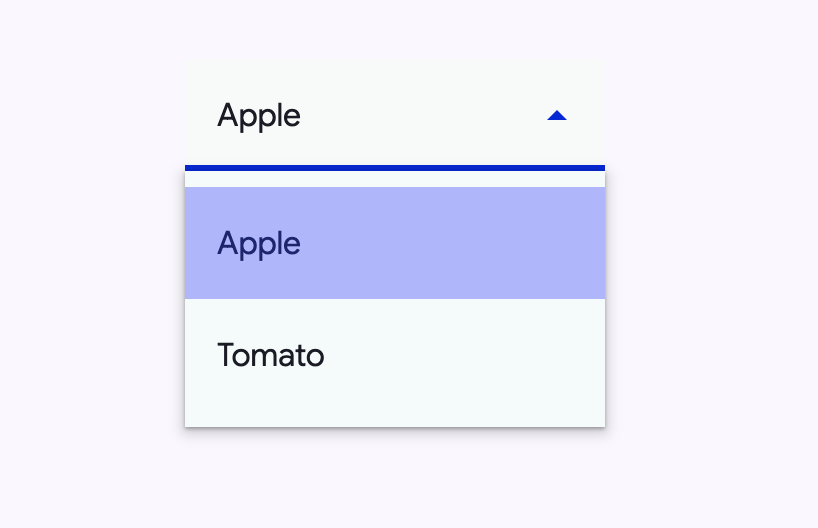
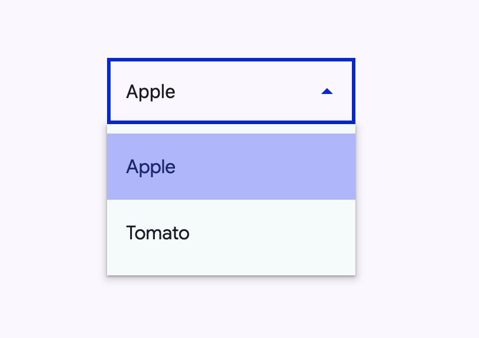

<!-- catalog-only-start --><!-- ---
name: Select
dirname: select
-----><!-- catalog-only-end -->

<catalog-component-header image-align="start">
<catalog-component-header-title slot="title">

# Select

<!-- no-catalog-start -->

<!--*
# Document freshness: For more information, see go/fresh-source.
freshness: { owner: 'ajakubowicz' reviewed: '2023-09-14' }
tag: 'docType:reference'
*-->

<!-- go/md-select -->

<!-- [TOC] -->

<!-- external-only-start -->
**This documentation is fully rendered on the
[Material Web catalog](https://material-web.dev/components/<component>/)**
<!-- external-only-end -->

<!-- no-catalog-end -->

[Select menus](https://m3.material.io/components/menus/overview#b1704de4-94b7-4177-9e96-b677ae767cb4)<!-- {.external} -->
display a list of choices on temporary surfaces and display the currently
selected menu item above the menu.

</catalog-component-header-title>



</catalog-component-header>

*   Design article (*coming soon*)
*   [API Documentation](#api)
*   [Source code](https://github.com/material-components/material-web/tree/main/select)
    <!-- {.external} -->

## Usage

Select (also referred to as a dropdown menu) allows choosing a value from a
fixed list of available options. It is analogous to the native HTML
[`<select>` element](https://developer.mozilla.org/en-US/docs/Web/HTML/Element/select)<!-- {.external} -->.

<!-- no-catalog-start -->



<!-- no-catalog-end -->
<!-- catalog-include "figures/select/usage.html" -->

```html
<md-outlined-select>
  <md-select-option aria-label="blank"></md-select-option>
  <md-select-option selected value="apple">
    <div slot="headline">Apple</div>
  </md-select-option>
  <md-select-option value="apricot">
    <div slot="headline">Apricot</div>
  </md-select-option>
</md-outlined-select>

<md-filled-select>
  <md-select-option aria-label="blank"></md-select-option>
  <md-select-option value="apple">
    <div slot="headline">Apple</div>
  </md-select-option>
  <md-select-option value="apricot">
    <div slot="headline">Apricot</div>
  </md-select-option>
</md-filled-select>
```

### Required select

Indicate that a selection is mandatory by adding the `required` attribute.

```html
<md-filled-select required>
  <md-select-option value="one">
    <div slot="headline">One</div>
  </md-select-option>
  <md-select-option value="two">
    <div slot="headline">Two</div>
  </md-select-option>
</md-filled-select>
```

<!--
## Accessibility

*Insert a 1-2 sentence description of a common accessibility scenario, followed
by a code snippet. Do not include a rendered image for accessibility examples.*

```html
<component-name aria-label="Example">
```

*Repeat with additional examples as needed to explain how to make the component
accessible.* -->

## Theming

Select supports
[Material theming](https://github.com/material-components/material-web/blob/main/docs/theming/README.md)<!-- {.external} -->
and can be customized in terms of color, typography, and shape.

### Filled Select tokens

Token                                            | Default value
------------------------------------------------ | -------------
`--md-filled-select-text-field-container-color`  | `--md-sys-color-surface-container-highest`
`--md-filled-select-text-field-container-shape`  | `4px`
`--md-filled-select-text-field-input-text-color` | `--md-sys-color-on-surface`
`--md-filled-select-text-field-input-text-font`  | `--md-sys-typescale-body-large-font`

*   [Filled Select tokens](https://github.com/material-components/material-web/blob/main/tokens/_md-comp-filled-select.scss)
    <!-- {.external} -->

To theme the select's dropdown menu, use the `md-menu` component tokens on the
`::part(menu)` selector.

### Filled Select example

<!-- no-catalog-start -->



<!-- no-catalog-end -->
<!-- catalog-include "figures/select/theming-filled.html" -->

```html
<style>
:root {
  --md-filled-select-text-field-container-shape: 0px;
  --md-filled-select-text-field-container-color: #f7faf9;
  --md-filled-select-text-field-input-text-color: #005353;
  --md-filled-select-text-field-input-text-font: system-ui;
}

md-filled-select::part(menu) {
  --md-menu-container-color: #f4fbfa;
  --md-menu-container-shape: 0px;
}
</style>

<md-filled-select>
  <md-select-option selected value="apple">
    <div slot="headline">Apple</div>
  </md-select-option>
  <md-select-option value="tomato">
    <div slot="headline">Tomato</div>
  </md-select-option>
</md-filled-select>
```

### Outlined Select tokens

Token                                              | Default value
-------------------------------------------------- | -------------
`--md-outlined-select-text-field-outline-color`    | `--md-sys-color-outline`
`--md-outlined-select-text-field-container-shape`  | `4px`
`--md-outlined-select-text-field-input-text-color` | `--md-sys-color-on-surface`
`--md-outlined-select-text-field-input-text-font`  | `--md-sys-typescale-body-large-font`

*   [Outlined Select tokens](https://github.com/material-components/material-web/blob/main/tokens/_md-comp-outlined-select.scss)
    <!-- {.external} -->

### Outlined Select example

<!-- no-catalog-start -->



<!-- no-catalog-end -->
<!-- catalog-include "figures/select/theming-outlined.html" -->

```html
<style>
:root {
  --md-outlined-select-text-field-outline-color: #6e7979;
  --md-outlined-select-text-field-container-shape: 0px;
  --md-outlined-select-text-field-input-text-color: #005353;
  --md-outlined-select-text-field-input-text-font: system-ui;
}

md-outlined-select::part(menu) {
  --md-menu-container-color: #f4fbfa;
  --md-menu-container-shape: 0px;
}
</style>

<md-outlined-select>
  <md-select-option selected value="apple">
    <div slot="headline">Apple</div>
  </md-select-option>
  <md-select-option value="tomato">
    <div slot="headline">Tomato</div>
  </md-select-option>
</md-outlined-select>
```

<!-- auto-generated API docs start -->
<!-- auto-generated API docs end -->
