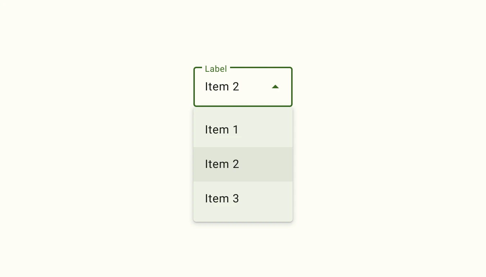
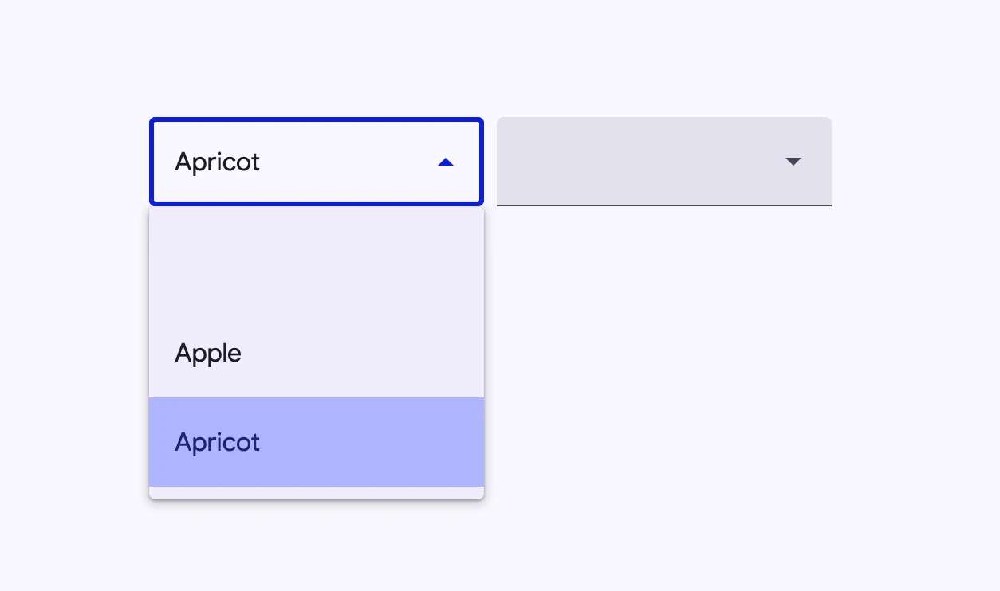
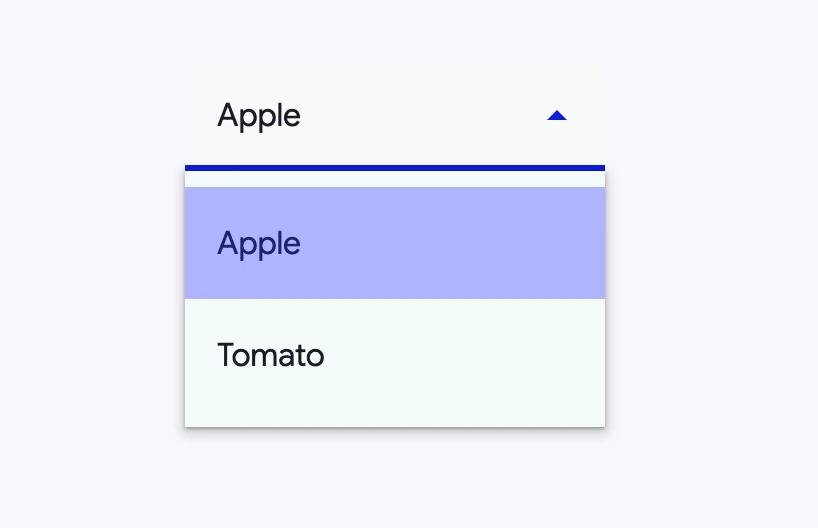
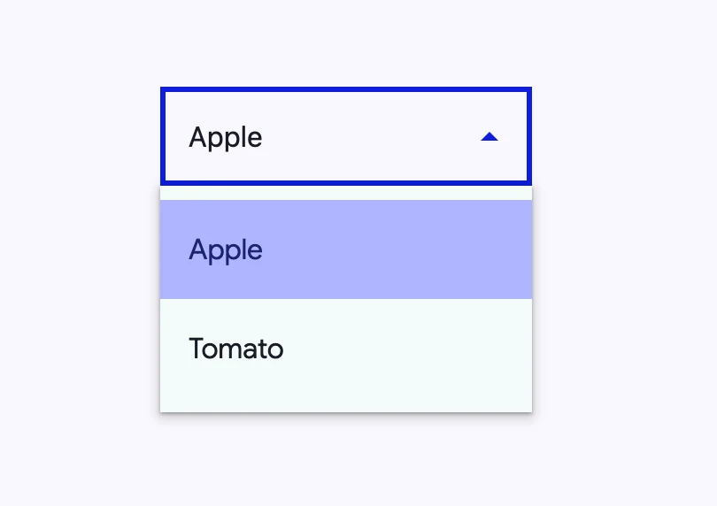

<!-- catalog-only-start --><!-- ---
name: Select
dirname: select
-----><!-- catalog-only-end -->

<catalog-component-header image-align="start">
<catalog-component-header-title slot="title">

# Select

<!-- no-catalog-start -->

<!--*
# Document freshness: For more information, see go/fresh-source.
freshness: { owner: 'material-web-team' reviewed: '2025-05-20' }
tag: 'docType:reference'
*-->

<!-- go/md-select -->

<!-- [TOC] -->

<!-- external-only-start -->
**This documentation is fully rendered on the
[Material Web catalog](https://material-web.dev/components/select/)**
<!-- external-only-end -->

<!-- no-catalog-end -->

[Select menus](https://m3.material.io/components/menus/overview#b1704de4-94b7-4177-9e96-b677ae767cb4)<!-- {.external} -->
display a list of choices on temporary surfaces and display the currently
selected menu item above the menu.

</catalog-component-header-title>



</catalog-component-header>

*   Design article (*coming soon*)
*   [API Documentation](#api)
*   [Source code](https://github.com/material-components/material-web/tree/main/select)
    <!-- {.external} -->

## Usage

Select (also referred to as a dropdown menu) allows choosing a value from a
fixed list of available options. It is analogous to the native HTML
[`<select>` element](https://developer.mozilla.org/en-US/docs/Web/HTML/Element/select)<!-- {.external} -->.

<!-- no-catalog-start -->



<!-- no-catalog-end -->
<!-- catalog-include "figures/select/usage.html" -->

```html
<md-outlined-select>
  <md-select-option aria-label="blank"></md-select-option>
  <md-select-option selected value="apple">
    <div slot="headline">Apple</div>
  </md-select-option>
  <md-select-option value="apricot">
    <div slot="headline">Apricot</div>
  </md-select-option>
</md-outlined-select>

<md-filled-select>
  <md-select-option aria-label="blank"></md-select-option>
  <md-select-option value="apple">
    <div slot="headline">Apple</div>
  </md-select-option>
  <md-select-option value="apricot">
    <div slot="headline">Apricot</div>
  </md-select-option>
</md-filled-select>
```

### Required select

Indicate that a selection is mandatory by adding the `required` attribute.

```html
<md-filled-select required>
  <md-select-option value="one">
    <div slot="headline">One</div>
  </md-select-option>
  <md-select-option value="two">
    <div slot="headline">Two</div>
  </md-select-option>
</md-filled-select>
```

<!--
## Accessibility

*Insert a 1-2 sentence description of a common accessibility scenario, followed
by a code snippet. Do not include a rendered image for accessibility examples.*

```html
<component-name aria-label="Example">
```

*Repeat with additional examples as needed to explain how to make the component
accessible.* -->

## Theming

Select supports
[Material theming](https://github.com/material-components/material-web/blob/main/docs/theming/README.md)<!-- {.external} -->
and can be customized in terms of color, typography, and shape.

### Filled Select tokens

Token                                            | Default value
------------------------------------------------ | -------------
`--md-filled-select-text-field-container-color`  | `--md-sys-color-surface-container-highest`
`--md-filled-select-text-field-container-shape`  | `--md-sys-shape-corner-extra-small`
`--md-filled-select-text-field-input-text-color` | `--md-sys-color-on-surface`
`--md-filled-select-text-field-input-text-font`  | `--md-sys-typescale-body-large-font`

*   [Filled Select tokens](https://github.com/material-components/material-web/blob/main/tokens/_md-comp-filled-select.scss)
    <!-- {.external} -->

To theme the select's dropdown menu, use the `md-menu` component tokens on the
`::part(menu)` selector.

### Filled Select example

<!-- no-catalog-start -->



<!-- no-catalog-end -->
<!-- catalog-include "figures/select/theming-filled.html" -->

```html
<style>
:root {
  --md-filled-select-text-field-container-shape: 0px;
  --md-filled-select-text-field-container-color: #f7faf9;
  --md-filled-select-text-field-input-text-color: #005353;
  --md-filled-select-text-field-input-text-font: system-ui;
}

md-filled-select::part(menu) {
  --md-menu-container-color: #f4fbfa;
  --md-menu-container-shape: 0px;
}
</style>

<md-filled-select>
  <md-select-option selected value="apple">
    <div slot="headline">Apple</div>
  </md-select-option>
  <md-select-option value="tomato">
    <div slot="headline">Tomato</div>
  </md-select-option>
</md-filled-select>
```

### Outlined Select tokens

Token                                              | Default value
-------------------------------------------------- | -------------
`--md-outlined-select-text-field-outline-color`    | `--md-sys-color-outline`
`--md-outlined-select-text-field-container-shape`  | `--md-sys-shape-corner-extra-small`
`--md-outlined-select-text-field-input-text-color` | `--md-sys-color-on-surface`
`--md-outlined-select-text-field-input-text-font`  | `--md-sys-typescale-body-large-font`

*   [Outlined Select tokens](https://github.com/material-components/material-web/blob/main/tokens/_md-comp-outlined-select.scss)
    <!-- {.external} -->

### Outlined Select example

<!-- no-catalog-start -->



<!-- no-catalog-end -->
<!-- catalog-include "figures/select/theming-outlined.html" -->

```html
<style>
:root {
  --md-outlined-select-text-field-outline-color: #6e7979;
  --md-outlined-select-text-field-container-shape: 0px;
  --md-outlined-select-text-field-input-text-color: #005353;
  --md-outlined-select-text-field-input-text-font: system-ui;
}

md-outlined-select::part(menu) {
  --md-menu-container-color: #f4fbfa;
  --md-menu-container-shape: 0px;
}
</style>

<md-outlined-select>
  <md-select-option selected value="apple">
    <div slot="headline">Apple</div>
  </md-select-option>
  <md-select-option value="tomato">
    <div slot="headline">Tomato</div>
  </md-select-option>
</md-outlined-select>
```

<!-- auto-generated API docs start -->

## API


### MdFilledSelect <code>&lt;md-filled-select&gt;</code>

#### Properties

<!-- mdformat off(autogenerated might break rendering in catalog) -->

| Property | Attribute | Type | Default | Description |
| --- | --- | --- | --- | --- |
| `quick` | `quick` | `boolean` | `false` | Opens the menu synchronously with no animation. |
| `required` | `required` | `boolean` | `false` | Whether or not the select is required. |
| `errorText` | `error-text` | `string` | `''` | The error message that replaces supporting text when `error` is true. If `errorText` is an empty string, then the supporting text will continue to show.<br>This error message overrides the error message displayed by `reportValidity()`. |
| `label` | `label` | `string` | `''` | The floating label for the field. |
| `noAsterisk` | `no-asterisk` | `boolean` | `false` | Disables the asterisk on the floating label, when the select is required. |
| `supportingText` | `supporting-text` | `string` | `''` | Conveys additional information below the select, such as how it should be used. |
| `error` | `error` | `boolean` | `false` | Gets or sets whether or not the select is in a visually invalid state.<br>This error state overrides the error state controlled by `reportValidity()`. |
| `menuPositioning` | `menu-positioning` | `string` | `'popover'` | Whether or not the underlying md-menu should be position: fixed to display in a top-level manner, or position: absolute.<br>position:fixed is useful for cases where select is inside of another element with stacking context and hidden overflows such as `md-dialog`. |
| `clampMenuWidth` | `clamp-menu-width` | `boolean` | `false` | Clamps the menu-width to the width of the select. |
| `typeaheadDelay` | `typeahead-delay` | `number` | `DEFAULT_TYPEAHEAD_BUFFER_TIME` | The max time between the keystrokes of the typeahead select / menu behavior before it clears the typeahead buffer. |
| `hasLeadingIcon` | `has-leading-icon` | `boolean` | `false` | Whether or not the text field has a leading icon. Used for SSR. |
| `displayText` | `display-text` | `string` | `''` | Text to display in the field. Only set for SSR. |
| `menuAlign` | `menu-align` | `string` | `'start'` | Whether the menu should be aligned to the start or the end of the select's textbox. |
| `value` | `value` | `string` | `undefined` |  |
| `selectedIndex` | `selected-index` | `number` | `undefined` |  |
| `disabled` |  | `boolean` | `undefined` |  |
| `name` |  | `string` | `undefined` |  |
| `options` |  | `SelectOption[]` | `undefined` |  |
| `selectedOptions` |  | `SelectOption[]` | `undefined` |  |

<!-- mdformat on(autogenerated might break rendering in catalog) -->

#### Methods

<!-- mdformat off(autogenerated might break rendering in catalog) -->

| Method | Parameters | Returns | Description |
| --- | --- | --- | --- |
| `select` | `value` | `void` | Selects an option given the value of the option, and updates MdSelect's value. |
| `selectIndex` | `index` | `void` | Selects an option given the index of the option, and updates MdSelect's value. |
| `reset` | _None_ | `void` | Reset the select to its default value. |
| `showPicker` | _None_ | `void` | Shows the picker. If it's already open, this is a no-op. |
| `getUpdateComplete` | _None_ | `Promise<boolean>` |  |
| `formResetCallback` | _None_ | `void` |  |
| `formStateRestoreCallback` | `state` | `void` |  |
| `click` | _None_ | `void` |  |

<!-- mdformat on(autogenerated might break rendering in catalog) -->

#### Events

<!-- mdformat off(autogenerated might break rendering in catalog) -->

| Event | Type | [Bubbles](https://developer.mozilla.org/en-US/docs/Web/API/Event/bubbles) | [Composed](https://developer.mozilla.org/en-US/docs/Web/API/Event/composed) | Description |
| --- | --- | --- | --- | --- |
| `change` | `Event` | Yes | No | The native `change` event on [`<input>`](https://developer.mozilla.org/en-US/docs/Web/API/HTMLElement/change_event) |
| `input` | `InputEvent` | Yes | Yes | The native `input` event on [`<input>`](https://developer.mozilla.org/en-US/docs/Web/API/HTMLElement/input_event) |
| `opening` | `Event` | No | No | Fired when the select's menu is about to open. |
| `opened` | `Event` | No | No | Fired when the select's menu has finished animations and opened. |
| `closing` | `Event` | No | No | Fired when the select's menu is about to close. |
| `closed` | `Event` | No | No | Fired when the select's menu has finished animations and closed. |

<!-- mdformat on(autogenerated might break rendering in catalog) -->

### MdOutlinedSelect <code>&lt;md-outlined-select&gt;</code>

#### Properties

<!-- mdformat off(autogenerated might break rendering in catalog) -->

| Property | Attribute | Type | Default | Description |
| --- | --- | --- | --- | --- |
| `quick` | `quick` | `boolean` | `false` | Opens the menu synchronously with no animation. |
| `required` | `required` | `boolean` | `false` | Whether or not the select is required. |
| `errorText` | `error-text` | `string` | `''` | The error message that replaces supporting text when `error` is true. If `errorText` is an empty string, then the supporting text will continue to show.<br>This error message overrides the error message displayed by `reportValidity()`. |
| `label` | `label` | `string` | `''` | The floating label for the field. |
| `noAsterisk` | `no-asterisk` | `boolean` | `false` | Disables the asterisk on the floating label, when the select is required. |
| `supportingText` | `supporting-text` | `string` | `''` | Conveys additional information below the select, such as how it should be used. |
| `error` | `error` | `boolean` | `false` | Gets or sets whether or not the select is in a visually invalid state.<br>This error state overrides the error state controlled by `reportValidity()`. |
| `menuPositioning` | `menu-positioning` | `string` | `'popover'` | Whether or not the underlying md-menu should be position: fixed to display in a top-level manner, or position: absolute.<br>position:fixed is useful for cases where select is inside of another element with stacking context and hidden overflows such as `md-dialog`. |
| `clampMenuWidth` | `clamp-menu-width` | `boolean` | `false` | Clamps the menu-width to the width of the select. |
| `typeaheadDelay` | `typeahead-delay` | `number` | `DEFAULT_TYPEAHEAD_BUFFER_TIME` | The max time between the keystrokes of the typeahead select / menu behavior before it clears the typeahead buffer. |
| `hasLeadingIcon` | `has-leading-icon` | `boolean` | `false` | Whether or not the text field has a leading icon. Used for SSR. |
| `displayText` | `display-text` | `string` | `''` | Text to display in the field. Only set for SSR. |
| `menuAlign` | `menu-align` | `string` | `'start'` | Whether the menu should be aligned to the start or the end of the select's textbox. |
| `value` | `value` | `string` | `undefined` |  |
| `selectedIndex` | `selected-index` | `number` | `undefined` |  |
| `disabled` |  | `boolean` | `undefined` |  |
| `name` |  | `string` | `undefined` |  |
| `options` |  | `SelectOption[]` | `undefined` |  |
| `selectedOptions` |  | `SelectOption[]` | `undefined` |  |

<!-- mdformat on(autogenerated might break rendering in catalog) -->

#### Methods

<!-- mdformat off(autogenerated might break rendering in catalog) -->

| Method | Parameters | Returns | Description |
| --- | --- | --- | --- |
| `select` | `value` | `void` | Selects an option given the value of the option, and updates MdSelect's value. |
| `selectIndex` | `index` | `void` | Selects an option given the index of the option, and updates MdSelect's value. |
| `reset` | _None_ | `void` | Reset the select to its default value. |
| `showPicker` | _None_ | `void` | Shows the picker. If it's already open, this is a no-op. |
| `getUpdateComplete` | _None_ | `Promise<boolean>` |  |
| `formResetCallback` | _None_ | `void` |  |
| `formStateRestoreCallback` | `state` | `void` |  |
| `click` | _None_ | `void` |  |

<!-- mdformat on(autogenerated might break rendering in catalog) -->

#### Events

<!-- mdformat off(autogenerated might break rendering in catalog) -->

| Event | Type | [Bubbles](https://developer.mozilla.org/en-US/docs/Web/API/Event/bubbles) | [Composed](https://developer.mozilla.org/en-US/docs/Web/API/Event/composed) | Description |
| --- | --- | --- | --- | --- |
| `change` | `Event` | Yes | No | The native `change` event on [`<input>`](https://developer.mozilla.org/en-US/docs/Web/API/HTMLElement/change_event) |
| `input` | `InputEvent` | Yes | Yes | The native `input` event on [`<input>`](https://developer.mozilla.org/en-US/docs/Web/API/HTMLElement/input_event) |
| `opening` | `Event` | No | No | Fired when the select's menu is about to open. |
| `opened` | `Event` | No | No | Fired when the select's menu has finished animations and opened. |
| `closing` | `Event` | No | No | Fired when the select's menu is about to close. |
| `closed` | `Event` | No | No | Fired when the select's menu has finished animations and closed. |

<!-- mdformat on(autogenerated might break rendering in catalog) -->

### MdSelectOption <code>&lt;md-select-option&gt;</code>

#### Properties

<!-- mdformat off(autogenerated might break rendering in catalog) -->

| Property | Attribute | Type | Default | Description |
| --- | --- | --- | --- | --- |
| `disabled` | `disabled` | `boolean` | `false` | Disables the item and makes it non-selectable and non-interactive. |
| `selected` | `selected` | `boolean` | `false` | Sets the item in the selected visual state when a submenu is opened. |
| `value` | `value` | `string` | `''` | Form value of the option. |
| `type` |  | `string` | `'option' as const` |  |
| `typeaheadText` |  | `string` | `undefined` |  |
| `displayText` |  | `string` | `undefined` |  |

<!-- mdformat on(autogenerated might break rendering in catalog) -->

#### Events

<!-- mdformat off(autogenerated might break rendering in catalog) -->

| Event | Type | [Bubbles](https://developer.mozilla.org/en-US/docs/Web/API/Event/bubbles) | [Composed](https://developer.mozilla.org/en-US/docs/Web/API/Event/composed) | Description |
| --- | --- | --- | --- | --- |
| `close-menu` | `CustomEvent<{initiator: SelectOption, reason: Reason, itemPath: SelectOption[]}>` | Yes | Yes | Closes the encapsulating menu on closable interaction. |
| `request-selection` | `Event` | Yes | Yes | Requests the parent md-select to select this element (and deselect others if single-selection) when `selected` changed to `true`. |
| `request-deselection` | `Event` | Yes | Yes | Requests the parent md-select to deselect this element when `selected` changed to `false`. |

<!-- mdformat on(autogenerated might break rendering in catalog) -->

<!-- auto-generated API docs end -->
