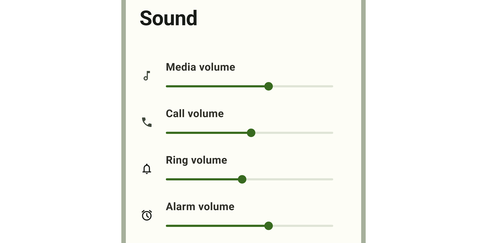
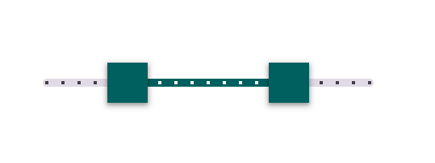

<!-- catalog-only-start --><!-- ---
name: Sliders
dirname: slider
-----><!-- catalog-only-end -->

<catalog-component-header image-align="start">
<catalog-component-header-title slot="title">

# Sliders

<!-- no-catalog-start -->

<!--*
# Document freshness: For more information, see go/fresh-source.
freshness: { owner: 'ajakubowicz' reviewed: '2023-08-01' }
tag: 'docType:reference'
*-->

<!-- go/md-slider -->

<!-- [TOC] -->

<!-- external-only-start -->
**This documentation is fully rendered on the
[Material Web catalog](https://material-web.dev/components/slider/)**
<!-- external-only-end -->

<!-- no-catalog-end -->

[Sliders](https://m3.material.io/components/sliders)<!-- {.external} --> allow users to
view and select a value (or range) along a track. They're ideal for adjusting
settings such as volume and brightness, or for applying image filters.

Sliders can use icons or labels to represent a numeric or relative scale.

</catalog-component-header-title>



</catalog-component-header>

*   [Design article](https://m3.material.io/components/sliders) <!-- {.external} -->
*   [API Documentation](#api)
*   [Source code](https://github.com/material-components/material-web/tree/main/slider)
    <!-- {.external} -->

<!-- catalog-only-start -->

<!--

## Interactive Demo



-->

<!-- catalog-only-end -->

## Usage

Sliders may be continuous or discrete, and may also represent a range.

```html
<md-slider></md-slider>
<md-slider ticks value="50"></md-slider>
<md-slider range value-start="25" value-end="75"></md-slider>
```

### Continuous

Allows users to select a value along a subjective range.

```html
<md-slider min="0" max="100" value="50"></md-slider>
```

### Discrete

Allows users to select a specific value from a predetermined range. Tick marks
may be used to indicate available values.

```html
<md-slider step="5" ticks min="0" max="20"></md-slider>
```

### Range

A range slider has two handles, and indicates a minimum and maximum value in a
range.

```html
<md-slider range value-start="25" value-end="50"></md-slider>
```

### Value label

A value label displays the specific value that corresponds with the handle's
placement.

The label appears when the handle is selected. For range sliders, labels appear
when either handle is selected.

```html
<md-slider labeled></md-slider>
```

<!-- TODO(b/318567101): ## Accessibility -->

## Theming

Slider supports [Material theming](../theming/README.md) and can be customized
in terms of color and shape.

### Tokens

Token                              | Default value
---------------------------------- | ------------------------------------------
`--md-slider-active-track-color`   | `--md-sys-color-primary`
`--md-slider-active-track-shape`   | `--md-sys-shape-corner-full`
`--md-slider-inactive-track-color` | `--md-sys-color-surface-container-highest`
`--md-slider-inactive-track-shape` | `--md-sys-shape-corner-full`
`--md-slider-handle-color`         | `--md-sys-color-primary`
`--md-slider-handle-shape`         | `--md-sys-shape-corner-full`

*   [All tokens](https://github.com/material-components/material-web/blob/main/tokens/_md-comp-slider.scss)
    <!-- {.external} -->

### Example

<!-- no-catalog-start -->



<!-- no-catalog-end -->

```html
<style>
:root {
  /* System tokens */
  --md-sys-color-primary: #006A6A;

  /* Component tokens */
  --md-slider-handle-shape: 0px;
}
</style>

<md-slider
  range
  value-start="25"
  value-end="75"
  ticks
  step="5"
></md-slider>
```

<!-- auto-generated API docs start -->

## API


### MdSlider <code>&lt;md-slider&gt;</code>

#### Properties

<!-- mdformat off(autogenerated might break rendering in catalog) -->

Property | Attribute | Type | Default | Description
--- | --- | --- | --- | ---
`disabled` | `disabled` | `boolean` | `false` | Whether or not the slider is disabled.
`min` | `min` | `number` | `0` | The slider minimum value
`max` | `max` | `number` | `100` | The slider maximum value
`value` | `value` | `number` | `undefined` | The slider value displayed when range is false.
`valueStart` | `value-start` | `number` | `undefined` | The slider start value displayed when range is true.
`valueEnd` | `value-end` | `number` | `undefined` | The slider end value displayed when range is true.
`valueLabel` | `value-label` | `string` | `''` | An optional label for the slider's value displayed when range is false; if not set, the label is the value itself.
`valueLabelStart` | `value-label-start` | `string` | `''` | An optional label for the slider's start value displayed when range is true; if not set, the label is the valueStart itself.
`valueLabelEnd` | `value-label-end` | `string` | `''` | An optional label for the slider's end value displayed when range is true; if not set, the label is the valueEnd itself.
`ariaLabelStart` | `aria-label-start` | `string` | `''` | Aria label for the slider's start handle displayed when range is true.
`ariaValueTextStart` | `aria-valuetext-start` | `string` | `''` | Aria value text for the slider's start value displayed when range is true.
`ariaLabelEnd` | `aria-label-end` | `string` | `''` | Aria label for the slider's end handle displayed when range is true.
`ariaValueTextEnd` | `aria-valuetext-end` | `string` | `''` | Aria value text for the slider's end value displayed when range is true.
`step` | `step` | `number` | `1` | The step between values.
`ticks` | `ticks` | `boolean` | `false` | Whether or not to show tick marks.
`labeled` | `labeled` | `boolean` | `false` | Whether or not to show a value label when activated.
`range` | `range` | `boolean` | `false` | Whether or not to show a value range. When false, the slider displays a slideable handle for the value property; when true, it displays slideable handles for the valueStart and valueEnd properties.
`name` |  | `string` | `undefined` |
`nameStart` |  | `string` | `undefined` |
`nameEnd` |  | `string` | `undefined` |
`form` |  | `HTMLFormElement` | `undefined` |
`labels` |  | `NodeList` | `undefined` |

<!-- mdformat on(autogenerated might break rendering in catalog) -->

<!-- auto-generated API docs end -->
