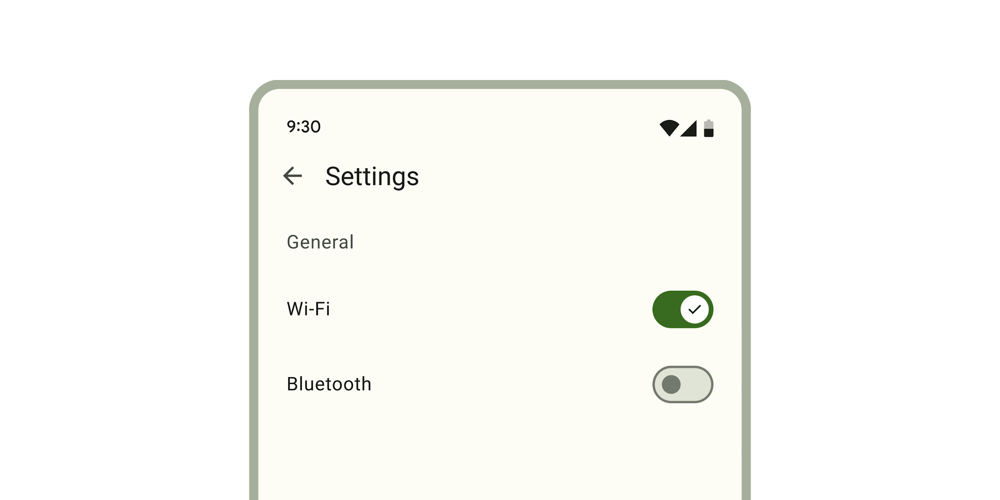

<!-- catalog-only-start --><!-- ---
name: Switch
dirname: switch
-----><!-- catalog-only-end -->

<catalog-component-header>
<catalog-component-header-title slot="title">

# Switch

<!--*
# Document freshness: For more information, see go/fresh-source.
freshness: { owner: 'lizmitchell' reviewed: '2023-08-02' }
tag: 'docType:reference'
*-->

<!-- no-catalog-start -->

<!-- go/md-switch -->

<!-- [TOC] -->

<!-- external-only-start -->
**This documentation is fully rendered on the
[Material Web catalog](https://material-web.dev/components/switch/).**
<!-- external-only-end -->

<!-- no-catalog-end -->

[Switches](https://m3.material.io/components/switch)<!-- {.external} --> toggle the state
of an item on or off.

</catalog-component-header-title>



</catalog-component-header>

*   [Design article](https://m3.material.io/components/switch) <!-- {.external} -->
*   API Documentation (*coming soon*)
*   [Source code](https://github.com/material-components/material-web/tree/main/switch)
    <!-- {.external} -->

<!-- catalog-only-start -->

<!--

## Interactive Demo



-->

<!-- catalog-only-end -->

## Usage

Switches are similar to checkboxes, and can be unselected or selected.

<!-- no-catalog-start -->
<!-- TODO: add image -->
<!-- no-catalog-end -->
<!-- catalog-only-start -->

<!--

<div class="figure-wrapper">
  <figure
      style="justify-content:center;"
      aria-label="">
    TODO: update figure
  </figure>
</div>

-->

<!-- catalog-only-end -->

```html
<md-switch></md-switch>
<md-switch selected></md-switch>
```

### Icons

Icons can be used to visually emphasize the switch's selected state. Switches
can choose to display both icons or only selected icons.

<!-- no-catalog-start -->
<!-- TODO: add image -->
<!-- no-catalog-end -->
<!-- catalog-only-start -->

<!--

<div class="figure-wrapper">
  <figure
      style="justify-content:center;"
      aria-label="">
    TODO: update figure
  </figure>
</div>

-->

<!-- catalog-only-end -->

```html
<md-switch icons></md-switch>
<md-switch icons selected></md-switch>

<md-switch icons show-only-selected-icon></md-switch>
<md-switch icons show-only-selected-icon selected></md-switch>
```

### Label

Associate a label with a switch using the `<label>` element.

<!-- no-catalog-start -->
<!-- TODO: add image -->
<!-- no-catalog-end -->
<!-- catalog-only-start -->

<!--

<div class="figure-wrapper">
  <figure
      style="justify-content:center;"
      aria-label="">
    TODO: update figure
  </figure>
</div>

-->

<!-- catalog-only-end -->

```html
<label>
  Wi-Fi
  <md-switch selected></md-switch>
</label>

<label for="switch">Bluetooth</label>
<md-switch id="switch"></md-switch>
```

## Accessibility

Add an
[`aria-label`](https://developer.mozilla.org/en-US/docs/Web/Accessibility/ARIA/Attributes/aria-label)<!-- {.external} -->
attribute to switches without labels or switches whose labels need to be more
descriptive.

```html
<md-switch aria-label="Lights"></md-switch>

<label>
  All
  <md-switch aria-label="All notifications"></md-switch>
</label>
```

> Note: switches are not automatically labelled by `<label>` elements and always
> need an `aria-label`. See b/294081528.

## Theming

Switches supports [Material theming](../theming/README.md) and can be customized
in terms of color and shape.

### Tokens

Token                               | Default value
----------------------------------- | ------------------------------------------
`--md-switch-handle-color`          | `--md-sys-color-outline`
`--md-switch-handle-shape`          | `9999px`
`--md-switch-track-color`           | `--md-sys-color-surface-container-highest`
`--md-switch-track-shape`           | `9999px`
`--md-switch-selected-handle-color` | `--md-sys-color-on-primary`
`--md-switch-selected-track-color`  | `--md-sys-color-primary`

*   [All tokens](https://github.com/material-components/material-web/blob/main/tokens/_md-comp-switch.scss)
    <!-- {.external} -->

### Example

<!-- no-catalog-start -->
<!-- TODO: add image -->
<!-- no-catalog-end -->
<!-- catalog-only-start -->

<!--

<div class="figure-wrapper">
  <figure
      style="justify-content:center;"
      aria-label="">
    TODO: update figure
  </figure>
</div>

-->

<!-- catalog-only-end -->

```html
<style>
  :root {
    /* System tokens */
    --md-sys-color-primary: #006a6a;
    --md-sys-color-on-primary: #ffffff;
    --md-sys-color-outline: #6f7979;
    --md-sys-color-surface-container-highest: #dde4e3;

    /* Component tokens */
    --md-switch-handle-shape: 0px;
    --md-switch-track-shape: 0px;
  }
</style>

<md-switch></md-switch>
<md-switch selected></md-switch>
```

<!-- auto-generated API docs start -->

## API


### MdSwitch

#### Properties

<!-- mdformat off(autogenerated might break rendering in catalog) -->

Property | Attribute | Type | Default | Description
--- | --- | --- | --- | ---
`disabled` | `disabled` | `boolean` | `false` | Disables the switch and makes it non-interactive.
`selected` | `selected` | `boolean` | `false` | Puts the switch in the selected state and sets the form submission value to<br>the `value` property.
`icons` | `icons` | `boolean` | `false` | Shows both the selected and deselected icons.
`showOnlySelectedIcon` | `show-only-selected-icon` | `boolean` | `false` | Shows only the selected icon, and not the deselected icon. If `true`,<br>overrides the behavior of the `icons` property.
`required` | `required` | `boolean` | `false` | When true, require the switch to be selected when participating in<br>form submission.<br><br>https://developer.mozilla.org/en-US/docs/Web/HTML/Element/input/checkbox#validation
`value` | `value` | `string` | `'on'` | The value associated with this switch on form submission. `null` is<br>submitted when `selected` is `false`.
`name` |  | `string` | `undefined` | The HTML name to use in form submission.
`form` |  | `HTMLFormElement` | `undefined` | The associated form element with which this element's value will submit.
`labels` |  | `NodeList` | `undefined` | The labels this element is associated with.
`validity` |  | `ValidityState` | `undefined` | Returns a ValidityState object that represents the validity states of the<br>switch.<br><br>Note that switches will only set `valueMissing` if `required` and not<br>selected.<br><br>https://developer.mozilla.org/en-US/docs/Web/HTML/Element/input/checkbox#validation
`validationMessage` |  | `string` | `undefined` | Returns the native validation error message.<br><br>https://developer.mozilla.org/en-US/docs/Web/HTML/Constraint_validation#constraint_validation_process
`willValidate` |  | `boolean` | `undefined` | Returns whether an element will successfully validate based on forms<br>validation rules and constraints.<br><br>https://developer.mozilla.org/en-US/docs/Web/HTML/Constraint_validation#constraint_validation_process

<!-- mdformat on(autogenerated might break rendering in catalog) -->

#### Methods

<!-- mdformat off(autogenerated might break rendering in catalog) -->

Method | Parameters | Returns | Description
--- | --- | --- | ---
`checkValidity` | _None_ | `boolean` | Checks the switch's native validation and returns whether or not the<br>element is valid.<br><br>If invalid, this method will dispatch the `invalid` event.<br><br>https://developer.mozilla.org/en-US/docs/Web/API/HTMLInputElement/checkValidity
`reportValidity` | _None_ | `boolean` | Checks the switch's native validation and returns whether or not the<br>element is valid.<br><br>If invalid, this method will dispatch the `invalid` event.<br><br>The `validationMessage` is reported to the user by the browser. Use<br>`setCustomValidity()` to customize the `validationMessage`.<br><br>https://developer.mozilla.org/en-US/docs/Web/API/HTMLInputElement/reportValidity
`setCustomValidity` | `error` | `void` | Sets the switch's native validation error message. This is used to<br>customize `validationMessage`.<br><br>When the error is not an empty string, the switch is considered invalid<br>and `validity.customError` will be true.<br><br>https://developer.mozilla.org/en-US/docs/Web/API/HTMLInputElement/setCustomValidity

<!-- mdformat on(autogenerated might break rendering in catalog) -->

#### Events

<!-- mdformat off(autogenerated might break rendering in catalog) -->

Event | Type | Description
--- | --- | ---
`input` | `InputEvent` | Fired whenever `selected` changes due to user<br>interaction (bubbles and composed).
`change` | `Event` | Fired whenever `selected` changes due to user<br>interaction (bubbles).

<!-- mdformat on(autogenerated might break rendering in catalog) -->

<!-- auto-generated API docs end -->
