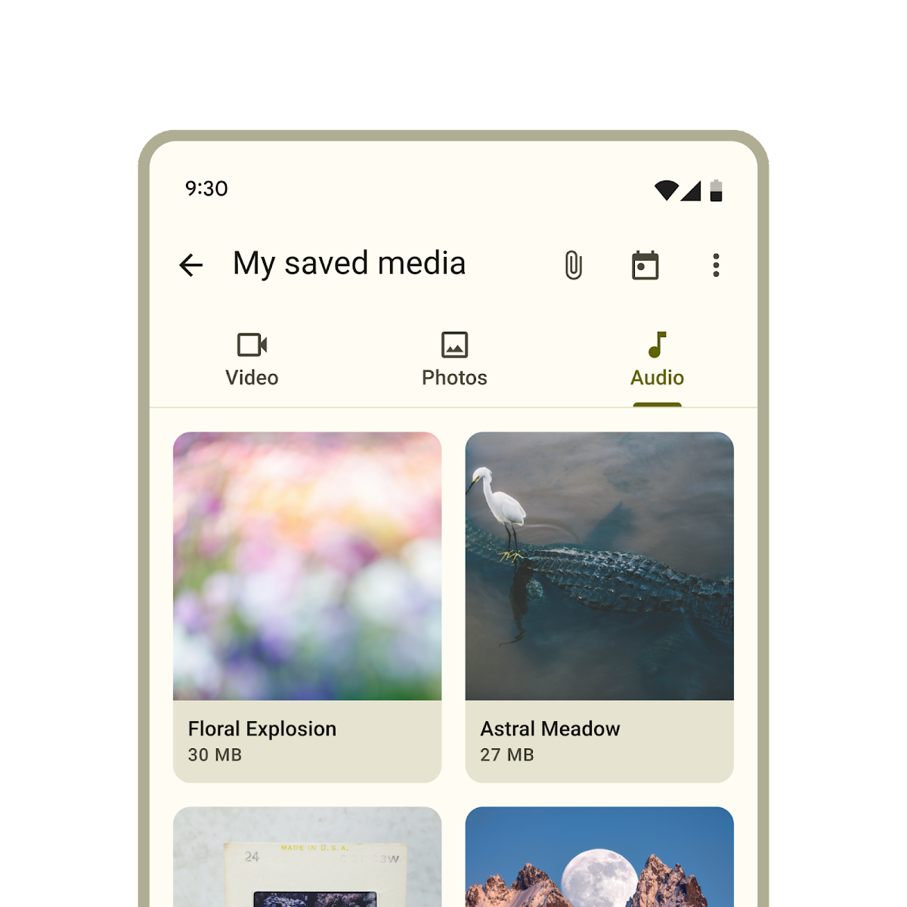
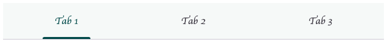

<!-- catalog-only-start --><!-- ---
name: Tabs
dirname: tabs
-----><!-- catalog-only-end -->

<catalog-component-header image-align="start">
<catalog-component-header-title slot="title">

# Tabs

<!-- no-catalog-start -->

<!--*
# Document freshness: For more information, see go/fresh-source.
freshness: {
  owner: 'lizmitchell'
  owner: 'ajakubowicz'
  reviewed: '2023-09-08'
}
tag: 'docType:reference'
*-->

<!-- go/md-tabs -->

<!-- [TOC] -->

<!-- external-only-start -->
**This documentation is fully rendered on the
[Material Web catalog](https://material-web.dev/components/tabs/)**
<!-- external-only-end -->

<!-- no-catalog-end -->

[Tabs](https://m3.material.io/components/tabs)<!-- {.external} --> organize groups of
related content that are at the same level of hierarchy.

</catalog-component-header-title>



</catalog-component-header>

*   [Design article](https://m3.material.io/components/tabs) <!-- {.external} -->
*   [API Documentation](#api)
*   [Source code](https://github.com/material-components/material-web/tree/main/tabs)
    <!-- {.external} -->

## Types

1.  [Primary tabs](#primary-tabs)
1.  [Secondary tabs](#secondary-tabs)

<!-- catalog-only-start -->

<!--

## Interactive Demo



-->

<!-- catalog-only-end -->

## Usage

Tabs contain multiple primary or secondary tab children. Use the same type of
tab in a tab bar.

<!-- no-catalog-start -->
<!-- Need to add image -->
<!-- no-catalog-end -->
<!-- Need to add catalog-include "figures/<component>/usage.html" -->

```html
<md-tabs>
  <md-primary-tab>Video</md-primary-tab>
  <md-primary-tab>Photos</md-primary-tab>
  <md-primary-tab>Audio</md-primary-tab>
</md-tabs>

<md-tabs>
  <md-secondary-tab>Birds</md-secondary-tab>
  <md-secondary-tab>Cats</md-secondary-tab>
  <md-secondary-tab>Dogs</md-secondary-tab>
</md-tabs>
```

### Selection

Add an `active` attribute to change which tab is selected.

```html
<md-tabs>
  <md-primary-tab>Video</md-primary-tab>
  <md-primary-tab active>Photos</md-primary-tab>
  <md-primary-tab>Audio</md-primary-tab>
</md-tabs>
```

To observe changes to tab selections, add an event listener to `<md-tabs>`,
listening for the `change` event.

```ts
tabs.addEventListener('change', (event: Event) => {
  if (event.target.activeTabIndex === 2) {
    // ... perform logic only if index of selected item is 2.
  }
});
```

### Icons

Tabs may optionally show an icon.

Icons communicate the type of content within a tab. Icons should be simple and
recognizable.

<!-- no-catalog-start -->
<!-- Need to add image -->
<!-- no-catalog-end -->
<!-- Need to add catalog-include "figures/<component>/usage.html" -->

```html
<md-tabs>
  <md-primary-tab>
    <md-icon slot="icon">piano</md-icon>
    Keyboard
  </md-primary-tab>
  <md-primary-tab>
    <md-icon slot="icon">tune</md-icon>
    Guitar
  </md-primary-tab>
</md-tabs>
```

Tabs may optionally show icons without a label.

<!-- no-catalog-start -->
<!-- Need to add image -->
<!-- no-catalog-end -->
<!-- Need to add catalog-include "figures/<component>/usage.html" -->

```html
<md-tabs>
  <md-primary-tab>
    <md-icon slot="icon">piano</md-icon>
  </md-primary-tab>
  <md-primary-tab>
    <md-icon slot="icon">tune</md-icon>
  </md-primary-tab>
</md-tabs>
```

## Primary tabs

<!-- go/md-primary-tab -->

Primary tabs are placed at the top of the content pane under a top app bar. They
display the main content destinations.

<!-- no-catalog-start -->
<!-- Need to add image -->
<!-- no-catalog-end -->
<!-- Need to add catalog-include "figures/<component>/usage.html" -->

```html
<md-tabs>
  <md-primary-tab>
    <md-icon slot="icon">piano</md-icon>
    Keyboard
  </md-primary-tab>
  <md-primary-tab>
    <md-icon slot="icon">tune</md-icon>
    Guitar
  </md-primary-tab>
</md-tabs>
```

### Inline icons

Primary tabs can show their icons inline, like secondary tabs.

<!-- no-catalog-start -->
<!-- Need to add image -->
<!-- no-catalog-end -->
<!-- Need to add catalog-include "figures/<component>/usage.html" -->

```html
<md-tabs>
  <md-primary-tab inline-icon>
    <md-icon slot="icon">piano</md-icon>
    Keyboard
  </md-primary-tab>
  <md-primary-tab inline-icon>
    <md-icon slot="icon">tune</md-icon>
    Guitar
  </md-primary-tab>
</md-tabs>
```

## Secondary tabs

<!-- go/md-secondary-tab -->

Secondary tabs are used within a content area to further separate related
content and establish hierarchy.

<!-- no-catalog-start -->
<!-- Need to add image -->
<!-- no-catalog-end -->
<!-- Need to add catalog-include "figures/<component>/usage.html" -->

```html
<md-tabs>
  <md-secondary-tab>
    <md-icon slot="icon">flight</md-icon>
    Travel
  </md-secondary-tab>
  <md-secondary-tab>
    <md-icon slot="icon">hotel</md-icon>
    Hotel
  </md-secondary-tab>
  <md-secondary-tab>
    <md-icon slot="icon">hiking</md-icon>
    Activities
  </md-secondary-tab>
</md-tabs>
```

## Accessibility

Add an
[`aria-label`](https://developer.mozilla.org/en-US/docs/Web/Accessibility/ARIA/Attributes/aria-label)<!-- {.external} -->
attribute to `<md-tabs>` and any individual tab whose label needs to be more
descriptive, such as icon-only tabs.

```html
<md-tabs aria-label="Content to view">
  <md-primary-tab aria-label="Photos">
    <md-icon slot="icon">photo</md-icon>
  </md-primary-tab>
  <md-primary-tab aria-label="Videos">
    <md-icon slot="icon">videocam</md-icon>
  </md-primary-tab>
  <md-primary-tab aria-label="Music">
    <md-icon slot="icon">audiotrack</md-icon>
  </md-primary-tab>
</md-tabs>
```

### Tab panels

Every tab must reference a
[`role="tabpanel"`](https://developer.mozilla.org/en-US/docs/Web/Accessibility/ARIA/Roles/tabpanel_role)<!-- {.external} -->
element with `aria-controls`. Tab panels must be labelled with `aria-label` or
`aria-labelledby`.

It's common to reference the panel's tab with `aria-labelledby`.

```html
<md-tabs aria-label="Content to view">
  <md-primary-tab id="photos-tab" aria-controls="photos-panel">
    Photos
  </md-primary-tab>
  <md-primary-tab id="videos-tab" aria-controls="videos-panel">
    Videos
  </md-primary-tab>
  <md-primary-tab id="music-tab" aria-controls="music-panel">
    Music
  </md-primary-tab>
</md-tabs>

<div id="photos-panel" role="tabpanel" aria-labelledby="photos-tab">
  ...
</div>
<div id="videos-panel" role="tabpanel" aria-labelledby="videos-tab" hidden>
  ...
</div>
<div id="music-panel" role="tabpanel" aria-labelledby="music-tab" hidden>
  ...
</div>
```

## Theming

Tabs supports [Material theming](../theming/README.md) and can be customized in
terms of color, typography, and shape.

### Primary tab tokens

Token                                     | Default value
----------------------------------------- | -------------
`--md-primary-tab-container-color`        | `--md-sys-color-surface`
`--md-primary-tab-label-text-font`        | `--md-sys-typescale-title-small-font`
`--md-primary-tab-active-indicator-color` | `--md-sys-color-primary`
`--md-primary-tab-icon-color`             | `--md-sys-color-on-surface-variant`
`--md-primary-tab-container-shape`        | `--md-sys-shape-corner-none`

*   [All tokens](https://github.com/material-components/material-web/blob/main/tokens/_md-comp-primary-tab.scss)
    <!-- {.external} -->

### Primary tab example

<!-- no-catalog-start -->



<!-- no-catalog-end -->

```html
<style>
:root {
  /* System tokens */
  --md-sys-color-surface: #f7faf9;
  --md-sys-color-primary: #005353;

  /* Component tokens */
  --md-primary-tab-label-text-font: cursive, system-ui;
  --md-primary-tab-label-text-size: 0.8em;
}
</style>

<md-tabs>
  <md-primary-tab>Tab 1</md-primary-tab>
  <md-primary-tab>Tab 2</md-primary-tab>
  <md-primary-tab>Tab 3</md-primary-tab>
</md-tabs>
```

### Secondary tab tokens

Token                                       | Default value
------------------------------------------- | -------------
`--md-secondary-tab-container-color`        | `--md-sys-color-surface`
`--md-secondary-tab-label-text-font`        | `--md-sys-typescale-title-small-font`
`--md-secondary-tab-active-indicator-color` | `--md-sys-color-primary`
`--md-secondary-tab-icon-color`             | `--md-sys-color-on-surface-variant`
`--md-secondary-tab-container-shape`        | `--md-sys-shape-corner-none`

*   [All tokens](https://github.com/material-components/material-web/blob/main/tokens/_md-comp-secondary-tab.scss)
    <!-- {.external} -->

### Secondary tab example

<!-- no-catalog-start -->
<!-- Need to add image -->
<!-- no-catalog-end -->

```html
<style>
:root {
  /* System tokens */
  --md-sys-color-surface: #f7faf9;
  --md-sys-color-primary: #005353;

  /* Component tokens */
  --md-secondary-tab-label-text-font: cursive, system-ui;
  --md-secondary-tab-label-text-size: 0.8em;
}
</style>

<md-tabs>
  <md-secondary-tab>Tab 1</md-secondary-tab>
  <md-secondary-tab>Tab 2</md-secondary-tab>
  <md-secondary-tab>Tab 3</md-secondary-tab>
</md-tabs>
```

<!-- auto-generated API docs start -->

## API


### MdTabs <code>&lt;md-tabs&gt;</code>

#### Properties

<!-- mdformat off(autogenerated might break rendering in catalog) -->

Property | Attribute | Type | Default | Description
--- | --- | --- | --- | ---
`autoActivate` | `auto-activate` | `boolean` | `false` | Whether or not to automatically select a tab when it is focused.
`tabs` |  | `Tab[]` | `undefined` | The tabs of this tab bar.
`activeTab` |  | `Tab` | `undefined` |
`activeTabIndex` |  | `number` | `undefined` |

<!-- mdformat on(autogenerated might break rendering in catalog) -->

#### Methods

<!-- mdformat off(autogenerated might break rendering in catalog) -->

Method | Parameters | Returns | Description
--- | --- | --- | ---
`scrollToTab` | `tabToScrollTo` | `Promise<void>` | Scrolls the toolbar, if overflowing, to the active tab, or the provided tab.

<!-- mdformat on(autogenerated might break rendering in catalog) -->

#### Events

<!-- mdformat off(autogenerated might break rendering in catalog) -->

Event | Description
--- | ---
`change` | Fired when the selected tab changes. The target's selected or selectedItem and previousSelected or previousSelectedItem provide information about the selection change. The change event is fired when a user interaction like a space/enter key or click cause a selection change. The tab selection based on these actions can be cancelled by calling preventDefault on the triggering `keydown` or `click` event.

<!-- mdformat on(autogenerated might break rendering in catalog) -->

### MdPrimaryTab <code>&lt;md-primary-tab&gt;</code>

#### Properties

<!-- mdformat off(autogenerated might break rendering in catalog) -->

Property | Attribute | Type | Default | Description
--- | --- | --- | --- | ---
`inlineIcon` | `inline-icon` | `boolean` | `false` | Whether or not the icon renders inline with label or stacked vertically.
`isTab` | `md-tab` | `boolean` | `true` | The attribute `md-tab` indicates that the element is a tab for the parent element, `<md-tabs>`. Make sure if you're implementing your own `md-tab` component that you have an `md-tab` attribute set.
`active` | `active` | `boolean` | `false` | Whether or not the tab is selected.
`hasIcon` | `has-icon` | `boolean` | `false` | In SSR, set this to true when an icon is present.
`iconOnly` | `icon-only` | `boolean` | `false` | In SSR, set this to true when there is no label and only an icon.
`selected` | `selected` | `boolean` | `undefined` |

<!-- mdformat on(autogenerated might break rendering in catalog) -->

### MdSecondaryTab <code>&lt;md-secondary-tab&gt;</code>

#### Properties

<!-- mdformat off(autogenerated might break rendering in catalog) -->

Property | Attribute | Type | Default | Description
--- | --- | --- | --- | ---
`isTab` | `md-tab` | `boolean` | `true` | The attribute `md-tab` indicates that the element is a tab for the parent element, `<md-tabs>`. Make sure if you're implementing your own `md-tab` component that you have an `md-tab` attribute set.
`active` | `active` | `boolean` | `false` | Whether or not the tab is selected.
`hasIcon` | `has-icon` | `boolean` | `false` | In SSR, set this to true when an icon is present.
`iconOnly` | `icon-only` | `boolean` | `false` | In SSR, set this to true when there is no label and only an icon.
`selected` | `selected` | `boolean` | `undefined` |

<!-- mdformat on(autogenerated might break rendering in catalog) -->

<!-- auto-generated API docs end -->
