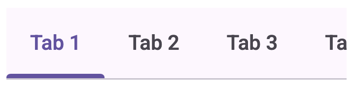

<!-- catalog-only-start --><!-- ---
name: Tabs
dirname: tabs
-----><!-- catalog-only-end -->

<catalog-component-header image-align="start">
<catalog-component-header-title slot="title">

# Tabs

<!-- no-catalog-start -->

<!--*
# Document freshness: For more information, see go/fresh-source.
freshness: { owner: 'ajakubowicz' reviewed: '2023-08-01' }
tag: 'docType:reference'
*-->

<!-- go/md-tabs -->

<!-- [TOC] -->

<!-- external-only-start -->
**This documentation is fully rendered on the
[Material Web catalog](https://material-web.dev/components/tabs/)**
<!-- external-only-end -->

<!-- no-catalog-end -->

[Tabs](https://m3.material.io/components/tabs)<!-- {.external} --> organize groups of
related content that are at the same level of hierarchy.

</catalog-component-header-title>


</catalog-component-header>

*   [Design article](https://m3.material.io/components/tabs) <!-- {.external} -->
*   API Documentation (*coming soon*)
*   [Source code](https://github.com/material-components/material-web/tree/main/tabs)
    <!-- {.external} -->

<!-- catalog-only-start -->

<!--

## Interactive Demo



-->

<!-- catalog-only-end -->

## Usage

There are two tabs variants: `primary` (default), and `secondary`.

Tabs consist of a parent `<md-tabs>` tag, containing multiple `<md-tab>`
children.


```html
<md-tabs>
  <md-tab>
    <md-icon aria-hidden="true" slot="icon">piano</md-icon>
    Keyboard
  </md-tab>
  <md-tab>
    <md-icon aria-hidden="true" slot="icon">tune</md-icon>
    Guitar
  </md-tab>
</md-tabs>


<md-tabs variant="secondary">
 <md-tab inline-icon>
  <md-icon aria-hidden="true" slot="icon">flight</md-icon>
   Travel
 </md-tab>
 <md-tab inline-icon>
  <md-icon aria-hidden="true" slot="icon">hotel</md-icon>
   Hotel
 </md-tab>
 <md-tab inline-icon>
  <md-icon aria-hidden="true" slot="icon">hiking</md-icon>
   Activities
 </md-tab>
</md-tabs>
```

To observe changes to tab selections, add an event listener to `<md-tabs>`,
listening for the `change` event.

```ts
tabs.addEventListener('change', (event: Event) => {
  if (event.target.selected === 2) {
    // ... perform logic only if index of selected item is 2.
  }
});
```

### Scrollable

When a set of tabs cannot fit on screen or container, use scrollable tabs.
Scrollable tabs can use longer text labels and a larger number of tabs. They are
best used for browsing on touch interfaces.



```html
<md-tabs>
  <md-tab>Tab 1</md-tab>
  <md-tab>Tab 2</md-tab>
  <md-tab>Tab 3</md-tab>
  <md-tab>Tab 4</md-tab>
</md-tabs>
```

<!-- TODO: ## Accessibility -->

## Theming

Tabs supports [Material theming](../theming.md) and can be customized in terms
of color, typography, and shape.

### Tokens

Token                                     | Default value
----------------------------------------- | -----------------------------------
`--md-primary-tab-container-color`        | `--md-sys-color-surface`
`--md-secondary-tab-container-color`      | `--md-sys-color-surface`
`--md-primary-tab-divider-color`          | `--md-sys-color-outline-variant`
`--md-primary-tab-label-text-type`        | `500 0.875rem/1.25rem Roboto`
`--md-primary-tab-active-indicator-color` | `--md-sys-color-primary`
`--md-primary-tab-icon-color`             | `--md-sys-color-on-surface-variant`
`--md-primary-tab-container-shape`        | `0px`

*   [All tokens](https://github.com/material-components/material-web/blob/main/tokens/_md-comp-tab.scss)
    <!-- {.external} -->

### Example

<!-- no-catalog-start -->


<!-- no-catalog-end -->

```html
<style>
:root {
  /* System tokens */
  --md-sys-color-surface: #f7faf9;
  --md-sys-color-primary: #005353;

  /* Component tokens */
  --md-primary-tab-label-text-type: 0.8em cursive, system-ui;
}
</style>

<md-tabs>
  <md-tab>Tab 1</md-tab>
  <md-tab>Tab 2</md-tab>
  <md-tab>Tab 3</md-tab>
</md-tabs>
```
