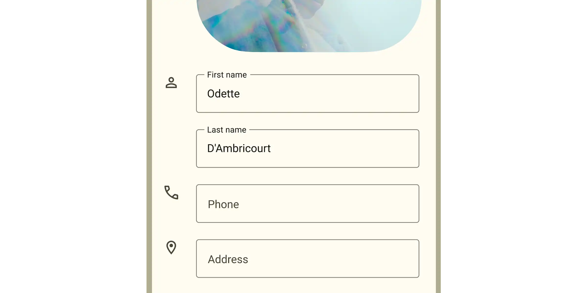
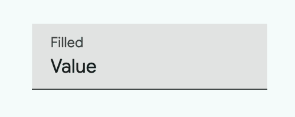
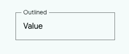

<!-- catalog-only-start --><!-- ---
name: Text field
dirname: textfield
-----><!-- catalog-only-end -->

<catalog-component-header image-align="start">
<catalog-component-header-title slot="title">

# Text field

<!--*
# Document freshness: For more information, see go/fresh-source.
freshness: { owner: 'lizmitchell' reviewed: '2024-02-28' }
tag: 'docType:reference'
*-->

<!-- no-catalog-start -->

<!-- go/md-text-field -->

<!-- [TOC] -->

<!-- external-only-start -->
**This documentation is fully rendered on the
[Material Web catalog](https://material-web.dev/components/text-field/)**
<!-- external-only-end -->

<!-- no-catalog-end -->

[Text fields](https://m3.material.io/components/text-fields)<!-- {.external} --> let
users enter text into a UI.

</catalog-component-header-title>



</catalog-component-header>

*   [Design article](https://m3.material.io/components/text-fields) <!-- {.external} -->
*   [API Documentation](#api)
*   [Source code](https://github.com/material-components/material-web/tree/main/textfield)
    <!-- {.external} -->

## Types

1.  [Filled text field](#filled-text-field)
1.  [Outlined text field](#outlined-text-field)

<!-- catalog-only-start -->

<!--

## Interactive Demo



-->

<!-- catalog-only-end -->

## Usage

Text fields behave like
[`<input>`](https://developer.mozilla.org/en-US/docs/Web/HTML/Element/input)<!-- {.external} -->
elements. They provide a container with labels for user input.

<!-- no-catalog-start -->


<!-- no-catalog-end -->
<!-- catalog-include "figures/textfield/usage.html" -->

```html
<md-filled-text-field label="Label" value="Value">
</md-filled-text-field>

<md-outlined-text-field label="Label" value="Value">
</md-outlined-text-field>
```

### Input type

A text field's `type` attribute changes how the text field works, such as
displaying a different keyboard or providing default validation.

-   [`type="text"`](https://developer.mozilla.org/en-US/docs/Web/HTML/Element/input/text)<!-- {.external} -->
    (default)
-   [`type="email"`](https://developer.mozilla.org/en-US/docs/Web/HTML/Element/input/email)
    <!-- {.external} -->
-   [`type="number"`](https://developer.mozilla.org/en-US/docs/Web/HTML/Element/input/number)
    <!-- {.external} -->
-   [`type="password"`](https://developer.mozilla.org/en-US/docs/Web/HTML/Element/input/password)
    <!-- {.external} -->
-   [`type="search"`](https://developer.mozilla.org/en-US/docs/Web/HTML/Element/input/search)
    <!-- {.external} -->
-   [`type="tel"`](https://developer.mozilla.org/en-US/docs/Web/HTML/Element/input/tel)
    <!-- {.external} -->
-   [`type="url"`](https://developer.mozilla.org/en-US/docs/Web/HTML/Element/input/url)
    <!-- {.external} -->
-   [`type="textarea"`](https://developer.mozilla.org/en-US/docs/Web/HTML/Element/textarea)
    <!-- {.external} -->

<!-- no-catalog-start -->


<!-- no-catalog-end -->
<!-- catalog-include "figures/textfield/usage-type.html" -->

```html
<md-filled-text-field label="Username" type="email">
</md-filled-text-field>

<md-filled-text-field label="Password" type="password">
</md-filled-text-field>
```

> Tip: use the
> [`inputmode`](https://developer.mozilla.org/en-US/docs/Web/HTML/Global_attributes/inputmode)<!-- {.external} -->
> attribute for more control over the displayed keyboard.

### Labels

Text fields should label their value with a floating `label`, a `placeholder`,
or an external label. Labels help the user understand what value to input.

<!-- no-catalog-start -->


<!-- no-catalog-end -->
<!-- catalog-include "figures/textfield/usage-label.html" -->

```html
<md-outlined-text-field label="Favorite food">
</md-outlined-text-field>

<md-outlined-text-field placeholder="email@domain.com">
</md-outlined-text-field>

<div>First name</div>
<md-outlined-text-field aria-label="First name">
</md-outlined-text-field>
```

> Note: text fields do not currently support `aria-labelledby`. External labels
> must provide an `aria-label`. See b/276484803.

### Textarea

Multi-line text fields behave like
[`<textarea>`](https://developer.mozilla.org/en-US/docs/Web/HTML/Element/textarea)<!-- {.external} -->
elements.

Textareas can specify the initial number of `rows`. Use CSS `width`, `height`,
and `resize` to control the resize behavior of a textarea.

<!-- no-catalog-start -->


<!-- no-catalog-end -->
<!-- catalog-include "figures/textfield/usage-textarea.html" -->

```html
<style>
  md-filled-text-field {
    resize: vertical;
  }
</style>
<md-filled-text-field
    type="textarea"
    label="Vertical resize"
    rows="3">
</md-filled-text-field>
```

### Icons

Text fields may display optional icons. Use icons to describe the input method
(such as a search icon), provide additional functionality (such as a clear
icon), or to express errors.

<!-- no-catalog-start -->


<!-- no-catalog-end -->
<!-- catalog-include "figures/textfield/usage-icons.html" -->

```html
<md-outlined-text-field placeholder="Search for messages">
  <md-icon slot="leading-icon">search</md-icon>
</md-outlined-text-field>

<md-outlined-text-field label="Password" type="password">
  <md-icon-button toggle slot="trailing-icon">
    <md-icon>visibility</md-icon>
    <md-icon slot="selected">visibility_off</md-icon>
  </md-icon-button>
</md-outlined-text-field>

<md-outlined-text-field
    label="Username"
    error
    error-text="Username not available">
  <md-icon slot="trailing-icon">error</md-icon>
</md-outlined-text-field>
```

### Prefix and suffix

Add `prefix-text` and `suffix-text` attributes to text fields to display
additional context for the value.

<!-- no-catalog-start -->


<!-- no-catalog-end -->
<!-- catalog-include "figures/textfield/usage-prefix.html" -->

```html
<md-outlined-text-field
    label="Dollar amount"
    type="number"
    value="0"
    prefix-text="$"
    suffix-text=".00">
</md-outlined-text-field>
```

### Supporting text

Supporting text conveys additional information about the input field, such as
how it will be used. Supporting text can be replaced with error text when
[validating](#validation).

<!-- no-catalog-start -->


<!-- no-catalog-end -->
<!-- catalog-include "figures/textfield/usage-supporting-text.html" -->

```html
<md-filled-text-field
    label="Comments"
    supporting-text="Provide comments for the issue">
</md-filled-text-field>

<md-filled-text-field
    label="Name"
    required
    supporting-text="*required"
    error-text="Please fill out this field">
</md-filled-text-field>
```

### Character counter

Text fields with a `maxlength` attribute will display a character counter.

<!-- no-catalog-start -->


<!-- no-catalog-end -->
<!-- catalog-include "figures/textfield/usage-char-counter.html" -->

```html
<md-outlined-text-field label="Title" value="Short" maxlength="10">
</md-outlined-text-field>
```

### Validation

Text fields that validate can use
[constraint validation](#constraint-validation) or
[manual validation](#manual-validation).

#### Constraint validation

Text fields may validate using the browser's
[constraint validation](https://developer.mozilla.org/en-US/docs/Web/HTML/Constraint_validation)<!-- {.external} -->
API. Each [input type](#input-type) above links to an article that describes how
to validate it.

Text fields in a `<form>` will validate on submission, or by calling
`textField.reportValidity()`.

```html
<form>
  <md-filled-text-field
      name="name"
      label="Name"
      required>
  </md-filled-text-field>
  <md-filled-text-field
      name="email"
      label="Email"
      pattern="[\w\d-]+"
      suffix-text="@gmail.com">
  </md-filled-text-field>
</form>
```

Use the following properties and methods to check and report validation errors.

-   `validity` is the text field's current
    [`ValidityState`](https://developer.mozilla.org/en-US/docs/Web/API/ValidityState)<!-- {.external} -->.
-   [`setCustomValidity()`](https://developer.mozilla.org/en-US/docs/Web/API/HTMLInputElement/setCustomValidity)<!-- {.external} -->
    sets a custom error message.
-   [`checkValidity()`](https://developer.mozilla.org/en-US/docs/Web/API/HTMLInputElement/checkValidity)<!-- {.external} -->
    dispatches an
    [`invalid` event](https://developer.mozilla.org/en-US/docs/Web/API/HTMLInputElement/invalid_event)<!-- {.external} -->.
-   [`reportValidity()`](https://developer.mozilla.org/en-US/docs/Web/API/HTMLInputElement/reportValidity)<!-- {.external} -->
    dispatches an
    [`invalid` event](https://developer.mozilla.org/en-US/docs/Web/API/HTMLInputElement/invalid_event)<!-- {.external} -->
    and displays the error in the text field's supporting text.

#### Manual validation

Alternatively, text fields can manually control their error state and error
message. Use manual validation if the text fields are driven by application
state logic.

```html
<md-outlined-text-field
    label="Username"
    value="jdoe"
    error
    error-text="Username is not available">
</md-outlined-text-field>
```

> Tip: Prefer [constraint validation](#constraint-validation) when possible for
> more platform features, such as `<form>` validation and listening to `invalid`
> events.

## Accessibility

Add an
[`aria-label`](https://developer.mozilla.org/en-US/docs/Web/Accessibility/ARIA/Attributes/aria-label)<!-- {.external} -->
attribute to text fields with external labels or text fields whose labels need
to be more descriptive.

```html
<div>Username</div>
<md-filled-text-field aria-label="Username"></md-filled-text-field>

<md-filled-text-field label="First" aria-label="First name"></md-filled-text-field>
```

## Filled text field

<!-- go/md-filled-text-field -->

Filled and outlined text fields are functionally identical. See
[choosing a text field](https://m3.material.io/components/text-fields/guidelines#83956188-4d8f-4c11-9389-aaba30b10214)<!-- {.external} -->
for guidance on which one to use.

```html
<md-filled-text-field label="Filled" value="Value"></md-filled-text-field>
```

## Outlined text field

<!-- go/md-outlined-text-field -->

Filled and outlined text fields are functionally identical. See
[choosing a text field](https://m3.material.io/components/text-fields/guidelines#83956188-4d8f-4c11-9389-aaba30b10214)<!-- {.external} -->
for guidance on which one to use.

```html
<md-outlined-text-field label="Outlined" value="Value"></md-outlined-text-field>
```

## Theming

Text fields support [Material theming](../theming/README.md) and can be
customized in terms of color, typography, and shape.

### Filled text field tokens

Token                                                 | Default value
----------------------------------------------------- | -------------
`--md-filled-text-field-container-shape`              | `--md-sys-shape-corner-extra-small`
`--md-filled-text-field-container-color`              | `--md-sys-color-surface-container-highest`
`--md-filled-text-field-focus-active-indicator-color` | `--md-sys-color-primary`
`--md-filled-text-field-input-text-font`              | `--md-sys-typescale-body-large-font`
`--md-filled-text-field-label-text-font`              | `--md-sys-typescale-body-large-font`

*   [All tokens](https://github.com/material-components/material-web/blob/main/tokens/_md-comp-filled-text-field.scss)
    <!-- {.external} -->

### Filled text field example

<!-- no-catalog-start -->



<!-- no-catalog-end -->
<!-- catalog-include "figures/textfield/theming-filled.html" -->

```html
<style>
:root {
  --md-filled-text-field-container-shape: 0px;
  --md-sys-typescale-body-large: 400 1rem system-ui;
  --md-sys-color-primary: #006a6a;
  --md-sys-color-surface-container-highest: #e0e3e2;
  --md-filled-text-field-label-text-color: #3f4948;
  --md-filled-text-field-input-text-color: #161d1d;
}
</style>

<md-filled-text-field label="Filled" value="Value">
</md-filled-text-field>
```

### Outlined text field tokens

Token                                          | Default value
---------------------------------------------- | -------------
`--md-outlined-text-field-container-shape`     | `--md-sys-shape-corner-extra-small`
`--md-outlined-text-field-focus-outline-color` | `--md-sys-color-primary`
`--md-outlined-text-field-input-text-font`     | `--md-sys-typescale-body-large-font`
`--md-outlined-text-field-label-text-font`     | `--md-sys-typescale-body-large-font`

*   [All tokens](https://github.com/material-components/material-web/blob/main/tokens/_md-comp-outlined-text-field.scss)
    <!-- {.external} -->

### Outlined text field example

<!-- no-catalog-start -->



<!-- no-catalog-end -->
<!-- catalog-include "figures/textfield/theming-outlined.html" -->

```html
<style>
:root {
  --md-outlined-text-field-container-shape: 0px;
  --md-sys-typescale-body-large: 400 1rem system-ui;
  --md-sys-color-primary: #006a6a;
  --md-outlined-text-field-label-text-color: #3f4948;
  --md-outlined-text-field-input-text-color: #161d1d;
}
</style>

<md-outlined-text-field label="Outlined" value="Value"></md-outlined-text-field>
```

<!-- auto-generated API docs start -->

## API


### MdFilledTextField <code>&lt;md-filled-text-field&gt;</code>

#### Properties

<!-- mdformat off(autogenerated might break rendering in catalog) -->

Property | Attribute | Type | Default | Description
--- | --- | --- | --- | ---
`disabled` | `disabled` | `boolean` | `false` |
`error` | `error` | `boolean` | `false` | Gets or sets whether or not the text field is in a visually invalid state.<br>This error state overrides the error state controlled by `reportValidity()`.
`errorText` | `error-text` | `string` | `''` | The error message that replaces supporting text when `error` is true. If `errorText` is an empty string, then the supporting text will continue to show.<br>This error message overrides the error message displayed by `reportValidity()`.
`label` | `label` | `string` | `''` |
`required` | `required` | `boolean` | `false` |
`value` | `value` | `string` | `''` | The current value of the text field. It is always a string.
`prefixText` | `prefix-text` | `string` | `''` | An optional prefix to display before the input value.
`suffixText` | `suffix-text` | `string` | `''` | An optional suffix to display after the input value.
`hasLeadingIcon` | `has-leading-icon` | `boolean` | `false` | Whether or not the text field has a leading icon. Used for SSR.
`hasTrailingIcon` | `has-trailing-icon` | `boolean` | `false` | Whether or not the text field has a trailing icon. Used for SSR.
`supportingText` | `supporting-text` | `string` | `''` | Conveys additional information below the text field, such as how it should be used.
`textDirection` | `text-direction` | `string` | `''` | Override the input text CSS `direction`. Useful for RTL languages that use LTR notation for fractions.
`rows` | `rows` | `number` | `2` | The number of rows to display for a `type="textarea"` text field. Defaults to 2.
`cols` | `cols` | `number` | `20` | The number of cols to display for a `type="textarea"` text field. Defaults to 20.
`inputMode` | `inputmode` | `string` | `''` |
`max` | `max` | `string` | `''` | Defines the greatest value in the range of permitted values.<br>https://developer.mozilla.org/en-US/docs/Web/HTML/Element/input#max
`maxLength` | `maxlength` | `number` | `-1` | The maximum number of characters a user can enter into the text field. Set to -1 for none.<br>https://developer.mozilla.org/en-US/docs/Web/HTML/Element/input#maxlength
`min` | `min` | `string` | `''` | Defines the most negative value in the range of permitted values.<br>https://developer.mozilla.org/en-US/docs/Web/HTML/Element/input#min
`minLength` | `minlength` | `number` | `-1` | The minimum number of characters a user can enter into the text field. Set to -1 for none.<br>https://developer.mozilla.org/en-US/docs/Web/HTML/Element/input#minlength
`pattern` | `pattern` | `string` | `''` | A regular expression that the text field's value must match to pass constraint validation.<br>https://developer.mozilla.org/en-US/docs/Web/HTML/Element/input#pattern
`placeholder` | `placeholder` | `string` | `''` |
`readOnly` | `readonly` | `boolean` | `false` | Indicates whether or not a user should be able to edit the text field's value.<br>https://developer.mozilla.org/en-US/docs/Web/HTML/Element/input#readonly
`multiple` | `multiple` | `boolean` | `false` | Indicates that input accepts multiple email addresses.<br>https://developer.mozilla.org/en-US/docs/Web/HTML/Element/input/email#multiple
`step` | `step` | `string` | `''` | Returns or sets the element's step attribute, which works with min and max to limit the increments at which a numeric or date-time value can be set.<br>https://developer.mozilla.org/en-US/docs/Web/HTML/Element/input#step
`type` | `type` | `string` | `'text'` | The `<input>` type to use, defaults to "text". The type greatly changes how the text field behaves.<br>Text fields support a limited number of `<input>` types:<br>- text - textarea - email - number - password - search - tel - url<br>See https://developer.mozilla.org/en-US/docs/Web/HTML/Element/input#input_types for more details on each input type.
`autocomplete` | `autocomplete` | `string` | `''` | Describes what, if any, type of autocomplete functionality the input should provide.<br>https://developer.mozilla.org/en-US/docs/Web/HTML/Attributes/autocomplete
`form` |  | `HTMLFormElement` | `undefined` |
`labels` |  | `NodeList` | `undefined` |
`name` |  | `string` | `undefined` |
`selectionDirection` |  | `string` | `undefined` |
`selectionEnd` |  | `number` | `undefined` |
`selectionStart` |  | `number` | `undefined` |
`validationMessage` |  | `string` | `undefined` |
`validity` |  | `ValidityState` | `undefined` |
`valueAsNumber` |  | `number` | `undefined` |
`valueAsDate` |  | `Date` | `undefined` |
`willValidate` |  | `boolean` | `undefined` |

<!-- mdformat on(autogenerated might break rendering in catalog) -->

#### Methods

<!-- mdformat off(autogenerated might break rendering in catalog) -->

Method | Parameters | Returns | Description
--- | --- | --- | ---
`checkValidity` | _None_ | `boolean` | Checks the text field's native validation and returns whether or not the element is valid.<br>If invalid, this method will dispatch the `invalid` event.<br>https://developer.mozilla.org/en-US/docs/Web/API/HTMLInputElement/checkValidity
`reportValidity` | _None_ | `boolean` | Checks the text field's native validation and returns whether or not the element is valid.<br>If invalid, this method will dispatch the `invalid` event.<br>This method will display or clear an error text message equal to the text field's `validationMessage`, unless the invalid event is canceled.<br>Use `setCustomValidity()` to customize the `validationMessage`.<br>This method can also be used to re-announce error messages to screen readers.<br>https://developer.mozilla.org/en-US/docs/Web/API/HTMLInputElement/reportValidity
`select` | _None_ | `void` | Selects all the text in the text field.<br>https://developer.mozilla.org/en-US/docs/Web/API/HTMLInputElement/select
`setCustomValidity` | `error` | `void` | Sets a custom validation error message for the text field. Use this for custom error message.<br>When the error is not an empty string, the text field is considered invalid and `validity.customError` will be true.<br>https://developer.mozilla.org/en-US/docs/Web/API/HTMLInputElement/setCustomValidity
`setRangeText` | `args` | `void` |
`setSelectionRange` | `start`, `end`, `direction` | `void` | Sets the start and end positions of a selection in the text field.<br>https://developer.mozilla.org/en-US/docs/Web/API/HTMLInputElement/setSelectionRange
`stepDown` | `stepDecrement` | `void` | Decrements the value of a numeric type text field by `step` or `n` `step` number of times.<br>https://developer.mozilla.org/en-US/docs/Web/API/HTMLInputElement/stepDown
`stepUp` | `stepIncrement` | `void` | Increments the value of a numeric type text field by `step` or `n` `step` number of times.<br>https://developer.mozilla.org/en-US/docs/Web/API/HTMLInputElement/stepUp
`reset` | _None_ | `void` | Reset the text field to its default value.

<!-- mdformat on(autogenerated might break rendering in catalog) -->

### MdOutlinedTextField <code>&lt;md-outlined-text-field&gt;</code>

#### Properties

<!-- mdformat off(autogenerated might break rendering in catalog) -->

Property | Attribute | Type | Default | Description
--- | --- | --- | --- | ---
`disabled` | `disabled` | `boolean` | `false` |
`error` | `error` | `boolean` | `false` | Gets or sets whether or not the text field is in a visually invalid state.<br>This error state overrides the error state controlled by `reportValidity()`.
`errorText` | `error-text` | `string` | `''` | The error message that replaces supporting text when `error` is true. If `errorText` is an empty string, then the supporting text will continue to show.<br>This error message overrides the error message displayed by `reportValidity()`.
`label` | `label` | `string` | `''` |
`required` | `required` | `boolean` | `false` |
`value` | `value` | `string` | `''` | The current value of the text field. It is always a string.
`prefixText` | `prefix-text` | `string` | `''` | An optional prefix to display before the input value.
`suffixText` | `suffix-text` | `string` | `''` | An optional suffix to display after the input value.
`hasLeadingIcon` | `has-leading-icon` | `boolean` | `false` | Whether or not the text field has a leading icon. Used for SSR.
`hasTrailingIcon` | `has-trailing-icon` | `boolean` | `false` | Whether or not the text field has a trailing icon. Used for SSR.
`supportingText` | `supporting-text` | `string` | `''` | Conveys additional information below the text field, such as how it should be used.
`textDirection` | `text-direction` | `string` | `''` | Override the input text CSS `direction`. Useful for RTL languages that use LTR notation for fractions.
`rows` | `rows` | `number` | `2` | The number of rows to display for a `type="textarea"` text field. Defaults to 2.
`cols` | `cols` | `number` | `20` | The number of cols to display for a `type="textarea"` text field. Defaults to 20.
`inputMode` | `inputmode` | `string` | `''` |
`max` | `max` | `string` | `''` | Defines the greatest value in the range of permitted values.<br>https://developer.mozilla.org/en-US/docs/Web/HTML/Element/input#max
`maxLength` | `maxlength` | `number` | `-1` | The maximum number of characters a user can enter into the text field. Set to -1 for none.<br>https://developer.mozilla.org/en-US/docs/Web/HTML/Element/input#maxlength
`min` | `min` | `string` | `''` | Defines the most negative value in the range of permitted values.<br>https://developer.mozilla.org/en-US/docs/Web/HTML/Element/input#min
`minLength` | `minlength` | `number` | `-1` | The minimum number of characters a user can enter into the text field. Set to -1 for none.<br>https://developer.mozilla.org/en-US/docs/Web/HTML/Element/input#minlength
`pattern` | `pattern` | `string` | `''` | A regular expression that the text field's value must match to pass constraint validation.<br>https://developer.mozilla.org/en-US/docs/Web/HTML/Element/input#pattern
`placeholder` | `placeholder` | `string` | `''` |
`readOnly` | `readonly` | `boolean` | `false` | Indicates whether or not a user should be able to edit the text field's value.<br>https://developer.mozilla.org/en-US/docs/Web/HTML/Element/input#readonly
`multiple` | `multiple` | `boolean` | `false` | Indicates that input accepts multiple email addresses.<br>https://developer.mozilla.org/en-US/docs/Web/HTML/Element/input/email#multiple
`step` | `step` | `string` | `''` | Returns or sets the element's step attribute, which works with min and max to limit the increments at which a numeric or date-time value can be set.<br>https://developer.mozilla.org/en-US/docs/Web/HTML/Element/input#step
`type` | `type` | `string` | `'text'` | The `<input>` type to use, defaults to "text". The type greatly changes how the text field behaves.<br>Text fields support a limited number of `<input>` types:<br>- text - textarea - email - number - password - search - tel - url<br>See https://developer.mozilla.org/en-US/docs/Web/HTML/Element/input#input_types for more details on each input type.
`autocomplete` | `autocomplete` | `string` | `''` | Describes what, if any, type of autocomplete functionality the input should provide.<br>https://developer.mozilla.org/en-US/docs/Web/HTML/Attributes/autocomplete
`form` |  | `HTMLFormElement` | `undefined` |
`labels` |  | `NodeList` | `undefined` |
`name` |  | `string` | `undefined` |
`selectionDirection` |  | `string` | `undefined` |
`selectionEnd` |  | `number` | `undefined` |
`selectionStart` |  | `number` | `undefined` |
`validationMessage` |  | `string` | `undefined` |
`validity` |  | `ValidityState` | `undefined` |
`valueAsNumber` |  | `number` | `undefined` |
`valueAsDate` |  | `Date` | `undefined` |
`willValidate` |  | `boolean` | `undefined` |

<!-- mdformat on(autogenerated might break rendering in catalog) -->

#### Methods

<!-- mdformat off(autogenerated might break rendering in catalog) -->

Method | Parameters | Returns | Description
--- | --- | --- | ---
`checkValidity` | _None_ | `boolean` | Checks the text field's native validation and returns whether or not the element is valid.<br>If invalid, this method will dispatch the `invalid` event.<br>https://developer.mozilla.org/en-US/docs/Web/API/HTMLInputElement/checkValidity
`reportValidity` | _None_ | `boolean` | Checks the text field's native validation and returns whether or not the element is valid.<br>If invalid, this method will dispatch the `invalid` event.<br>This method will display or clear an error text message equal to the text field's `validationMessage`, unless the invalid event is canceled.<br>Use `setCustomValidity()` to customize the `validationMessage`.<br>This method can also be used to re-announce error messages to screen readers.<br>https://developer.mozilla.org/en-US/docs/Web/API/HTMLInputElement/reportValidity
`select` | _None_ | `void` | Selects all the text in the text field.<br>https://developer.mozilla.org/en-US/docs/Web/API/HTMLInputElement/select
`setCustomValidity` | `error` | `void` | Sets a custom validation error message for the text field. Use this for custom error message.<br>When the error is not an empty string, the text field is considered invalid and `validity.customError` will be true.<br>https://developer.mozilla.org/en-US/docs/Web/API/HTMLInputElement/setCustomValidity
`setRangeText` | `args` | `void` |
`setSelectionRange` | `start`, `end`, `direction` | `void` | Sets the start and end positions of a selection in the text field.<br>https://developer.mozilla.org/en-US/docs/Web/API/HTMLInputElement/setSelectionRange
`stepDown` | `stepDecrement` | `void` | Decrements the value of a numeric type text field by `step` or `n` `step` number of times.<br>https://developer.mozilla.org/en-US/docs/Web/API/HTMLInputElement/stepDown
`stepUp` | `stepIncrement` | `void` | Increments the value of a numeric type text field by `step` or `n` `step` number of times.<br>https://developer.mozilla.org/en-US/docs/Web/API/HTMLInputElement/stepUp
`reset` | _None_ | `void` | Reset the text field to its default value.

<!-- mdformat on(autogenerated might break rendering in catalog) -->

<!-- auto-generated API docs end -->
