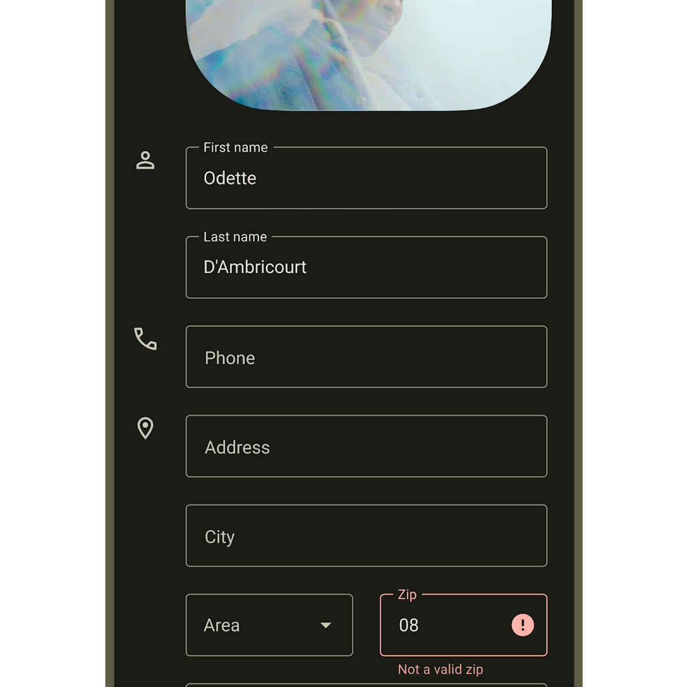
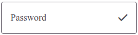
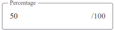
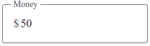
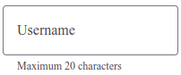
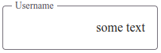
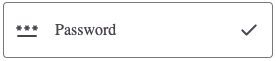
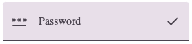

<!-- catalog-only-start -->
<!-- ---
name: Text Fields
dirname: textfield
----->
<!-- catalog-only-end -->

<!-- <catalog-component-header>
<catalog-component-header-title slot="title"> -->

# Text Fields

<!--*
# Document freshness: For more information, see go/fresh-source.
freshness: { owner: '--' reviewed: '--' }
tag: 'docType:reference'
*-->

<!-- go/md-textfield -->

<!-- [TOC] -->

[Text Fields](https://m3.material.io/components/text-fields)<!-- {.external} --> allow users to enter text into a UI. They typically appear in forms and dialogs.

There are two types of text fields: filled and outlined.

</catalog-component-header-title>



</catalog-component-header>

*   [Design article](https://m3.material.io/components/text-fields) <!-- {.external} -->
*   API Documentation (*coming soon*)
*   [Source code](https://github.com/material-components/material-web/tree/main/textfield)
    <!-- {.external} -->

<!-- catalog-only-start -->

<!--

## Interactive Demo



-->

<!-- catalog-only-end -->

## Types

<!-- github-only-start -->


<!-- github-only-end -->
<!-- catalog-only-start -->

<!--
<div class="figure-wrapper">
  <figure
      class="types-image"
      style="justify-content:center;padding-top:8px; padding-bottom:8px;"
      title="Outlined, and Filled text fields"
      aria-label="The 2 types of text fields">
    <style>
      .types-image .wrapper,
      .types-image .wrapper > * {
        display: flex;
        padding: 8px;
        flex-wrap: wrap;
        justify-content: center;
      }
      .types-image .wrapper > * {
        flex-direction: column;
        align-items: center;
        padding-inline: 16px;
      }
      .types-image span {
        display: inline-flex;
        background-color: var(--md-sys-color-inverse-surface);
        color: var(--md-sys-color-inverse-on-surface);
        padding: 8px;
        margin-block-start: 8px;
        width: 24px;
        height: 24px;
        border-radius: 50%;
        justify-content: center;
        align-items: center;
      }
    </style>
    <div class="wrapper">
      <div>
        <md-outlined-text-field label="Outlined Text Field" type="text"></md-outlined-text-field>
        <span>1</span>
      </div>
      <div>
        <md-filled-text-field label="Filled Text Field"></md-filled-text-field>
        <span>2</span>
      </div>
    </div>
  </figure>
</div>

-->

<!-- catalog-only-end -->

1.  [Filled Text Field](#filled-text-field)
2.  [Outlined Text Field](#outlined-text-field)

## Usage

Text Fields are used to collect user input. They typically appear in forms and dialogs.

<!-- github-only-start -->


<!-- github-only-end -->
<!-- catalog-only-start -->

<!--
<div class="figure-wrapper" style="padding:8px;">
  <figure
      style="justify-content:center;gap: 8px; padding-top:8px; padding-bottom:8px;"
      title="Outlined and Filled Text Fields."
      aria-label="An outlined text field with the label 'Username' next to a Filled Text Field with label 'Password'">
    <md-outlined-text-field label='Username'></md-outlined-text-field>
    <md-filled-text-field label='Password'></md-filled-text-field>
  </figure>
</div>

-->

<!-- catalog-only-end -->

```html
<md-outlined-text-field label="Username"></md-outlined-text-field>
<md-filled-text-field label="Password"></md-filled-text-field>
```

### Input types

Text fields support a variety of input types, including text, password, `email`, `number`, `password`, `search`, `tel`, `text`, and `url`. The input type is specified with the `type` attribute.

<!-- catalog-only-start -->

```html
<md-outlined-text-field label="Email" type="email"></md-outlined-text-field>
<md-outlined-text-field label="Number" type="number"></md-outlined-text-field>
<md-outlined-text-field label="Password" type="password"></md-outlined-text-field>
<md-outlined-text-field label="Search" type="search"></md-outlined-text-field>
<md-outlined-text-field label="Telephone" type="tel"></md-outlined-text-field>
<md-outlined-text-field label="Text" type="text"></md-outlined-text-field>
<md-outlined-text-field label="URL" type="url"></md-outlined-text-field>
```


### Leading Icon

A leading icon can be added to a text field to help users understand the type of input expected.

<!-- github-only-start -->


<!-- github-only-end -->
<!-- catalog-only-start -->

<!--

<div class="figure-wrapper">
  <figure
      style="justify-content:center;gap: 8px; padding-top:8px; padding-bottom:8px;"
      title="Outlined Text Field with leading icon."
      aria-label="An outlined text field with a label 'Password' and a leading icon 'password'">
    <md-outlined-text-field label="Password">
      <md-icon slot="leadingicon">password</md-icon>
    </md-outlined-text-field>
  </figure>
</div>

-->

<!-- catalog-only-end -->

```html
<md-outlined-text-field label="Password">
  <md-icon slot="leadingicon">password</md-icon>
</md-outlined-text-field>
```

### Trailing Icon

A trailing icon in a text field can be used to provide additional context or functionality related to the input in the text field. For example, a search icon can be used in a search text field to indicate that the input will be used for searching. It can also be used to provide visual feedback, such as indicating whether the input is valid or invalid.

<!-- github-only-start -->



<!-- github-only-end -->
<!-- catalog-only-start -->

<!--

<div class="figure-wrapper">
  <figure
      style="justify-content:center;gap: 8px; padding-top:8px; padding-bottom:8px;"
      title="Outlined Text Field with trailing icon."
      aria-label="An outlined text field with a label 'Password' and a trailing icon 'check'">
    <md-outlined-text-field label="Password">
      <md-icon slot="trailingicon">check</md-icon>
    </md-outlined-text-field>
  </figure>
</div>

-->

<!-- catalog-only-end -->

```html
<md-outlined-text-field label="Password">
  <md-icon slot="trailingicon">check</md-icon>
</md-outlined-text-field>
```

### Suffix Text

A suffix text in a text field can provide additional context or information related to the input, such as indicating the input's format or maximum length. It can be set using the `suffix-text` attribute.

<!-- github-only-start -->



<!-- github-only-end -->
<!-- catalog-only-start -->

<!--
<div class="figure-wrapper">
  <figure
      style="justify-content:center;gap: 8px; padding-top:8px; padding-bottom:8px;"
      title="Outlined Text Field with supporting text."
      aria-label="An outlined text field with a label 'Percentage' and a suffix text '/100'">
    <md-outlined-text-field label="Percentage" value="50" type="text" suffix-text="/100">
    </md-outlined-text-field>
  </figure>
</div>

-->
<!-- catalog-only-end -->

```html
<md-outlined-text-field label="Percentage" value="50" suffix-text="/100">
</md-outlined-text-field>
```

### Prefix Text

A prefix text in a text field can provide additional context or information related to the input, such as indicating the input's format like currency, etc.. It can be set using the `prefix-text` attribute.

<!-- github-only-start -->



<!-- github-only-end -->
<!-- catalog-only-start -->

<!--

<div class="figure-wrapper">
  <figure
      style="justify-content:center;gap: 8px; padding-top:8px; padding-bottom:8px;"
      title="Outlined and Filled Text Fields."
      aria-label="An outlined text field with a label 'Percentage' and a prefix text '$'">
    <md-outlined-text-field label="Money" value="50" type="text" prefix-text="$">
    </md-outlined-text-field>
  </figure>
</div>

-->

<!-- catalog-only-end -->

```html
<md-outlined-text-field label="Money" value="50" prefix-text="$">
</md-outlined-text-field>
```


### Supporting Text

Supporting text can provide additional information or guidance related to the input, such as instructions or error messages. It can be set using the `suporting-text` attribute.

<!-- github-only-start -->



<!-- github-only-end -->
<!-- catalog-only-start -->

<!--

<div class="figure-wrapper">
  <figure
      style="justify-content:center;gap: 8px; padding-top:8px; padding-bottom:8px;"
      title="Outlined and Filled Text Fields."
      aria-label="An outlined text field with a label 'Username' and a supporting text 'Maximum 20 characters'">
    <md-outlined-text-field label="Username" type="text" supporting-text="Maximum 20 characters">
    </md-outlined-text-field>
  </figure>
</div>

-->

<!-- catalog-only-end -->

```html
<md-outlined-text-field label="Username" type="text" supporting-text="Maximum 20 characters"></md-outlined-text-field>
```

### Error

The text field's `error` attribute can be used to indicate that the input is invalid. When the error attribute is set, the text field will change its appearance to indicate that the input is invalid.

<!-- github-only-start -->


<!-- github-only-end -->
<!-- catalog-only-start -->

<!--

<div class="figure-wrapper">
  <figure
      style="justify-content:center;gap: 8px; padding-top:8px; padding-bottom:8px;"
      title="Outlined Text Field wtih error attribute set."
      aria-label="An outlined text field with a label 'Username' and error attribute set.">
    <md-outlined-text-field label="Username" type="text" error>
    </md-outlined-text-field>
  </figure>
</div>

-->

<!-- catalog-only-end -->

```html
<md-outlined-text-field label="Username" type="text" error></md-outlined-text-field>
```

### Text Direction

The text field's text direction can be set using the `text-direction` attribute..

<!-- github-only-start -->




<!-- github-only-end -->
<!-- catalog-only-start -->

<!--

<div class="figure-wrapper">
  <figure
      style="justify-content:center;gap: 8px; padding-top:8px; padding-bottom:8px;"
      title="Outlined Text Field wtih direction set as rtl."
      aria-label="An outlined text field with a label 'Username' and direction set as rtl.">
    <md-outlined-text-field label="Username" type="text" text-direction="rtl" value="some text">
    </md-outlined-text-field>
  </figure>
</div>

-->

<!-- catalog-only-end -->

```html
<md-outlined-text-field label="Username" type="text" text-direction="rtl"></md-outlined-text-field>
```

## Accessibility

Add an
[`aria-label`](https://developer.mozilla.org/en-US/docs/Web/Accessibility/ARIA/Attributes/aria-label)<!-- {.external} -->
attribute to text fields whose labels need a more descriptive label.

```html
<md-outlined-text-field aria-label="Enter Password" label="Password"></md-outlined-text-field>
```

## Outlined Text Field

<!-- go/md-outlined-text-field -->

[Outlined Text Fields](https://m3.material.io/components/text-fields/guidelines#1206edf3-4472-4c05-90e7-8efe7e409ea2) have less visual emphasis than filled text fields. When they appear in places like forms (where many text fields are placed together) their reduced emphasis helps simplify the layout.

<!-- github-only-start -->



<!-- github-only-end -->
<!-- catalog-only-start -->

<!--

<div class="figure-wrapper">
  <figure
      style="justify-content:center;align-items:center;padding-top:8px; padding-bottom:8px;"
      aria-label="An Outlined Text Field.">
    <md-outlined-text-field label="Password">
    <md-icon slot='trailingicon'>check</md-icon>
    <md-icon slot='leadingicon'>password</md-icon>
    </md-outlined-text-field>
  </figure>
</div>

-->

<!-- catalog-only-end -->

```html
<md-outlined-text-field label="Password">
  <md-icon slot='trailingicon'>check</md-icon>
  <md-icon slot='leadingicon'>password</md-icon>
</md-outlined-text-field>
```

## Filled Text Fields

<!-- go/md-filled-text-field -->

Filled Text Fields (LINK MISSING)<!-- {.external} --> fields have more visual emphasis than outlined text fields, making them stand out when surrounded by other content and components.


<!-- github-only-start -->

<!-- github-only-end -->
<!-- catalog-only-start -->

<!--

<div class="figure-wrapper">
  <figure
      style="justify-content:center;align-items:center;padding-top:8px; padding-bottom:8px;"
      aria-label="A Filled Text Field.">
    <md-filled-text-field label="Password">
      <md-icon slot='trailingicon'>check</md-icon>
      <md-icon slot='leadingicon'>password</md-icon>
    </md-filled-text-field>
  </figure>
</div>

-->

<!-- catalog-only-end -->

```html
<md-filled-text-field label="Password">
  <md-icon slot='trailingicon'>check</md-icon>
  <md-icon slot='leadingicon'>password</md-icon>
</md-filled-text-field>
```

## Theming

Text Fields support [Material theming](../theming.md) and can be customized in terms
of color, typography, and shape.

### Outlined Text Field tokens

| Token                                       | Default value                       |
| ------------------------------------------- | ----------------------------------- |
| `--md-outlined-text-field-container-shape`  | `4px`                               |
| `--md-outlined-text-field-label-text-color` | `--md-sys-color-on-surface-variant` |
| `--md-outlined-text-field-outline-width`    | `1px`                               |

*   [All tokens](https://github.com/material-components/material-web/blob/main/tokens/_md-comp-outlined-text-field.scss)
    <!-- {.external} -->

### Outlined Text Field example

<!-- github-only-start -->


<!-- github-only-end -->
<!-- catalog-only-start -->

<!-- <div class="figure-wrapper">
  <figure
      style="justify-content:center;align-items:center;padding-top:8px; padding-bottom:8px;"
      class="styled-example"
      title="Outlined Text Field theming example."
      aria-label="Image of an Outlined Text Field with a different theme applied">
    <style>
      .styled-example {
        --md-outlined-text-field-container-shape: 16px;
        --md-outlined-text-field-outline-width: 3px;
      }
    </style>
    <md-outlined-text-field supporting-text="Some Supporting Text">
      <md-icon slot='leadingicon'>password</md-icon>
      <p> 
    </md-outlined-text-field>
  </figure>
</div> -->

<!-- catalog-only-end -->

```html
<style>
:root {
  --md-outlined-text-field-container-shape: 16px;
  --md-outlined-text-field-outline-width: 3px;
}
</style>

<md-outlined-text-field supporting-text="Some Supporting Text"></md-outlined-text-field>
```

### Filled Text Field tokens

| Token                                                  | Default value                              |
| ------------------------------------------------------ | ------------------------------------------ |
| `--md-outlined-text-field-container-shape-start-start` | `4px`                                      |
| `--md-outlined-text-field-container-shape-start-end`   | `4px`                                      |
| `--md-outlined-text-field-container-shape-end-start`   | `0px`                                      |
| `--md-outlined-text-field-container-shape-end-end`     | `0px`                                      |
| `--md-outlined-text-field-container-color`             | `--md-sys-color-surface-container-highest` |
| `--md-outlined-text-field-label-text-color`            | `--md-sys-color-on-surface-variant`        |
| `--md-outlined-text-field-outline-width`               | `1px`                                      |
*   [All tokens](https://github.com/material-components/material-web/blob/main/tokens/_md-comp-filled-text-field.scss)
    <!-- {.external} -->

### Filled Text Field example

<!-- github-only-start -->


<!-- github-only-end -->
<!-- catalog-only-start -->

<!--

<div class="figure-wrapper">
  <figure
      style="justify-content:center;align-items:center;padding-top:8px; padding-bottom:8px;"
      class="styled-example"
      title="Filled Text Field theming example."
      aria-label="Image of a Filled Text Field with a different theme applied">
    <style>
      .styled-example {
        --md-filled-text-field-container-shape-start-start: 16px;
        --md-filled-text-field-container-shape-start-end: 16px ;
        --md-filled-text-field-container-color: var(--md-sys-color-secondary-container);
        --md-filled-text-field-label-text-color: var(--md-sys-color-on-secondary-container);
      }
    </style>

    <md-filled-text-field label="Filled"></md-filled-text-field>
  </figure>
</div>

-->

<!-- catalog-only-end -->

```html
<style>
:root {
  --md-filled-text-field-container-shape-start-start: 16px;
  --md-filled-text-field-container-shape-start-end: 16px ;
  --md-filled-text-field-container-color: var(--md-sys-color-secondary-container);
  --md-filled-text-field-label-text-color: var(--md-sys-color-on-secondary-container);
}
</style>

<md-filled-text-field label="Filled"></md-filled-text-field>
```
