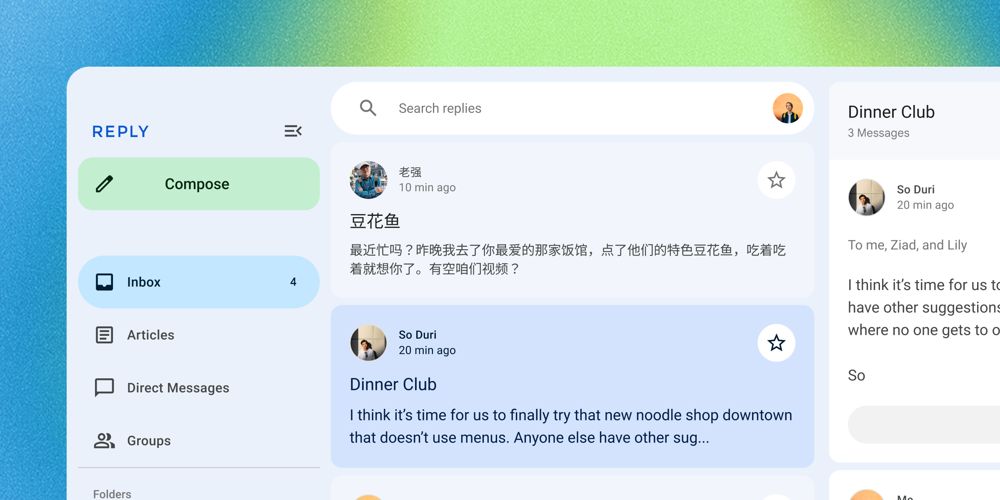

<!-- catalog-only-start --><!-- ---
name: Introduction
title: Introduction
order: 1
-----><!-- catalog-only-end -->

# Intro to Material Web Components

<!-- go/mwc-intro -->

<!--*
# Document freshness: For more information, see go/fresh-source.
freshness: { owner: 'lizmitchell' reviewed: '2023-08-10' }
*-->

Material web, also known as Material Web Components or MWC, is a library of
[web components](https://developer.mozilla.org/en-US/docs/Web/API/Web_components)<!-- {.external} -->
that follows Google's [Material Design](https://material.io/)<!-- {.external} -->
guidelines.

<!-- [TOC] -->

## What is Material?

Material Design is a design system built and supported by Google designers and
developers. Guidelines for building Material apps and components are published
on [material.io](https://material.io)<!-- {.external} -->.

The latest version, Material 3, enables personal, adaptive, and expressive
experiences – from dynamic color and enhanced accessibility, to foundations for
large screen layouts and design tokens.



## What are web components?

[Web components](https://developer.mozilla.org/en-US/docs/Web/API/Web_components)<!-- {.external} -->
are custom HTML elements with encapsulated styles and behavior. They work across
many different frameworks (such as Lit, React, Vue, and Svelte) as well as web
environments (such as Eleventy, Wordpress, and Ruby on Rails).

Many components in
this library are drop-in replacements for browser elements like `<button>` and `<input>`.

```html
<!-- Browser elements -->
<form>
  <label>
    Email
    <input type="email" name="email" required>
  </label>
  <label>
    Subscribe
    <input type="checkbox" name="subscribe">
  </label>

  <button type="reset">Reset</button>
  <button>Submit</button>
</form>

<!-- Material elements -->
<form>
  <md-outlined-text-field label="Email" type="email"
      name="email" required></md-outlined-text-field>
  <label>
    Subscribe
    <md-checkbox name="subscribe"></md-checkbox>
  </label>

  <md-text-button type="reset">Reset</md-text-button>
  <md-outlined-button>Submit</md-outlined-button>
</form>
```

## What are tokens?

[Design tokens](https://m3.material.io/foundations/design-tokens/overview)<!-- {.external} -->
are the building blocks of all UI elements. In MWC, tokens are
[CSS custom properties](https://developer.mozilla.org/en-US/docs/Web/CSS/--*)
that can be used to style components.

```css
:root {
  --md-sys-color-primary: olive;
  --md-sys-color-secondary: tomato;
  --md-ref-typeface-brand: 'Open Sans';
  --md-ref-typeface-plain: system-ui;
}
```

<!--#include file="../googlers/intro-who-should-use-mwc.md" -->
