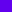

<!--docs:
title: "Theming Guide"
layout: landing
section: docs
path: /docs/theming/
-->

# Theming Guide

## Overview

Material Web Components (MWC) include a theming system designed to make it easy to customize your application's UI by changing 
aspects including typography, color, and component shape. MWC supports theming using CSS Custom Properties.

## Theming with CSS custom properties

MWC supports theming using [CSS custom properties](https://developer.mozilla.org/en-US/docs/Web/CSS/Using_CSS_custom_properties). 
Custom properties are set just like standard CSS properties:

```css
html {
  --mdc-theme-primary: fuchsia;
}
```

In addition to setting custom properties to customize the appearance of MWC components, you can also 
use them to style your own components (or generic HTML elements):

```css
div.myCard {
  background-color: var(--mdc-theme-primary);
}
```

### Custom properties and older browsers

CSS custom properties are supported on most modern browsers. However, if you need to support older browsers,
you'll need to take a few extra steps. (These steps primarily apply to Internet Explorer 11.)

1.  Load the web components polyfills, as described in the [Getting started guide](../README.md#supporting-older-browsers).

2.  Load `CustomStyleInterface` (after loading the web components polyfills):

    ```html
    <script src="@webcomponents/shadycss/custom-style-interface.min.js"></script>
    ```

3.  Identify any top-level style elements that define custom properties. Add
    a class to these style elements so you can easily locate them from script.

    ```html
    <style class="document-style">
    html {
      --mdc-theme-primary: brown;
    }
    </style>
    ```

4.  From script, call `addCustomStyle` for all document level style elements. 

    ```js
    window.ShadyCSS.CustomStyleInterface.addCustomStyle(document.querySelector('style.document-style'));
    ```

    This code assumes a single top-level style element. If you have more than one, you'll need to modify the code.
    See [About CustomStyleInterface](https://github.com/webcomponents/polyfills/tree/master/packages/shadycss#about-customstyleinterface)
    in the Shady CSS README for more examples of using `CustomStyleInterface`.

With these steps, the polyfills provide limited support for CSS custom properties. 
See [Limitations](https://github.com/webcomponents/polyfills/tree/master/packages/shadycss#limitations)
in the ShadyCSS README for details.

## Colors

Material Design theming uses two main colors: **primary** and **secondary**. The primary color is used
throughout most of the application and components as the main color for your application. The secondary color is used
for floating action buttons and other interactive elements, serving as visual contrast to the primary.

In addition to the primary and secondary colors, Material Theming also defines a _background_ color for the app, 
as well as a _surface_ color, which is used as a background in components on top of the app's background.

Finally, Material Theming has a number of text colors, which are used for rendering text and other shapes.

<!-- Add these back in when we include the properties for setting them
- High-emphasis, used for the most important text.
- Medium-emphasis, used for text which is lower in the visual hierarchy.
- Hint, used for text hints (such as those in text fields and labels).
- Disabled, used for text in disabled components and content.
- Icon, used for icons.
-->
- On-surface, used for text that is on top of a surface background.
- On-primary, used for text that is on top of a primary background.
- On-secondary, used for text that is on top of a secondary background.

For information on choosing foreground and background colors, see [Text legibility](https://material.io/design/color/text-legibility.html#text-backgrounds) in the Material Design guidelines.

### Color custom properties

MWC provides a set of custom properties to set the main colors for an application:

| Custom property               | Description                                 | Default |
| ----------------------------- | ------------------------------------------- | ------- |
| `--mdc-theme-primary`         | The theme primary color.                    |  `#6200ee` |
| `--mdc-theme-secondary`       | The theme secondary color.                  |  `#018786` |
| `--mdc-theme-surface`         | The theme surface color.                    |  `#ffffff` |
| `--mdc-theme-background`      | The theme background color.                 |  `#ffffff` |

When you set the main colors, you may need to change the default colors for text and iconography,
making sure the colors have enough contrast to meet the [Web Content Accessibility Guidelines (WCAG)](https://material.io/design/color/text-legibility.html#legibility-standards).

The default colors for text and icons are also controlled by custom properties:

| Custom property                               | Description                                                      | Default |
| --------------------------------------------- | ---------------------------------------------------------------- | ------- |
| `--mdc-theme-on-primary`                      | Text and icons on top of a theme primary color background.       |  `#ffffff`  |
| `--mdc-theme-on-secondary`                    | Text and icons on top of a theme secondary color background.     |  `#ffffff`  |
| `--mdc-theme-on-surface`                      | Text and icons on top of a theme surface color background.       |  `#000000` |

<!-- Add these back in when they are more widely used.

The same pattern is followed for text colors on _background_:

| Custom property                            | Description                                                | Default | 
| ------------------------------------------ | ---------------------------------------------------------- | ------- |
| `--mdc-theme-text-primary-on-background`   | High-emphasis text on top of the theme background color.   | rgba(0,0,0,.87)  |
| `--mdc-theme-text-secondary-on-background` | Medium-emphasis text on top of the theme background color. | rgba(0,0,0,.60)  |
| `--mdc-theme-text-hint-on-background`      | Hint text on top of the theme background color.            | rgba(0,0,0,.60)  |
| `--mdc-theme-text-disabled-on-background`  | Disabled text on top of the theme background color.        | rgba(0,0,0,.38)  |
| `--mdc-theme-text-icon-on-background`      | Icons on top of the theme background color.                | rgba(0,0,0,.60)  |

-->

## Typography

Material Theming defines a hierarchy of type styles, from headlines to body text and captions. 
The default Material Design theme uses the Roboto font for all of these styles.

The easiest way to customize your application is to set a new default font family. If necessary, you
can also set individual properties for each of the named type styles.

See also: [Material Design type system](https://material.io/design/typography/the-type-system.html#)

### Typography custom properties

MWC provides a set of CSS custom properties to define typography for your application. 

The `--mdc-typography-font-family` property sets the default font family for all components.

For more granular control, you can set individual type properties for each of the styles 
used in the type system:

Style | Description
--- | ---
`headline1` | The largest text on the screen, reserved for short, important text or numerals
`headline2` | Headline variant 2
`headline3` | Headline variant 3
`headline4` | Headline variant 4
`headline5` | Headline variant 5
`headline6` | Headline variant 6
`subtitle1` | Smaller than headline, reserved for medium-emphasis text that is shorter in length
`subtitle2` | Subtitle variant 2
`body1` | Used for long-form writing
`body2` | Body variant 2
`caption` | Used sparingly to annotate imagery
`button` | A call to action used by different types of buttons
`overline` | Used sparingly to introduce a headline

For a given style, MWC supports the following custom properties (where `<STYLE>` is one of the style names, above):

CSS custom property | Description
--- | ---
`--mdc-typography-font-family` | The base font-family. 
`--mdc-typography-<STYLE>-font-family` | The font-family for `<STYLE>`. 
`--mdc-typography-<STYLE>-font-size` | The font-size for `<STYLE>`. 
`--mdc-typography-<STYLE>-line-height` | The line-height for `<STYLE>`.  
`--mdc-typography-<STYLE>-font-weight` | The font-weight for `<STYLE>`. 
`--mdc-typography-<STYLE>-letter-spacing` | The letter-spacing for `<STYLE>`. 
`--mdc-typography-<STYLE>-text-decoration` | The text-decoration for `<STYLE>`. 
`--mdc-typography-<STYLE>-text-transform` | The text-transform for `<STYLE>`. 


**Example:** Overriding type properties for a button

To set typography properties for a button, you might use the following CSS:

```css
html {
  --mdc-typography-button-font-size: 16px;
  --mdc-typography-button-text-transform: none;
}
```

**Example:** Overriding the global `font-family` property.

This example shows loading a web font and setting it as the default font for MWC components.

```html
<link href="https://fonts.googleapis.com/css2?family=Arvo&display=swap" rel="stylesheet">

<style>
  html {
    --mdc-typography-font-family: Arvo, serif;
  }
</style>
```

**Example:** Overriding the `font-family` property for `headline1` and `font-family` and `font-size` for `headline2`.


```css
html {
  --mdc-typography-headline1-font-family: Arial, Helvetica, sans-serif;
  --mdc-typography-headline2-font-family: Arial, Helvetica, sans-serif;
  --mdc-typography-headline2-font-size: 3.25rem;
}
```

## Shape

MWC doesn't currently support shape customization.

<!-- 
Material components are all basically rectangular, but allow for some customization of the corner shape. 

By default, components have a rounded corner. The default radius depends on the component's size 
(small, medium, or large).

MWC doesn't support cut corners.

See also: [Material Design shape](https://material.io/design/shape/applying-shape-to-ui.html#).
-->

## Iconography

The [Material icons](https://material.io/resources/icons/) are a set of icons designed to meet the
[Material icon design principles](https://material.io/design/iconography/system-icons.html#). 

The MWC components use the Material icons by default, although you can choose to specify a different 
icon font, or specify SVG icons inline for many components.

To use the Material icons, you need to load the icon font:

```html
<link href="https://fonts.googleapis.com/icon?family=Material+Icons" rel="stylesheet">
```

Most MWC components that can display an icon let you specify an icon by name:

```html
<mwc-button icon="playlist_add">Add To Playlist</mwc-button>
```

To load an alternate icon font:

1.  Load the font (for example, using a `<link>` tag as above).
2.  Set the default icon font:

    ```css
    html {
      --mdc-icon-font: 'My Icons';
    }
    ```
**Example:** Using the outlined variant of Material icons

```html
<link href="https://fonts.googleapis.com/icon?family=Material+Icons+Outlined" rel="stylesheet">
<style>
  html {
    --mdc-icon-font: 'Material Icons Outlined';
  }
</style>
```

## Theming components

In addition to the global theme properties, most MWC components provide a set 
of CSS custom properties to customize their appearance,
such as changing the fill color, ink color, stroke width, and so on.
These properties are documented in each component's API doc
(for example, the [mwc-button API doc](../packages/mdc-button/README.md)).

For example, to change the fill, text, and and outline colors for all of your application's buttons:

```css
mwc-button {
  --mdc-theme-primary: blue;
  --mdc-theme-on-primary: white;
  --mdc-button-outline-color: rgba(20, 20, 200, .2);
}
```

You can also use CSS selectors to override global theme properties or 
component properties for certain components.

```css
mwc-button.action {
  --mdc-theme-primary: red;
}
```
