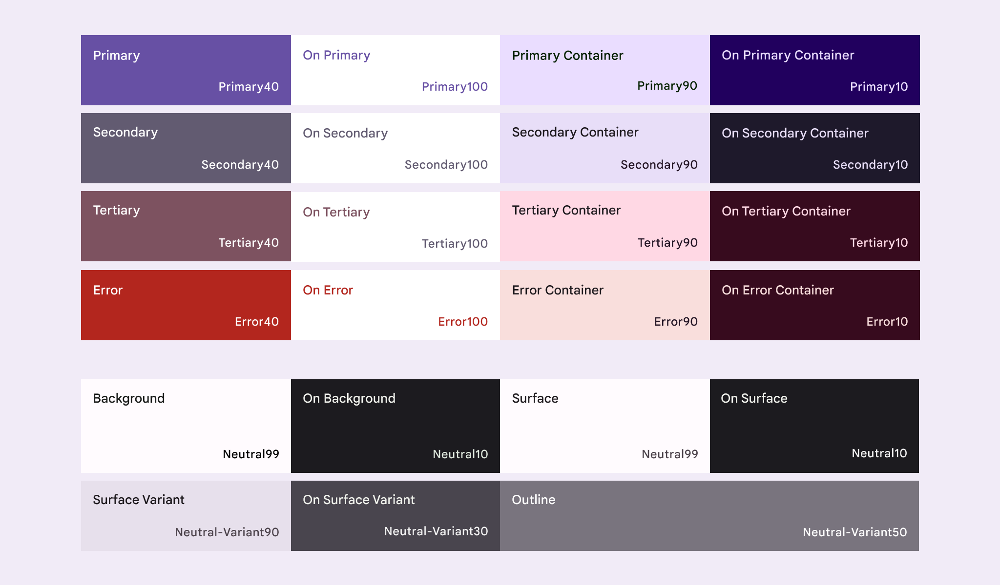

# Theming

<!--*
# Document freshness: For more information, see go/fresh-source.
freshness: { owner: 'lizmitchell' reviewed: '2023-01-23' }
tag: 'docType:concepts'
*-->

<!-- go/mwc/docs/theming -->

<!-- [TOC] -->

Styles are the visual aspects of a UI that give it a distinct look and feel.
They can be customized by changing your Material theme.

## Color scheme

A
[color scheme](https://m3.material.io/styles/color/the-color-system/color-roles#f005bd5b-3b5b-4354-9564-4791399cea67)<!-- {.external} -->
is the group of
[key color tones](https://m3.material.io/styles/color/the-color-system/key-colors-tones#5fdf196d-1e21-4d03-ae63-e802d61ad5ee)<!-- {.external} -->
assigned to specific roles that get mapped to components.




### Tokens

A color scheme can be set using
[CSS custom properties](https://developer.mozilla.org/en-US/docs/Web/CSS/--*)<!-- {.external} -->.

Key color       | Tokens
--------------- | ------------------------------------------
Primary         | `--md-sys-color-primary`
&nbsp;          | `--md-sys-color-on-primary`
&nbsp;          | `--md-sys-color-primary-container`
&nbsp;          | `--md-sys-color-on-primary-container`
Secondary       | `--md-sys-color-secondary`
&nbsp;          | `--md-sys-color-on-secondary`
&nbsp;          | `--md-sys-color-secondary-container`
&nbsp;          | `--md-sys-color-on-secondary-container`
Tertiary        | `--md-sys-color-tertiary`
&nbsp;          | `--md-sys-color-on-tertiary`
&nbsp;          | `--md-sys-color-tertiary-container`
&nbsp;          | `--md-sys-color-on-tertiary-container`
Error           | `--md-sys-color-error`
&nbsp;          | `--md-sys-color-on-error`
&nbsp;          | `--md-sys-color-error-container`
&nbsp;          | `--md-sys-color-on-error-container`
Neutral         | `--md-sys-color-background`
&nbsp;          | `--md-sys-color-on-background`
&nbsp;          | `--md-sys-color-surface`
&nbsp;          | `--md-sys-color-on-surface`
Neutral variant | `--md-sys-color-surface-variant`
&nbsp;          | `--md-sys-color-on-surface-variant`
&nbsp;          | `--md-sys-color-outline`
&nbsp;          | `--md-sys-color-outline-variant`
Inverse         | `--md-sys-color-inverse-surface`
&nbsp;          | `--md-sys-color-on-inverse-surface`
&nbsp;          | `--md-sys-color-inverse-primary`
Elevation       | `--md-sys-color-shadow`
&nbsp;          | `--md-sys-color-surface-tint`
&nbsp;          | `--md-sys-color-surface-container-lowest`
&nbsp;          | `--md-sys-color-surface-container-low`
&nbsp;          | `--md-sys-color-surface-container`
&nbsp;          | `--md-sys-color-surface-container-high`
&nbsp;          | `--md-sys-color-surface-container-highest`
&nbsp;          | `--md-sys-color-surface-dim`
Scrim           | `--md-sys-color-scrim`

### Example

```css
:root {
  --md-sys-color-primary: #006A6A;
  --md-sys-color-primary-container: #6FF7F6;
  --md-sys-color-on-primary: #FFFFFF;
  --md-sys-color-on-primary-container: #002020;
  --md-sys-color-secondary: #4A6363;
  --md-sys-color-secondary-container: #CCE8E7;
  --md-sys-color-on-secondary: #FFFFFF;
  --md-sys-color-on-secondary-container: #051F1F;
  --md-sys-color-tertiary: #4B607C;
  --md-sys-color-tertiary-container: #D3E4FF;
  --md-sys-color-on-tertiary: #FFFFFF;
  --md-sys-color-on-tertiary-container: #041C35;
  --md-sys-color-error: #BA1A1A;
  --md-sys-color-error-container: #FFDAD6;
  --md-sys-color-on-error: #FFFFFF;
  --md-sys-color-on-error-container: #410002;
  --md-sys-color-outline: #6F7979;
  --md-sys-color-background: #FAFDFC;
  --md-sys-color-on-background: #191C1C;
  --md-sys-color-surface: #FAFDFC;
  --md-sys-color-on-surface: #191C1C;
  --md-sys-color-surface-variant: #DAE5E4;
  --md-sys-color-on-surface-variant: #3F4948;
  --md-sys-color-inverse-surface: #2D3131;
  --md-sys-color-inverse-on-surface: #EFF1F0;
  --md-sys-color-inverse-primary: #4CDADA;
  --md-sys-color-shadow: #000000;
  --md-sys-color-surface-tint: #006A6A;
  --md-sys-color-outline-variant: #BEC9C8;
  --md-sys-color-scrim: #000000;
}

.dark {
  --md-sys-color-primary: #4CDADA;
  --md-sys-color-primary-container: #004F4F;
  --md-sys-color-on-primary: #003737;
  --md-sys-color-on-primary-container: #6FF7F6;
  --md-sys-color-secondary: #B0CCCB;
  --md-sys-color-secondary-container: #324B4B;
  --md-sys-color-on-secondary: #1B3534;
  --md-sys-color-on-secondary-container: #CCE8E7;
  --md-sys-color-tertiary: #B3C8E8;
  --md-sys-color-tertiary-container: #334863;
  --md-sys-color-on-tertiary: #1C314B;
  --md-sys-color-on-tertiary-container: #D3E4FF;
  --md-sys-color-error: #FFB4AB;
  --md-sys-color-error-container: #93000A;
  --md-sys-color-on-error: #690005;
  --md-sys-color-on-error-container: #FFDAD6;
  --md-sys-color-outline: #889392;
  --md-sys-color-background: #191C1C;
  --md-sys-color-on-background: #E0E3E2;
  --md-sys-color-surface: #191C1C;
  --md-sys-color-on-surface: #E0E3E2;
  --md-sys-color-surface-variant: #3F4948;
  --md-sys-color-on-surface-variant: #BEC9C8;
  --md-sys-color-inverse-surface: #E0E3E2;
  --md-sys-color-inverse-on-surface: #191C1C;
  --md-sys-color-inverse-primary: #006A6A;
  --md-sys-color-shadow: #000000;
  --md-sys-color-surface-tint: #4CDADA;
  --md-sys-color-outline-variant: #3F4948;
  --md-sys-color-scrim: #000000;
}
```
