# `<mwc-button>` [](https://www.npmjs.com/package/@material/mwc-button)

> IMPORTANT: The Material Web Components are a work in progress and subject to
> major changes until 1.0 release.

Buttons allow users to take actions, and make choices, with a single tap.

[Material Design Guidelines: Button](https://material.io/design/components/buttons.html)

[Demo](https://material-components.github.io/material-components-web-components/demos/button/)

## Installation

```sh
npm install @material/mwc-button
```

> NOTE: The Material Web Components are distributed as ES2017 JavaScript
> Modules, and use the Custom Elements API. They are compatible with all modern
> browsers including Chrome, Firefox, Safari, Edge, and IE11, but an additional
> tooling step is required to resolve *bare module specifiers*, as well as
> transpilation and polyfills for IE11. See
> [here](https://github.com/material-components/material-components-web-components#quick-start)
> for detailed instructions.

## Example Usage

### Standard

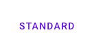
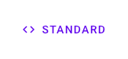

```html
<mwc-button label="standard"></mwc-button>
<mwc-button label="standard" icon="code"></mwc-button>
```

### Outlined

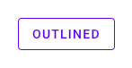
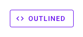

```html
<mwc-button outlined label="outlined"></mwc-button>
<mwc-button outlined label="outlined" icon="code"></mwc-button>
```

### Raised

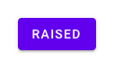
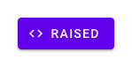

```html
<mwc-button raised label="raised"></mwc-button>
<mwc-button raised label="raised" icon="code"></mwc-button>
```

### Unelevated

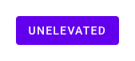
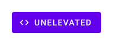

```html
<mwc-button unelevated label="unelevated"></mwc-button>
<mwc-button unelevated label="unelevated" icon="code"></mwc-button>
```

### Dense

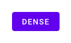
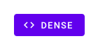

```html
<mwc-button dense unelevated label="dense"></mwc-button>
<mwc-button dense unelevated label="dense" icon="code"></mwc-button>
```

### Trailing Icon

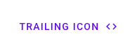

```html
<mwc-button label="trailing icon" icon="code" trailingIcon></mwc-button>
```

### Disabled

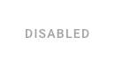
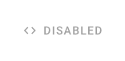

```html
<mwc-button disabled label="disabled"></mwc-button>
<mwc-button disabled label="disabled" icon="code"></mwc-button>
```

### Customize Colors


```css
mwc-button {
  --mdc-theme-primary: #e9437a;
  --mdc-theme-on-primary: white;
}
```

## API

### Slots
| Name           | Description
| -------------- | -----------
| `icon`         | Leading icon. Overrides `icon` property. Use `label` or the `icon` property to set the `aria-label`.
| `trailingIcon` | Icon to show _after_ the label. Overrides `trailingIcon` property. Use `label` or the `trailingIcon` property to set the `aria-label`.
| _default_      | Default content to display between both icons and after label. __NOTE:__ It is highly recommended to set the `label` property instead of projecting text as it will also set the `aria-label`

### Properties/Attributes
| Name | Type | Default | Description
| ---- | ---- | ------- | -----------
| `icon` | `string` | `''` | Icon to display, and `aria-label` value when `label` is not defined.
| `label` | `string` | `''` | Label to display for the button, and `aria-label`.
| `raised` | `boolean` | `false` | Creates a contained button that is elevated above the surface.
| `unelevated` | `boolean` | `false` | Creates a contained button that is flush with the surface.
| `outlined` | `boolean` | `false` | Creates an outlined button that is flush with the surface.
| `dense` | `boolean` | `false` | Makes the button text and container slightly smaller.
| `disabled` | `boolean` | `false` | Disabled buttons cannot be interacted with and have no visual interaction effect.
| `trailingIcon` | `boolean` | `false` | When `true`, `icon` will be displayed _after_ `label`.

### Methods
*None*

### Events
*None*

### CSS Custom Properties

| Name | Default | Description
| ------------------------------------- | -------------------------------------------------- | ---
| `--mdc-button-horizontal-padding`     | filled: `16px` outlined: `15px` default: `8px`     | Left and right padding of the button label (for outlined buttons the outline width is automatically subtracted).
| `--mdc-button-outline-width`          | `1px`                                              | `width` of the outline of an outlined button and attempts to keep the component size constant.
| `--mdc-button-outline-color`          | 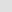 | Color of the outline of an outlined element.
| `--mdc-button-disabled-fill-color`    |  `rgba(0,0,0,0.12)`  | Background fill color of a disabled raised or unelevated button.
| `--mdc-button-disabled-ink-color`     |  `rgba(0,0,0,0.37)`  | Text color of a disabled button as well as the outline color of a disabled outlined button.
| `--mdc-button-disabled-outline-color` |  | Sets the color of the outline of a disabled outlined button.
| `--mdc-button-raised-box-shadow`          | mdc elevation 2 | Sets the box shadow of the raised button.
| `--mdc-button-raised-box-shadow-hover`    | mdc elevation 4 | Sets the box shadow of the raised button when focused or hovered.
| `--mdc-button-raised-box-shadow-active`   | mdc elevation 8 | Sets the box shadow of the raised button when active.
| `--mdc-button-raised-box-shadow-disabled` | mdc elevation 0 | Sets the box shadow of the raised button when disabled.

#### Global Custom Properties

This component exposes the following global [theming](https://github.com/material-components/material-components-web-components/blob/master/docs/theming.md)
custom properties.

| Name                                 | Description
| ------------------------------------ | -----------
| `--mdc-theme-primary`                | Color of a flat or outlined button. Background color of a raised button.
| `--mdc-theme-on-primary`             | Text color of a raised button.
| `--mdc-icon-font`                    | Font to use for the icon.
| `--mdc-typography-button-<PROPERTY>` | Styles the typography of the button label.

#### Elevation values

| Elevation Level | CSS Value
| --- | ---
| `2` | `0px 3px 1px -2px rgba(0, 0, 0, 0.2), 0px 2px 2px 0px rgba(0, 0, 0, 0.14), 0px 1px 5px 0px rgba(0, 0, 0, 0.12)`
| `4` | `0px 2px 4px -1px rgba(0, 0, 0, 0.2), 0px 4px 5px 0px rgba(0, 0, 0, 0.14), 0px 1px 10px 0px rgba(0, 0, 0, 0.12)`
| `8` | `0px 5px 5px -3px rgba(0, 0, 0, 0.2), 0px 8px 10px 1px rgba(0, 0, 0, 0.14), 0px 3px 14px 2px rgba(0, 0, 0, 0.12)`
| `0` | `0px 0px 0px 0px rgba(0, 0, 0, 0.2), 0px 0px 0px 0px rgba(0, 0, 0, 0.14), 0px 0px 0px 0px rgba(0, 0, 0, 0.12)`

## Additional references

- [MDC Web: Button](https://material.io/develop/web/components/buttons/)
