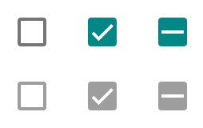
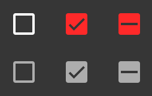
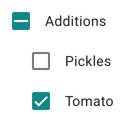

# `<mwc-checkbox>` [](https://www.npmjs.com/package/@material/mwc-checkbox)
> IMPORTANT: The Material Web Components are a work in progress and subject to
> major changes until 1.0 release.

Checkboxes allow the user to select one or more items from a set. Checkboxes can
be used to turn an option on or off.

[Material Design Guidelines: Checkboxes](https://material.io/components/selection-controls/#checkboxes)

[Demo](https://material-components.github.io/material-components-web-components/demos/checkbox/)


## Installation

```sh
npm install @material/mwc-checkbox
```

> NOTE: The Material Web Components are distributed as ES2017 JavaScript
> Modules, and use the Custom Elements API. They are compatible with all modern
> browsers including Chrome, Firefox, Safari, Edge, and IE11, but an additional
> tooling step is required to resolve *bare module specifiers*, as well as
> transpilation and polyfills for IE11. See
> [here](https://github.com/material-components/material-components-web-components#quick-start)
> for detailed instructions.

## Example usage

### Standard


```html
<mwc-checkbox checked></mwc-checkbox>

<script type="module">
  import '@material/mwc-checkbox';

  const checkbox = document.body.querySelector('mwc-checkbox')
  checkbox.addEventListener('change', () => {
    console.log(`checkbox changed to ${checkbox.checked}`);
  });
</script>
```

### Standard, disabled



```html
<div>
  <mwc-checkbox></mwc-checkbox>
  <mwc-checkbox checked></mwc-checkbox>
  <mwc-checkbox indeterminate></mwc-checkbox>
</div>

<div>
  <mwc-checkbox disabled></mwc-checkbox>
  <mwc-checkbox disabled checked></mwc-checkbox>
  <mwc-checkbox disabled indeterminate></mwc-checkbox>
</div>
```

### Styled standard, disabled



```html
<style>
  body {
    background-color: #363636;

    --mdc-theme-secondary: #ff2929;
    --mdc-checkbox-unchecked-color: white;
    /* Required for unchecked focus ripple */
    --mdc-theme-on-surface: white;
    --mdc-checkbox-disabled-color: #adadad;
    --mdc-checkbox-mark-color: #363636;
  }
</style>

<div>
  <mwc-checkbox></mwc-checkbox>
  <mwc-checkbox checked></mwc-checkbox>
  <mwc-checkbox indeterminate></mwc-checkbox>
</div>

<div>
  <mwc-checkbox disabled></mwc-checkbox>
  <mwc-checkbox disabled checked></mwc-checkbox>
  <mwc-checkbox disabled indeterminate></mwc-checkbox>
</div>
```

### With Form Field

Most applications should use
[`<mwc-formfield>`](https://github.com/material-components/material-components-web-components/tree/master/packages/formfield)
to associate an interactive label with the checkbox.



```html
<style>
  mwc-formfield {
    display: block;
  }
  .child {
    margin-left: 20px;
  }
</style>

<mwc-formfield label="Additions">
  <mwc-checkbox indeterminate></mwc-checkbox>
</mwc-formfield>

<mwc-formfield label="Pickles">
  <mwc-checkbox class="child"></mwc-checkbox>
</mwc-formfield>

<mwc-formfield label="Tomato">
  <mwc-checkbox class="child" checked></mwc-checkbox>
</mwc-formfield>

<script type="module">
  import '@material/mwc-checkbox';
  import '@material/mwc-formfield';
</script>
```

## API

### Properties/Attributes

Name            | Type      | Default | Description
-------------------- | --------- | ------- | -----------
`checked`            | `boolean` | `false` | Whether the checkbox is checked.
`indeterminate`      | `boolean` | `false` | When a checkbox is the parent of a set of child checkboxes, the *indeterminate* state is used on the parent to indicate that some but not all of its children are checked.
`disabled`           | `boolean` | `false` | When `true`, the checkbox cannot be interacted with, and renders in muted colors.
`value`              | `string`  | `''`    | The value that will be included if the checkbox is submitted in a form.
`reducedTouchTarget` | `boolean` | `false` | When `true`, the checkbox remove padding for touchscreens and increase density. Note, the checkbox will no longer meet accessibility guidelines for touch.


### Methods

*None*

### Events

| Event Name | Target         | Detail | Description
| ---------- | -------------- | ------ | -----------
| `change`   | `mwc-checkbox` | `{}`   | Fired when the user modifies the checkbox `checked` or `indeterminate` states from an input device interaction. Note that, like [native `<input>`](https://developer.mozilla.org/en-US/docs/Web/API/HTMLElement/change_event), the `change` event is *not* fired when the `checked` or `indeterminate` properties are set from JavaScript.

### CSS Custom Properties


| Name                    | Default   | Description                         |
| ----------------------- | --------- | ----------------------------------- |
| `--mdc-theme-secondary` |  `#018786` | Background color when the checkbox is `checked` or `indeterminate`, and the base color of the ripple effect and focus halo.
| `--mdc-theme-on-surface` |  `#000` | Color of the unchecked focus ripple.
| `--mdc-checkbox-mark-color` |  `#fff` | Color of mark inside a `checked` or `indeterminate` checkbox (enabled or disabled).
| `--mdc-checkbox-unchecked-color` |  `rgba(0, 0, 0, 0.54)` | Color of the unchecked box.
| `--mdc-checkbox-disabled-color` |  `rgba(0, 0, 0, 0.38)` | Color of the checkbox box and fill when disabled.


## Additional references

-   [MDC Web Checkboxes](https://material.io/develop/web/components/input-controls/checkboxes/)
