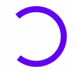
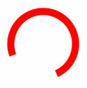

# `<mwc-circular-progress>` [](https://www.npmjs.com/package/@material/mwc-circular-progress)
> IMPORTANT: The Material Web Components are a work in progress and subject to
> major changes until 1.0 release.

Progress indicators express an unspecified wait time or display the length of a
process.


[Material Design Guidelines: Progress Indicators](https://material.io/components/progress-indicators/#circular-progress-indicators)

[Demo](https://material-components.github.io/material-components-web-components/demos/circular-progress/)

## Example usage

### Determinate


```html
<script type="module">
  import '@material/mwc-circular-progress';
</script>
<mwc-circular-progress progress="0.7"></mwc-circular-progress>
```

### Indeterminate



```html
<mwc-circular-progress indeterminate></mwc-circular-progress>
```

### Styled



```html
<style>
  mwc-circular-progress {
    --mdc-theme-primary: red;
  }
</style>
<mwc-circular-progress indeterminate></mwc-circular-progress>
```

## API

### Slots

None

### Properties/Attributes

| Name            | Type      | Default | Description
| --------------- | --------- | ------- | -----------
| `indeterminate` | `boolean` | `false` | Sets the circular-progress into its indeterminate state.
| `progress`      | `number`  | `0`     | Sets the progress bar's value. Value should be between [0, 1].
| `density`       | `number`  | `0`     | Sets the progress indicator's sizing based on density scale. Minimum value is `-8`. Each unit change in density scale corresponds to 4px change in side dimensions. The stroke width adjusts automatically.
| `closed`        | `boolean` | `false` | Sets the progress indicator to the closed state. Sets content opacity to 0. Typically should be set to true when loading has finished.

### Methods

Name              | Description
----------------- | ------------------------------------------
`open() => void`  | Sets `CircularProgress.closed` to `false`;
`close() => void` | Sets `CircularProgress.closed` to `true`;

### Events

None

### CSS Custom Properties

Name                  | Default                                                  | Description
--------------------- | -------------------------------------------------------- | -----------
`--mdc-theme-primary` |  `#6200EE` | Sets the color of primary progress bar.
