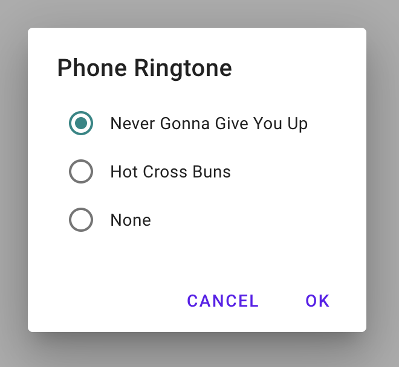
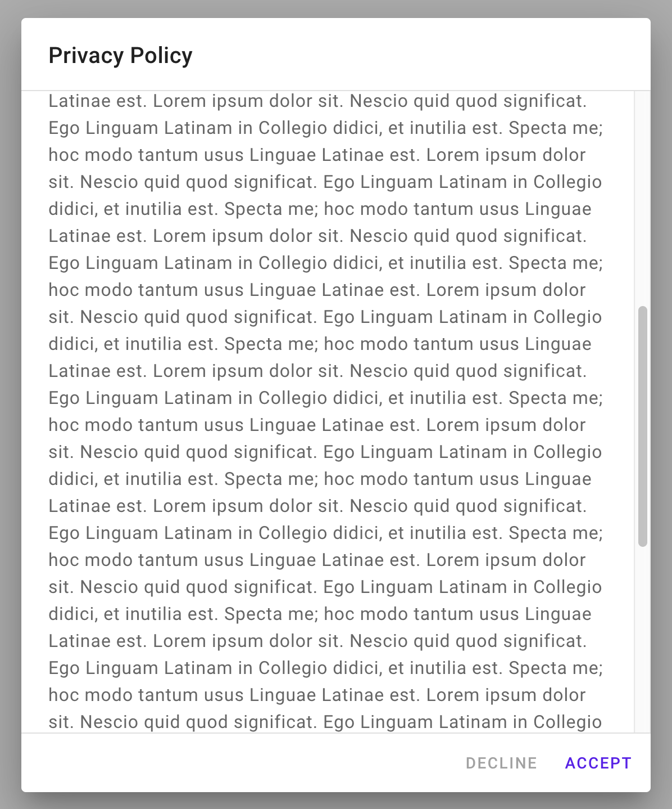
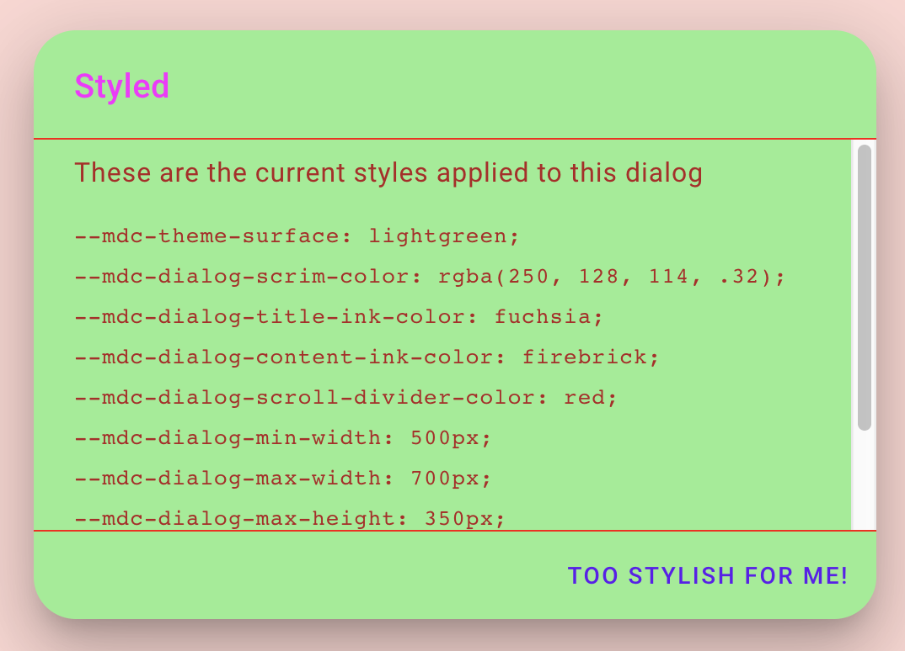
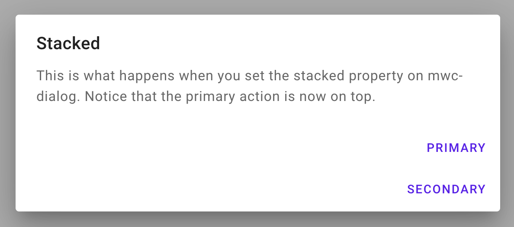
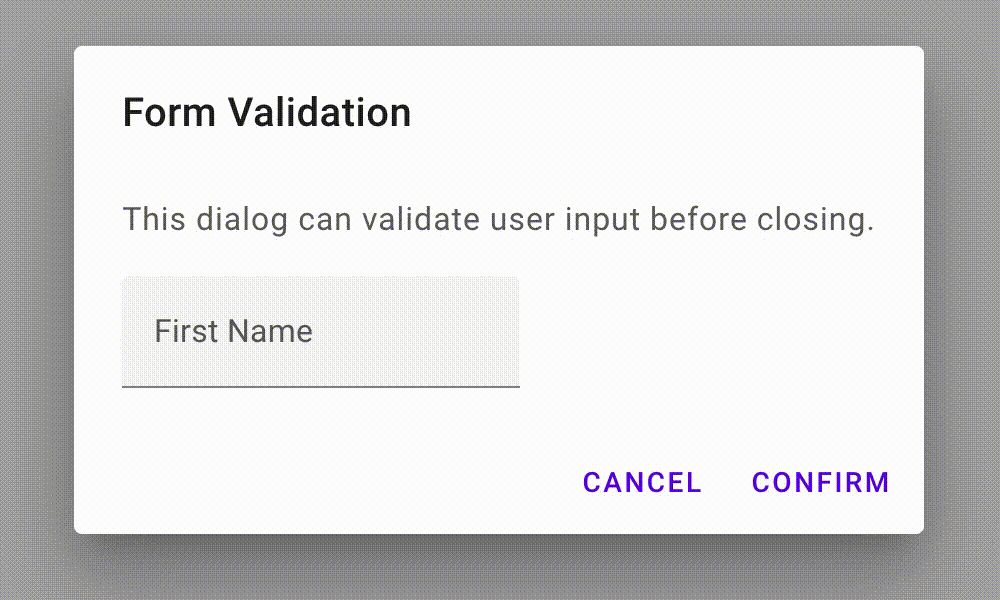
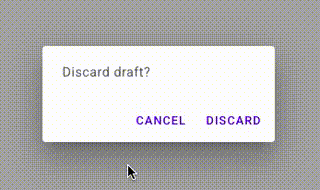
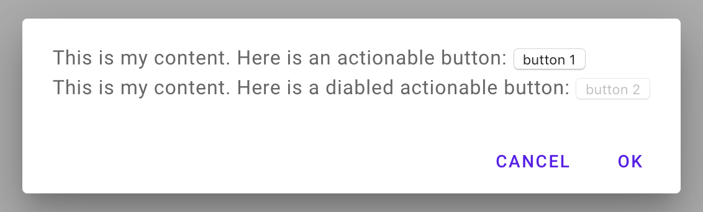
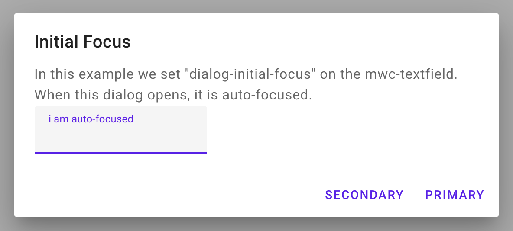

# `<mwc-dialog>` [](https://www.npmjs.com/package/@material/mwc-dialog)
> IMPORTANT: The Material Web Components are a work in progress and subject to
> major changes until 1.0 release.

Dialogs inform users about a task and can contain critical information, require
decisions, or involve multiple tasks.


[Material Design Guidelines: dialogs](https://material.io/design/components/dialogs.html)

[Demo](https://material-components.github.io/material-web/demos/dialog/)

## Installation

```sh
npm install @material/mwc-dialog
```

> NOTE: The Material Web Components are distributed as ES2017 JavaScript
> Modules, and use the Custom Elements API. They are compatible with all modern
> browsers including Chrome, Firefox, Safari, Edge, and IE11, but an additional
> tooling step is required to resolve *bare module specifiers*, as well as
> transpilation and polyfills for IE11. See
> [here](https://github.com/material-components/material-components-web-components#quick-start)
> for detailed instructions.

## Example usage

<!-- TODO(emarquez): reenable simple example when we get mwc-list -->

<!-- ### Simple


```html
<mwc-dialog
    heading="Simple Dialog"
    open
    hideActions>
  <ul>
    <li dialogAction="item1">Item 1</li>
    <li dialogAction="item2">Item 2</li>
    <li dialogAction="item3">Item 3</li>
    <li dialogAction="item4">Item 4</li>
  </ul>
</mwc-dialog>

<script type="module">
  import '@material/mwc-dialog';
</script>

<style>
  /* styling for the list */
  ul {
    list-style-type: none;
    padding: 0;
    margin: 0;
  }
  li {
    padding: 20px 16px 20px 16px;
    border-bottom: 1px solid rgba(0, 0, 0, .5);
  }
  li:last-child {
    border-bottom: none;
  }
  li:hover, li:focus {
    background-color: rgba(128, 128, 128, .25);
    cursor: pointer;
  }
</style>
``` -->

### Alert


```html
<mwc-dialog open>
  <div>Discard draft?</div>
  <mwc-button
      slot="primaryAction"
      dialogAction="discard">
    Discard
  </mwc-button>
  <mwc-button
      slot="secondaryAction"
      dialogAction="cancel">
    Cancel
  </mwc-button>
</mwc-dialog>
```

### Confirmation



```html
<style>
  mwc-dialog div {
    flex-direction: column;
  }
  mwc-dialog div, mwc-radio {
    display: flex;
  }
</style>

<mwc-dialog heading="Phone Ringtone" open>
  <div>
    <mwc-formfield label="Never Gonna Give You Up">
      <mwc-radio id="a1" name="a" checked></mwc-radio>
    </mwc-formfield>
    <mwc-formfield label="Hot Cross Buns">
      <mwc-radio name="a"></mwc-radio>
    </mwc-formfield>
    <mwc-formfield label="None">
      <mwc-radio name="a"></mwc-radio>
    </mwc-formfield>
  </div>
  <mwc-button
      dialogAction="ok"
      slot="primaryAction">
    ok
  </mwc-button>
  <mwc-button
      dialogAction="cancel"
      slot="secondaryAction">
    cancel
  </mwc-button>
</mwc-dialog>

<script type="module">
  import '@material/mwc-dialog';
  import '@material/mwc-button/mwc-button';
  import '@material/mwc-radio/mwc-radio';
  import '@material/mwc-formfield/mwc-formfield';
</script>
```

### Scrollable



```html
<mwc-dialog heading="Privacy Policy" open>
<div>
  really large amount of text...
</div>
<mwc-button
    slot="primaryAction"
    dialogAction="accept">
  Accept
</mwc-button>
<mwc-button
    slot="secondaryAction"
    dialogAction="decline"
    disabled>
  Decline
</mwc-button>
</mwc-dialog>
```

### Styled



```html
<style>
  .styled {
    --mdc-shape-medium: 0px;

    /* color buttons */
    --mdc-theme-primary: #344955;
  }
</style>

<mwc-dialog heading="Styled" class="styled" open>
    <div>
      In this dialog we have changed the button color and removed the border
      radius.
    </div>
  <mwc-button slot="primaryAction" dialogAction="close">
    This button is bluish!
  </mwc-button>
</mwc-dialog>
```

### Stacked



```html
<mwc-dialog heading="Stacked" stacked>
  <div>
    This is what happens when you set the stacked property on mwc-dialog.
    Notice that the primary action is now on top.
  </div>
  <mwc-button slot="primaryAction" dialogAction="close">
    Primary
  </mwc-button>
  <mwc-button slot="secondaryAction" dialogAction="close">
    Secondary
  </mwc-button>
</mwc-dialog>
```

### Form Validation



```html
<mwc-dialog id="dialog" heading="Form Validation">
  <p>This dialog can validate user input before closing.</p>
  <mwc-textfield
    id="text-field"
    minlength="3"
    maxlength="64"
    placeholder="First name"
    required>
  </mwc-textfield>
  <mwc-button
    id="primary-action-button"
    slot="primaryAction">
    Confirm
  </mwc-button>
  <mwc-button
    slot="secondaryAction"
    dialogAction="close">
    Cancel
  </mwc-button>
</mwc-dialog>
<script>
  const dialog = document.querySelector('#dialog');
  const textField = document.querySelector('#text-field');
  const primaryButton = document.querySelector('#primary-action-button');

  primaryButton.addEventListener('click', () => {
    // validate, possible asynchronous such as a server response
    const isValid = textField.checkValidity();
    if (isValid) {
      dialog.close();
      return;
    }

    textField.reportValidity();
  });
</script>
```

### Prevent Scrim Clicks



```html
<mwc-dialog scrimClickAction="">
  <div>
    This will prevent a click outside of the dialog from closing the dialog.
  </div>
  <mwc-button slot="primaryAction" dialogAction="close">
    Discard
  </mwc-button>
  <mwc-button slot="secondaryAction" dialogAction="close">
    Cancel
  </mwc-button>
</mwc-dialog>
```

### Prevent Escape Key Action

You can prevent the default escape key action from closing the dialog by setting
the `escapeKeyAction` attribute to an empty string `""`.

```html
<mwc-dialog escapeKeyAction="">
  <div>
    This will prevent the escape key from closing the dialog.
  </div>
  <mwc-button slot="primaryAction" dialogAction="close">
    Primary
  </mwc-button>
  <mwc-button slot="secondaryAction" dialogAction="close">
    Secondary
  </mwc-button>
</mwc-dialog>
```

## API

### Slots

Name              | Description
----------------- | ------------------------------------------------------------
_default_         | Primary content area. May contain a list, a form, or prose.
`primaryAction`   | Footer area containing the dialog's primary action button.
`secondaryAction` | Footer area containing the dialog's secondary action button.

### Properties/Attributes

| Name                    | Type      | Description
| ----------------------- | --------- |------------
| `open`                  | `boolean` | Whether the dialog should open.
| `hideActions`           | `boolean` | Hides the actions footer of the dialog. Needed to remove excess padding when no actions are slotted in.
| `stacked`               | `boolean` | Whether to stack the action buttons.
| `heading`               | `string`  | Heading text of the dialog.
| `scrimClickAction`      | `string`  | _Default: 'close'_ – Action to be emitted with the `closing` and `closed` events when the dialog closes because the scrim was clicked (see [actions section](#actions)). Setting this attribute to an empty string `""` will prevent clicks outside the dialog from closing the dialog.
| `escapeKeyAction`       | `string`  | _Default: 'close'_ – Action to be emitted with the `closing` and `closed` events when the dialog closes because the escape key was pressed (see [actions section](#actions)). Setting this attribute to an empty string `""` will prevent the escape key from  closing the dialog.
| `defaultAction`         | `string`  | _Default: 'close'_ – Action to be emitted with the `closing` and `closed` events when `<mwc-dialog>.open` is toggled (see [actions section](#actions)).
| `actionAttribute`       | `string`  | _Default: 'dialogAction'_ – Attribute to read in light dom of dialog for closing action value (see [actions section](#actions)).
| `initialFocusAttribute` | `string`  | _Default: 'dialogInitialFocus'_ – Attribute to search for in light dom for initial focus on dialog open.

### Methods

| Name     | Description
| -------- | -------------
| `forceLayout() => void` | Forces dialog to relayout (animation frame time). May be required if dialog size is incorrect or if stacked layout has not been triggered correctly.
| `focus() => void` | Focuses on the initial focus element if defined (see [focus section](#focus)).
| `blur() => void`  | Blurs the active element.
| `show() => void`  | Opens the dialog.
| `close() => void` | Closes the dialog.

### Listeners
| Event Name          | Target       | Description
| ------------------- | ------------ | -----------
| `click`             | root element | Detects if clicked target is a dialog action.
| `resize`            | `window `    | Performs dialog layout (passive).
| `orientationchange` | `window`     | Performs dialog layout (passive).
| `keydown`           | `mwc-dialog` | Listens for the enter key to click the default button (passive).
| `keydown`           | `document`   | Listens for the escape key to close the dialog (see [`escapeKeyAction`](#properties)).

### Events

| Event Name | Target       | Detail             | Description
| ---------- | ------------ | ------------------ | -----------
| `opening`  | `mwc-dialog` | `{}`               | Fired when the dialog is beginning to open.
| `opened`   | `mwc-dialog` | `{}`               | Fired once the dialog is finished opening (after animation).
| `closing`  | `mwc-dialog` | `{action: string}` | Fired when the dialog is is beginning to close. Detail is the action that closed the dialog (see [actions section](#actions)).
| `closed`   | `mwc-dialog` | `{action: string}` | Fired once the dialog is finished closing (after animation). Detail is the action that closed the dialog (see [actions section](#actions)).

### CSS Custom Properties

Name                                | Default                                                     | Description
----------------------------------- | ----------------------------------------------------------- | -----------
`--mdc-dialog-scrim-color`          |  `rgba(0, 0, 0, 0.32)` | Color of the scrim. (**Note:** setting alpha to 0 will still make scrim clickable but transparent).
`--mdc-dialog-heading-ink-color`    |  `rgba(0, 0, 0, 0.87)` | Color of the heading text.
`--mdc-dialog-content-ink-color`    |  `rgba(0, 0, 0, 0.6)`   | Color applied to the projected content. (**Note:** it may also be possible to style the content via the light DOM since it is not encapsulated in a shadow root).
`--mdc-dialog-scroll-divider-color` |  `rgba(0, 0, 0, 0.12)` | Color of the dividers present when dialog is scrollable.
`--mdc-dialog-min-width`            | `280px`                                                     | min-width ofthe dialog surface.
`--mdc-dialog-max-width`            | `560px`                                                     | max-width of the dialog surface. (**Note:** if max-width is < `560px`, there is a visual jank bug that will occur causing the max width to be `560px` when the window is sized to <= than `560px`).
`--mdc-dialog-max-height`           | `calc(100% - 32px)`                                         | Max height of the dialog surface.
`--mdc-dialog-box-shadow`           | mdc elevation 24                                            | Sets the box shadow of the dialog.
`--mdc-dialog-z-index`              | `7`                                                         | Sets the `z-index` of the dialog and scrim.

#### Elevation values

| Elevation Level | CSS Value
| --------------- | ---------
`24`              | `0px 11px 15px -7px rgba(0, 0, 0, 0.2), 0px 24px 38px 3px rgba(0, 0, 0, 0.14), 0px 9px 46px 8px rgba(0, 0, 0, 0.12)`

#### Global Custom Properties

This component exposes the following global
[theming](https://github.com/material-components/material-components-web-components/blob/master/docs/theming.md)
custom properties.

| Name                                     | Description
| ---------------------------------------- | -----------
| `--mdc-theme-surface`                    | Color of the dialog surface's background.
| `--mdc-shape-medium`                     | Corner radius of the dialog surface.
| `--mdc-typography-body1-<PROPERTY>`      | Styles the typography of the dialog's text.
| `--mdc-typography-headline6-<PROPERTY>`  | Styles the typography of the action buttons.

### Actions

Actions close the dialog on click. You can define an action by slotting an
element with the `dialogAction="..."` string attribute. The name of the
attribute can be customized by the
[`actionAttribute` property](#propertiesattributes). When a clickable element
with the `dialogAction` attribute is clicked, `mwc-dialog` will get the value of
the attribute and fire the `closing` and subsequent `closed` events with a
detail of `{action: <clickedElement.getAttribute('dialogAction')>}`.

For example:



```html
<mwc-dialog open>
  <div>
    <div>
      This is my content. Here is an actionable button:
      <button dialogAction="contentButton">button 1</button>
    </div>
    <div>
      This is my content. Here is a diabled actionable button:
      <button disabled dialogAction="disabledContentButton">button 2</button>
    </div>
  </div>
  <mwc-button slot="primaryAction" dialogAction="ok">ok</mwc-button>
  <mwc-button slot="secondaryAction">cancel</mwc-button>
</mwc-dialog>
```

In this example we have 3 actionable elements: `html <button
dialogAction="contentButton">button 1</button>`

```html
<button disabled dialogAction="disabledContentButton">button 2</button>
```

```html
<mwc-button slot="primaryAction" dialogAction="ok">ok</mwc-button>
```

*   Clicking button 1 will close the dialog and fire a `closing` and
    subsequently a `closed` event with a detail of `{action: 'contentButton'}`.
*   Clicking button 2 will not close the dialog since it is disabled
*   Clicking the cancel `mwc-button` will not close the dialog as it does not
    have a `dialogAction` attribute set on it.
*   Clicking the ok `mwc-button` will close the dialog and fire a `closing` and
    subsequently a `closed` event with a detail of `{action: 'ok'}`.
*   Setting `document.querySelector('mwc-dialog').open = false;` will close the
    dialog and fire a `closing` and subsequently a `closed` event with a detail
    of `{action: 'close'}` (action is configurable via
    [`defaultAction` property](#propertiesattributes)).

### Focus

Initial focus can be set on an element with the `dialogInitialFocus` boolean
attribute (configurable via the
[`initialFocusAttribute` property](#propertiesattributes)).

For example:



```html
<mwc-dialog heading="Initial Focus" open>
  <div>
    In this example we set "dialogInitialFocus" on the mwc-textfield.
    When this dialog opens, it is auto-focused.
  </div>
  <mwc-textfield
      label="i am auto-focused"
      dialogInitialFocus>
  </mwc-textfield>
  <mwc-button slot="primaryAction" dialogAction="close">
    Primary
  </mwc-button>
  <mwc-button slot="secondaryAction" dialogAction="close">
    Secondary
  </mwc-button>
</mwc-dialog>
```

In this example we set `dialogInitialFocus` on the `mwc-textfield`, so
`mwc-textfield.focus()` will be called on the button. This attribute can also be
set on anything in the light DOM of `mwc-dialog` or the light dom of the
flattened, distributed nodes including the primary and secondary actions. Only
one element designated with this attribute will be focused.

Calling `focus()` on the `mwc-dialog` itself will call `focus()` on any
`dialogInitialFocus` element in the light DOM of `mwc-dialog`.

Calling `blur()` on the `mwc-dialog` will attempt to blur the
[`activeElement`](https://developer.mozilla.org/en-US/docs/Web/API/DocumentOrShadowRoot/activeElement)
of the shadow root of `mwc-dialog` or the
[root node](https://developer.mozilla.org/en-US/docs/Web/API/Node/getRootNode)
of the dialog.

## Additional references

-   [MDC Web dialogs](https://material.io/develop/web/components/dialogs/)
