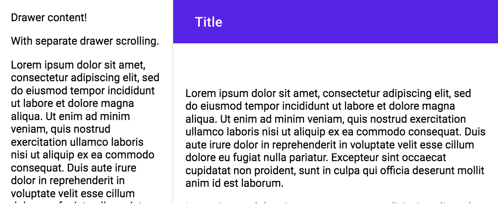
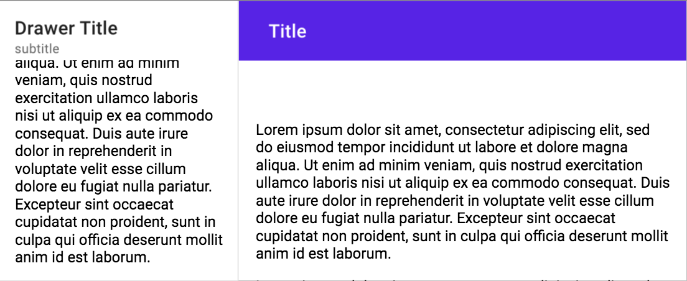
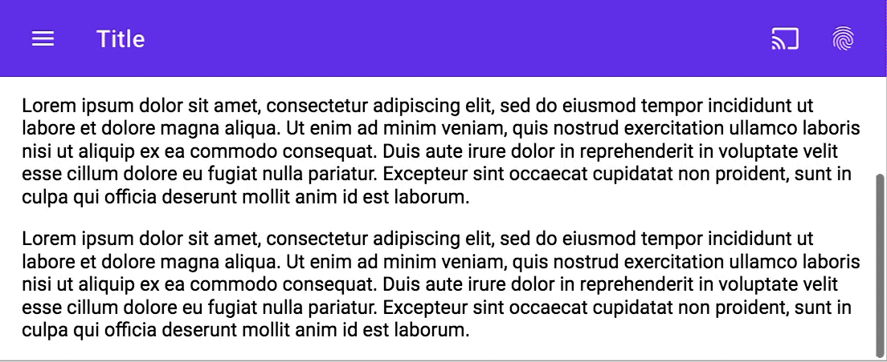

# `<mwc-drawer>` [](https://www.npmjs.com/package/@material/mwc-drawer)
> IMPORTANT: The Material Web Components are a work in progress and subject to
> major changes until 1.0 release.

The Navigation Drawer is used to organize access to destinations and other functionality on an app.

[Material Design Guidelines: Navigation Drawer](https://material.io/components/navigation-drawer/)

[Demo](https://material-components.github.io/material-components-web-components/demos/drawer/)

## Installation

```sh
npm install @material/mwc-drawer
```

> NOTE: The Material Web Components are distributed as ES2017 JavaScript
> Modules, and use the Custom Elements API. They are compatible with all modern
> browsers including Chrome, Firefox, Safari, Edge, and IE11, but an additional
> tooling step is required to resolve *bare module specifiers*, as well as
> transpilation and polyfills for IE11. See
> [here](https://github.com/material-components/material-components-web-components#quick-start)
> for detailed instructions.

## Example usage

### Standard


```html
<mwc-drawer>
    <div>
        <p>Drawer Content!</p>
    </div>
    <div slot="appContent">
        <mwc-top-app-bar>
            <div slot="title">Title</div>
        </mwc-top-app-bar>
        <div>
            <p>Main Content!</p>
        </div>
    </div>
</mwc-drawer>
```

### Standard with Header


```html
<mwc-drawer hasHeader>
    <span slot="title">Drawer Title</span>
    <span slot="subtitle">subtitle</span>
    <div>
        <p>Drawer content!</p>
    </div>
    <div slot="appContent">
        <mwc-top-app-bar>
            <div slot="title">Title</div>
        </mwc-top-app-bar>
        <div>
            <p>Main Content!</p>
        </div>
    </div>
</mwc-drawer>
```

### Dismissible


```html
<mwc-drawer hasHeader type="dismissible">
    <span slot="title">Drawer Title</span>
    <span slot="subtitle">subtitle</span>
    <div>
        <p>Drawer content!</p>
        <mwc-icon-button icon="gesture"></mwc-icon-button>
        <mwc-icon-button icon="gavel"></mwc-icon-button>
    </div>
    <div slot="appContent">
        <mwc-top-app-bar>
            <mwc-icon-button slot="navigationIcon" icon="menu"></mwc-icon-button>
            <div slot="title">Title</div>
        </mwc-top-app-bar>
        <div>
            <p>Main Content!</p>
        </div>
    </div>
</mwc-drawer>
<script>
    const drawer = document.getElementsByTagName('mwc-drawer')[0];
    if (drawer) {
        const container = drawer.parentNode;
        container.addEventListener('MDCTopAppBar:nav', () => {
            drawer.open = !drawer.open;
        });
    }
</script>
```

### Modal


```html
<mwc-drawer hasHeader type="modal">
    <span slot="title">Drawer Title</span>
    <span slot="subtitle">subtitle</span>
    <div>
        <p>Drawer content!</p>
        <mwc-icon-button icon="gesture"></mwc-icon-button>
        <mwc-icon-button icon="gavel"></mwc-icon-button>
    </div>
    <div slot="appContent">
        <mwc-top-app-bar>
            <mwc-icon-button slot="navigationIcon" icon="menu"></mwc-icon-button>
            <div slot="title">Title</div>
        </mwc-top-app-bar>
        <div>
            <p>Main Content!</p>
        </div>
    </div>
</mwc-drawer>
<script>
    const drawer = document.getElementsByTagName('mwc-drawer')[0];
    if (drawer) {
        const container = drawer.parentNode;
        container.addEventListener('MDCTopAppBar:nav', () => {
            drawer.open = !drawer.open;
        });
    }
</script>
```

## API

### Slots
Name | Description
---- | -----------
`title` | Header title to display in the drawer when `hasHeader` is true.
`subtitle` | Header subtitle to display in the drawer when `hasHeader` is true.
`header` | Additional header elements to display in the drawer.
`appContent` | Elements to display in the "app content" to the right of, or under, the drawer.
*default* | Elements to display under the header in drawer.


### Properties/Attributes

Name | Type | Default | Description
---- | ---- | ------- | -----------
`open` | `boolean` | `false` | Whether the dialog is open
`hasHeader` | `boolean` | `false` | When `true`, displays the `title`, `subtitle`, and `header` slots.
`type` | `string` | `''` | When set to `'dismissible'`, overlays the drawer on the content. When set to `'modal'`, also adds a scrim when the drawer is open. When set to empty string, it is inlined with the page and displaces app content.

### Methods
*None*

### Events

Name | Detail | Description
---- | ------ | -----------
`MDCDrawer:opened` | `{}` | Fired when the drawer opens.
`MDCDrawer:closed` | `{}` | Fired when the drawer closes.

### CSS Custom Properties

| Name                 | Default   | Description
| -------------------- | --------- | -----------
| `--mdc-drawer-width` | `256px`   | Width of the side drawer when opened.

### Additional References

-   [MDC Web Drawers](https://material.io/develop/web/components/drawers/)
