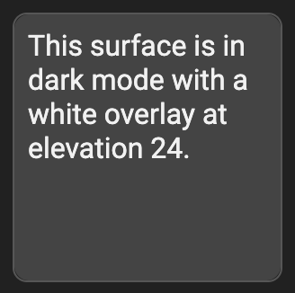
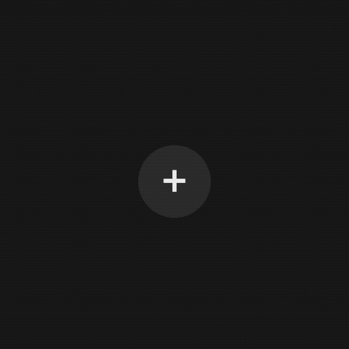

# `elevation-overlay` [](https://www.npmjs.com/package/@material/mwc-elevataion-overlay)
> IMPORTANT: The Material Web Components are a work in progress and subject to
> major changes until 1.0 release.

An overlay is a semi-transparent covering on an element that indicates its
state. Overlays provide a systematic approach to visualizing states by using
opacity.



[Material Design Guidelines: States - Overlay](https://material.io/design/interaction/states.html#anatomy)

[Demo](https://material-components.github.io/material-web/demos/elevation-overlay/)

## Installation

```sh
npm install @material/mwc-elevation-overlay
```

> NOTE: The Material Web Components are distributed as ES2017 JavaScript
> Modules, and use the Custom Elements API. They are compatible with all modern
> browsers including Chrome, Firefox, Safari, Edge, and IE11, but an additional
> tooling step is required to resolve *bare module specifiers*, as well as
> transpilation and polyfills for IE11. See
> [here](https://github.com/material-components/material-components-web-components#quick-start)
> for detailed instructions.

## Example usage

### Standard



```html
<style>
  body {
    /* dark mode surface color */
    background-color: #212121;
  }
</style>

<my-element></my-element>

<script type="module">
  import {styles as elevationStyle} from '@material/mwc-elevation-overlay/mwc-elevation-overlay.css';
  import {LitElement, css, html} from 'lit-element';

  class MyElement extends LitElement {
    static get styles() {
      return [
        // use overlay styles
        elevationStyle,
        // this element's styles
        css`
          button {
            /* generic floating elevation */
            --mdc-elevation-overlay-opacity: 9%;
          }
          button:hover,
          button:focus {
            /* higher interaction elevation */
            --mdc-elevation-overlay-opacity: 15%;
          }
          button:active {
            /* highest interaction elevation */
            --mdc-elevation-overlay-opacity: 24%;
          }

          button {
            /* Dark mode surface color */
            background-color: #212121;
            /* bounds overlay to element */
            position: relative;
            /* dark mode text color */
            color: #eeeeee;

            /* misc button styling */
            border: none;
            border-radius: 26px;
            height: 52px;
            width: 52px;
            font-size: 2em;
            outline: none;
          }
        `,
      ];
    }
    render() {
      return html`
        <button>
          <!--
            Must have class mdc-elevation-overlay and must always come before a
            ripple node.
          -->
          <div class="mdc-elevation-overlay"></div>
          <!-- surface content -->
          +
        </button>
      `;
    }
  }

  customElements.define('my-element', MyElement);
</script>
```

### Customize colors


Appending to the example from above:
```css
button {
  /* Note: try to keep luminosity high on low-opacity colors on dark */
  --mdc-elevation-overlay-fill-color: lightgreen;
}
button:hover,
button:focus {
  --mdc-elevation-overlay-fill-color: yellow;
}
button:active {
  --mdc-elevation-overlay-fill-color: red;
}
.mdc-elevation-overlay {
  /* transition animation to sync up color with opacity change */
  transition: opacity 280ms cubic-bezier(0.4, 0, 0.2, 1), background-color 280ms cubic-bezier(0.4, 0, 0.2, 1);
}
```

## API

### CSS Custom Properties

Name                                   | Default                               | Description
-------------------------------------- | ------------------------------------- | -----------
`--mdc-elevation-overlay-opacity`      | `0`    | Opacity of the overlay.
`--mdc-elevation-overlay-fill-color`   | `#fff` | Fill color of the overlay.
`--mdc-elevation-overlay-width`        | `100%` | Width of the overlay (`absolute` positioning may need to be set as well e.g. `.mdc-elevation-overlay {--mdc-elevation-overlay-width: 50%; left: 50%;}`).
`--mdc-elevation-overlay-height`       | `100%` | Height of the overlay (`absolute` positioning may need to be set as well e.g. `.mdc-elevation-overlay {--mdc-elevation-overlay-height: 50%; top: 50%;}`).

## Additional references

- [Material Dark Theme - Properties](https://material.io/design/color/dark-theme.html#properties)
