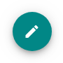
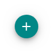
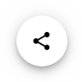

# `<mwc-fab>` [](https://www.npmjs.com/package/@material/mwc-fab)

> IMPORTANT: The Material Web Components are a work in progress and subject to
> major changes until 1.0 release.

A floating action button (FAB) represents the primary action of a screen.






[Material Design Guidelines: Floating Action Button](https://material.io/design/components/buttons-floating-action-button.html)

[Demo](https://material-components.github.io/material-components-web-components/demos/fab/)

## Installation

```sh
npm install @material/mwc-fab
```

> NOTE: The Material Web Components are distributed as ES2017 JavaScript
> Modules, and use the Custom Elements API. They are compatible with all modern
> browsers including Chrome, Firefox, Safari, Edge, and IE11, but an additional
> tooling step is required to resolve *bare module specifiers*, as well as
> transpilation and polyfills for IE11. See
> [here](https://github.com/material-components/material-components-web-components#quick-start)
> for detailed instructions.

## Example usage

### Standard


```html
<link rel="stylesheet" href="https://fonts.googleapis.com/icon?family=Material+Icons&display=block">

<mwc-fab icon="edit"></mwc-fab>

<script type="module">
  import '@material/mwc-fab';
  const fab = document.querySelector('mwc-fab');
  fab.addEventListener('click', () => {
    edit();
  });
</script>
```

### Standard - slotted


```html
<link rel="stylesheet" href="https://fonts.googleapis.com/icon?family=Material+Icons&display=block">

<mwc-fab label="edit">
  <mwc-icon slot="icon">edit</mwc-icon>
</mwc-fab>

<script type="module">
  import '@material/mwc-fab';
  import '@material/mwc-icon';
</script>
```

_Note: `label` should still be set for button accessibility purposes._

### Mini


```html
<mwc-fab mini icon="add"></mwc-fab>
```

### Extended


```html
<mwc-fab extended icon="shopping_cart" label="Add to cart"></mwc-fab>
```
### Customize colors


```css
mwc-fab {
  --mdc-theme-secondary: white;
  --mdc-theme-on-secondary: black;
}
```

## API

### Slots

| Name     | Description
| -------- | ---
| `icon`   | An icon to be slotted into the fab. _Note:_ the `label` property should still be set for button accessibility.

### Properties/Attributes

| Name            | Type      | Description
| --------------- | --------- |------------
| `icon`          | `string`  | The icon to display.
| `label`         | `string`  | The label to display when using the `extended` layout, and the `aria-label` attribute in all layouts.
| `mini`          | `boolean` | Modifies the FAB to be a smaller size, for use on smaller screens. Defaults to `false`.
| `extended`      | `boolean` | Enable the *extended* layout which includes a text label. Defaults to `false`.
| `showIconAtEnd` | `boolean` | When in the *extended* layout, position the icon after the label, instead of before. Defaults to `false`.

### Methods
*None*

### Events
*None*

### CSS Custom Properties

Name                       | Default                                                             | Description
-------------------------- | ------------------------------------------------------------------- | -----------
`--mdc-icon-font`          | [`Material Icons`](https://google.github.io/material-design-icons/) | Font to use for the icon.
`--mdc-theme-on-secondary` |  `#ffffff`                          | Foreground color of the label and icon.
`--mdc-theme-secondary`    |  `#018786`                          | Background color of the FAB.
`--mdc-fab-box-shadow`     | mdc elevation 6, 8, 12                                              | Sets the box shadow of the fab. Elevation 6 when idle, 8 when focused or hovered, and 12 when active.

#### Elevation values

| Elevation Level | CSS Value
| ---- | ---
| `6`  | `0px 3px 5px -1px rgba(0, 0, 0, 0.2), 0px 6px 10px 0px rgba(0, 0, 0, 0.14), 0px 1px 18px 0px rgba(0, 0, 0, 0.12)`
| `8`  | `0px 5px 5px -3px rgba(0, 0, 0, 0.2), 0px 8px 10px 1px rgba(0, 0, 0, 0.14), 0px 3px 14px 2px rgba(0, 0, 0, 0.12)`
| `12` | `0px 7px 8px -4px rgba(0, 0, 0, 0.2), 0px 12px 17px 2px rgba(0, 0, 0, 0.14), 0px 5px 22px 4px rgba(0, 0, 0, 0.12)`

## Additional references

- [MDC Web: Floating Action Button](https://material.io/develop/web/components/buttons/floating-action-buttons/)
