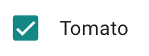
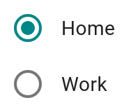

# `<mwc-formfield>` [](https://www.npmjs.com/package/@material/mwc-formfield)
> IMPORTANT: The Material Web Components are a work in progress and subject to
> major changes until 1.0 release.

A form field is a text caption for MWC input elements including
[`<mwc-checkbox>`](https://github.com/material-components/material-components-web-components/tree/master/packages/checkbox),
[`<mwc-radio>`](https://github.com/material-components/material-components-web-components/tree/master/packages/radio),
and
[`<mwc-switch>`](https://github.com/material-components/material-components-web-components/tree/master/packages/switch).

It is equivalent to the native
[`<label>`](https://developer.mozilla.org/en-US/docs/Web/HTML/Element/label)
element in that it forwards user interaction events to the input element. For example, tapping on the label causes the associated input element to toggle and focus.

[Material Design Guidelines: Selection controls](https://material.io/components/selection-controls/)

[Demo](https://material-components.github.io/material-components-web-components/demos/formfield/)

## Installation

```sh
npm install @material/mwc-formfield
```

> NOTE: The Material Web Components are distributed as ES2017 JavaScript
> Modules, and use the Custom Elements API. They are compatible with all modern
> browsers including Chrome, Firefox, Safari, Edge, and IE11, but an additional
> tooling step is required to resolve *bare module specifiers*, as well as
> transpilation and polyfills for IE11. See
> [here](https://github.com/material-components/material-components-web-components#quick-start)
> for detailed instructions.

## Example usage

### With checkbox



```html
<mwc-formfield label="Tomato">
  <mwc-checkbox checked></mwc-checkbox>
</mwc-formfield>

<script type="module">
  import '@material/mwc-checkbox';
  import '@material/mwc-formfield';
</script>
```

### nowrap label with checkbox


```html
<style>
  mwc-formfield[nowrap] {
    width: 150px;
  }
</style>
<mwc-formfield label="really really long label" nowrap>
  <mwc-checkbox></mwc-checkbox>
</mwc-formfield>

<script type="module">
  import '@material/mwc-checkbox';
  import '@material/mwc-formfield';
</script>
```

### With Radio



```html
<style>
  mwc-formfield {
    display: block;
  }
</style>

<mwc-formfield label="Home">
  <mwc-radio name="location" checked></mwc-radio>
</mwc-formfield>

<mwc-formfield label="Work">
  <mwc-radio name="location"></mwc-radio>
</mwc-formfield>

<script type="module">
  import '@material/mwc-radio';
  import '@material/mwc-formfield';
</script>
```

### With Switch


```html
<mwc-formfield label="Airplane mode">
  <mwc-switch checked></mwc-switch>
</mwc-formfield>

<script type="module">
  import '@material/mwc-switch';
  import '@material/mwc-formfield';
</script>
```

## API

### Slots

Name      | Description
--------- | -----------
*default* | The input element that this form field provides a label for.


### Properties/Attributes

Name    | Type     | Description
------- | -------- | ----------------------------------
`label` | `string` | The text to display for the label and sets a11y label on input. (visually overriden by slotted label)
`alignEnd` | `boolean` | Align the component at the end of the label.
`spaceBetween` | `boolean` | Add space between the component and the label as the formfield grows.
`nowrap` | `boolean` | Prevents the label from wrapping and overflow text is ellipsed.

### Methods

*None*

### Events

*None*

### CSS Custom Properties

*None*

## Additional references

-   [MDC Web Form Fields](https://material.io/develop/web/components/input-controls/form-fields/)
