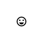
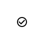
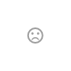
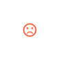

# `<mwc-icon-button-toggle>` [](https://www.npmjs.com/package/@material/mwc-icon-button-toggle)

> IMPORTANT: The Material Web Components are a work in progress and subject to
> major changes until 1.0 release.

Toggle buttons can be used to group related options. To emphasize groups of related toggle buttons, a group should share a common container.

Icons can be used as toggle buttons when they allow selection, or deselection, of a single choice, such as marking an item as a favorite.

For the non-toggling version of this component, see [`<mwc-icon-button>`](https://github.com/material-components/material-components-web-components/tree/master/packages/icon-button)

[Material Design Guidelines: Toggle Button](https://material.io/design/components/buttons.html#toggle-button)

[Demo](https://material-components.github.io/material-components-web-components/demos/icon-button-toggle/)

## Installation

```sh
npm install @material/mwc-icon-button-toggle
```

> NOTE: The Material Web Components are distributed as ES2017 JavaScript
> Modules, and use the Custom Elements API. They are compatible with all modern
> browsers including Chrome, Firefox, Safari, Edge, and IE11, but an additional
> tooling step is required to resolve *bare module specifiers*, as well as
> transpilation and polyfills for IE11. See
> [here](https://github.com/material-components/material-components-web-components#quick-start)
> for detailed instructions.

## Example Usage

### Standard

#### `on = false`


```html
<mwc-icon-button-toggle onIcon="sentiment_very_satisfied" offIcon="sentiment_very_dissatisfied"></mwc-icon-button-toggle>
```

#### `on = true`


```html
<mwc-icon-button-toggle on onIcon="sentiment_very_satisfied" offIcon="sentiment_very_dissatisfied"></mwc-icon-button-toggle>
```

### SVG

#### `on = false`


```html
<mwc-icon-button-toggle>
  <svg slot="onIcon" xmlns="http://www.w3.org/2000/svg" width="24" height="24" viewBox="0 0 24 24"><path d="M0 0h24v24H0z" fill="none"/><path d="M12 2C6.48 2 2 6.48 2 12s4.48 10 10 10 10-4.48 10-10S17.52 2 12 2zm-2 15l-5-5 1.41-1.41L10 14.17l7.59-7.59L19 8l-9 9z"/></svg>
  <svg slot="offIcon" xmlns="http://www.w3.org/2000/svg" width="24" height="24" viewBox="0 0 24 24"><path fill="none" d="M0 0h24v24H0V0zm0 0h24v24H0V0z"/><path d="M16.59 7.58L10 14.17l-3.59-3.58L5 12l5 5 8-8zM12 2C6.48 2 2 6.48 2 12s4.48 10 10 10 10-4.48 10-10S17.52 2 12 2zm0 18c-4.42 0-8-3.58-8-8s3.58-8 8-8 8 3.58 8 8-3.58 8-8 8z"/></svg>
</mwc-icon-button-toggle>
```

#### `on = true`


```html
<mwc-icon-button-toggle on>
  <svg slot="onIcon" xmlns="http://www.w3.org/2000/svg" width="24" height="24" viewBox="0 0 24 24"><path d="M0 0h24v24H0z" fill="none"/><path d="M12 2C6.48 2 2 6.48 2 12s4.48 10 10 10 10-4.48 10-10S17.52 2 12 2zm-2 15l-5-5 1.41-1.41L10 14.17l7.59-7.59L19 8l-9 9z"/></svg>
  <svg slot="offIcon" xmlns="http://www.w3.org/2000/svg" width="24" height="24" viewBox="0 0 24 24"><path fill="none" d="M0 0h24v24H0V0zm0 0h24v24H0V0z"/><path d="M16.59 7.58L10 14.17l-3.59-3.58L5 12l5 5 8-8zM12 2C6.48 2 2 6.48 2 12s4.48 10 10 10 10-4.48 10-10S17.52 2 12 2zm0 18c-4.42 0-8-3.58-8-8s3.58-8 8-8 8 3.58 8 8-3.58 8-8 8z"/></svg>
</mwc-icon-button-toggle>
```

### Image

#### `on = false`


```html
<mwc-icon-button-toggle>
  
  
</mwc-icon-button-toggle>
```

#### `on = true`

```html
<mwc-icon-button-toggle on>
  
  
</mwc-icon-button-toggle>
```

### Disabled



```html
<mwc-icon-button-toggle disabled onIcon="sentiment_very_satisfied" offIcon="sentiment_very_dissatisfied"></mwc-icon-button-toggle>
```

### Customize Colors

#### `on = false`

#### `on = true`


```css
mwc-icon-button-toggle {
  color: tomato;
}
```

## Fonts

Most users should include the following in their application HTML when using
icons:

```html
<link href="https://fonts.googleapis.com/css?family=Material+Icons&display=block" rel="stylesheet">
```

This loads the *Material Icons* font, which is required to render icons, and is
*not* loaded automatically. If you see plain text instead of an icon, then the
most likely cause is that the Material Icons font is not loaded.

To see all icons that are available in the Material Icons font, see
[Material Icons](https://material.io/resources/icons/).

For technical details about the Material Icons font, see the
[Material Icons Developer Guide](https://google.github.io/material-design-icons/).

## API

### Slots
| Name | Description
| ---- | -----------
| `onIcon` | Optional `` or `<svg>` to display instead of using an icon font for the `onIcon` property.
| `offIcon` | Optional `` or `<svg>` to display instead of using an icon font for the `offIcon` property.

### Properties/Attributes
| Name | Type | Default | Description
| ---- | ---- | ------- | -----------
| `on` | `boolean` | `false` | Whether the toggle is activated.
| `onIcon` | `string` | `''` | Icon to display when `on` is `true`.
| `offIcon` | `string` | `''` | Icon to display when `on` is `false`.
| `label` | `string` | `''` | Accessible label for the button, sets `aria-label`.
| `disabled` | `boolean` | `false` | Disabled buttons cannot be interacted with and have no visual interaction effect.

### Methods
*None*

### Events

| Name | Detail | Description
| ---- | ------ | -----------
| `MDCIconButtonToggle:change` | `{isOn: boolean}` | Indicates the button has toggled. `isOn` indicates the `on` value of the toggle button.

### CSS Custom Properties

| Name | Default | Description
| ---- | ------- | -----------
| `--mdc-icon-font` | [`Material Icons`](https://material.io/resources/icons/) | Font that supports *ligatures* and determines which icons are available (see [fonts](#fonts) above).
| `--mdc-theme-text-disabled-on-light` | `rgba(0, 0, 0, 0.38)` | Color of icon when `disabled` is `true`
| `--mdc-icon-button-ripple-opacity` | `0.12` | Opacity of the ripple on the icon button

## Additional references

- [MDC Web: Icon Buttons](https://material.io/develop/web/components/buttons/icon-buttons/)
