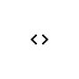
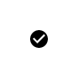
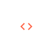

# `<mwc-icon-button>` [](https://www.npmjs.com/package/@material/mwc-icon-button)

> IMPORTANT: The Material Web Components are a work in progress and subject to
> major changes until 1.0 release.

Icon buttons allow users to take actions, and make choices, with a single tap.

For the toggling version of this component, see [`<mwc-icon-button-toggle>`](https://github.com/material-components/material-components-web-components/tree/master/packages/icon-button-toggle/)

[Material Design Guidelines: Button](https://material.io/design/components/buttons.html)

[Demo](https://material-components.github.io/material-components-web-components/demos/icon-button/)

## Installation

```sh
npm install @material/mwc-icon-button
```

> NOTE: The Material Web Components are distributed as ES2017 JavaScript
> Modules, and use the Custom Elements API. They are compatible with all modern
> browsers including Chrome, Firefox, Safari, Edge, and IE11, but an additional
> tooling step is required to resolve *bare module specifiers*, as well as
> transpilation and polyfills for IE11. See
> [here](https://github.com/material-components/material-components-web-components#quick-start)
> for detailed instructions.

## Example Usage

### Standard



```html
<mwc-icon-button icon="code"></mwc-icon-button>
```

### SVG or Image



```html
<mwc-icon-button>
  <svg xmlns="http://www.w3.org/2000/svg" width="24" height="24" viewBox="0 0 24 24"><path d="M0 0h24v24H0z" fill="none"/><path d="M12 2C6.48 2 2 6.48 2 12s4.48 10 10 10 10-4.48 10-10S17.52 2 12 2zm-2 15l-5-5 1.41-1.41L10 14.17l7.59-7.59L19 8l-9 9z"/></svg>
</mwc-icon-button>
```

### Disabled


```html
<mwc-icon-button icon="code" disabled></mwc-icon-button>
```

### Custom Style



```css
mwc-icon-button {
  color: tomato;
  --mdc-icon-size: 50px;
}
```

## Fonts

Most users should include the following in their application HTML when using
icons:

```html
<link href="https://fonts.googleapis.com/css?family=Material+Icons&display=block" rel="stylesheet">
```

This loads the *Material Icons* font, which is required to render icons, and is
*not* loaded automatically. If you see plain text instead of an icon, then the
most likely cause is that the Material Icons font is not loaded.

To see all icons that are available in the Material Icons font, see
[Material Icons](https://material.io/resources/icons/).

For technical details about the Material Icons font, see the
[Material Icons Developer Guide](https://google.github.io/material-design-icons/).

## API

### Slots
| Name | Description
| ---- | -----------
| _default_ | Optional `` or `<svg>` to display instead of using an icon font

### Properties/Attributes
| Name | Type | Default | Description
| ---- | ---- | ------- | -----------
| `icon` | `string` | `''` | Icon to display, and `aria-label` value when `label` is not defined.
| `label` | `string` | `''` | Accessible label for the button, sets `aria-label`.
| `disabled` | `boolean` | `false` | Disabled buttons cannot be interacted with and have no visual interaction effect.

### Methods
*None*

### Events
*None*

### CSS Custom Properties

| Name | Default | Description
| ---- | ------- | -----------
| `--mdc-icon-font` | [`Material Icons`](https://material.io/resources/icons/) | Font that supports *ligatures* and determines which icons are available (see [fonts](#fonts) above).
| `--mdc-icon-button-size` | `48px` | Sets the size of the button wrapping the icon.
| `--mdc-icon-size` | `24px` | Sets the size of the icon.
| `--mdc-theme-text-disabled-on-light` | `rgba(0, 0, 0, 0.38)` | Color of icon when `disabled` is `true`
| `--mdc-icon-button-ripple-opacity` | `0.12` | Opacity of the ripple on the icon button

## Additional references

- [MDC Web: Icon Buttons](https://material.io/develop/web/components/buttons/icon-buttons/)
