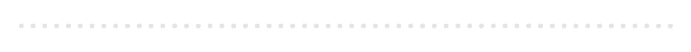
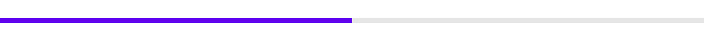
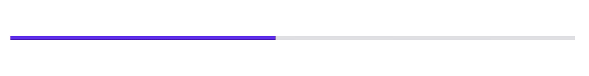
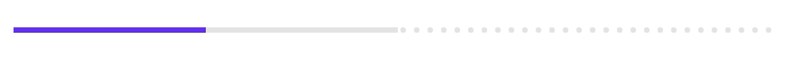
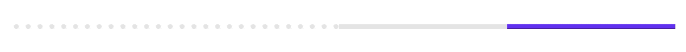

# `<mwc-linear-progress>` [](https://www.npmjs.com/package/@material/mwc-linear-progress)

> IMPORTANT: The Material Web Components are a work in progress and subject to
> major changes until 1.0 release.

Progress indicators express an unspecified wait time or display the length of a process.



[Material Design Guidelines: Progress Indicators](https://material.io/components/progress-indicators/#circular-progress-indicators)

[Demo](https://material-components.github.io/material-components-web-components/demos/linear-progress/)

## Example usage

### Determinate



```html
<script type="module">
  import '@material/mwc-linear-progress';
</script>
<mwc-linear-progress progress="0.5"></mwc-linear-progress>
```

### Indeterminate



```html
<mwc-linear-progress indeterminate></mwc-linear-progress>
```

### Determinate buffer



```html
<mwc-linear-progress progress="0.25" buffer="0.5"></mwc-linear-progress>
```

### Reversed




```html
<mwc-linear-progress
    reverse
    progress="0.25"
    buffer="0.5">
</mwc-linear-progress>
```

### Styled


```html
<style>
  mwc-linear-progress {
    --mdc-theme-primary: red;
    --mdc-linear-progress-buffer-color: orange;
    /* Note: all that was changed from default was "fill='orange'" */
    --mdc-linear-progress-buffering-dots-image:
        url("data:image/svg+xml,%3Csvg version='1.1' xmlns='http://www.w3.org/2000/svg' xmlns:xlink='http://www.w3.org/1999/xlink' x='0px' y='0px' enable-background='new 0 0 5 2' xml:space='preserve' viewBox='0 0 5 2' preserveAspectRatio='none slice'%3E%3Ccircle cx='1' cy='1' r='1' fill='orange'/%3E%3C/svg%3E");
  }
</style>
<mwc-linear-progress progress="0.25" buffer="0.5"></mwc-linear-progress>
```

## API

### Slots

None

### Properties/Attributes

| Name            | Type      | Default | Description
| --------------- | --------- | ------- |------------
| `indeterminate` | `boolean` | `false` | Sets the linear-progress into its indeterminate state.
| `progress`      | `number`  | `0`     | Sets the primary progress bar's value. Value should be between [0, 1].
| `buffer`        | `number`  | `1`     | Sets the buffer progress bar's value. Value should be between [0, 1]. Setting this value to be less than 1 will reveal moving, buffering dots.
| `reverse`       | `boolean` | `false` | Reverses the direction of the linear progress indicator.
| `closed`        | `boolean` | `false` | Sets the progress indicator to the closed state. Sets content opactiy to 0. Typically should be set to true when loading has finished.

### Methods

| Name              | Description
| ----------------- | -----------
| `open() => void`  | Sets `LinearProgress.closed` to `false`;
| `close() => void` | Sets `LinearProgress.closed` to `true`;

### Events

None

### CSS Custom Properties

| Name                                         | Default                                | Description
| -------------------------------------------- | -------------------------------------- |------------
| `--mdc-theme-primary`                        |  `#6200EE` | Sets the color of primary progress bar.
| `--mdc-linear-progress-buffer-color`         |  `#E6E6E6` | Sets the color of the buffer progress bar.<br> **NOTE:** to change the color of the buffering dots, you must do so in the image of `--mdc-linear-progress-buffering-dots-image`.
| `--mdc-linear-progress-buffering-dots-image` | `url("<svg data url>")` (see below for value) | Sets the image to use as the buffering dots. This pattern is then repeated horizontally and animated.

Default value for `--mdc-linear-progress-buffering-dots-image`:

```
data:image/svg+xml,%3Csvg version='1.1' xmlns='http://www.w3.org/2000/svg' xmlns:xlink='http://www.w3.org/1999/xlink' x='0px' y='0px' enable-background='new 0 0 5 2' xml:space='preserve' viewBox='0 0 5 2' preserveAspectRatio='none slice'%3E%3Ccircle cx='1' cy='1' r='1' fill='%23e6e6e6'/%3E%3C/svg%3E
```

If you paste that data url into your browser you can see and inspect the SVG.
You may also notice that it is simply a colored circle with some transparent
space to its right. If you would like to change the color of the circle, you can
simply change the `fill="%23e6e6e6"` to any valid color property (n.b. `%23` is
the url-encoded equivalent of `#`).

## Additional references

- [MDC Web linear-progresss](https://material-components.github.io/material-components-web-catalog/#/component/linear-progress-indicator)
