# `<mwc-list>` [](https://www.npmjs.com/package/@material/mwc-list)

> IMPORTANT: The Material Web Components are a work in progress and subject to
> major changes until 1.0 release.

Lists are continuous, vertical indexes of text or images.

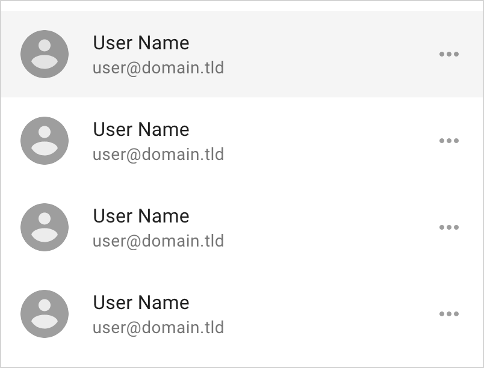

[Material Design Guidelines: lists](https://material.io/design/components/lists.html)

## Installation

```sh
npm install @material/mwc-list
```

> NOTE: The Material Web Components are distributed as ES2017 JavaScript
> Modules, and use the Custom Elements API. They are compatible with all modern
> browsers including Chrome, Firefox, Safari, Edge, and IE11, but an additional
> tooling step is required to resolve *bare module specifiers*, as well as
> transpilation and polyfills for Edge and IE11. See
> [here](https://github.com/material-components/material-components-web-components#quick-start)
> for detailed instructions.

## Example usage

### Basic

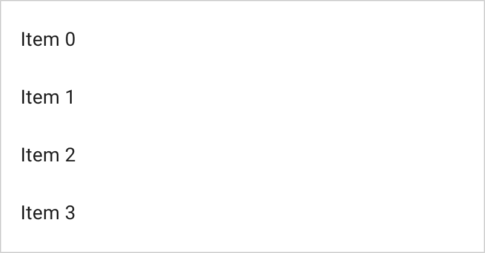

```html
<mwc-list>
  <mwc-list-item>Item 0</mwc-list-item>
  <mwc-list-item>Item 1</mwc-list-item>
  <mwc-list-item>Item 2</mwc-list-item>
  <mwc-list-item>Item 3</mwc-list-item>
</mwc-list>

<script type="module">
  import '@material/mwc-list/mwc-list.js';
  import '@material/mwc-list/mwc-list-item.js';
</script>
```

### Activatable

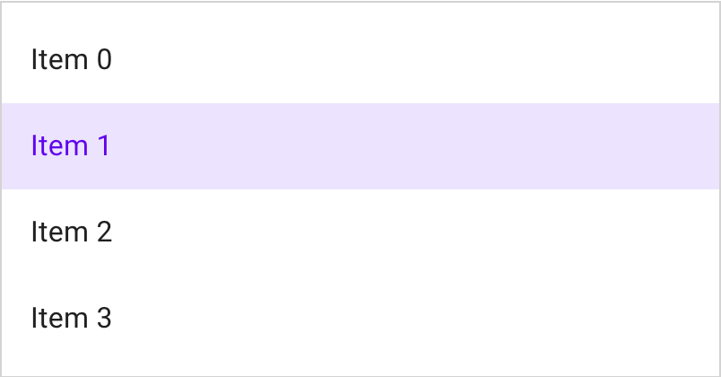

```html
<mwc-list activatable>
  <mwc-list-item>Item 0</mwc-list-item>
  <mwc-list-item selected activated>Item 1</mwc-list-item>
  <mwc-list-item>Item 2</mwc-list-item>
  <mwc-list-item>Item 3</mwc-list-item>
</mwc-list>
```

### Multi-selectable (activatable)

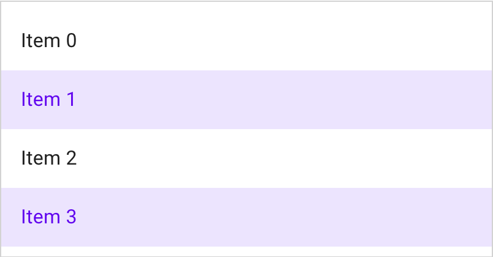

```html
<mwc-list activatable multi>
  <mwc-list-item>Item 0</mwc-list-item>
  <mwc-list-item selected activated>Item 1</mwc-list-item>
  <mwc-list-item>Item 2</mwc-list-item>
  <mwc-list-item selected activated>Item 3</mwc-list-item>
</mwc-list>
```

### Leading Graphic

_Note_: it is not recommended to mix graphic sizes in the same list.


```html
<style>
  /* invert icon color */
  mwc-icon {
    background-color: gray;
    color: white;
  }
</style>

<mwc-list>
  <mwc-list-item graphic="avatar">
    <span>Avatar graphic</span>
    <mwc-icon slot="graphic">folder</mwc-icon>
  </mwc-list-item>
  <mwc-list-item graphic="icon">
    <span>Icon graphic</span>
    <mwc-icon slot="graphic">folder</mwc-icon>
  </mwc-list-item>
  <mwc-list-item graphic="medium">
    <span>medium graphic</span>
    <mwc-icon slot="graphic">folder</mwc-icon>
  </mwc-list-item>
  <mwc-list-item graphic="large">
    <span>large graphic</span>
    <mwc-icon slot="graphic">folder</mwc-icon>
  </mwc-list-item>
</mwc-list>

<script type="module">
  import '@material/mwc-list/mwc-list-item.js';
  import '@material/mwc-list/mwc-list.js';
  import '@material/mwc-icon';
</script>
```

### Meta Icon

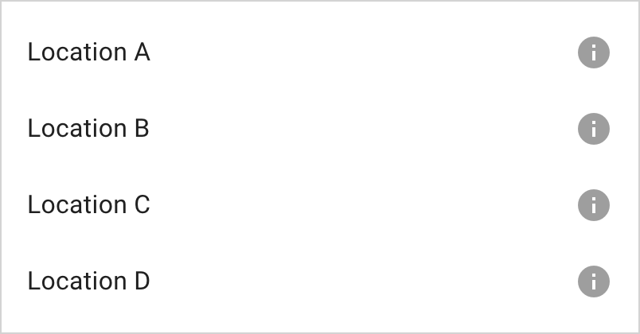

```html
<mwc-list>
  <mwc-list-item hasMeta>
    <span>Location A</span>
    <mwc-icon slot="meta">info</mwc-icon>
  </mwc-list-item>
  <mwc-list-item hasMeta>
    <span>Location B</span>
    <mwc-icon slot="meta">info</mwc-icon>
  </mwc-list-item>
  <mwc-list-item hasMeta>
    <span>Location C</span>
    <mwc-icon slot="meta">info</mwc-icon>
  </mwc-list-item>
  <mwc-list-item hasMeta>
    <span>Location D</span>
    <mwc-icon slot="meta">info</mwc-icon>
  </mwc-list-item>
</mwc-list>
```

### Two-Line

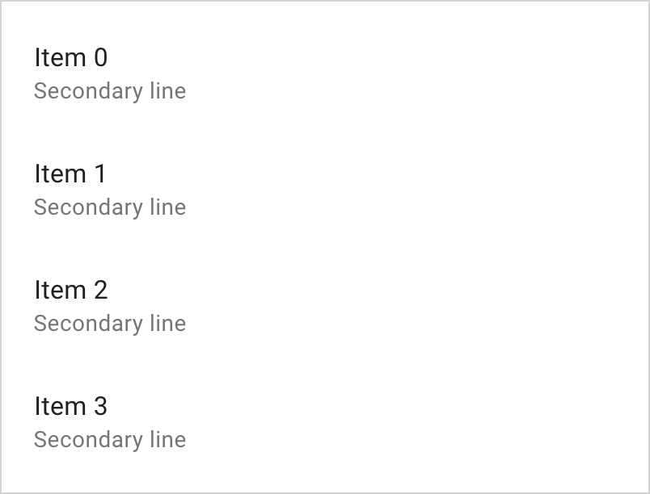

```html
<mwc-list>
  <mwc-list-item twoline>
    <span>Item 0</span>
    <span slot="secondary">Secondary line</span>
  </mwc-list-item>
  <mwc-list-item twoline>
    <span>Item 1</span>
    <span slot="secondary">Secondary line</span>
  </mwc-list-item>
  <mwc-list-item twoline>
    <span>Item 2</span>
    <span slot="secondary">Secondary line</span>
  </mwc-list-item>
  <mwc-list-item twoline>
    <span>Item 3</span>
    <span slot="secondary">Secondary line</span>
  </mwc-list-item>
</mwc-list>
```

### Dividers

Dividers must have the `divider` attribute and it is recommended to add
`role="separator"` for screen readers. There are 3 variants of dividers,
full-width (default), padded (respects list padding), and inset (left-padding
respects avatar and icon paddding). These variants can be mixed.

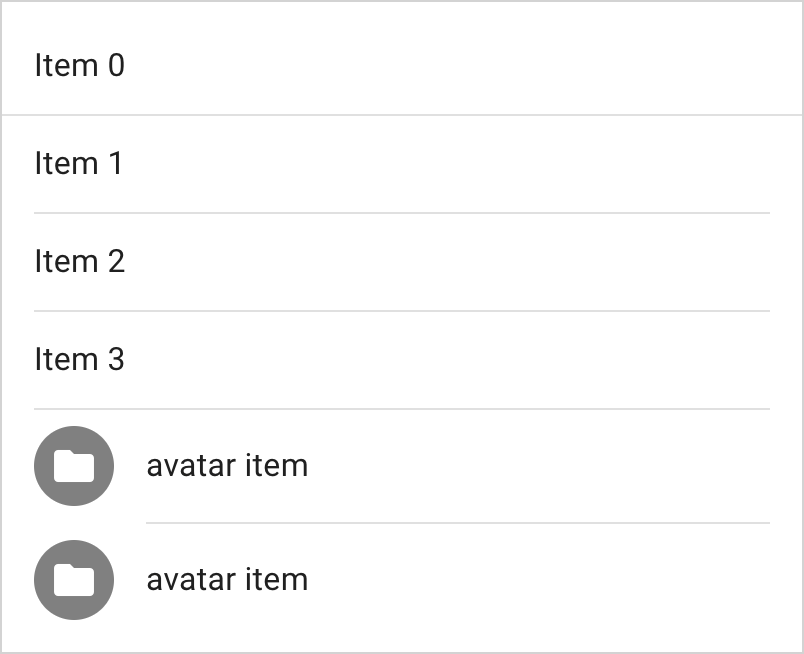

```html
<mwc-list>
  <mwc-list-item>Item 0</mwc-list-item>
  <li divider role="separator"></li>
  <mwc-list-item>Item 1</mwc-list-item>
  <li divider padded role="separator"></li>
  <mwc-list-item>Item 2</mwc-list-item>
  <li divider padded role="separator"></li>
  <mwc-list-item>Item 3</mwc-list-item>
  <li divider padded role="separator"></li>
  <mwc-list-item graphic="avatar">
    <span>avatar item</span>
    <mwc-icon slot="graphic">folder</mwc-icon>
  </mwc-list-item>
  <li divider inset padded role="separator"></li>
  <mwc-list-item graphic="avatar">
    <span>avatar item</span>
    <mwc-icon slot="graphic">folder</mwc-icon>
  </mwc-list-item>
</mwc-list>
```

### Checklist

`mwc-check-list-item` inherits from `mwc-list-item`, so it will share a similar
API to `mwc-list-item`. e.g. you can still add graphics and make them
activatable but not two-lined.

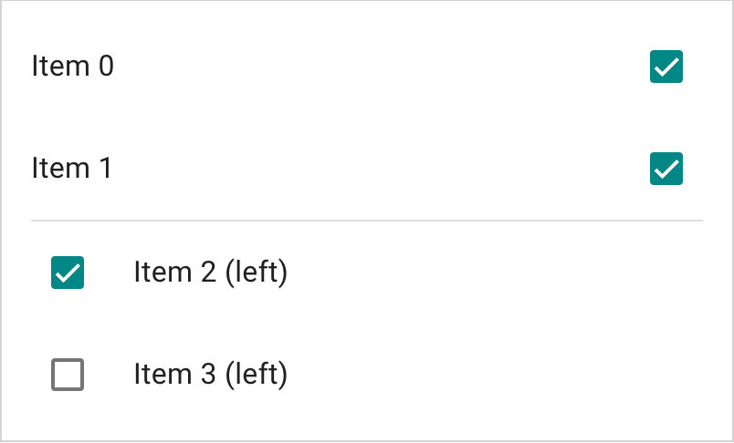

```html
<mwc-list multi>
  <mwc-check-list-item selected>Item 0</mwc-check-list-item>
  <mwc-check-list-item selected>Item 1</mwc-check-list-item>
  <li divider role="separator" padded></li>
  <mwc-check-list-item left selected>Item 2 (left)</mwc-check-list-item>
  <mwc-check-list-item left>Item 3 (left)</mwc-check-list-item>
</mwc-list>

<script type="module">
  import '@material/mwc-list/mwc-check-list-item.js';
  import '@material/mwc-list/mwc-list.js';
</script>
```

### Radio List

`mwc-radio-list-item` inherits from `mwc-list-item`, so it will share a similar
API to `mwc-list-item`. e.g. you can still add graphics and make them
activatable but not two-lined.

Setting `group` on the `radio-list-item` will group those `mwc-radio`s together
across the same Document.

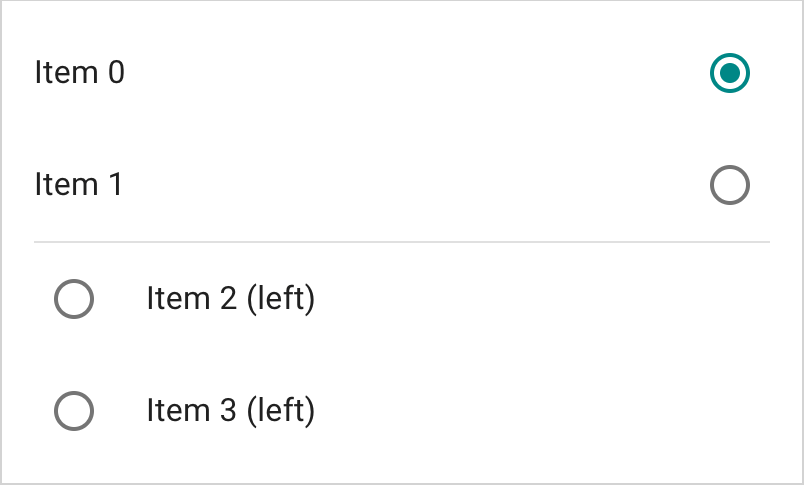

```html
<mwc-list>
  <mwc-radio-list-item group="a" seslected>Item 0</mwc-radio-list-item>
  <mwc-radio-list-item group="a">Item 1</mwc-radio-list-item>
  <li divider padded role="separator"></li>
  <mwc-radio-list-item left group="a">Item 2 (left)</mwc-radio-list-item>
  <mwc-radio-list-item left group="a">Item 3 (left)</mwc-radio-list-item>
</mwc-list>
```

### Multi Radio List

A radio list can also have `multi`.

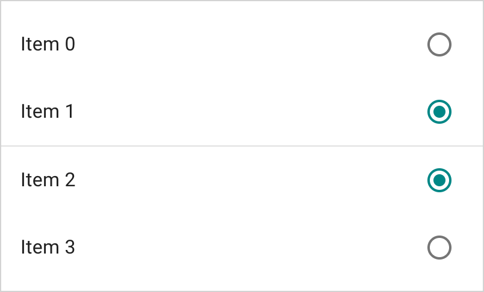

```html
<mwc-list multi>
  <mwc-radio-list-item group="b">Item 0</mwc-radio-list-item>
  <mwc-radio-list-item group="b" selected>Item 1</mwc-radio-list-item>
  <li divider role="separator"></li>
  <mwc-radio-list-item group="c" selected>Item 2</mwc-radio-list-item>
  <mwc-radio-list-item group="c">Item 3</mwc-radio-list-item>
</mwc-list>
<script type="module">
  import '@material/mwc-list/mwc-radio-list-item.js';
  import '@material/mwc-list/mwc-list.js';
</script>
```

### Item Noninteractive

Setting a list-item to non-interactive will disable focus and pointer events on
the item, and it will no longer be considered for selection.

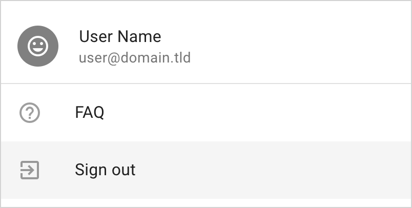

```html
<style>
  .inverted {
    background-color: gray;
    color: white;
  }
</style>
<mwc-list>
  <mwc-list-item twoline graphic="avatar" noninteractive>
    <span>User Name</span>
    <span slot="secondary">user@domain.tld</span>
    <mwc-icon slot="graphic" class="inverted">tag_faces</mwc-icon>
  </mwc-list-item>
  <li divider role="separator"></li>
  <mwc-list-item graphic="icon">
    <slot>FAQ</slot>
    <mwc-icon slot="graphic">help_outline</mwc-icon>
  </mwc-list-item>
  <mwc-list-item graphic="icon">
    <slot>Sign out</slot>
    <mwc-icon slot="graphic">exit_to_app</mwc-icon>
  </mwc-list-item>
</mwc-list>
```

### Styled

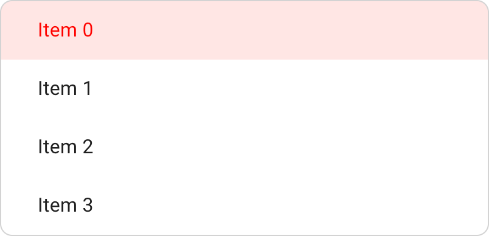

```html
<style>
  #styled {
    --mdc-theme-primary: red;
    --mdc-list-vertical-padding: 0px;
    --mdc-list-side-padding: 30px;
    border-radius: 10px;
    overflow: hidden;
  }
</style>
<mwc-list activatable id="styled">
  <mwc-list-item selected>Item 0</mwc-list-item>
  <mwc-list-item>Item 1</mwc-list-item>
  <mwc-list-item>Item 2</mwc-list-item>
  <mwc-list-item>Item 3</mwc-list-item>
</mwc-list>
```

### Styled No-ripple

For more-control on styling, you may want to disable the ripple which is set on
`mwc-list-item`'s `::before` and `::after` pseudo-elements.

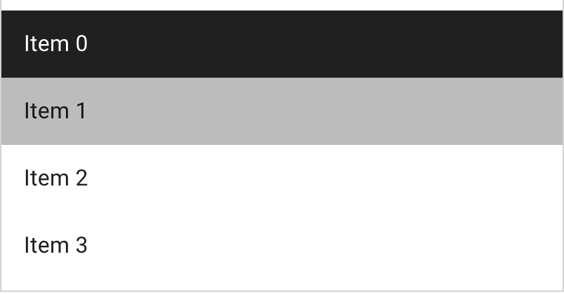

```html
<style>
  /* disable ripple */
  #styledr > *::before,
  #styledr > *::after {
    display: none;
  }

  #styledr > * {
    transition: background-color .2s, color .2s;
  }

  #styledr [selected] {
    background-color: rgb(33, 33, 33);
    color: white;
  }

  #styledr [mwc-list-item]:not([selected]):hover,
  #styledr [mwc-list-item]:not([selected]):focus {
    background-color: rgba(33, 33, 33, 0.3);
  }

  #styledr [mwc-list-item]:not([selected]):active {
    background-color: rgba(33, 33, 33, 0.4);
  }

  #styledr [mwc-list-item][selected]:hover,
  #styledr [mwc-list-item][selected]:focus {
    background-color: rgba(33, 33, 33, 0.9);
  }

  #styledr [mwc-list-item][selected]:active {
    background-color: rgba(33, 33, 33, 0.8);
  }
</style>

<mwc-list id="styledr">
  <mwc-list-item selected>Item 0</mwc-list-item>
  <mwc-list-item>Item 1</mwc-list-item>
  <mwc-list-item>Item 2</mwc-list-item>
  <mwc-list-item>Item 3</mwc-list-item>
</mwc-list>
```

## API

### Slots

#### mwc-list

| Name              |	Description
| ----------------- | -------------
| _default_         |	Content to display in the lists internal `<ul>` element.

#### mwc-list-item

| Name        | Description
| ----------- | ---
| `graphic`   | First tile graphic to display when `graphic` attribute is defined.
| `meta`      | Last tile meta icon or text to display when `hasMeta` is true.
| `secondary` | Secondary text displayed below primary text of a two-line list item.
| _default_   |	Primary text to display in the list item. Note, text must be wrapped in an inline node to be styled for `disabled` variant.


### Properties/Attributes

#### mwc-list

| Name             | Type           | Default | Description
| ---------------- | -------------- | ------- |------------
| `activatable`    | `boolean`      | `false` | Sets `activated` attribute on selected items which provides a focus-persistent highlight.
| `rootTabbable`   | `boolean`      | `false` | When `true`, sets `tabindex="0"` on the internal list. Otherwise sets `tabindex="-1"`.
| `multi`          | `boolean`      | `false` | When `true`, enables selection of multiple items. This will result in `index` being of type `Set<number>` and selected returning `ListItemBase[]`.
| `wrapFocus`      | `boolean`      | `false` | When `true`, pressing `up` on the keyboard when focused on the first item will focus the last item and `down` when focused on the last item will focus the first item.
| `itemRoles`      | `string|null`  | `null`  | Determines what `role` attribute to set on all list items.
| `innerRole`      | `string|null`  | `null`  | Role of the internal `<ul>` element.
| `noninteractive` | `boolean`      | `false` | When `true`, disables focus and pointer events (thus ripples) on the list. Used for display-only lists.
| `items`          | `ListItemBase[]` (readonly)* | `[]` | All list items that are available for selection. Eligible items have the `[mwc-list-item]` attribute which `ListItemBase` applies automatically.
| `selected`       | `ListItemBase|ListItemBase[]|null` (readonly)* | `null` | Currently-selected list item(s). When `multi` is `true`, `selected` is of type `ListItemBase[]` and when `false`, `selected` is of type `ListItemBase`. `selected` is `null` when no item is selected.
| `index`          | `MWCListIndex` (readonly)**  | `-1` | Index / indices of selected item(s). When `multi` is `true`, `index` is of type `number` and when `false`, `index` is of type `Set<number>`. Unset indicies are `-1` and empty `Set<number>` for single and multi selection respectively.

\* `ListItemBase` is the base class of `mwc-list-item` of which both
`mwc-check-list-item` and `mwc-radio-list-item` also inherit from.

\** `MWCListIndex` is equivalent to type `number|Set<number>`.

#### mwc-list-item

| Name             | Type                | Default | Description
| ---------------- | ------------------- | ------- | -----------
| `value`          | `string`            | `''`    | Value associated with this list item (used by `mwc-select`).
| `group`          | `string|null`       | `null`  | Used to group items together (used by `mwc-menu` for menu selection groups and `mwc-radio-list-element`).
| `tabindex`       | `number`            | `-1`    | Reflects `tabindex` and sets internal tab indices.
| `disabled`       | `boolean`           | `false` | Reflects `disabled` and sets internal `disabled` attributes.
| `twoline`        | `boolean`           | `false` | Activates the two-line variant and enables the `secondary` slot.
| `activated`      | `boolean`           | `false` | Activates focus-persistent ripple.
| `graphic`        | `GraphicType`*      | `null`  | Determines which graphic layout to show and enables the `graphic` slot.
| `hasMeta`        | `boolean`           | `false` | Activates the meta layout tile and enables the `meta` slot.
| `noninteractive` | `boolean`           | `false` | Disables focus and pointer events for the list item.
| `selected`       | `boolean`           | `false` | Denotes that the list item is selected.
| `text`           | `string` (readonly) | `''`    | Trimmed `textContent` of the list item.

\* `GraphicType` is equivalent to the type
`'avatar'|'icon'|'medium'|'large'|'control'|null`.

#### mwc-check-list-item

Note: `mwc-check-list-item` inherits from `ListItemBase` which is the base class
of `mwc-list-item`, so all properties in `mwc-list-item` will be available on
`mwc-check-list-item`.

| Name             | Type           | Default     | Description
| ---------------- | -------------- | ----------- | -----------
| `left`           | `boolean`      | `false`     | Displays the checkbox on the left. Overrides `graphic`.
| `graphic`        | `GraphicType`* | `'control'` | Determines which graphic layout to show and enables the `graphic` slot when value is not `control` or `null`.

\* `GraphicType` is equivalent to the type
`'avatar'|'icon'|'medium'|'large'|'control'|null`.

### mwc-radio-list-item

Note: `mwc-radio-list-item` inherits from `ListItemBase` which is the base class
of `mwc-list-item`, so all properties in `mwc-list-item` will be available on
`mwc-radio-list-item`.

| Name             | Type           | Default     | Description
| ---------------- | -------------- | ----------- | -----------
| `left`           | `boolean`      | `false`     | Displays the checkbox on the left. Overrides `graphic`.
| `graphic`        | `GraphicType`* | `'control'` | Determines which graphic layout to show and enables the `graphic` slot when value is not `control` or `null`.
| `group`          | `string|null`  | `null`      | Used to group the internal `mwc-radio`s together (also used by `mwc-menu` for selection groups).

\* `GraphicType` is equivalent to the type
`'avatar'|'icon'|'medium'|'large'|'control'|null`.

### Methods

| Name     | Description
| -------- | -------------
| `select(index: MWCListIndex) => void` | Selects the elements at the given index / indices.
| `toggle(index: number, force?: boolean) => void` | Toggles the selected index, and forcibly selects or deselects the value of `force` if attribtue is provided.
| `layout(updateItems = true) => void` | Resets tabindex on all items and will update items model if provided true. It may be required to call layout if selectability of an element is dynamically changed. e.g. `[mwc-list-item]` attribute is removed from a list item or `noninteractive` is dynamically set on a list item.

### Events

#### mwc-list

| Event Name | Target       | Detail             | Description
| ---------- | ------------ | ------------------ | -----------
| `action`  | `mwc-list`    | `ActionDetail`*    | Fired when a selection has been made via click or keyboard aciton.
| `selected`  | `mwc-list` | `SelectedDetail`**   | Fired when a selection has been made. `index` is the selected index (will be of type `Set<number>` if multi and `number` if single), and `diff` (of type `IndexDiff`**) represents the diff of added and removed indices from previous selection.

\* `ActionDetail` is an interface of the following type:

```ts
interface ActionDetail {
  index: number;
}
```

\** `SelectedDetail` is an interface of the following type:

```ts
interface SelectedDetail<T extends MWCListIndex = MWCListIndex> {
  index: T;
  diff: T extends Set<number> ? IndexDiff: undefined;
}
```

\** `IndexDiff` is an interface of the following type:

```ts
interface IndexDiff {
  added: number[];
  removed: number[];
}
```

It may be easier to use `SelectedEvent` which is of type
`SingleSelectedEvent|MultiSelectedEvent`.

`SingleSelectedEvent` is of type `CustomEvent<SelectedDetail<number>>`

`MultiSelectedEvent` is of type `CustomEvent<SelectedDetail<Set<number>>>`

If you listen for a `selected` event you may be able to use the following
pattern:

```ts
import '@material/mwc-list';
import {isEventMulti} from '@material/mwc-list';

const onSelected = (evt: SelectedEvent) => {
  if (isEventMulti(evt)) {
    // Typescript will infer evt as {index: Set<number>, diff: IndexDiff}
    ...
  } else {
    // Typescript will infer evt as {index: number, diff: undefined}
    ...
  }
};

mwcList.addEventListener('selected', onSelected);
```

#### mwc-list-item

| Event Name          | Target          | Detail                   | Description
| ------------------- | --------------- | ------------------------ | -----------
| `request-selected`  | `mwc-list-item` | `RequestSelectedDetail`* | Fired upon click. Requests selection from the `mwc-list`.

\* `RequestSelectedDetail` is an interface of the following type:

```ts
interface RequestSelectedDetail {
  selected: boolean;
  isClick: boolean;
}
```

#### mwc-check-list-item

| Event Name          | Target          | Detail                  | Description
| ------------------- | --------------- | ----------------------- | -----------
| `request-selected`  | `mwc-list-item` | `RequestSelectedDetail` | Fired upon click. Requests selection from the `mwc-list`.

#### mwc-radio-list-item

| Event Name          | Target          | Detail                   | Description
| ------------------- | --------------- | ------------------------ | -----------
| `request-selected`  | `mwc-list-item` | `RequestSelectedDetail` | Fired upon click and on internal `mwc-radio`'s `checked` event. Requests selection from the `mwc-list`.

### CSS Custom Properties

#### mwc-list

| Name                                | Default               | Description
| ----------------------------------- | --------------------- |------------
| `--mdc-theme-text-primary-on-background` |  `rgba(0, 0, 0, 0.87)` | Color of the primary text.
| `--mdc-list-vertical-padding` | `8px`    | Padding before and after the first and last list items.
| `--mdc-list-side-padding`     | `16px`   | Adjusts the padding of the `[padded]` list dividers (also propagates to `mwc-list-item`).
| `--mdc-list-inset-margin`     | `72px`   | Adjusts the left inset padding of an `[inset]` list divider. Typically used for dividing list items with icons.

#### mwc-list-item

| Name                                       | Default              | Description
| ------------------------------------------ | -------------------- |------------
| `--mdc-theme-primary`                      |  `#6200ee` | Color of the activated ripple and primary text color when activated.
| `--mdc-theme-on-surface`                   |  `#000`       | Disabled text color
| `--mdc-theme-text-icon-on-background`      |  `rgba(0, 0, 0, .38)` | Color of the graphic icon (if graphic is text icon).
| `--mdc-theme-text-primary-on-background`   |  `rgba(0, 0, 0, .87)` | Color of the primary text if not activated.
| `--mdc-theme-text-secondary-on-background` |  `rgba(0, 0, 0, .54)` | Color of the secondary text if not activated.
| `--mdc-theme-hint-on-background`           |  `rgba(0, 0, 0, .38)` | Color of the meta (if is text or text icon).
| `--mdc-list-side-padding`                  | `16px`               | Side padding of the list item.
| `--mdc-list-item-meta-size`                | `24px`               | Line height of the meta icon or text and width & height of the slotted parent wrapper.
| `--mdc-list-item-graphic-size`             | `24px`,`40px`,`56px` | Line height of the graphic and width & height of the slotted parent wrapper. `24px` when graphic is `"icon"`. `40px` when grpahic is `"avatar"`. `56px` when graphic is `"medium"`, and `"large"`.
| `--mdc-list-item-graphic-margin`           | `16px`,`32px`        | Margin between the text and graphic. `16px` when graphic is `"avatar"`, `"medium"`, `"large"`, and `"control"`. `32px` when graphic is `"icon"`.

## Additional references

- [MDC Web lists](https://material.io/develop/web/components/lists/)
