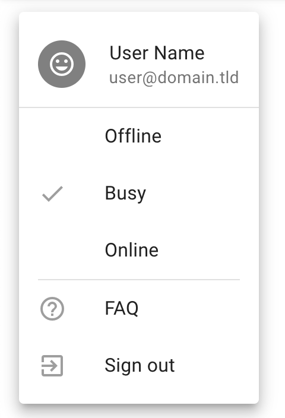
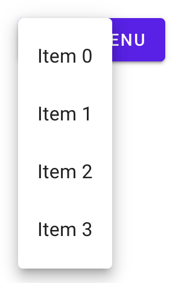
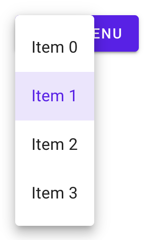
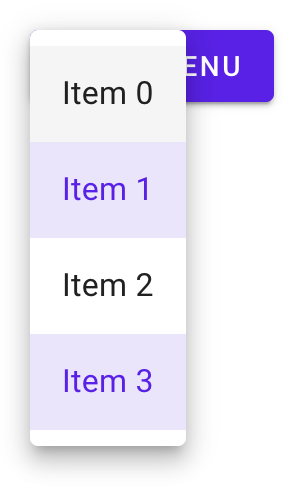
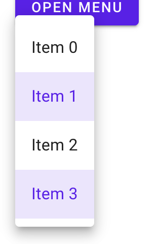
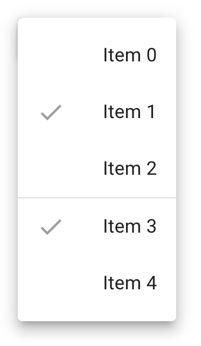
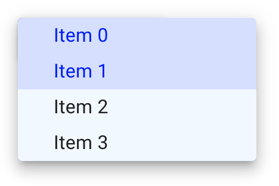

# `<mwc-menu>` [](https://www.npmjs.com/package/@material/mwc-menu)
> IMPORTANT: The Material Web Components are a work in progress and subject to
> major changes until 1.0 release.

Menus display a list of choices on temporary surfaces.



[Material Design Guidelines: menus](https://material.io/design/components/menus.html)

[Demo](https://material-components.github.io/material-web/demos/menu/)

## Installation

```sh
npm install @material/mwc-menu
```

> NOTE: The Material Web Components are distributed as ES2017 JavaScript
> Modules, and use the Custom Elements API. They are compatible with all modern
> browsers including Chrome, Firefox, Safari, Edge, and IE11, but an additional
> tooling step is required to resolve *bare module specifiers*, as well as
> transpilation and polyfills for IE11. See
> [here](https://github.com/material-components/material-components-web-components#quick-start)
> for detailed instructions.

## Example usage

### Basic

Note, `mwc-menu` internally uses
[`mwc-list`](https://github.com/material-components/material-components-web-components/tree/master/packages/list),
so its main slot has the same interface as the main slot of a `mwc-list`.



```html
<div style="position: relative;">
  <mwc-button id="button" raised label="Open Menu"></mwc-button>
  <mwc-menu id="menu">
    <mwc-list-item>Item 0</mwc-list-item>
    <mwc-list-item>Item 1</mwc-list-item>
    <mwc-list-item>Item 2</mwc-list-item>
    <mwc-list-item>Item 3</mwc-list-item>
  </mwc-menu>
</div>

<script type="module">
  import '@material/mwc-menu';
  import '@material/mwc-list/mwc-list-item';

  // anchor must share a parent with menu that is `position: relative`
  menu.anchor = button;

  button.addEventListener('click', function (e) {
    menu.open = true;
    // alternatively you can use menu.show();
  });
</script>
```

### Activatable



```html
<div style="position: relative;">
  <mwc-button id="button" raised label="Open Menu"></mwc-button>
  <mwc-menu activatable id="menu">
    <mwc-list-item>Item 0</mwc-list-item>
    <mwc-list-item selected activated>Item 1</mwc-list-item>
    <mwc-list-item>Item 2</mwc-list-item>
    <mwc-list-item>Item 3</mwc-list-item>
  </mwc-menu>
</div>
```

### Multi-selectable (activatable)



```html
<div style="position: relative;">
  <mwc-button id="button" raised label="Open Menu"></mwc-button>
  <mwc-menu activatable multi id="menu">
    <mwc-list-item>Item 0</mwc-list-item>
    <mwc-list-item selected activated>Item 1</mwc-list-item>
    <mwc-list-item>Item 2</mwc-list-item>
    <mwc-list-item selected activated>Item 3</mwc-list-item>
  </mwc-menu>
</div>
```

### Absolute


```html
<!--
  Note: no position: relative; This will make x and y relative to whatever
  ancestor is position: relative;
-->
<div>
  <mwc-button id="button" raised label="Open Menu"></mwc-button>
  <mwc-menu absolute x="50" y="100" id="menu">
    <mwc-list-item>Item 0</mwc-list-item>
    <mwc-list-item>Item 1</mwc-list-item>
    <mwc-list-item>Item 2</mwc-list-item>
    <mwc-list-item>Item 3</mwc-list-item>
  </mwc-menu>
</div>
<!-- No anchor associated -->
```

### Fixed



```html
<div>
  <mwc-button id="button" raised label="Open Menu"></mwc-button>
  <mwc-menu fixed id="menu">
    <mwc-list-item>Item 0</mwc-list-item>
    <mwc-list-item>Item 1</mwc-list-item>
    <mwc-list-item>Item 2</mwc-list-item>
    <mwc-list-item>Item 3</mwc-list-item>
  </mwc-menu>
</div>
<script type="module">
  import '@material/mwc-menu';
  import '@material/mwc-list/mwc-list-item';

  menu.anchor = button;

  button.addEventListener('click', function (e) {
    menu.open = true;
    // alternatively you can use menu.show();
  });
</script>
```

### Selection Groups

Adding a `group` to your `mwc-list-item`s will associate them with other
`[mwc-list-item]`s in the same group and make selection function similarly to
a radio group.



```html
<style>
  /* Hide the icon of unselected menu items that are in a group */
  #menu > [mwc-list-item][group]:not([selected]) [slot="graphic"] {
    display: none;
  }
</style>
<div style="position:relative;">
  <mwc-button id="button" raised label="Open Menu"></mwc-button>

  <mwc-menu multi id="menu">
    <mwc-list-item group="a" graphic="icon">
      <mwc-icon slot="graphic">check</mwc-icon>
      <span>Item 0</span>
    </mwc-list-item>
    <mwc-list-item group="a" graphic="icon" selected>
      <mwc-icon slot="graphic">check</mwc-icon>
      <span>Item 1</span>
    </mwc-list-item>
    <mwc-list-item group="a" graphic="icon">
      <mwc-icon slot="graphic">check</mwc-icon>
      <span>Item 2</span>
    </mwc-list-item>
    <li divider role="separator"></li>
    <mwc-list-item group="b" graphic="icon" selected>
      <mwc-icon slot="graphic">check</mwc-icon>
      <span>Item 3</span>
    </mwc-list-item>
    <mwc-list-item group="b" graphic="icon">
      <mwc-icon slot="graphic">check</mwc-icon>
      <span>Item 4</span>
    </mwc-list-item>
  </mwc-menu>
</div>
```

### Styled

`mwc-menu` internally uses
[`mwc-list`](https://github.com/material-components/material-components-web-components/tree/master/packages/list),
and all CSS custom properties exposed by `mwc-list` apply here as well.



```html
<style>
  #menu {
    --mdc-menu-min-width: 200px;
    --mdc-menu-item-height: 30px;
    --mdc-theme-surface: aliceblue;

    /* inherits the styles of mwc-list internally */
    --mdc-theme-primary: blue;
    --mdc-list-vertical-padding: 0px;
    --mdc-list-side-padding: 30px;
  }
</style>
<div style="position: relative;">
  <mwc-button id="button" raised label="Open Menu"></mwc-button>
  <mwc-menu activatable multi id="menu">
    <mwc-list-item selected activated>Item 0</mwc-list-item>
    <mwc-list-item selected activated>Item 1</mwc-list-item>
    <mwc-list-item>Item 2</mwc-list-item>
    <mwc-list-item>Item 3</mwc-list-item>
  </mwc-menu>
</div>
```

## API

### Slots

| Name              |	Description
| ----------------- | -------------
| _default_         |	Content to display in the menus internal `<mwc-list>` element.

`mwc-menu` internally uses
[`mwc-list`](https://github.com/material-components/material-components-web-components/tree/master/packages/list),
so the default slot has the same interface as the default slot of `mwc-list`.

### Properties/Attributes

Name                  | Type                              | Default       | Description
--------------------- | --------------------------------- | ------------- | -----------
`open`                | `boolean`                         | `false`       | Whether the menu should open and display.
`anchor`              | `HTMLElement\|null`               | `null`        | Determines from which element the floating menu should calculate sizing and position offsets. In the default case, both `mwc-menu` and the anchor should share a parent with `position:relative`. Changing anchor typically requires `absolute` or `fixed`.
`corner`              | `Corner`*                         | `"TOP_START"` | Corner of the anchor from which the menu should position itself.
`menuCorner`          | `MenuCorner`\*\*                  | `"START"`     | Horizontal corner of the menu from which the menu should position itself. **NOTE:** Only horizontal corners are supported.
`quick`               | `boolean`                         | `false`       | Whether to skip the opening animation.
`absolute`            | `boolean`                         | `false`       | Makes the menu's position `absolute` which will be relative to whichever ancestor has `position:relative`. Setting `x` and `y` will modify the menu's `left` and `top`. Setting `anchor` will attempt to position the menu to the `anchor`.
`fixed`               | `boolean`                         | `false`       | Makes the menu's position `fixed` which will be relative to the window. Setting `x` and `y` will modify the menu's `left` and `top`. Setting `anchor` will attempt to position the menu to the `anchor`'s immediate position before opening.
`x`                   | `number\|null`                    | `null`        | Sets horizontal position when `absolute`. When given an `anchor`, sets horizontal position relative to `anchor` at given `corner`. Requires `y` not to be null.
`y`                   | `number\|null`                    | `null`        | Sets vertical position when `absolute`. When given an `anchor`, sets vertical position relative to `anchor` at given `corner`. Requires `x` not to be null.
`forceGroupSelection` | `boolean`                         | `false`       | Forces a menu group to have a selected item by preventing deselection of menu items in menu groups via user interaction.
`defaultFocus`        | `DefaultFocusState`\*\*\*         | `"LIST_ROOT"` | Item to focus upon menu open.
`fullwidth`           | `boolean`                         | `false`       | Sets surface width to 100%.
`stayOpenOnBodyClick` | `boolean`                         | `false`       | Prevents the menu from closing when clicking outside the menu.
`wrapFocus`           | `boolean`                         | `false`       | Proxies to [`mwc-list`'s](https://github.com/material-components/material-components-web-components/tree/master/packages/list#mwc-list-1) `wrapFocus` property.
`innerAriaLabel`      | `string\|null`                    | `null`        | Proxies to [`mwc-list`'s](https://github.com/material-components/material-components-web-components/tree/master/packages/list#mwc-list-1) `innerAriaLabel` property.
`innerRole`           | `"menu"\|"listbox"`               | `"menu"`      | Proxies to [`mwc-list`'s](https://github.com/material-components/material-components-web-components/tree/master/packages/list#mwc-list-1) `innerRole` property.
`multi`               | `boolean`                         | `false`       | Proxies to [`mwc-list`'s](https://github.com/material-components/material-components-web-components/tree/master/packages/list#mwc-list-1) `multi` property.
`activatable`         | `boolean`                         | `false`       | Proxies to [`mwc-list`'s](https://github.com/material-components/material-components-web-components/tree/master/packages/list#mwc-list-1) `activatable` property.
`items`               | `ListItemBase[]` (readonly)       | `[]`          | Proxies to [`mwc-list`'s](https://github.com/material-components/material-components-web-components/tree/master/packages/list#mwc-list-1) `items` property.
`index`               | `MWCListIndex` (readonly)\*\*\*\*   | `-1`          | Proxies to [`mwc-list`'s](https://github.com/material-components/material-components-web-components/tree/master/packages/list#mwc-list-1) `index` property.
`selected`            | `SelectedType` (readonly)\*\*\*\*\* | `null`        | Proxies to [`mwc-list`'s](https://github.com/material-components/material-components-web-components/tree/master/packages/list#mwc-list-1) `selected` property.

\* `Corner` is equivalent to type
`"TOP_LEFT"|"TOP_RIGHT"|"BOTTOM_LEFT"|"BOTTOM_RIGHT"|"TOP_START"|"TOP_END" |"BOTTOM_START"|"BOTTOM_END"`

\*\* `Corner` is equivalent to type `"START"|"END"`

\*\*\* `DefaultFocusState` is equivalent to type
`"NONE"|"LIST_ROOT"|"FIRST_ITEM"|"LAST_ITEM"`

\*\*\*\* `MWCListIndex` is equivalent to type `number|Set<number>`.

\*\*\*\*\* `SelectedType` is equivaalent to type `ListItemBase|ListItemBase[]|null`.
`ListItemBase` is the base class of `mwc-list-item` of which both
`mwc-check-list-item` and `mwc-radio-list-item` also inherit from.

### Methods

| Name     | Description
| -------- | -------------
| `show() => void`  | Sets `open` to true.
| `close() => void` | Sets `open` to false.
| `select(index: MWCMenuIndex) => void` | Selects the elements at the given index / indices.
| `getFocusedItemIndex() => number` | Returns the index of the currently-focused item. `-1` if none are focused.
| `focusItemAtIndex(index) => void` | Focuses the item at the given index and manages tabindex on all other items.
| `layout(updateItems = true) => void` | Resets tabindex on all items and will update `items` model if provided true. It may be required to call layout if selectability of an element is dynamically changed. e.g. `[mwc-list-item]` attribute is removed from a list item or `noninteractive` is dynamically set on a list item.

### Events

| Event Name | Target             | Detail             | Description
| ---------- | ------------------ | ------------------ | -----------
| `opened`   | `mwc-menu-surface` | none               | Fired when opened.
| `closing`  | `mwc-menu-surface` | none               | Fired when closing but animation may not have completed yet. Use for time-sensitive logic that must be run immediately upon close.
| `closed`   | `mwc-menu-surface` | none               | Fired when closed.
| `action`   | `mwc-list`         | `ActionDetail`*    | Fired when a selection has been made via click or keyboard aciton.
| `selected` | `mwc-list`         | `SelectedDetail`*  | Fired when a selection has been made. `index` is the selected index (will be of type `Set<number>` if multi and `number` if single), and `diff` (of type `IndexDiff`**) represents the diff of added and removed indices from previous selection.

\* See
[`mwc-list`'s Events section](https://github.com/material-components/material-components-web-components/tree/master/packages/list#mwc-list-2) for more details.

### CSS Custom Properties

`mwc-menu` inherits from `mwc-list`, so all custom properties from `mwc-list`
propagate through `mwc-menu`.

| Name                     | Default | Description
| ------------------------ | ------- |------------
| `--mdc-menu-item-height` | `48px`  | Height of single-line list-items in the menu.
| `--mdc-menu-min-width`   | `112px` | Menu min-width.
| `--mdc-menu-max-width`   | `calc(100vw - 32px)` | Menu max-width.
| `--mdc-menu-max-height`  | `calc(100vh - 32px)` | Menu max-height.
| `--mdc-menu-z-index`     | `8`     | Z-index of the popup menu surface.

`mwc-menu` internally uses
[`mwc-list`](https://github.com/material-components/material-components-web-components/tree/master/packages/list#css-custom-properties),
see the
[styling documentation](https://github.com/material-components/material-components-web-components/tree/master/packages/list#css-custom-properties)
for further details.

#### Global Custom Properties

This component exposes the following global [theming](https://github.com/material-components/material-components-web-components/blob/master/docs/theming.md)
custom properties.

| Name                                 | Description
| ------------------------------------ | -----------
| `--mdc-theme-surface`                | Color of the menu surface.
| `--mdc-shape-medium`                 | Border radius of the dropdown.

## Additional references

- [MDC Web menus](https://material.io/develop/web/components/menus/)
