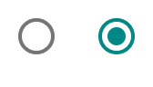
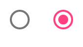

# `<mwc-radio>` [](https://www.npmjs.com/package/@material/mwc-radio)

> IMPORTANT: The Material Web Components are a work in progress and subject to
> major changes until 1.0 release.

Radio buttons allow the user to select one option from a set. Use radio buttons when the user needs to see all available options.



[Material Design Guidelines: Radio buttons](https://material.io/design/components/selection-controls.html#radio-buttons)

## Installation

```sh
npm install @material/mwc-radio
```

> NOTE: The Material Web Components are distributed as ES2017 JavaScript
> Modules, and use the Custom Elements API. They are compatible with all modern
> browsers including Chrome, Firefox, Safari, Edge, and IE11, but an additional
> tooling step is required to resolve *bare module specifiers*, as well as
> transpilation and polyfills for Edge and IE11. See
> [here](https://github.com/material-components/material-components-web-components#quick-start)
> for detailed instructions.

## Example usage

### Standard


```html
<mwc-radio name="myGroup" value="value1"></mwc-radio>
<mwc-radio name="myGroup" value="value2" checked></mwc-radio>

<script type="module">
  import '@material/mwc-radio';
</script>
```

### Custom color



```html
<style>
body {
  background-color: #363636;

  --mdc-theme-secondary: #ff2929;
  --mdc-radio-unchecked-color: white;
}
</style>

<mwc-radio name="myGroup" checked></mwc-radio>
<mwc-radio name="myGroup"></mwc-radio>
```

### Disabled custom color


```html
<style>
body {
  background-color: #363636;

  --mdc-radio-disabled-color: #adadad;
}
</style>

<mwc-radio disabled name="myGroup"></mwc-radio>
<mwc-radio disabled name="myGroup" checked></mwc-radio>
```

### With Form Field

Most applications should use
[`<mwc-formfield>`](https://github.com/material-components/material-components-web-components/tree/master/packages/formfield)
to associate an interactive label with the radio.


```html
<style>
  mwc-formfield {
    display: block;
  }
</style>

<mwc-formfield label="Home">
  <mwc-radio name="location"></mwc-radio>
</mwc-formfield>

<mwc-formfield label="Work">
  <mwc-radio name="location"></mwc-radio>
</mwc-formfield>

<script type="module">
  import '@material/mwc-radio';
  import '@material/mwc-formfield';
</script>
```

## API

### Slots
*None*

### Properties/Attributes

| Name            | Type      | Default | Description
| --------------- | --------- |-------- | -----------
| `checked`       | `boolean` | `false` | Whether this radio button is the currently-selected one in its group. Maps to the native [`checked`](https://developer.mozilla.org/en-US/docs/Web/HTML/Element/input/radio#checked) attribute.
| `disabled`      | `boolean` | `false` | If `true`, this radio button cannot be selected or de-selected. Maps to the native [`disabled`](https://developer.mozilla.org/en-US/docs/Web/HTML/Element/input#disabled) attribute.
| `name`          | `string`  | `''`    | Name of the input for form submission, and identifier for the selection group. Only one radio button can be checked for a given selection group. Maps to the native [`name`](https://developer.mozilla.org/en-US/docs/Web/HTML/Element/input#name) attribute.
| `value`         | `string`  | `''`    | Value of the input for form submission. Maps to the native [`value`](https://developer.mozilla.org/en-US/docs/Web/HTML/Element/input/radio#value) attribute.
| `global`        | `boolean` | `false` | If `true`, this radio button will use a global, document-level scope for its selection group rather than its local shadow root.

### Methods
*None*

### Events
| Name     | Detail | Description
| ---------| ------ | -----------
| `change` | `{}`   | Fired when the user modifies the radio `checked` state from an input device interaction on this radio. Note that, like [native `<input>`](https://developer.mozilla.org/en-US/docs/Web/API/HTMLElement/change_event), the `change` event is *not* fired when the `checked` property is set from JavaScript, nor is it fired when another radio in the same group becomes `checked`.


### CSS Custom Properties

| Name                    | Default                                | Description
| ----------------------- | -------------------------------------- |------------
| `--mdc-theme-secondary` |  `#018786` | Color of the radio button.
| `--mdc-radio-unchecked-color` |  `rgba(0, 0, 0, 0.54)` | Color of the ring of an unchecked radio.
| `--mdc-radio-disabled-color` |  `rgba(0, 0, 0, 0.38)` | Color of the ring and circle of a disabled radio.

## Additional references

- [MDC Web: Radio Buttons](https://material.io/develop/web/components/input-controls/radio-buttons/)
