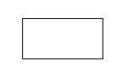
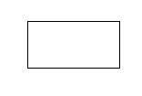

# `<mwc-ripple>` [](https://www.npmjs.com/package/@material/mwc-ripple)

> IMPORTANT: The Material Web Components are a work in progress and subject to
> major changes until 1.0 release.

Ripple provides the JavaScript and CSS required to provide components (or any element at all) with a material "ink ripple" interaction effect.

[Material Design Guidelines: States](https://material.io/design/interaction/states.html)

[Demo](https://material-components.github.io/material-components-web-components/demos/ripple/)

## Installation

```sh
npm install @material/mwc-ripple
```

> NOTE: The Material Web Components are distributed as ES2017 JavaScript
> Modules, and use the Custom Elements API. They are compatible with all modern
> browsers including Chrome, Firefox, Safari, Edge, and IE11, but an additional
> tooling step is required to resolve *bare module specifiers*, as well as
> transpilation and polyfills for IE11. See
> [here](https://github.com/material-components/material-components-web-components#quick-start)
> for detailed instructions.

## Example Usage

### Standard



```html
<mwc-ripple></mwc-ripple>
```

### Unbounded



```html
<mwc-ripple unbounded></mwc-ripple>
```

<!--
TODO(dfreedm): add examples when list-item has activated and selected states
### Selected

```html
<mwc-ripple selected></mwc-ripple>
```

### Activated

```html
<mwc-ripple activated></mwc-ripple>
```
-->

## API

### Properties/Attributes

Name | Type | Default | Description
---- | ---- | ------- | -----------
`primary` | `boolean` | `false` | When true, sets the ripple color to `--mdc-theme-primary`. Will be overridden by `--mdc-ripple-color` if set.
`accent` | `boolean` | `false` | When true, sets the ripple color to `--mdc-theme-secondary`. Will be overridden by `--mdc-ripple-color` if set.
`unbounded` | `boolean` | `false` | When true, the ripple will flow outside the component in a circle.
`activated` | `boolean` | `false` | Set true when the container of the ripple should be in an [`activated`](https://material.io/design/interaction/states.html#activated) state.
`selected` | `boolean` | `false` | Set true when the container of the ripple should be in a [`selected`](https://material.io/design/interaction/states.html#selected) state.
`disabled` | `boolean` | `false` | Set true to disable the ripple when the container of the ripple is disabled.

### Methods

| Name | Description
| ---- | -----------
| `startPress(event?: Event) => void` | Begin the `press` state of the ripple. Optional `Event` will be used to determine the beginning coordinates of the ripple animation when `unbounded` is false.
| `endPress() => void` | End the `press` state of the ripple.
| `startFocus() => void` | Begin the `focus` state of the ripple.
| `endFocus() => void` | End the `focus` state of the ripple.
| `startHover() => void` | Begin the `hover` state of the ripple.
| `endHover() => void` | End the `hover` state of the ripple.


### CSS Custom Properties

| Name | Default | Description
| ---- | ------- | -----------
| `--mdc-ripple-color` |  `#000` | Color of the ripple will have when activated.
| `--mdc-ripple-press-opacity` | `0.12` | Opacity of the ripple when pressed.
| `--mdc-ripple-hover-opacity` | `0.04` | Opacity of the ripple when hovered.
| `--mdc-ripple-focus-opacity` | `0.12` | Opacity of the ripple when focused.
| `--mdc-ripple-selected-opacity` | `0.08` | Opacity of the ripple when the host component is "selected". This opacity is added to `press`, `hover`, and `focus` states.
| `--mdc-ripple-activated-opacity` | `0.12` | Opacity of the ripple when the host component is "activated". This opacity is added to `press`, `hover`, and `focus` states.
| `--m-ripple-z-index` | `0` | Z-index of the ripple.
