# `<mwc-select>` [](https://www.npmjs.com/package/@material/mwc-select)
> IMPORTANT: The Material Web Components are a work in progress and subject to
> major changes until 1.0 release.

Selects display a list of choices on temporary surfaces.

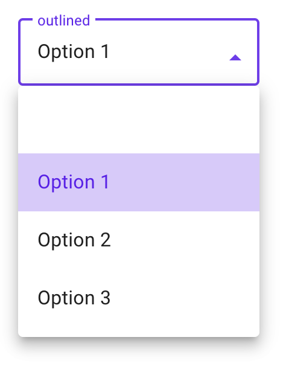

[Material Design Guidelines: exposed dropdown menus](https://material.io/components/menus/#exposed-dropdown-menu)

[Demo](https://material-components.github.io/material-components-web-components/demos/select/)

## Installation

```sh
npm install @material/mwc-select
```

> NOTE: The Material Web Components are distributed as ES2017 JavaScript
> Modules, and use the Custom Elements API. They are compatible with all modern
> browsers including Chrome, Firefox, Safari, Edge, and IE11, but an additional
> tooling step is required to resolve *bare module specifiers*, as well as
> transpilation and polyfills for IE11. See
> [here](https://github.com/material-components/material-components-web-components#quick-start)
> for detailed instructions.

## Example usage

### Basic (filled)

Note, `mwc-select` internally uses
[`mwc-list`](https://github.com/material-components/material-components-web-components/tree/master/packages/list), so
its main slot has the same interface as the main slot of a `mwc-list`.

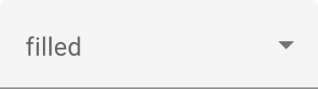
<br>


```html
<mwc-select label="filled">
  <mwc-list-item></mwc-list-item>
  <mwc-list-item value="0">Item 0</mwc-list-item>
  <mwc-list-item value="1">Item 1</mwc-list-item>
  <mwc-list-item value="2">Item 2</mwc-list-item>
  <mwc-list-item value="3">Item 3</mwc-list-item>
</mwc-select>

<script type="module">
  import '@material/mwc-select';
  import '@material/mwc-list/mwc-list-item';
</script>
```

### Outlined

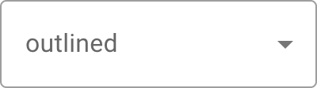
<br>
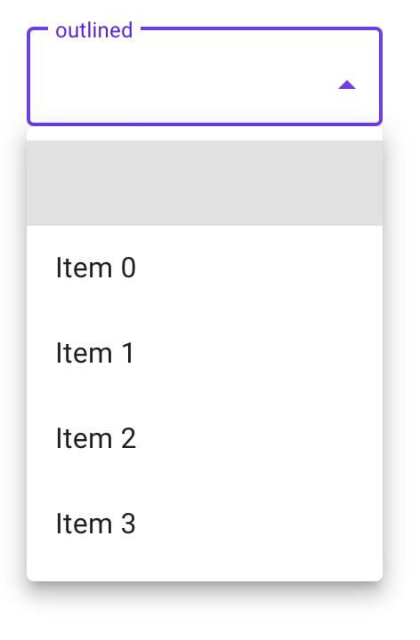

```html
<mwc-select outlined label="outlined">
  <mwc-list-item></mwc-list-item>
  <mwc-list-item value="0">Item 0</mwc-list-item>
  <mwc-list-item value="1">Item 1</mwc-list-item>
  <mwc-list-item value="2">Item 2</mwc-list-item>
  <mwc-list-item value="3">Item 3</mwc-list-item>
</mwc-select>
```

### Preselected

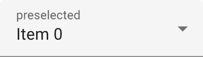
<br>
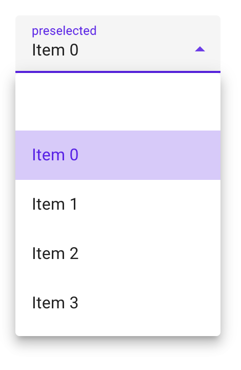

```html
<mwc-select label="preselected">
  <mwc-list-item></mwc-list-item>
  <mwc-list-item selected value="0">Item 0</mwc-list-item>
  <mwc-list-item value="1">Item 1</mwc-list-item>
  <mwc-list-item value="2">Item 2</mwc-list-item>
  <mwc-list-item value="3">Item 3</mwc-list-item>
</mwc-select>
```

### Icon

Icon is a material-icons font name. Additionally, all options must have
`graphic="icon"` defined to enable proper spacing.

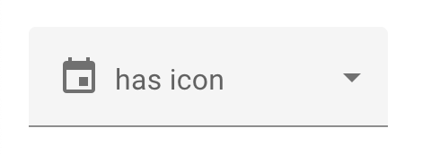
<br>
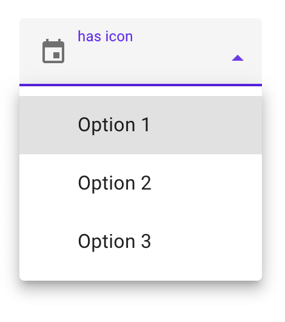

```html
<mwc-select label="has icon" icon="event">
  <mwc-list-item graphic="icon" value="1">Option 1</mwc-list-item>
  <mwc-list-item graphic="icon" value="2">Option 2</mwc-list-item>
  <mwc-list-item graphic="icon" value="3">Option 3</mwc-list-item>
</mwc-select>
```

### Required (error, validation message)

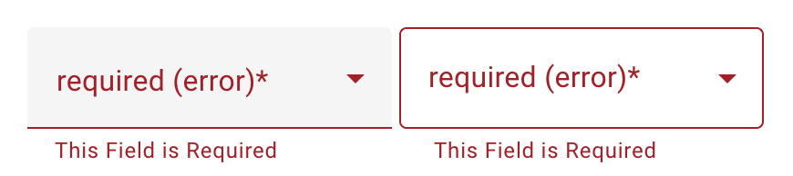
<br>
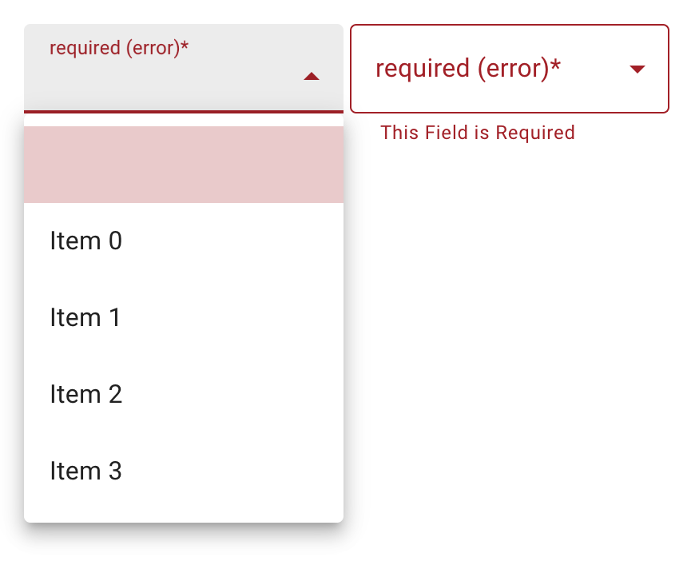

```html
<mwc-select
    required
    validationMessage="This Field is Required"
    label="required (error)">
  <mwc-list-item selected></mwc-list-item>
  <mwc-list-item value="0">Item 0</mwc-list-item>
  <mwc-list-item value="1">Item 1</mwc-list-item>
  <mwc-list-item value="2">Item 2</mwc-list-item>
  <mwc-list-item value="3">Item 3</mwc-list-item>
</mwc-select>
<mwc-select
    required
    validationMessage="This Field is Required"
    outlined
    label="required (error)">
  <mwc-list-item selected></mwc-list-item>
  <mwc-list-item value="0">Item 0</mwc-list-item>
  <mwc-list-item value="1">Item 1</mwc-list-item>
  <mwc-list-item value="2">Item 2</mwc-list-item>
  <mwc-list-item value="3">Item 3</mwc-list-item>
</mwc-select>
```

### Helper Text

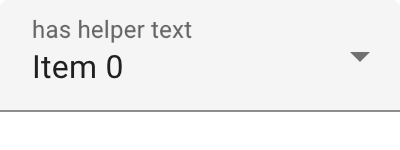
<br>
focused:
<br>
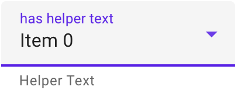
<br>
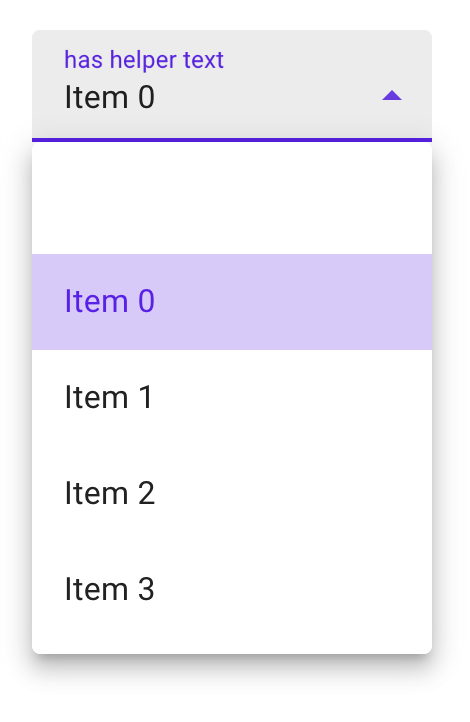

```html
<mwc-select
    label="has helper text"
    helper="Helper Text">
  <mwc-list-item></mwc-list-item>
  <mwc-list-item selected value="0">Item 0</mwc-list-item>
  <mwc-list-item value="1">Item 1</mwc-list-item>
  <mwc-list-item value="2">Item 2</mwc-list-item>
  <mwc-list-item value="3">Item 3</mwc-list-item>
</mwc-select>
```

### Styled

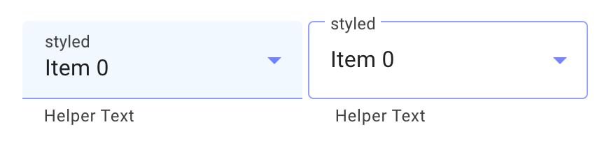
<br>
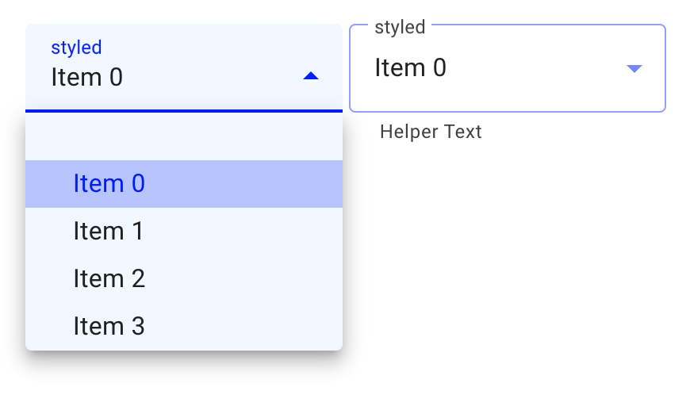

```html
<style>
  mwc-select {
    --mdc-theme-primary: blue;
    --mdc-select-fill-color: aliceblue;
    --mdc-select-label-ink-color: rgba(0, 0, 0, 0.75);
    --mdc-select-dropdown-icon-color: blue;

    --mdc-select-idle-line-color: rgba(0, 0, 255, 0.42);
    --mdc-select-hover-line-color: rgba(0, 0, 255, 0.87);

    --mdc-select-outlined-idle-border-color: rgba(0, 0, 255, 0.42);
    --mdc-select-outlined-hover-border-color: rgba(0, 0, 255, 0.87);

    /* inherits the styles of mwc-menu internally */
    --mdc-menu-item-height: 30px;
    --mdc-theme-surface: aliceblue;

    /* inherits the styles of mwc-list internally */
    --mdc-list-vertical-padding: 0px;
    --mdc-list-side-padding: 30px;
  }
</style>
<mwc-select helper="Helper Text" label="styled">
  <mwc-list-item></mwc-list-item>
  <mwc-list-item selected value="0">Item 0</mwc-list-item>
  <mwc-list-item value="1">Item 1</mwc-list-item>
  <mwc-list-item value="2">Item 2</mwc-list-item>
  <mwc-list-item value="3">Item 3</mwc-list-item>
</mwc-select>
<mwc-select outlined helper="Helper Text" label="styled">
  <mwc-list-item></mwc-list-item>
  <mwc-list-item selected value="0">Item 0</mwc-list-item>
  <mwc-list-item value="1">Item 1</mwc-list-item>
  <mwc-list-item value="2">Item 2</mwc-list-item>
  <mwc-list-item value="3">Item 3</mwc-list-item>
</mwc-select>
```

## API

### Slots

Name      | Description
--------- | ----------------------------------------------------------------
_default_ | Content to display in the selects internal `<mwc-menu>` element.

`mwc-select` internally uses
[`mwc-list`](https://github.com/material-components/material-components-web-components/tree/master/packages/list), so
the default slot has the same interface as the default slot of `mwc-list`.

### Properties/Attributes

Name                      | Type                          | Default            | Description
------------------------- | ----------------------------- | ------------------ | -----------
`value`                   | `string`                      | `""`               | The select control's value determined by the `value` property of the currently selected list item. Setting value will attempt to select a list-item with the same value. If one does not match, it will set itself to `""` and the `index` to `-1`. Setting `value` before the list item is attached will not select the item.
`label`                   | `string`                      | `""`               | Sets floating label value. __NOTE:__ The label will not float if the selected item has a falsey value property.
`naturalMenuWidth`        | `string`                      | `false`            | Sets the dropdown menu's width to `auto`.
`fixedMenuPosition`       | `boolean`                     | `false`            | Sets the dropdown menu's position to `fixed`. This is useful when the select is inside of a stacking context e.g. inside of an `mwc-dialog`. Note, that [`--mdc-menu-min-width`](https://github.com/material-components/material-components-web-components/tree/master/packages/menu#css-custom-properties) or [`--mdc-menu-max-width`](https://github.com/material-components/material-components-web-components/tree/master/packages/menu#css-custom-properties) may have to be set to resize the menu to the width anchor.
`icon`                    | `string`                      | `""`               | Leading icon to display in select. See [`mwc-icon`](https://github.com/material-components/material-components-web-components/tree/master/packages/icon). _Note_: for proper list spacing, each list item must have `graphic="icon"` or `graphic="avatar"` to be set.
`disabled`                | `boolean`                     | `false`            | Whether or not the select should be disabled.
`outlined`                | `boolean`                     | `false`            | Whether or not to show the material outlined variant.
`helper`                  | `string`                      | `""`               | Helper text to display below the select. Always displays by default.
`required`                | `boolean`                     | `false`            | Displays error state if value is empty and select is blurred.
`validationMessage`       | `string`                      | `""`               | Message to show in the error color when the select is invalid. (Helper text will not be visible)
`selected`                | `ListItemBase`\|`null`        | `null`             | Selected list item element.
`items`                   | `ListItemBase[]`              | `[]`               | List of selectable items.
`index`                   | `number`                      | `-1`               | Index of selected list item.
`validity`                | `ValidityState` (readonly)    | `DefaultValidity`* | The [`ValidityState`](https://developer.mozilla.org/en-US/docs/Web/API/ValidityState) of the select.
`validityTransform`       | `ValidityTransform`**\|`null` | `null`             | Callback called before each validation check. See the [mwc-textfield's validation section](https://github.com/material-components/material-components-web-components/tree/master/packages/textfield#validation) for more details.
`validateOnInitialRender` | `boolean`                     | `false`            | Runs validation check on initial render.

\* `DefaultValidity` is: `ts { badInput: false, customError: false,
patternMismatch: false, rangeOverflow: false, rangeUnderflow: false,
stepMismatch: false, tooLong: false, tooShort: false, typeMismatch: false,
valid: true, valueMissing: false, }`

\** See
[`mwc-textfield`'s properties section](https://github.com/material-components/material-components-web-components/tree/master/packages/textfield#propertiesattributes)
for more info.

### Methods

Name                                          | Description
--------------------------------------------- | -----------
`checkValidity() => boolean`                  | Returns `true` if the select passes validity checks. Returns `false` and fires an [`invalid`](https://developer.mozilla.org/en-US/docs/Web/API/HTMLInputElement/invalid_event) event on the select otherwise. <br>**NOTE:** When accessing any property or function that checks validity at select initial boot up, you may have to await `<mwc-select>.updateComplete`.
`reportValidity() => boolean`                 | Runs `checkValidity()` method, and if it returns false, then it reports to the user that the input is invalid.
`setCustomValidity(message:string) => void`   | Sets a custom validity message (also overwrites `validationMessage`). If this message is not the empty string, then the element is suffering from a custom validity error and does not validate.
`select(index: number) => void`               | Selects the element at the given index.
`layout(updateItems = true) => Promise<void>` | Resets tabindex on all items and will update `items` model if provided true. It may be required to call layout if selectability of an element is dynamically changed. e.g. `[mwc-list-item]` attribute is removed from a list item or `noninteractive` is dynamically set on a list item. Also re-calculates layout. If a select is styled with `display:none` before it is first rendered, and it has a label that is floating, then you must call `layout()` the first time you remove `display:none`, or else the notch surrounding the label will not render correctly.

### Events

| Event Name | Target               | Detail            | Description          |
| ---------- | -------------------- | ----------------- | -------------------- |
| `opened`   | `mwc-select-surface` | none              | Fired menu opens.    |
| `closed`   | `mwc-select-surface` | none              | Fired menu closes.   |
| `action`   | `mwc-list`           | `ActionDetail`*   | Fired when a selection has been made via click or keyboard action. |
| `selected` | `mwc-list`           | `SelectedDetail`* | Fired when a selection has been made. Property `index` is the selected index (will  be of type `number`) |

\* See
[`mwc-list`'s Events section](https://github.com/material-components/material-components-web-components/tree/master/packages/list#mwc-list-2)
for more details.

### CSS Custom Properties

`mwc-select` internally uses both `mwc-menu` and `mwc-list`, so all custom
properties from `mwc-menu` and `mwc-list` propagate through `mwc-select`.

Name                                          | Default                                                       | Description
--------------------------------------------- | ------------------------------------------------------------- | -----------
`--mdc-select-error-color`                    | `--mdc-theme-error`                                           | Applies where --mdc-theme-error applies.
`--mdc-select-idle-line-color`                |  `rgba(0, 0, 0, 0.42)`   | Color of the filled select's bottom line when idle.
`--mdc-select-hover-line-color`               |  `rgba(0, 0, 0, 0.87)`   | Color of the filled select's bottom line when hovering.
`--mdc-select-outlined-idle-border-color`     |  `rgba(0, 0, 0, 0.38)`   | Color of the outlined select's outline when idle.
`--mdc-select-outlined-hover-border-color`    |  `rgba(0, 0, 0, 0.87)`   | Color of the outlined select's outline when hovering.
`--mdc-select-outlined-disabled-border-color` |  `rgba(0, 0, 0, 0.16)`   | Color of the outlined select's outline when disabled.
`--mdc-select-fill-color`                     |  `rgb(245, 245, 245)` | Color of the select's background fill (non-outlined).
`--mdc-select-disabled-fill-color`            |  `rgb(250, 250, 250)` | Color of the select's background fill (non-outlined) when disabled.
`--mdc-select-ink-color`                      |  `rgba(0, 0, 0, 0.87)`   | Color of the selected text in default and error states.
`--mdc-select-label-ink-color`                |  `rgba(0, 0, 0, 0.6)`    | Color of the non-focused floating label, helper text, and placeholder.
`--mdc-select-focused-label-color`            | `--mdc-theme-primary`                                         | Color of the focused floating label, helper text, and placeholder.
`--mdc-select-disabled-ink-color`             |  `rgba(0, 0, 0, 0.37)`   | Color of the input text, the floating label, helper text, and placeholder of a disabled select.
`--mdc-select-dropdown-icon-color`            | `rgba(0, 0, 0, 0.54)`                                         | Color of the dropdown icon when select is not activated.
`--mdc-select-focused-dropdown-icon-color`    | `--mdc-theme-primary`                                         | Color of the dropdown icon when select is activated.
`--mdc-select-disabled-dropdown-icon-color`   |  `rgba(0, 0, 0, 0.38)`   | Opacity of the dropdown icon when disabled.
`--mdc-select-error-dropdown-icon-color`      | `--mdc-select-error-color`                                    | Color of the dropdown icon when select is invalid.

`mwc-select` internally uses
[`mwc-list`](https://github.com/material-components/material-components-web-components/tree/master/packages/list#css-custom-properties),
see the
[styling documentation](https://github.com/material-components/material-components-web-components/tree/master/packages/list#css-custom-properties)
for further details.

#### Global Custom Properties

This component exposes the following global [theming](https://github.com/material-components/material-components-web-components/blob/master/docs/theming.md)
custom properties.

| Name                     | Description
| ------------------------ | -----------
| `--mdc-theme-primary`    | Color when active of the underline ripple, the outline, the caret, the dropdown-icon, and the focused and activatd list items.
| `--mdc-theme-error`      | Color when errored of the underline ripple, the outline, the caret, the dropdown-icon, and the focused and activatd list items.
| `--mdc-typography-subtitle1-<PROPERTY>` | Styles the typography of the selected text.


## Additional references

-   [MDC Web menus](https://material.io/develop/web/components/menus/#exposed-dropdown-menu)
