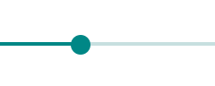
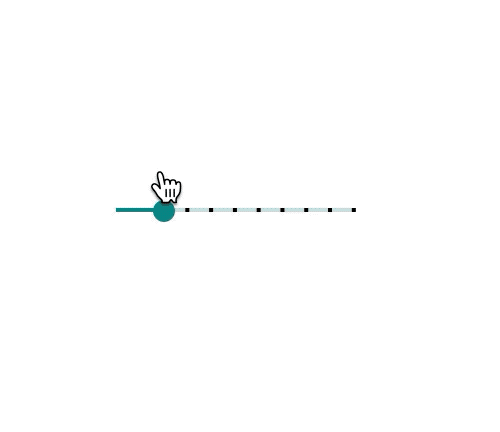
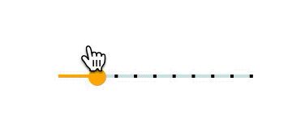

# `<mwc-slider>` [](https://www.npmjs.com/package/@material/mwc-slider)

> IMPORTANT: The Material Web Components are a work in progress and subject to
> major changes until 1.0 release.

Sliders allow users to make selections from a range of values.



[Material Design Guidelines: sliders](https://material.io/design/components/sliders.html)

[Demo](https://material-components.github.io/material-components-web-components/demos/slider/)

## Installation

```sh
npm install @material/mwc-slider
```

> NOTE: The Material Web Components are distributed as ES2017 JavaScript
> Modules, and use the Custom Elements API. They are compatible with all modern
> browsers including Chrome, Firefox, Safari, Edge, and IE11, but an additional
> tooling step is required to resolve *bare module specifiers*, as well as
> transpilation and polyfills for IE11. See
> [here](https://github.com/material-components/material-components-web-components#quick-start)
> for detailed instructions.

## Example usage

### Continuous


```html
<script type="module">
  import '@material/mwc-slider';
</script>

<mwc-slider value="25" min="10" max="50"></mwc-slider>
```

### Discrete



```html
<mwc-slider
    step="5"
    pin
    markers
    max="50"
    value="10">
</mwc-slider>
```

### Styled



```html
<style>
  mwc-slider {
    --mdc-theme-secondary: orange;
    --mdc-theme-text-primary-on-dark: green;
  }
</style>
<mwc-slider
    pin
    markers
    max="50"
    value="10"
    step="5">
</mwc-slider>
```

## API

### Properties/Attributes

| Name      | Type      | Default | Description
| --------- | --------- |-------- | -----------
| `value`   | `number`  | `0`     | Current value of the slider.
| `min`     | `number`  | `0`     | Minimum value of the slider.
| `max`     | `number`  | `100`   | Maximum value of the slider.
| `step`    | `number`  | `0`     | When defined, the slider will quantize (round to the nearest multiple) all values to match that step value, except for the minimum and maximum values, which can always be set. When 0, quantization is disabled.<br> **NOTE:** Throws when <0.
| `pin`     | `boolean` | `false` | Shows the thumb pin on a discrete slider.<br> **NOTE:** Numbers displayed inside the slider will be rounded to at most 3 decimal digits.
| `markers` | `boolean` | `false` | Shows the tick marks for each step on the track when the slider is discrete.

### Methods

| Name     | Description
| -------- | -------------
| `layout() => void` | Recomputes the dimensions and re-lays out the component. This should be called if the dimensions of the slider itself or any of its parent elements change programmatically (it is called automatically on resize and on mousedown / touchstart).

### Events

| Event Name | Target       | Detail             | Description
| ---------- | ------------ | ------------------ | -----------
| `input`    | `mwc-slider` | `Slider`           | Fired when the value changes due to user input. Similar to the [`input` event of the native `<input type="range">` element](https://developer.mozilla.org/en-US/docs/Web/API/HTMLElement/input_event), the `input` event will not fire when `value` is modified via JavaScript.
| `change`   | `mwc-slider` | `Slider`           | Fired when the value changes and the user has finished interacting with the slider. Similar to the [`change` event of the native `<input type="range">` element](https://developer.mozilla.org/en-US/docs/Web/API/HTMLElement/change_event), the `change` event will not fire when `value` is modified via JavaScript.

### CSS Custom Properties

| Name                                     | Default | Description
| ---------------------------------------- | ------- |------------
| `--mdc-theme-secondary`                  |  `#018786` | Sets the color of the knob and filled track when slider is active.
| `--mdc-theme-text-primary-on-dark`       |  `white`   | Sets the color of the text in the pin.
| `--mdc-slider-bg-color-behind-component` |  `white`   | Sets the color of the circle around the knob on the disabled slider to make it seem cut-out. May be necessary when placing a disabled slider on a different-colored background.

## Additional references

- [MDC Web sliders](https://material-components.github.io/material-components-web-catalog/#/component/slider)
