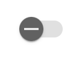
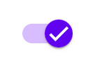
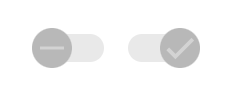
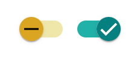
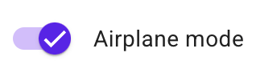

# `<mwc-switch>` [](https://www.npmjs.com/package/@material/mwc-switch)

> IMPORTANT: The Material Web Components are a work in progress and subject to
> major changes until 1.0 release.

Switches toggle the state of a single setting on or off. They are the preferred
way to adjust settings on mobile.

[Material Design Guidelines: Switch](https://material.io/components/selection-controls/#switches)

[Demo](https://material-components.github.io/material-components-web-components/demos/switch/)

## Installation

```sh
npm install @material/mwc-switch
```

> NOTE: The Material Web Components are distributed as ES2017 JavaScript
> Modules, and use the Custom Elements API. They are compatible with all modern
> browsers including Chrome, Firefox, Safari, Edge, and IE11, but an additional
> tooling step is required to resolve *bare module specifiers*, as well as
> transpilation and polyfills for IE11. See
> [here](https://github.com/material-components/material-components-web-components#quick-start)
> for detailed instructions.

## Example Usage

### Standard



```html
<mwc-switch></mwc-switch>
```

### Checked by default



```html
<mwc-switch checked></mwc-switch>
```

### Disabled



```html
<mwc-switch disabled></mwc-switch>
<mwc-switch checked disabled></mwc-switch>
```

### Styled



```html
<style>
  mwc-switch {
    --mdc-theme-surface: blue;
    --mdc-theme-on-surface: blue;
    --mdc-theme-secondary: red;
  }
</style>
<mwc-switch></mwc-switch>
<mwc-switch checked></mwc-switch>
```

### With Form Field

Most applications should use
[`<mwc-formfield>`](https://github.com/material-components/material-components-web-components/tree/master/packages/formfield)
to associate an interactive label with the switch.



```html
<mwc-formfield label="Airplane mode">
  <mwc-switch checked></mwc-switch>
</mwc-formfield>

<script type="module">
  import '@material/mwc-switch';
  import '@material/mwc-formfield';
</script>
```

## API

### Slots

*None*

### Properties/Attributes
| Name       | Type      | Default | Description
| ---------- | --------- | ------- | -----------
| `checked`  | `boolean` | `false` | Whether or not the switch should be checked / activated.
| `disabled` | `boolean` | `false` | Disables the input and sets the disabled styles.

### Methods

*None*

### Events

| Event Name | Target         | Detail | Description
| ---------- | -------------- | ------ | -----------
| `change`   | `mwc-switch`   | `{}`   | Fired when the user modifies the switch `checked` state from an input device interaction. Note that, like [native `<input>`](https://developer.mozilla.org/en-US/docs/Web/API/HTMLElement/change_event), the `change` event is *not* fired when the `checked` property is set from JavaScript.

### CSS Custom Properties

| Name | Default | Description
| ----------------------- | -------------------------------------- | ---
| `--mdc-theme-surface` |  `#ffffff` | Fill color of the thumb head when unchecked.
| `--mdc-theme-on-surface` |  `#000000` | 38% fill color of the track when unchecked.
| `--mdc-theme-secondary` |  `#018786` | Fill color of the thumb head and 38% fill color of the track when checked.

Also inherits styles from [ripple](https://github.com/material-components/material-components-web-components/tree/master/packages/ripple)

## Additional references

- [MDC Web: Switch](https://github.com/material-components/material-components-web/tree/master/packages/mdc-switch)
