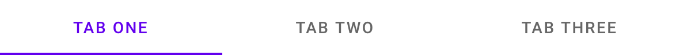
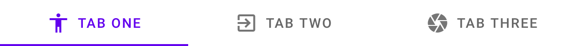
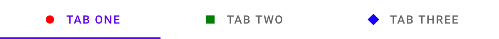
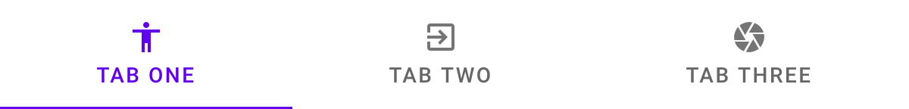
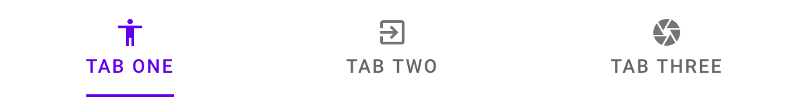
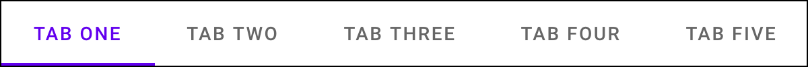
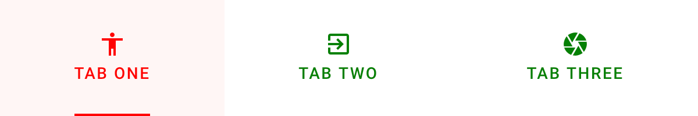

# `<mwc-tab-bar>` [](https://www.npmjs.com/package/@material/mwc-tab-bar)

> IMPORTANT: The Material Web Components are a work in progress and subject to
> major changes until 1.0 release.

Tabs organize content across different screens, data sets, and other interactions.

[Material Design Guidelines: tabs](https://material.io/components/tabs/)

## Installation

```sh
npm install @material/mwc-tab-bar
```

> NOTE: The Material Web Components are distributed as ES2017 JavaScript
> Modules, and use the Custom Elements API. They are compatible with all modern
> browsers including Chrome, Firefox, Safari, Edge, and IE11, but an additional
> tooling step is required to resolve *bare module specifiers*, as well as

## Example usage

### Basic



```html
<mwc-tab-bar>
  <mwc-tab label="Tab one"></mwc-tab>
  <mwc-tab label="Tab two"></mwc-tab>
  <mwc-tab label="Tab three"></mwc-tab>
</mwc-tab-bar>

<script type="module">
  import '@material/mwc-tab-bar';
  import '@material/mwc-tab';
</script>
```

### Preselected


```html
<mwc-tab-bar activeIndex="1">
  <mwc-tab label="Tab one"></mwc-tab>
  <mwc-tab label="Tab two"></mwc-tab>
  <mwc-tab label="Tab three"></mwc-tab>
</mwc-tab-bar>
```

### Icons



```html
<mwc-tab-bar>
  <mwc-tab label="Tab one" icon="accessibility"></mwc-tab>
  <mwc-tab label="Tab two" icon="exit_to_app"></mwc-tab>
  <mwc-tab label="Tab three" icon="camera"></mwc-tab>
</mwc-tab-bar>
```

### Image / Slotted Icons



```html
<mwc-tab-bar>
  <mwc-tab label="Tab one" hasImageIcon>
    <!-- margin bottom is (24px - height) / 2 -->
    <svg
        slot="icon"
        width="10px"
        height="10px"
        style="margin-bottom:7px;">
      <circle
          r="5px"
          cx="5px"
          cy="5px"
          color="red">
      </circle>
    </svg>
  </mwc-tab>
  <mwc-tab label="Tab two" hasImageIcon>
    <svg
        slot="icon"
        width="10px"
        height="10px"
        style="margin-bottom:7px;">
      <rect
          width="10px"
          height="10px"
          color="green">
      </rect>
    </svg>
  </mwc-tab>
  <mwc-tab label="Tab three" hasImageIcon>
    <svg
        slot="icon"
        width="14.143px"
        height="14.143px"
        style="margin-bottom:4.928px;">
      <rect
          width="10px"
          height="10px"
          color="blue"
          y="2.071px"
          x="2.071px"
          style="transform:rotate(45deg);transform-origin:center;">
      </rect>
    </svg>
  </mwc-tab>
</mwc-tab-bar>
```

### Stacked Icons



```html
<mwc-tab-bar>
  <mwc-tab label="tab one" icon="accessibility" stacked></mwc-tab>
  <mwc-tab label="tab two" icon="exit_to_app" stacked></mwc-tab>
  <mwc-tab label="tab three" icon="camera" stacked></mwc-tab>
</mwc-tab-bar>
```

### Min-width Indicator (w/ stacked icon)



```html
<mwc-tab-bar>
  <mwc-tab
      label="tab one"
      icon="accessibility"
      stacked
      isMinWidthIndicator>
  </mwc-tab>
  <mwc-tab
      label="tab two"
      icon="exit_to_app"
      stacked
      isMinWidthIndicator>
  </mwc-tab>
  <mwc-tab
      label="tab three"
      icon="camera"
      stacked
      isMinWidthIndicator>
  </mwc-tab>
</mwc-tab-bar>
```

### Icon Indicator (w/ stacked icon)


```html
<mwc-tab-bar>
  <mwc-tab
      icon="camera"
      indicatorIcon="donut_large">
  </mwc-tab>
  <mwc-tab
      icon="accessibility"
      indicatorIcon="donut_large">
  </mwc-tab>
  <mwc-tab
      icon="exit_to_app"
      indicatorIcon="donut_large">
  </mwc-tab>
</mwc-tab-bar>
```

### Scrollable

When the contents of `mwc-tab-bar` exceed its width, the overflow tabs are made
scrollable along the x axis.



```html
<style>
  mwc-tab-bar {
    border: solid black 1px;
  }
</style>
<mwc-tab-bar>
  <mwc-tab label="Tab one"></mwc-tab>
  <mwc-tab label="Tab two"></mwc-tab>
  <mwc-tab label="Tab three"></mwc-tab>
  <mwc-tab label="Tab four"></mwc-tab>
  <mwc-tab label="Tab five"></mwc-tab>
  <mwc-tab label="Tab six"></mwc-tab>
  <mwc-tab label="Tab seven"></mwc-tab>
  <mwc-tab label="Tab eight"></mwc-tab>
  <mwc-tab label="Tab nine"></mwc-tab>
  <mwc-tab label="Tab ten"></mwc-tab>
  <mwc-tab label="Tab eleven"></mwc-tab>
  <mwc-tab label="Tab twelve"></mwc-tab>
</mwc-tab-bar>
```

### Styled

_Note: example is in the state of hovering over the first tab._



```html
<style>
  mwc-tab-bar {
    --mdc-theme-primary: red;
    --mdc-text-transform: none;
    --mdc-tab-border-radius: 20px 20px 0px 0px;
    --mdc-tab-color-default: green;
    --mdc-tab-text-label-color-default: green;
    --mdc-tab-stacked-height: 100px;
  }
</style>
<mwc-tab-bar>
  <mwc-tab
      label="tab one"
      icon="accessibility"
      stacked
      isMinWidthIndicator>
  </mwc-tab>
  <mwc-tab
      label="tab two"
      icon="exit_to_app"
      stacked
      isMinWidthIndicator>
  </mwc-tab>
  <mwc-tab
      label="tab three"
      icon="camera"
      stacked
      isMinWidthIndicator>
  </mwc-tab>
</mwc-tab-bar>
```

## API

### Slots

| Name              |	Description
| ----------------- | -------------
| _default_         |	[`mwc-tab`](https://github.com/material-components/material-components-web-components/tree/master/packages/tab) elements to display.

### Properties/Attributes

| Name          | Type     | Default | Description
| ------------- | -------- | ------- | -----------
| `activeIndex` | `number` | `0`     | Index of tab that is active.

### Methods

| Name     | Description
| -------- | -------------
| `scrollIndexIntoView(index:number) => void` | For long, scrollable `tab-bar`s, scrolls the tab at the given index into view.

### Events

| Event Name | Target             | Detail             | Description
| ---------- | ------------------ | ------------------ | -----------
| `MDCTab:activated` | `mwc-tab-bar` | `{index: number}` | Emitted when a tab selection has been made.

### CSS Custom Properties

None


## Additional references

- [MDC Web tabs](https://material.io/components/tabs/)
