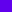

# `<mwc-tab>` [](https://www.npmjs.com/package/@material/mwc-tab)

> IMPORTANT: The Material Web Components are a work in progress and subject to
> major changes until 1.0 release.

Tabs organize content across different screens, data sets, and other interactions.

[Material Design Guidelines: tabs](https://material.io/components/tabs/)

## Installation

```sh
npm install @material/mwc-tab
```

> NOTE: The Material Web Components are distributed as ES2017 JavaScript
> Modules, and use the Custom Elements API. They are compatible with all modern
> browsers including Chrome, Firefox, Safari, Edge, and IE11, but an additional
> tooling step is required to resolve *bare module specifiers*, as well as

## Example usage

For usage please see [mwc-tab-bar](https://github.com/material-components/material-components-web-components/tree/master/packages/tab-bar)

## API

### Slots

| Name              |	Description
| ----------------- | -------------
| `icon`            |	Slotted icon to display. Only available if `hasImageIcon` or `icon` are defined.

### Properties/Attributes

| Name                  | Type      | Default | Description
| --------------------- | --------- | ------- | -----------
| `label`               | `string`  | `''`    | Text label to display in tab.
| `icon`                | `string`  | `''`    | Material design icon name to display (overridden by slotted icon).
| `hasImageIcon`        | `boolean` | `false` | Displays a slot to show an image icon.
| `indicatorIcon`       | `string`  | `''`    | Material design icon name to display as the indicator.
| `isFadingIndicator`   | `boolean` | `false` | Indicator fades in and out instead of sliding.
| `minWidth`            | `boolean` | `false` | Shrinks tab as narrow as possible without causing text to wrap.
| `isMinWidthIndicator` | `boolean` | `false` | Shrinks indicator to be the size of the content.
| `stacked`             | `boolean` | `false` | Stacks icon on top of label text.
| `active`              | `boolean` (readonly) | `false` | Indicates whether the tab's indicator is active.


### Methods

| Name     | Description
| -------- | -------------
| `activate() => void` | Activates the indicator.
| `deactivate() => void` | Deactivates the indicator.
| `computeDimensions() => MDCTabDimensions`\* | Computes the dimensions of the content.
| `computeIndicatorClientRect() => ClientRect` | Computes the dimensions of the indicator.

\* See MDC's [`Tab` types](https://github.com/material-components/material-components-web/blob/master/packages/mdc-tab/types.ts#L29) for definition.

### Events

| Event Name | Target             | Detail             | Description
| ---------- | ------------------ | ------------------ | -----------
| `MDCTab:interacted` | `mwc-tab` | `{tabId: string}`  | Emitted when the Tab is interacted with, regardless of its active state. Used by parent components to know which Tab to activate.

### CSS Custom Properties

| Name                                              | Default               | Description
| ------------------------------------------------- | --------------------- |------------
| `--mdc-theme-primary` |  `#6200ee` | Color of the activated tab's text, indicator, and ripple.
| `--mdc-theme-secondary` |  `#018786` | Color of the indicator icon if defined.
| `--mdc-icon-font` | `"Material Icons"` | Icon font to use for `icon` and `indicatorIcon`.
| `--mdc-icon-size` | `24px` | Size of the text icon.
| `--mdc-tab-height` | `48px` | Height of the tab.
| `--mdc-horizontal-padding` | `24px` | Horizontal padding on either side of the tab.
| `--mdc-tab-stacked-height` | `72px` | Height of the tab's stacked variant.
| `--mdc-text-transform` | `uppercase` | Text transform of the label.
| `--mdc-tab-border-radius` | `0px` | Tab's border radius (does not clip indicator).
| `--mdc-tab-text-label-color-default` |  `rgba(0, 0, 0, 0.6)` | Color of an unactivated tab label.
| `--mdc-tab-color-default` |  `rgba(0, 0, 0, 0.54)` | Color of an unactivated icon.


## Additional references

- [MDC Web tabs](https://material.io/components/tabs/)
